# 認可・ReBAC 実装ガイド（新規メンバー向け）

> 対象: 新しくアサインされたエンジニアで、**OpenFGA の概要は知っているが実務で扱うのは初めて**の人。
> このドキュメントは shiki-platform の認可（AuthZ）と ReBAC（OpenFGA）の仕組み・使い方・規約を
> **実装のコードに紐づけて**解説する。「概念は分かるが、じゃあ実際どこに何を書くのか」を埋めるのが狙い。
>
> 正本（迷ったら必ずこちらが正）:
> - 設計: [`docs/design.md`](../design.md) §4.1（認証・認可）／§4.2（ストレージ）／§4.3（RAG）
> - 概念入門（前提知識ゼロから）: [`docs/guides/mini-app-onboarding.md`](../guides/mini-app-onboarding.md) §2
> - 不変条件チェックリスト: `architecture-invariants` スキル
> - 落とし穴: [`docs/design-caveats.md`](../design-caveats.md)（PIT-1〜PIT-30）
>
> ⚠️ この資料は「実装を読むための地図」です。仕様の最終判断は上の正本とコードを見てください。
> 本文中の `path:line` はコードの位置。ソースジャンプに使ってください。

---

## 0. 30 秒サマリ

- **認可は OpenFGA（ReBAC）に一本化**する。「この人はこれを触れるか?」は最終的に必ず 1 つの問い
  `AuthzClient::check(subject, relation, object)` に帰着する。個別ハンドラに `if user.role == ...` を書かない。
- タプルは `object#relation@subject` の 3 つ組。例: `file:acme|123#viewer@user:acme|alice`
  =「alice は file 123 の viewer」。
- **識別子は必ず tenant 名前空間化**される: `<type>:<tenant_id>|<local_id>`。生の文字列を組む経路は
  `AuthContext::ns()`（`authz::Namespace`）に一本化され、**テナント越境は型レベルで不能**。
- **全データアクセスは `AuthContext`（principal + org + tenant_id）を受け取る**。アンビエント権限（暗黙のグローバル権限）は持たない。
- **RAG は二段 authz**（pre-filter ＋ post-filter）。片方が壊れても権限を守る、この製品の心臓部。
- 認可語彙（type 名・relation 名）は **Rust enum が単一ソース**。手書き文字列を作らない（`authz::vocab`）。

覚え方: **単一チョークポイント（AuthzClient）／アンビエント権限なし（AuthContext）／越境不能（Namespace）／二段 authz（RAG）**。この 4 つが柱。

---

## 1. 全体像 — 認証と認可は別物、認可は 1 経路に集約

まず用語。混同しやすいので最初に固定する。

- **認証 (AuthN)** = 「**あなたは誰か?**」。Keycloak（OIDC）が担う。結果は `Principal`（誰・どのテナント・どのグループ）。
- **認可 (AuthZ)** = 「**あなたはこれをしてよいか?**」。OpenFGA（ReBAC）が担う。結果は `check → bool`。

リクエストが入ってから認可判定に至るまでの流れ:

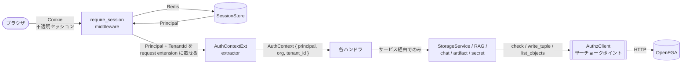

ポイントは 2 つ:

1. **AuthN（Keycloak/セッション）と AuthZ（OpenFGA）は完全に分離**している。認証は「誰か」を確定するだけ。
   「何を触れるか」は必ず OpenFGA に問う。セッションを消しても個別ファイルの共有解除にはならない（それは OpenFGA のタプル剥奪）。
2. **アプリのどのコードも OpenFGA を直叩きしない**。必ず `AuthzClient` トレイト（`crates/authz/src/client.rs:47`）経由。
   これが「単一チョークポイント」= 認可・監査・イベントをそこ 1 か所で担保する不変条件。

---

## 2. ReBAC のおさらい（この製品版）

ReBAC = Relationship-Based Access Control。「関係（タプル）」を積み上げ、**継承・グループ・個別共有をグラフの到達可能性**として判定する。

タプルの形（OpenFGA 共通）:

```
  <object>          #  <relation>  @  <subject>
  file:acme|123        viewer          user:acme|alice
  └ 誰に対する権限か     └ どんな権限    └ 誰が持つか
```

`check(user:acme|alice, viewer, file:acme|123)` は「alice→file123 に viewer で到達できるか」をグラフ探索する。
直接タプルが無くても、**親フォルダの viewer**や**所属ロール経由**で到達できれば `allowed=true` になる。ここが RBAC との決定的な違い。

### なぜ ReBAC なのか

- **フォルダ継承**（親フォルダの権限が子に効く）、**ロール階層**（営業部 ⊇ 営業1課）、**個別共有**（この 1 ファイルだけ渡す）を
  すべて同じ「タプル＋到達可能性」で自然に表現できる。
- RBAC の「ロール × 権限」表をコアにすると、階層と個別共有でロールが組合せ爆発する（design.md §4.1）。
- **可読性判定が単一のクエリに帰着**する。ファイル共有 UI も permission-aware RAG も、同じ `check` / `list_objects` を使う。

---

## 3. 認可モデル全体図（型と relation のカタログ）

正本は 2 ファイル。**必ず両方を同期**させる（乖離すると CI が落ちる・後述 §14）:

- `crates/authz/model/authorization-model.fga` … 人がレビューする DSL（可読用）
- `crates/authz/model/authorization-model.json` … 実際に OpenFGA へ投入する JSON（正本）

現在のモデル全体（`.fga` より）:

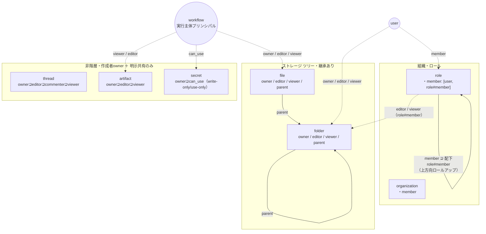

### 型（ObjectType）と relation（Relation）の一覧

いずれも `crates/authz/src/vocab.rs` の Rust enum が**単一ソース**。ここに無い名前は存在しない（タイポは compile/検証時に弾かれる）。

| ObjectType | relation | 継承・含意 | 共有語彙（誰を付与できるか） |
|---|---|---|---|
| `organization` | `member` | — | `[user]` |
| `role` | `member` | `member ⊇ 配下 role#member`（上方向） | `[user, role#member]` |
| `folder` | `parent` / `owner` / `editor` / `viewer` | `owner⊆editor⊆viewer`、`editor/viewer from parent` | owner=`[user, workflow]`、editor/viewer=`[user, role#member, workflow]` |
| `file` | `parent` / `owner` / `editor` / `viewer` | folder と同じ（parent は folder のみ） | 同上 |
| `thread` | `owner` / `editor` / `commenter` / `viewer` | `owner⊇editor⊇commenter⊇viewer`（階層なし） | owner=`[user]`、他=`[user, role#member]` |
| `artifact` | `owner` / `editor` / `viewer` | `owner⊇editor⊇viewer`（階層なし） | owner=`[user]`、他=`[user, role#member, workflow]` |
| `secret` | `owner` / `can_use` | `owner⊇can_use`（**viewer 無し**＝平文読み返し不可） | owner=`[user]`、can_use=`[user, role#member, workflow]` |
| `workflow` | （relation なし） | subject 専用型（schedule/event run の実行主体） | — |

設計上の約束（コードのコメントに根拠あり）:

- **owner に role#member や workflow を付与しない**（folder/file/thread/artifact）。owner は「横展開の起点」なので
  グループや実行主体に渡さない。共有語彙は viewer/editor（+commenter）に限る（`model.fga:37-38, 57`）。
- **secret に viewer 系は無い**。write-only / use-only。`can_use` は「解決して使える」であって**平文の読み返しではない**
  （`vocab.rs:30-31`, `secret` の doc）。
- **workflow は subject 専用型**。オブジェクトとして relation を持たない。委譲タプルの右辺（誰が持つか）にだけ現れる（§11）。

---

## 4. authz crate の構造

`crates/authz` が認可のすべて。アプリ（storage/rag/chat/api…）はこの crate の**公開トレイトと型だけ**に依存する。

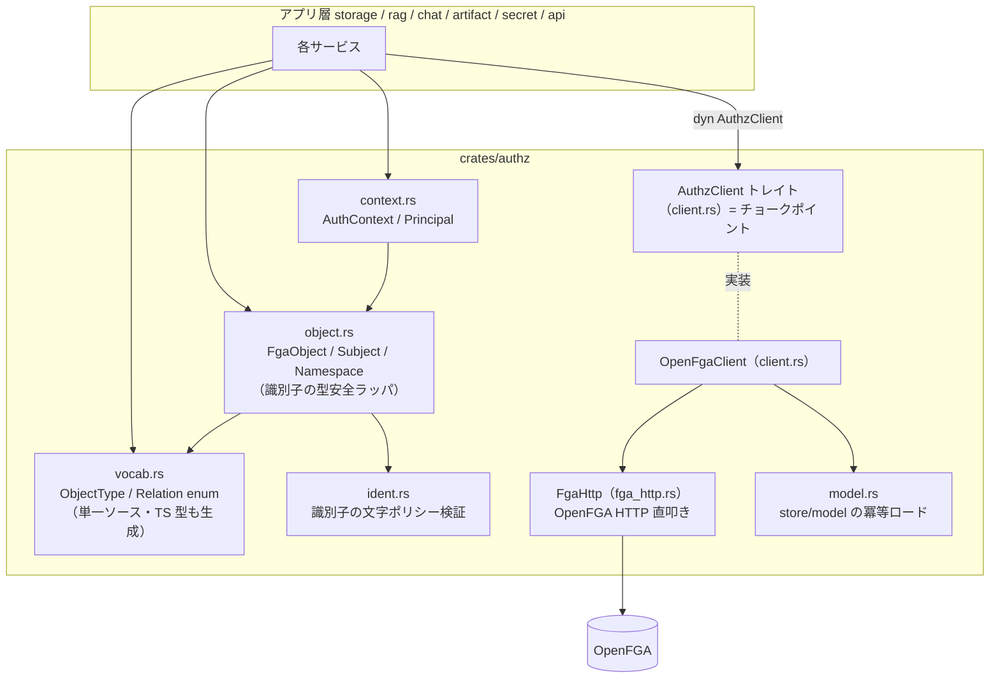

役割分担:

- **`AuthzClient` トレイト**（`client.rs:47`）: アプリが依存する唯一の口。`check` / `write_tuple` / `delete_tuple` /
  `read_tuples` / `list_objects` / `delete_object_tuples` / `read_subject_objects`。アプリは具象 `OpenFgaClient` ではなく
  `Arc<dyn AuthzClient>` に依存する（テストでモック差し替え可能・cloud/onprem 差をトレイト裏に閉じる）。
- **`vocab.rs`**: `ObjectType` / `Relation` の enum。`#[derive(TS)]` で TypeScript 型も生成し、フロント/ミニアプリと
  同じ閉じた集合を共有する。`Relation::parse`（`vocab.rs:52`）は未知の relation を fail-closed で `None` にする。
- **`object.rs`**: `FgaObject`（`type:id`）と `Subject`、そして tenant 名前空間化の要 `Namespace`（§5）。
- **`context.rs`**: `AuthContext` / `Principal`（§6）。
- **`fga_http.rs`**: OpenFGA の HTTP API を叩く低レベル実装（公式 SDK 不使用）。冪等化のロジック（`ensure_ok_idempotent`）もここ。
- **`model.rs`**: 起動時に store と authorization model を**冪等**にロード（`ensure_store_and_model`）。model は
  イミュータブル追記なので、意味的に同じなら書き込まずに再利用する（`model.rs:30`）。

---

## 5. 識別子とテナント名前空間化（SAAS.1）— これが越境を止める要

SaaS は**全テナント共有の単一 OpenFGA ストア**を使う。テナント分離は「識別子に tenant を織り込む」ことで担保する。

```
  folder:acme|123          ← tenant "acme" の folder 123
         └──┬──┘
       tenant_id | local_id     区切りは '|' = authz::TENANT_SEP
```

これを**構造的に強制**するのが `Namespace`（`object.rs:96`）。

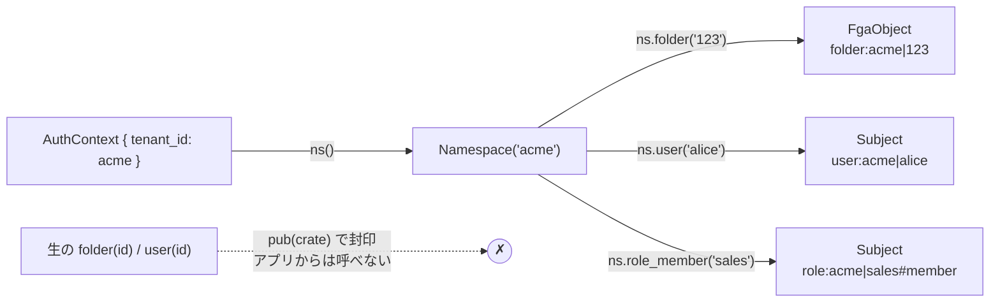

なぜこれで越境が止まるのか:

- `FgaObject::new` や `Subject::user` の**生コンストラクタは `pub(crate)`**（`object.rs:33, 221`）。
  アプリ層（storage/api…）はこれらを直接呼べない。
- 識別子を作る唯一の入口が `AuthContext::ns()`（`context.rs:76`）。ここは必ず `self.tenant_id` で名前空間化する。
  → **tenant を渡さずに識別子を組むことが型レベルで不可能**。acme のコンテキストからは `folder:beta|...` を組めない。
- FGA から読み戻す側も対称的に守る: `strip_object_id`（`object.rs:188`）は自 tenant プレフィクスに一致しなければ `None`。
  他テナントのオブジェクトが混ざっても防御的に除外される。

さらに `tenant_id` と local id の**文字ポリシーを 1 か所に集約**する（`ident.rs`）。区切り文字 `|` や FGA 構造文字
（`: # @`）、パス境界 `/` の混入を fail-closed で弾く。これが分散するとタイポ 1 個で名前空間が壊れる（`ident.rs:1-7`）。

| 関数 | 対象 | 拒否するもの |
|---|---|---|
| `validate_tenant_id`（`ident.rs:48`） | tenant_id | `\| : # @ /`・空白・制御文字・`.` `..` |
| `validate_local_id`（`ident.rs:76`） | 共有先 user/role id 等 | `: # \|`・制御文字（`/` や `@` は AD パス/email 由来で許可） |

> **落とし穴（PIT・#91）**: RAG の `authz_tags` は名前空間化形式（`folder:acme|123`）のまま格納する。
> local に剥がして保存すると「タグから tenant 境界が消え」、pre-filter バグ 1 個で越境する（design.md §4.3）。

---

## 6. AuthContext のライフサイクル

**全データアクセスは `AuthContext` を第一引数で受け取る**（アンビエント権限の禁止）。その中身と作られ方。

```rust
// crates/authz/src/context.rs
pub struct AuthContext {
    pub principal: Principal,   // 誰（OIDC sub 由来 or workflow プリンシパル）
    pub org: String,            // 所属組織（テナント内の最上位スコープ）
    pub tenant_id: String,      // SaaS 隔離境界。new() の必須引数（型レベルで欠落不能）
}
```

`tenant_id` は `new()` の**必須引数**なので、「tenant_id 無しの AuthContext」はコンパイルできない（`context.rs:52-62`）。

### リクエストから AuthContext まで（BFF 方式）

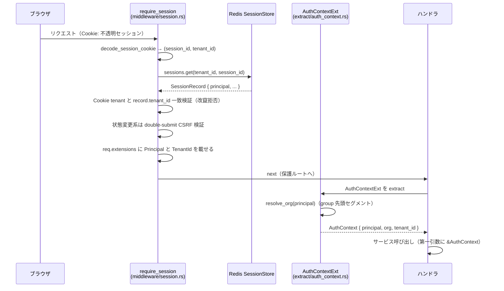

実装の要点:

- **BFF（Backend-for-Frontend）**: ブラウザには**不透明セッション Cookie だけ**。トークンはブラウザに置かない。
  `Authorization: Bearer` 入口は撤去済み（`middleware/auth.rs:3-6`）。
- middleware（`session.rs:30` の `require_session`）が state を使い、`Principal` と `TenantId` を
  request extension に載せる（`session.rs:92-95`）。
- extractor（`auth_context.rs` の `AuthContextExt`）は **state 非依存**で extension を読むだけ。
  「middleware が載せる → extractor が読む」の分業で、AuthContext を経由しないデータアクセスを構造的に書きにくくしている。
- middleware はグループ単位で**一律適用**される。`route_table()`（`server.rs:55`）の `AccessPolicy`
  （`Public` / `Session` / `Provisioner` …）ごとに `route_layer` で付ける。個別ハンドラに認証チェックを散らさない。

### tenant_id の解決 — `resolve_tenant_id`（`extract/auth_context.rs:76`）

```rust
match auth.tenancy {
    // SaaS: claim `tenant` 必須。欠落・空白は fail-closed で 401
    Tenancy::Multi  => non_empty(principal.tenant_id.as_deref()).ok_or(Unauthorized)?,
    // オンプレ/cell: 設定 auth.tenant_id の固定値（既定 "default"）
    Tenancy::Single => non_empty(auth.tenant_id.as_deref()).ok_or(Unauthorized)?,
}
// 由来を問わず必ず文字ポリシー検証（authz::validate_tenant_id へ委譲）
validate_tenant_id(&tenant_id)?;
```

- **Multi（SaaS）**: JWT の `tenant` claim を使う。無ければ認証を通さない（越境の余地を残さない）。
- **Single（オンプレ/cell）**: 設定の固定値。claim が無くても `tenant_id="default"` 名前空間で一様に動く。

### Principal の 2 種別（PrincipalKind）

```rust
pub enum PrincipalKind { User, Workflow }   // context.rs:18
```

- `User` = 対話トリガの本人（OIDC subject）。`subject()` は `user:<tenant>|<id>`。
- `Workflow` = schedule/event run の実行主体（`workflow:<tenant>|<id>`）。委譲タプルの照合に使う（§11）。
  `AuthContext::for_workflow(...)`（`context.rs:93`）で組む。

`AuthContext::subject()`（`context.rs:85`）が kind に応じて正しい subject を返すので、呼び出し側は種別を意識しない。

---

## 7. AuthzClient API リファレンス（実務で使う 7 メソッド）

すべて `crates/authz/src/client.rs:47` のトレイト。アプリはこれだけ使う。

| メソッド | 何をするか | 継承展開 | 主な用途 |
|---|---|---|---|
| `check(subject, relation, object, consistency) -> bool` | 1 件の権限判定 | ○（到達可能性） | 読み書きの許可判定・post-filter |
| `write_tuple(subject, relation, object) -> bool` | タプル付与。**実付与で `true`**、既存 no-op で `false` | — | owner/parent 付与・共有・ロール同期 |
| `delete_tuple(subject, relation, object) -> bool` | タプル剥奪。**実剥奪で `true`**、不在 no-op で `false` | — | 共有解除・move の旧親剥奪 |
| `read_tuples(object, relation?) -> Vec<ReadTupleKey>` | オブジェクトの**直接タプル**列挙 | ✗（直接のみ） | 共有相手一覧（誰に共有したか） |
| `list_objects(subject, relation, object_type) -> Vec<String>` | subject が relation を持つ**実効集合** | ○ | 共有された一覧・RAG pre-filter |
| `read_subject_objects(subject, object_type) -> Vec<String>` | subject が**直接タプル**を持つ object 一覧 | ✗（直接のみ） | ロール同期の差分算出・テナント撤去 |
| `delete_object_tuples(object) -> u32` | オブジェクトの全直接タプル一括剥奪 | — | テナント撤去（SAAS.2） |

`read_tuples` と `list_objects` の違いは頻出の混乱ポイント:

- `list_objects`（**継承展開する**）= 「alice が**実際に**読める file 全部」。部署メンバー・親フォルダ経由も含む。**共有された一覧**画面や RAG pre-filter に使う。
- `read_tuples`（**直接タプルのみ**）= 「この file に**直接書かれた**共有タプル」。**誰に共有したか**の管理ビューに使う。継承は見せない。

### 冪等性と bool の意味（重要）

`write_tuple` / `delete_tuple` は**冪等**。既存タプルの再付与、不在タプルの再剥奪は「成功」扱いにする
（`fga_http.rs:404` の `ensure_ok_idempotent`。OpenFGA が 400 で返す "already exists" / "does not exist" を no-op 成功へ変換）。

返す bool は「**実際に ACL を変えたか**」。これを補償ロールバックに使う（§9.5）。冪等 no-op を巻き戻すと既存状態を壊すため、
「実変更したときだけ巻き戻す」の判断材料にする（`client.rs:64-83`）。

### Consistency の使い分け（PIT-11）

```rust
pub enum Consistency { MinimizeLatency, HigherConsistency }   // client.rs:24
```

- `MinimizeLatency`（既定・結果整合・高速）: 通常の書込・管理系の check。多少の反映遅延を許容できる経路。
- `HigherConsistency`（強整合・レイテンシ代償）: **共有解除を即座に反映させたい read**。書込直後の付与/剥奪を確実に見る。

原則: **「読めなくなったことを即座に効かせたい」経路は `HigherConsistency`**。全 check を一律強整合にすると性能が落ちるので、
必要な経路だけ明示する。

| 経路 | Consistency | 理由 |
|---|---|---|
| ストレージ書込/管理系 `require`（`admin.rs:240`） | MinimizeLatency | 反映遅延を許容 |
| ストレージ読取 `require_read`（`admin.rs:280`） | **HigherConsistency** | 共有解除の即時反映（存在秘匿と対） |
| RAG post-filter（`authz_filter.rs:101`） | **HigherConsistency** | 剥奪の即時反映（正しさクリティカル） |
| chat/artifact/secret の `require`（後述） | **HigherConsistency** | 同上 |
| chat 引用の再評価 `can_view_file`（`threads.rs:239`） | MinimizeLatency | 表示フィルタ・大量判定 |
| RAG pre-filter `list_objects`（`fga_http.rs:262`） | HigherConsistency（内部固定） | grant/剥奪の即時反映 |

---

## 8. 型ごとの認可モデル詳細

### 8.1 ストレージ（folder / file）— ツリー継承あり

folder/file は**明示付与（owner/editor/viewer）と親フォルダからの継承のみ**で権限を持つ「厳格モデル」。
「org メンバーだから配下が全部読める」といった自動継承は**入れない**（`model.fga:32-38`）。

```
  define parent: [folder]
  define owner:  [user, workflow]
  define editor: [user, role#member, workflow] or owner or editor from parent
  define viewer: [user, role#member, workflow] or editor or viewer from parent
```

含意関係（下ほど弱い。上を持てば下も持つ）: `owner ⊆ editor ⊆ viewer`。
さらに `editor/viewer from parent` = **親フォルダの editor/viewer は子にも効く**。

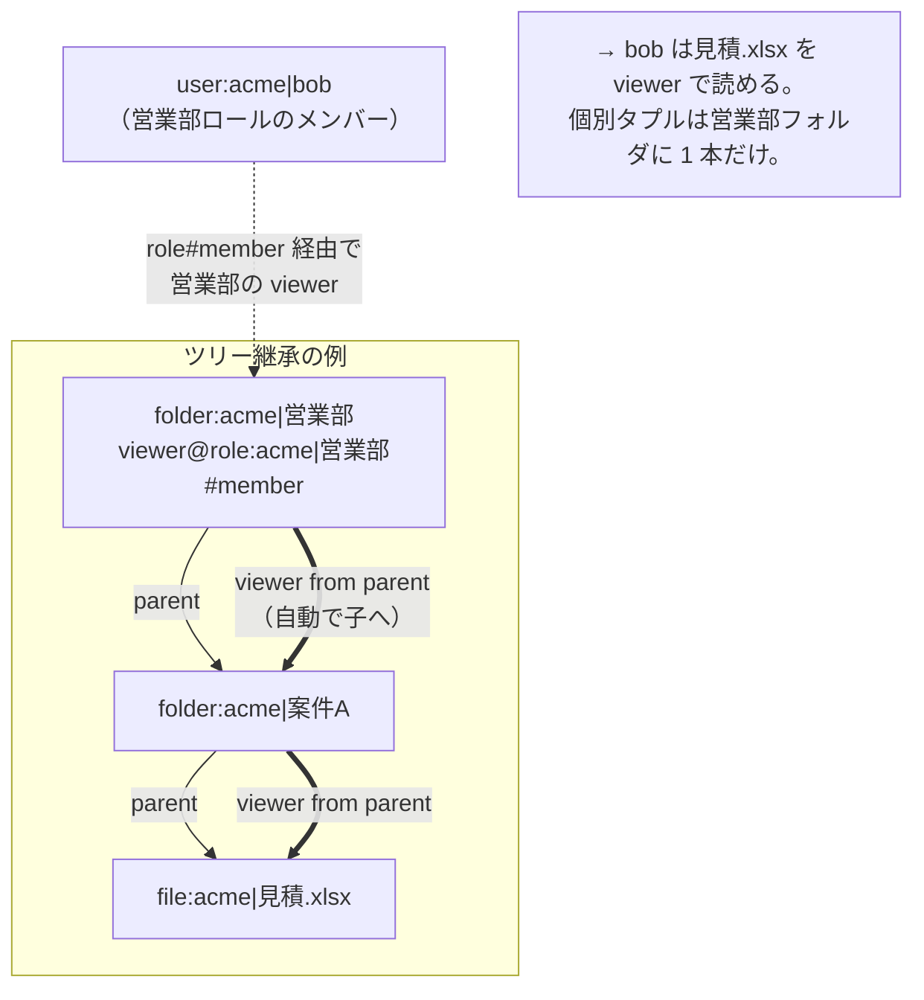

bob に対する個別タプルは 1 本も無い（営業部フォルダに `role#member` の viewer が 1 本あるだけ）。
継承で末端の file まで到達するので、**共有はフォルダ単位で 1 回**すればよい。

### 8.2 ロール階層 — 上方向ロールアップ

`role` の `member: [user, role#member]` が肝。**配下ロールのメンバーを親ロールに含める**（上方向）。

```
  role:acme|営業部#member@role:acme|営業1課#member
  = 「営業1課のメンバーは営業部のメンバーでもある」
```

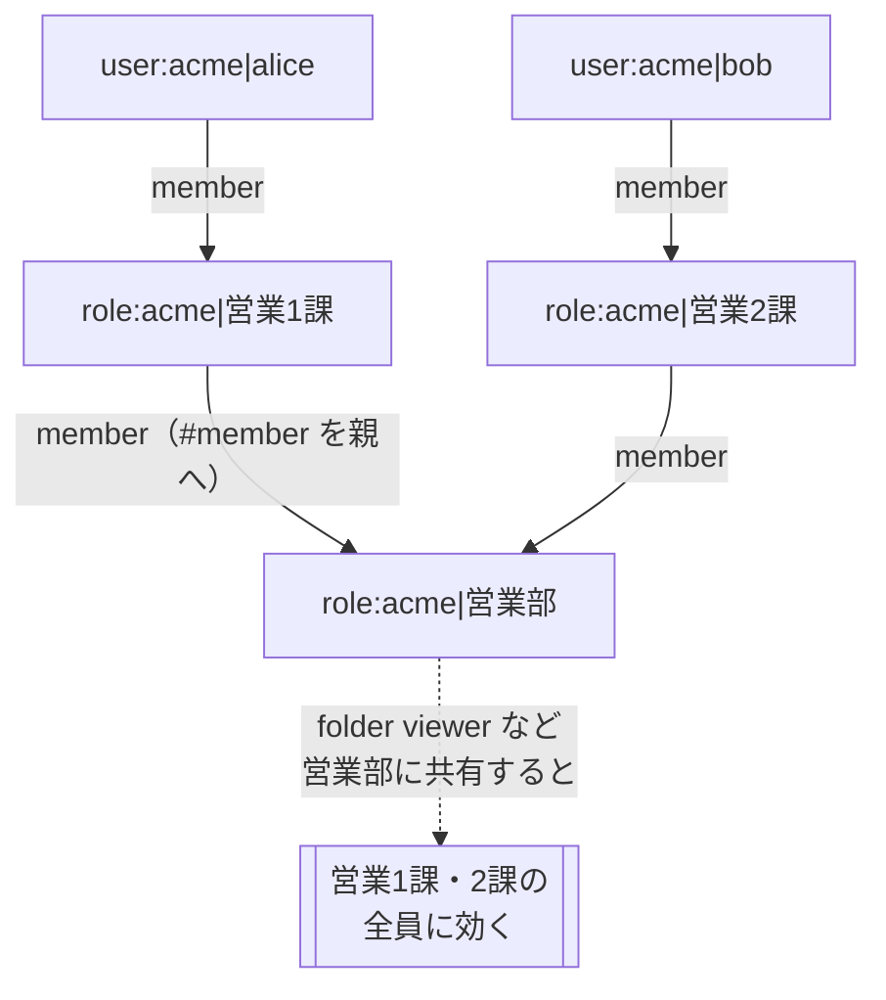

> 注意: これは**上方向**（配下→親）。旧 department 型にあった「上位組織メンバーが自動で全部署メンバーになる」下方向継承は**撤去済み**
> （`model.fga:24-30`）。営業部に共有すれば配下の課に効くが、逆（課に共有しても営業部全体には効かない）は起きない。

### 8.3 非階層型（thread / artifact / secret）— 作成者 owner ＋明示共有のみ

ツリー継承を持たず、`owner` の一直線の含意だけ。

- **thread**（会話・`model.fga:56-65`）: `owner ⊇ editor ⊇ commenter ⊇ viewer`。共有語彙は viewer/commenter/editor。
- **artifact**（バージョン付き共有本文・`model.fga:67-76`）: `owner ⊇ editor ⊇ viewer`。prompt template / UI スペック /
  ミニアプリ / ワークフロー IR / skill / script が同じ枠に乗る。**editor/viewer は workflow subject も受理**（委譲経路）。
- **secret**（`model.fga:78-84`）: `owner ⊇ can_use`。**viewer 系が無い**＝平文の読み返し不可（write-only/use-only）。
  `can_use` = 「解決して使える」。can_use も workflow subject を受理。

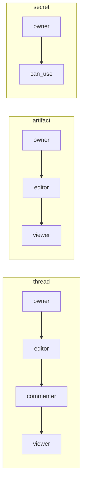

---

## 9. ストレージでの使い方（実装の型）

`crates/storage` が「タプルをどう読み書きするか」の最良の教科書。パターンを覚えれば他 crate も同型。

### 9.1 作成時 — owner ＋ parent を書く

フォルダ作成 `create_folder`（`service/folder.rs:19`）/ ファイル確定 `finalize_upload`（`service/finalize.rs:148`）は同型。
**DB commit の前に**タプルを書く:

```rust
let folder_obj = ctx.ns().folder(&folder_id.to_string());
// ① 作成者を owner に
self.authz.write_tuple(&ctx.subject(), Relation::Owner, &folder_obj).await?;
// ② 親フォルダとの parent 結線（親ありのとき）
if let Some(p) = parent_id {
    if let Err(e) = self.authz.write_tuple(
        &Subject::object(&ctx.ns().folder(&p.to_string())),  // 右辺は folder:acme|<parent>
        Relation::Parent,
        &folder_obj,
    ).await {
        // 親付与に失敗したら owner を補償剥奪してから返す
        let _ = self.authz.delete_tuple(&ctx.subject(), Relation::Owner, &folder_obj).await;
        return Err(StorageError::Authz(e));
    }
}
```

- owner タプル: `folder:acme|<id>#owner@user:acme|<uid>`。subject は `ctx.subject()`。
- parent タプル: `folder:acme|<id>#parent@folder:acme|<parent>`。subject は `Subject::object(...)`
  （オブジェクトを subject として参照する結線）。
- 事前認可: 親ありなら親フォルダに `Editor`、ルートなら org に `Member` を要求（`folder.rs:27-53`）。

### 9.2 読み書きの認可 — require / require_read

2 つのヘルパ（`service/admin.rs`）に集約:

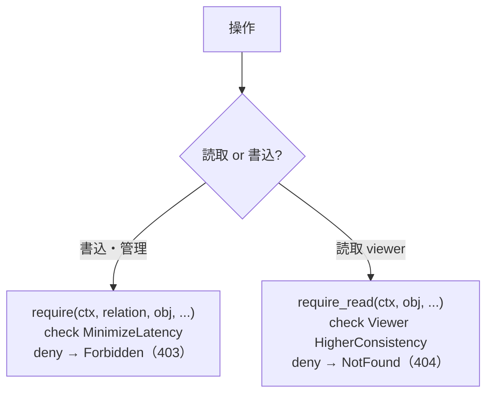

- **`require`**（`admin.rs:229`）: 書込/管理系。deny は監査記録して `Forbidden`。
- **`require_read`**（`admin.rs:270`）: 読取系。deny は**存在秘匿で `NotFound`**。403 と 404 を使い分けて
  「私有ファイルの存在」を漏らさない（P2-6）。強整合で共有解除を即反映。

`list_children` など「子を列挙して 1 件ずつ viewer 判定」する箇所も、すべて `HigherConsistency` で post-filter する
（`read.rs:148`「即時剥奪反映のため強整合」）。

### 9.3 共有 — viewer/editor を付与/剥奪

共有 API（`service/sharing.rs`）。前段で必ず**owner 権限**を要求する（`authorize_share_admin`, `sharing.rs:210`）。
editor が勝手に再共有する confused-deputy を防ぐため。

```rust
// 付与 share_node（sharing.rs:19）
let granted = self.authz
    .write_tuple(&target.subject(&ctx.ns()), role.relation(), &obj).await?;
// 解除 unshare_node（sharing.rs:57）
let revoked = self.authz
    .delete_tuple(&target.subject(&ctx.ns()), role.relation(), &obj).await?;
```

- `ShareTarget`（`model.rs:156`）: `User{id}` → `user:acme|<id>`、`Role{id}` → `role:acme|<id>#member`（部署共有）。
- `ShareRole`（`model.rs:189`）: `Viewer` / `Editor` のみ（owner/parent/member は共有語彙から除外）。
- 共有相手一覧 `list_shares`（`sharing.rs:94`）は `read_tuples`（直接タプルのみ）で「誰に共有したか」を返す。
- 自分に共有された一覧 `list_shared_with_me`（`sharing.rs:123`）は `list_objects`（継承込み実効集合）で引き、
  自テナント分のみ `strip_object_id` で抽出、作成者本人分を除いてページング。

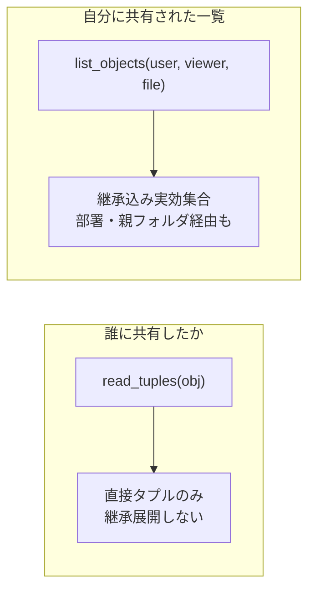

### 9.4 move/rename — 自ノードの parent だけ張り替える

`update_node`（`service/move_rename.rs:23`）。過剰権限を生まない順序で行う:

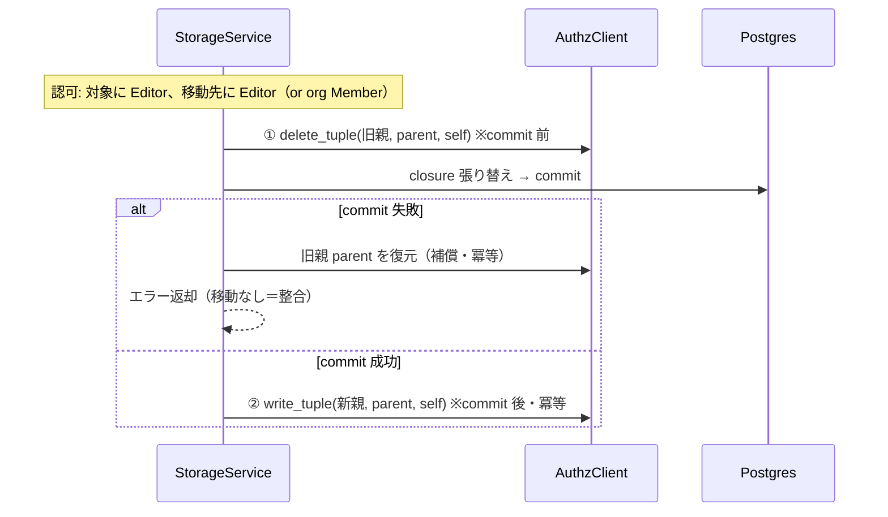

- 旧親剥奪は commit 前（失敗しても tx drop で移動が無かったことになる）。
- 新親付与は commit 後（冪等なので再試行で修復可能）。
- **移動するのは自ノードの parent タプルのみ**。子は OpenFGA の `from parent` 継承で自動追従する（`move_rename.rs:290`）。
- RAG の `authz_tags`（file＋祖先 folder）は move 時のみ再評価される（§10）。

### 9.5 削除・テナント撤去 — delete_object_tuples

- **ゴミ箱（soft-delete）は authz タプルに触らない**。`soft_delete_*`（`service/trash.rs`）は DB の `deleted_at` を立てるだけ。
  復元可能な間はタプルを残す（復元と対称）。
- **`delete_object_tuples` を呼ぶのはテナント撤去 `purge_tenant`（`admin.rs:57`）だけ**。node/role/org/artifact/secret を
  DB から列挙し、各オブジェクトの全直接タプルを一括剥奪する。OpenFGA 側は Read → `delete_tuples_batch`（100 件チャンク）を
  空になるまでループ（`client.rs:260`）。冪等。

### 9.6 補償ロールバック — bool で実変更時だけ巻き戻す

FGA と監査 DB は別の durability 境界。「ACL は変わったのに監査が無い」を残さないため、監査失敗時にタプルを巻き戻す。
ただし**冪等 no-op を巻き戻すと逆に壊す**（既存共有の誤剥奪 / 存在しなかった権限の新規付与＝昇格）ので、bool で実変更時のみに絞る:

```rust
// share_node（sharing.rs:31）
let granted = self.authz.write_tuple(&target.subject(&ctx.ns()), role.relation(), &obj).await?;
if let Err(e) = self.record_share_audit(...).await {
    if granted {  // ← 実際に付与したときだけ剥奪。no-op を剥奪して既存共有を壊さない
        let _ = self.authz.delete_tuple(&target.subject(&ctx.ns()), role.relation(), &obj).await;
    }
    return Err(e);
}
```

`unshare_node`（`sharing.rs:69`）は対称に「実剥奪したときだけ再付与」。

---

## 10. RAG 二段 authz（この製品の心臓部）

**pre-filter と post-filter の二段**で権限を守る。片方が壊れても、もう片方が守る。実装は `crates/rag/src/authz_filter.rs`。

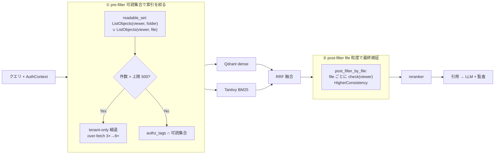

### pre-filter（`readable_set`, `authz_filter.rs:35`）

- `ListObjects(viewer, folder)` と `ListObjects(viewer, file)` を並列に呼び、**ユーザーの可読オブジェクト集合**を
  クエリごとに算出（継承込みの実効集合）。
- chunk に焼いた `authz_tags`（= file 自身 ＋ 祖先 folder 群）と**交差**を取って dense/keyword 両系統を絞る。
- **タグは構造タグ**（共有変更で書き換わらない）なので、**grant は次のクエリで即反映**（PIT-3 解消）。タグが変わるのは move のみ。

### カーディナリティ上限と縮退（`config.rs:88`, 既定 500）

```rust
if folders.len() + files.len() > max_tags {   // 既定 max_tags = 500
    return Ok(ReadableSet { tags: Vec::new(), overflowed: true });  // tenant-only へ縮退
}
```

OpenFGA `ListObjects` の応答上限（1000）で**切り詰められた不完全集合を正として使う under-recall 事故**を防ぐため、
上限手前（500）で pre-filter を**放棄して tenant-only へ縮退**する。縮退時は post-filter に全依存し、over-fetch を
3× → 8× に引き上げて正しさを維持する（`search.rs:98`）。

### post-filter（`post_filter_by_file`, `authz_filter.rs:76`）

```rust
let object = ctx.ns().file(&file_id.to_string());
let allowed = authz.check(&subject, Relation::Viewer, &object,
    Consistency::HigherConsistency).await?;   // 剥奪の即時反映（PIT-11）
```

- RRF 融合後に、候補を **file（node_id）単位に dedup** して並列 check。deny の file に属する chunk を全部落とす。
- **reranker の前**に呼ぶ（PIT-2）。読めない chunk に rerank 計算を浪費しないため。
- `HigherConsistency` で共有解除を即反映。

### 守るべき 2 つの不変条件

1. **chunk を OpenFGA オブジェクトにしない**（PIT-7）。post-filter は必ず `file:<tenant>|<local>` 粒度。
   chunk→file 対応は RAG メタ側で持つ。ObjectType にも `doc_chunk` は存在しない（`vocab.rs`、`doc_chunk` は拒否される）。
2. **tenant_id フィルタは authz_tags と独立に無条件 AND**。Qdrant は `must` に `tenant_id` を必ず入れる
   （`vector_qdrant.rs:59`、tenant-only 縮退でも tenant must は残る）。Tantivy は index-per-tenant で境界を強制。
   → authz_tags のフィルタが空/バグでも、tenant 境界は別の防壁として効く（design.md §4.3）。

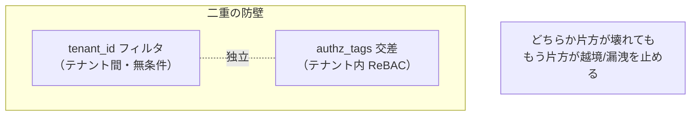

---

## 11. workflow 委譲（confused-deputy 防御）

schedule/event で自動起動する run は「誰の権限で動くのか?」が問題になる。本人の全権限で動かすと、
**トリガした人が意図しないファイルまで触れてしまう**（confused deputy）。これを**明示委譲**で防ぐ。

実装: `crates/workflow-engine/src/delegation.rs`（`DelegationStore`）、`src/run/launcher.rs`、台帳 `migrations/0017_workflow_registration.sql`。

### 考え方

- schedule/event run は**本人ではなく専用の workflow プリンシパル** `workflow:<tenant>|<id>` として動く。
- workflow プリンシパルが触れるのは、**有効化時に委譲者が明示的に渡したオブジェクトだけ**（委譲タプル）。
- 委譲できるのは**委譲者自身が今持っている権限の範囲内**のみ（スコープ ∩ 委譲者の ReBAC）。

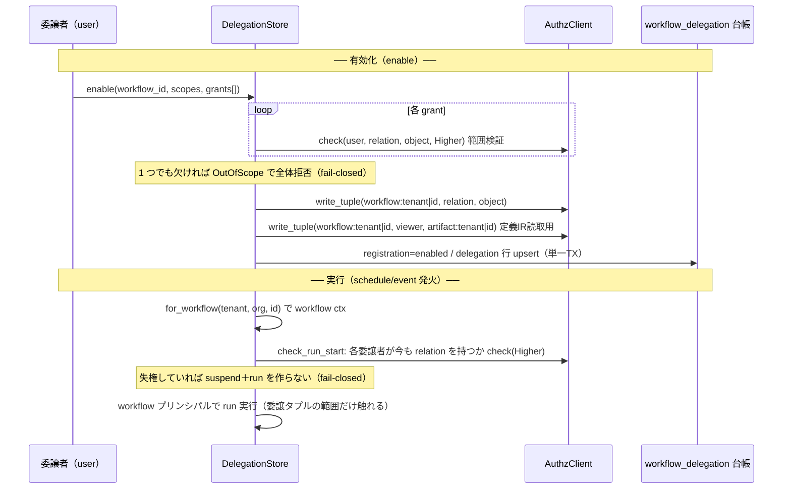

### 有効化 `DelegationStore::enable`（`delegation.rs:72`）

```rust
// ① 範囲検証: 委譲者が各 grant の権限を今持っているか
authz.check(&enabler.subject(), g.relation, &g.object, HigherConsistency).await?;
// 1 つでも欠ければ OutOfScope で全体拒否（部分委譲しない）

// ② 委譲タプル書込: workflow プリンシパルへ
let wf_subject = enabler.ns().workflow_principal(&workflow_id.to_string());
authz.write_tuple(&wf_subject, g.relation, &g.object).await?;

// 定義 IR（artifact）への viewer も付与（schedule run が IR を読むため）
let wf_artifact = enabler.ns().artifact(&workflow_id.to_string());
authz.write_tuple(&wf_subject, Relation::Viewer, &wf_artifact).await?;
```

### 実行時 `check_run_start`（`delegation.rs:221`）

run 開始のたびに 3 条件を fail-closed で確認:

1. registration が `enabled` か。
2. `declared ⊆ consented`（宣言スコープが同意済みスコープに収まるか）。欠けたら suspend。
3. **各委譲について、委譲者が今も relation を持つか** `check(HigherConsistency)`。失権していれば suspend＋run 中止。

さらに背景ジョブ `inventory`（`delegation.rs:286`）が全 active 委譲を棚卸しし、失権を検知したら
workflow プリンシパルのタプルを撤去する（二段目の防壁）。

### 台帳（DB・`migrations/0017`）

- `workflow_registration`: `status ∈ {enabled, disabled, suspended_reconsent}` / `enabled_version` / `consented_scopes`。
- `workflow_delegation`: `delegator` / `scope` / `object_ref`（`folder:acme|123` 等）/ `relation`。撤去に `relation` を使う。

> workflow-engine には ReBAC の `Relation` とは別に `Scope` 語彙（`crates/workflow-engine/src/vocab.rs`）がある。
> **Scope = API 呼び出しの天井**（`storage.read` 等）、**Relation = ReBAC の実インスタンス認可**。役割が違うので混同しない。

---

## 12. ロール同期（IdP → OpenFGA reconciliation）

OpenFGA の `role` タプルが「実効メンバーシップの正本」。IdP（Keycloak）の groups/roles claim を**正本として差分同期**する。
JWT の `roles` claim はあくまで識別メタデータで、認可判定には OpenFGA タプルを使う（`context.rs:36-40`）。

実装 `provision_roles`（`routes/auth/callback.rs:170`）。ログイン時と refresh 周期に detached で走る（レイテンシに載せない）:

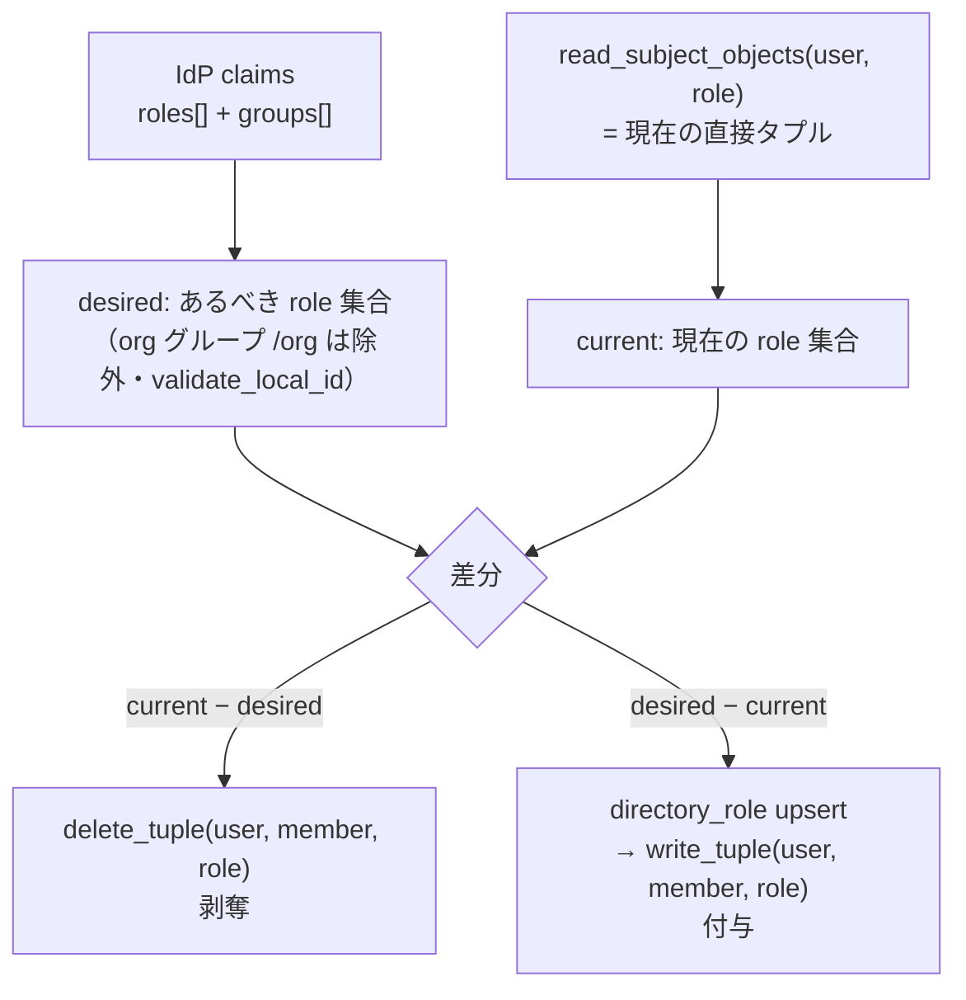

- **desired**（`desired_role_ids`, `callback.rs:254`）: `roles` claim ＋ `groups` claim を統合。org 同名グループ（`/org`）は
  organization タプルの責務なので除外。`validate_local_id` で構造文字を弾く。
- **current**（`read_subject_objects`, `callback.rs:180`）: **直接タプルのみ**（継承展開しない）を自テナント名前空間で抽出。
  剥奪対象は「直接付与されたもの」が正なので `list_objects` ではなく `read_subject_objects` を使う。
- **剥奪 → 付与**の順。付与時は台帳 `directory_role` を FGA タプルより先に upsert（purge 漏れ防止・#91）。
- **fail-safe**: READ 失敗時は剥奪をスキップして付与のみ（誤って全ロールを剥がさない）。claims が空＝ロール無しは
  正当に解釈して stale タプルを剥奪する（fail-open を避ける）。

---

## 13. 規約・不変条件チェックリスト（DO / DON'T）

コードを書く・レビューするときの早見表。詳細は `architecture-invariants` スキル。

### ✅ DO

- データアクセスする公開関数は**第一引数に `&AuthContext`** を取る。
- 識別子は必ず `ctx.ns()`（`Namespace`）経由で組む。`FgaObject` / `Subject` の生文字列を作らない。
- 認可判定は `AuthzClient` トレイト経由。type/relation 名は `vocab` の enum を使う。
- 共有解除を即反映したい read は `Consistency::HigherConsistency`。
- 書込は「FGA 付与 → 失敗時は補償」。冪等 no-op は bool で見分けて巻き戻さない。
- `.fga` と `.json` を**必ず同時に更新**し、`vocab.rs` の enum も足す。

### ❌ DON'T

- ハンドラに `if principal.roles.contains(...)` のような**認可ロジックを散らさない**（チョークポイント違反）。
- OpenFGA を直叩きしない（`FgaHttp` はアプリから見えない）。
- `tenant_id` を bare `String` で引き回さない。必ず `AuthContext` に載せる。
- **chunk / 個々のデータ行を OpenFGA オブジェクトにしない**（タプル爆発。post-filter は file/テーブル粒度）。
- owner を role#member や workflow に付与しない（横展開の禁止）。
- RAG で `authz_tags` を local に剥がして保存しない（tenant 境界が消える）。
- `list_objects` の結果を「読める一覧」として無条件に信じない（上限 500 縮退を考慮。post-filter が最終権威）。

---

## 14. 新しい型 / relation を足す手順

型や relation を増やすときは**単一ソースを全部そろえて更新**する。1 か所でも漏れると CI が落ちるか、実行時に壊れる。

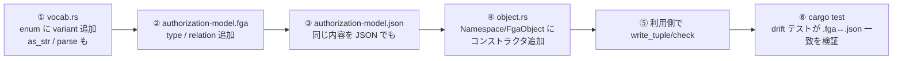

1. **`vocab.rs`**: `ObjectType` / `Relation` に variant を追加。`as_str` と（読み戻すなら）`parse` も更新。
   TS 型は `#[derive(TS)]` で自動生成される。
2. **`authorization-model.fga`**: 人がレビューする DSL に type/relation を追記。含意（`or owner` 等）も書く。
3. **`authorization-model.json`**: OpenFGA へ投入する正本。**②と意味的に一致させる**。
4. **`object.rs`**: `Namespace` と `FgaObject` に新型のコンストラクタ（`pub(crate)` + `Namespace` 公開メソッド）を追加。
5. 利用側で `ctx.ns().新型(id)` を作り `write_tuple` / `check`。
6. `cargo test -p authz`。**drift テスト**（`model.rs:121` の `fga_and_json_declare_same_types`）が
   `.fga` と `.json` の type 名集合の一致を検証し、片方だけ足す漏れを検出する。

> なぜ二重管理（.fga と .json）なのか: `.fga` は可読性のためのレビュー用、`.json` が実際に投入する形式。
> DSL コンパイラを実行時依存にせず、人のレビューと機械投入を両立するための割り切り。drift は CI で担保する（`model.rs:1-8`）。

model のロードは冪等（`ensure_store_and_model`, `model.rs:30`）。起動時に「最新 model が期待と意味的に一致すれば再利用、
差分があるときだけ新バージョンを書き込む」。model はイミュータブル追記なので毎起動 write するとバージョンが無限に増えるのを防ぐ。

---

## 15. よくある落とし穴・FAQ

**Q. `check` と `list_objects` はどう使い分ける?**
A. 1 件の判定は `check`。「この人が読めるもの全部」は `list_objects`。ただし `list_objects` は上限（RAG は 500）で
縮退し得るので、**最終的な権限の権威は常に `check`**（post-filter）に置く。

**Q. 共有相手一覧に部署のメンバーが出てこない**
A. `read_tuples`（直接タプル）を使っているから正しい。UI で「営業部（部署）に共有」と 1 行出れば OK。
個々のメンバー展開は見せない（それは継承）。「自分に共有された一覧」側は `list_objects` で展開済み。

**Q. 共有解除したのにまだ読める**
A. 読取経路が `MinimizeLatency` になっていないか確認。共有解除の即反映が要る read は `HigherConsistency`
（storage の `require_read`、RAG post-filter は既にそうなっている）。セッション削除では個別リソースの共有解除にはならない。

**Q. 別テナントのオブジェクトを間違って check してしまう心配は?**
A. `ctx.ns()` 経由でしか識別子を組めないので、acme のコンテキストから `folder:beta|...` は**作れない**（`pub(crate)` 封印）。
読み戻し側も `strip_object_id` が他テナントを `None` で弾く。テナント越境は型レベルで不能。

**Q. データ行（何万行）を個別に認可したい**
A. **行を OpenFGA タプルにしない**。テーブル単位を ReBAC、行は WHERE 述語（ABAC）、個別共有だけ例外的にスパースタプル。
詳細は `mini-app-onboarding.md` §6.2。RAG の chunk→file 粒度と同じ発想（タプル爆発を避ける）。

---

## 付録: 主要ファイル早見表

| 関心事 | ファイル |
|---|---|
| 認可の口（トレイト） | `crates/authz/src/client.rs` |
| type/relation 語彙（単一ソース） | `crates/authz/src/vocab.rs` |
| 識別子・テナント名前空間化 | `crates/authz/src/object.rs` |
| AuthContext / Principal | `crates/authz/src/context.rs` |
| 識別子の文字ポリシー | `crates/authz/src/ident.rs` |
| OpenFGA HTTP 実装・冪等化 | `crates/authz/src/fga_http.rs` |
| model 冪等ロード・drift テスト | `crates/authz/src/model.rs` |
| ReBAC モデル正本（DSL / JSON） | `crates/authz/model/authorization-model.{fga,json}` |
| ストレージの owner/parent/共有/move | `crates/storage/src/service/{folder,finalize,sharing,move_rename,admin,trash}.rs` |
| RAG 二段 authz | `crates/rag/src/authz_filter.rs` / `search.rs` |
| チャット thread 共有 | `crates/chat/src/store/threads.rs` |
| artifact / secret | `crates/artifact/src/store.rs` / `crates/secrets/src/store.rs` |
| workflow 委譲 | `crates/workflow-engine/src/delegation.rs` / `run/launcher.rs` |
| 認証 middleware / tenant 解決 / ロール同期 | `crates/api/src/middleware/session.rs` / `extract/auth_context.rs` / `routes/auth/callback.rs` |
