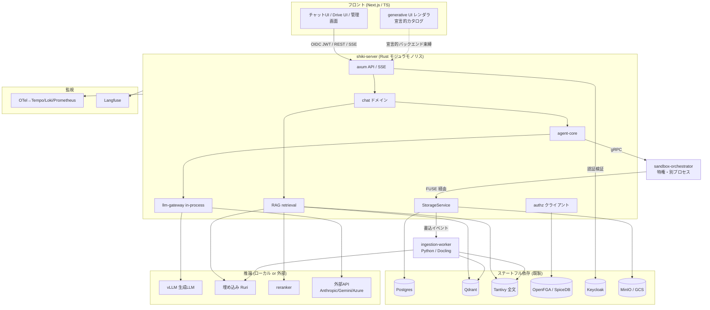
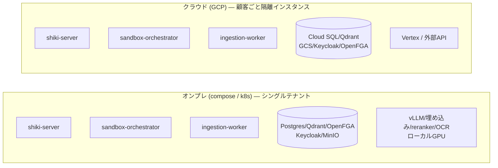
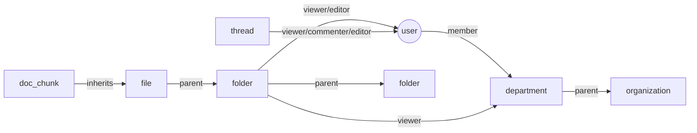
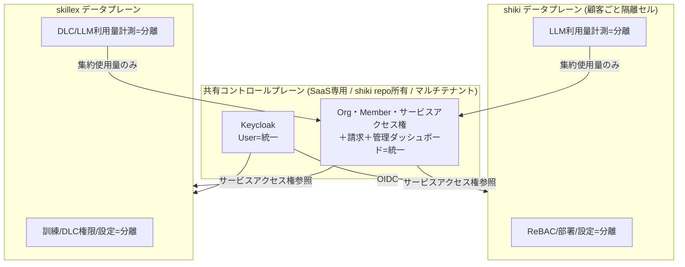
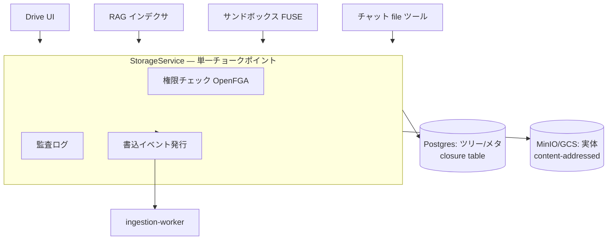
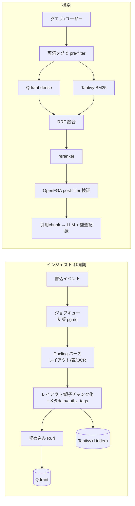
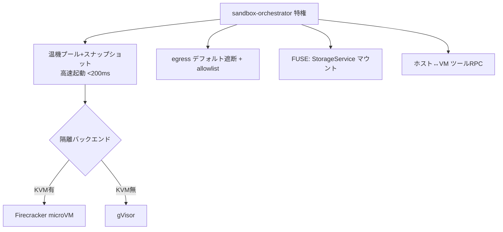

# shiki 設計書

> 本書は[要件定義書](./requirements.md)を満たすアーキテクチャを定義する。実装順は[ROADMAP](./roadmap.md)。

## 1. 設計原則

1. **モジュラモノリス＋特権分離**: コアは単一バイナリ。特権が要るサンドボックスだけ別プロセス。
2. **差し替え点はトレイトに集約**: クラウド/オンプレ差は4〜5本のトレイト実装で吸収、アプリ本体は不変。
3. **単一チョークポイント**: ストレージ・認可・LLM呼出は各々1経路に集約し、権限/監査/イベントをそこで担保。
4. **枯れた基盤に乗る／コアを自作**: 隔離・認可・認証・パースは既製、サンドボックス制御/RAG/agent/gatewayは自作。
5. **トレイト裏＝fable 5、トレイト表＝人**。

## 2. システム全体構成



## 3. デプロイ・トポロジ



- 同一バイナリ。差は下表のトレイト実装と推論バックエンドのみ。

### 3.1 差し替えトレイト

| トレイト | オンプレ実装 | クラウド実装 | 委譲 |
|----------|-------------|-------------|------|
| `ObjectStore` | MinIO (S3) | GCS | — |
| `VectorStore` | Qdrant（小規模は pgvector） | Qdrant / マネージド | — |
| `LlmProvider` | vLLM（ローカル） | Vertex / 外部API | — |
| `Sandbox` | Firecracker（KVM有）/ gVisor | gVisor / Firecracker | **fable 5** |
| `DocumentParser` | Docling（ローカル） | Docling / 商用OCR | — |
| `EmbeddingProvider` | Ruri / BGE-m3 | 同左 / 外部 | — |

## 4. サブシステム設計

### 4.1 認証・認可

- **AuthN = Keycloak**: 顧客IdP（AD/Entra/Okta）をOIDC/SAML/LDAPでフェデレート＋ローカルIdP。
  フロントは OIDC JWT を取得し `Authorization` ヘッダで送信。SSEは fetch-stream でヘッダ付与。
  shiki-server の **AuthN 向き先は設定で差し替え**（SaaS=共有コントロールプレーンのissuer / オンプレ=ローカルKeycloak）。
- **AuthZ = ReBAC（OpenFGA/SpiceDB）**: タプル `object#relation@subject` で表現。



- フォルダ→子・部署→上位への継承を relation で表現。**可読性判定は単一の authz クエリ**に帰着し、
  ファイル共有も permission-aware RAG も同じ問いを使う。
- **認可コンテキスト**: 全データアクセスは `principal + org` を持つコンテキスト経由（将来 `tenant_id` 追加の継ぎ目）。

#### 4.1.1 マルチサービス境界（shiki × skillex）— SaaS版のみ

統一は **SaaS版限定**。オンプレは shiki・skillex とも認証基盤を切り離し単独運用（外部依存ゼロ）。



- **3層境界**: ①User=統一 ②サービスへの入場券＋管理者バッジ=統一 ③館内ルール（細かい認可/設定）=分離。
- **サービスロール付与**は `利用可否＋サービス管理者か` の粗い粒度のみ。細かい権限は各サービス内。
- **請求=統一（Org単位1請求・サービス別内訳）／利用量=分離（集約値のみ請求へ・クォータ強制は各サービス）**。
- **オンプレ**: 共有プレーンを積まず、`shiki-server` の AuthN をローカルKeycloakへ向ける（設定差し替え）。
- **契約の正本 = shiki repo `contracts/`**: skillex（別リポ）が参照する OIDC設定・サービスアクセス権API・
  利用量集約イベント・トークンの aud/scope の正本を公開し、skillex が取り込む（バージョン管理＋後方互換ポリシ）。

### 4.2 ストレージ（3層分離 ＋ FUSE）



- 実体=オブジェクトストア（コンテンツアドレッシングで重複排除＋バージョニング）。
  論理ツリー/メタ=Postgres（closure table）。権限=OpenFGA。実体に直接権限を持たせない。
- **FUSE仮想FS**: サンドボックス内で `/workspace` としてマウント。read/write は裏で StorageService を叩き、
  権限/監査/再索引を必ず通る。**API は FUSE 前提で設計**（初版実装は sync 妥協可、後で FUSE 差し替え）。

### 4.3 RAG パイプライン



- **二段authz**: pre-filter（両系統に必須）＋ post-filter 検証。片方が壊れても権限を守る。
- `embedding_model_version` をベクタに刻み、モデル変更＝該当インデックス全再構築。
- 親子チャンク（small-to-big）で日本語長文の文脈を保つ。

### 4.4 チャット & agent-core

- **Message content = 構造化ブロック配列（JSONB）**。添付はストレージ参照のみ。
- **agent-core（自作）**: LLM↔ツールのループ（計画→ツール→観測→継続）、ツールセット非依存、`Tool` トレイト。
  - チャット = 制約ツールセット（doc_search / code_interpreter / file_ops）＋短ホライズン。
  - 自律 = フルツール（shell/任意コマンド/CRUD）＋長ホライズン＋FUSEストレージ。
- 共通化: llm-gateway、Langfuseトレース、監査、トークン会計、権限境界。
- **ツール選択**: デフォルト全提示・モデル自動選択。権限/破壊/コスト系のみ明示許可。

### 4.5 llm-gateway（自作・in-process）

- 内部正規形=OpenAI互換スキーマ。薄いアダプタで vLLM / Anthropic / Gemini /（必要なら Azure）。
- 機能は必要分のみ（フォールバック/リトライ/トークン会計/Langfuse計装/権限注入）。
  セマンティックキャッシュ・高度ルーティング・仮想キーは後追い。
- `LlmProvider` トレイト実装そのもの。別プロセス化しない（ホップ0、部品削減）。

### 4.6 サンドボックス



- 隔離プリミティブは既製（Firecracker主/gVisor副、`Sandbox` トレイトで差し替え）。
- 自作=制御層（プール/高速起動/FUSE/egress/RPC/リソース制限）。参考実装 E2B（OSS）。
- code_interpreter は同基盤の制約インスタンス（Python限定・ネット遮断・短命）。

### 4.7 generative UI / ミニアプリ / prompt template

- **生成UI**: LLM→検証済みJSONスペック→信頼コンポーネントカタログで描画（任意コード実行なし）。
- **ミニアプリ** = prompt template ＋ UIスペック ＋ 許可ツール、のバージョン付きアーティファクト。
  バックエンド束縛は宣言済み・認可済みアクション経由のみ（アンビエント権限なし）。ReBACで共有。
- **prompt template** = システムプロンプト＋知識スコープ（RAG範囲限定）＋許可ツール＋モデル既定＋few-shot。
  知識スコープで絞っても最終可読性は個人ReBACで再チェック。
- すべて「共有可能アーティファクト＋ReBAC＋監査」の共通枠に収まる。

### 4.8 資料作成

- v1: `DocumentGenerator` トレイト。xlsx=`rust_xlsxwriter`、docx/pptx=ingestion-worker(Python)。
  ひな型プレースホルダ穴埋め併設。サンドボックスのエージェントが「スペック→生成→ストレージ保存」。
- v2: OnlyOffice Docs / Collabora をiframe＋保存コールバックで組込（StorageService保存→RAG再索引）。

### 4.9 監視

- OTel計装（axum/tonic/agent-core）→ Tempo/Loki/Prometheus（クラウドはエクスポータ差し替え）。
- Langfuse で LLM 可視化。**監査ログ（権限・引用chunk）と Langfuse を trace_id で突合**（早期に種を蒔く）。

## 5. リポジトリ構成（モノレポ・Rustワークスペース）

```
crates/
  api/             # axum, SSE, OpenAPI(utoipa)
  chat/            # スレッド/メッセージ/content blocks
  agent-core/      # エージェントループ・Tool トレイト   [fable 5 共同設計]
  llm-gateway/     # プロバイダアダプタ・LlmProvider
  storage/         # StorageService・ObjectStore
  rag/             # retrieval・VectorStore・二段authz     [fable 5]
  authz/           # OpenFGA クライアント・relation 定義
  sandbox-client/  # orchestrator gRPC クライアント
  sandbox-orchestrator/ # 特権プロセス・Firecracker/gVisor [fable 5]
  fuse/            # StorageService の FUSE 表現           [fable 5]
ingestion-worker/  # Python: Docling パース・docx/pptx 生成
web/               # Next.js / TypeScript
deploy/            # docker compose / k8s manifests
docs/
```

- 型契約: Rust→OpenAPI(utoipa)→openapi-typescript、SSEイベント型は ts-rs/typeshare（手書き型なし）。

## 6. fable 5 委譲境界

| 委譲 | 理由 |
|------|------|
| sandbox-orchestrator（制御層） | systems-heavy、`Sandbox`トレイトで境界明確 |
| fuse（FUSE仮想FS） | systems-heavy、`StorageService`が相手で自己完結 |
| agent-core ループ | 製品の核。fable 5実装＋**人が深く設計に関与（共同設計）** |
| RAG 二段authz・融合の正しさ | 正しさクリティカル、入出力境界明確 |

人が握る: API/CRUD/統合の糊、フロント、OpenFGA relation schema（ポリシ決定）、優先順位・トレイト境界。
