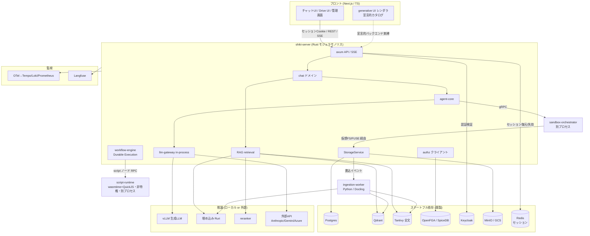
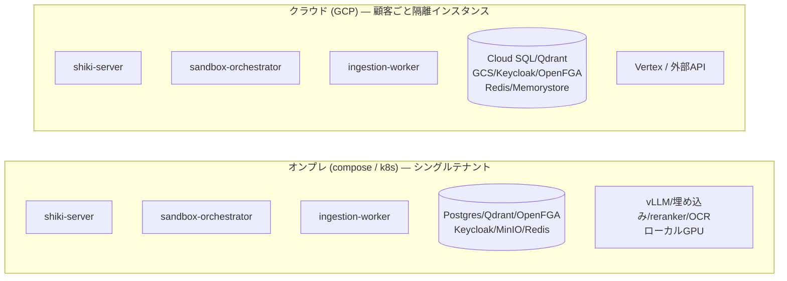
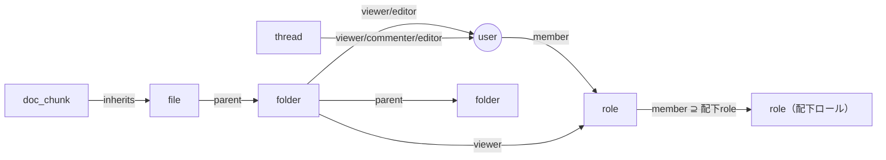
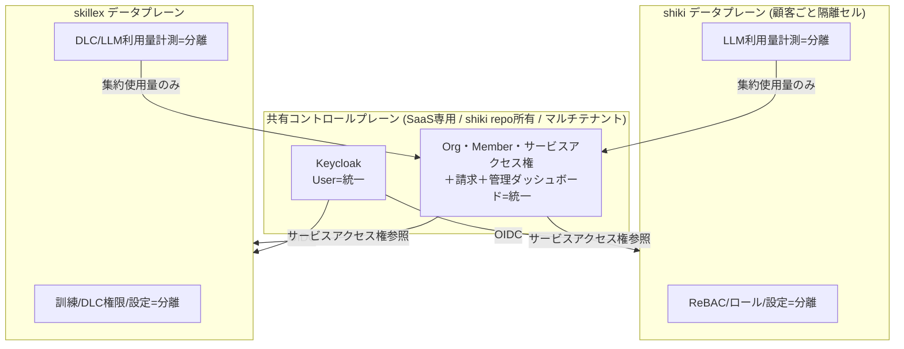
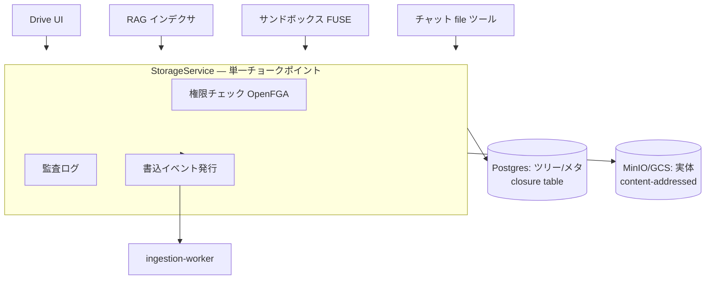
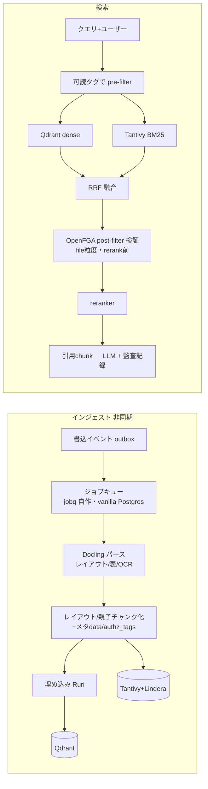
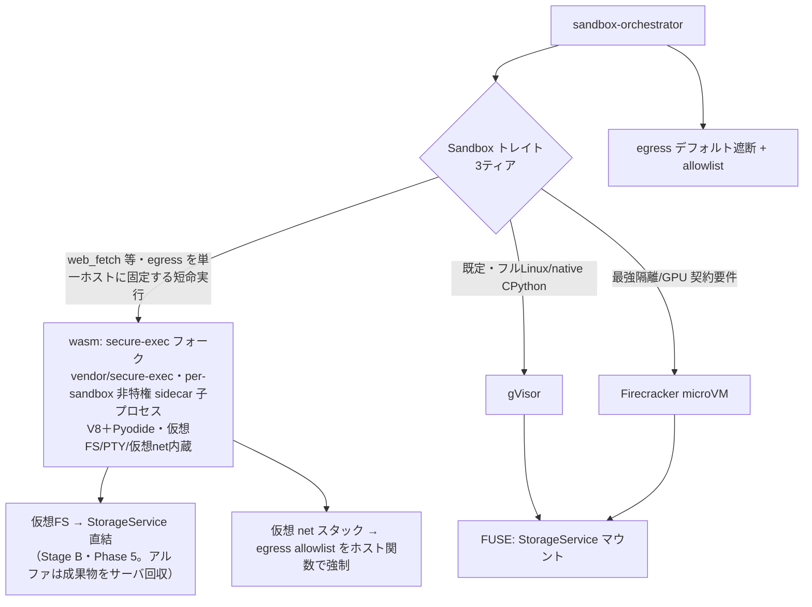
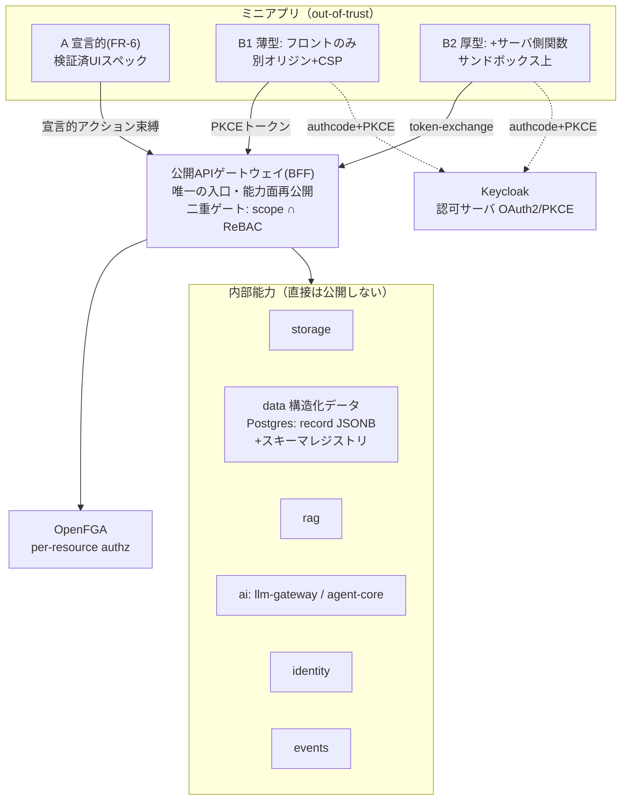

# shiki 設計書

> 本書は[要件定義書](./requirements.md)を満たすアーキテクチャを定義する。実装順は[ROADMAP](./roadmap.md)。
>
> ⚠️ **実装着手前に必ず読む**: 本設計が暗黙にしている前提のうち「このまま実装すると壊れる／詰まる／主張が嘘になる」箇所を
> [設計上の落とし穴・要注意点](./design-caveats.md) に固定した。RAG 二段 authz（PIT-1〜3）は
> Phase 2 で解決済み（§4.3 が正）。FUSE/エージェント一貫性（PIT-4〜5）は当該 Phase の成立条件であり、
> 未解決のまま着手しないこと。

## 1. 設計原則

1. **モジュラモノリス＋特権分離**: コアは単一バイナリ。特権が要るサンドボックスだけ別プロセス。
2. **差し替え点はトレイトに集約**: クラウド/オンプレ差は4〜5本のトレイト実装で吸収、アプリ本体は不変。
3. **単一チョークポイント**: ストレージ・認可・LLM呼出は各々1経路に集約し、権限/監査/イベントをそこで担保。
4. **枯れた基盤に乗る／コアを自作**: 隔離・認可・認証・パースは既製、サンドボックス制御/RAG/agent/gatewayは自作。

## 2. システム全体構成



## 3. デプロイ・トポロジ



- 同一バイナリ。差は下表のトレイト実装と推論バックエンドのみ。

### 3.1 差し替えトレイト

| トレイト | オンプレ実装 | クラウド実装 |
|----------|-------------|-------------|
| `ObjectStore` | MinIO (S3) | GCS |
| `VectorStore` | Qdrant（小規模は pgvector） | Qdrant / マネージド |
| `LlmProvider` | vLLM（ローカル） | Vertex / 外部API / LiteLLM アダプタ（§4.5） |
| `Sandbox` | wasm（agentos）/ Firecracker（KVM有）/ gVisor | wasm（agentos）/ gVisor / Firecracker（§4.6 3ティア） |
| `DocumentParser` | Docling（ローカル） | Docling / 商用OCR |
| `EmbeddingProvider` | Ruri / BGE-m3 | 同左 / 外部 |
| `KeyProvider` | ローカルキーファイル（将来HSM） | Cloud KMS |
| `SearchProvider` | SearXNG 自己ホスト（エアギャップは機能無効） | Brave Search API |
| `OfficeSuite` | Collabora Online（同梱） | Collabora Online（OnlyOffice へ差し替え可能な退路） |

## 4. サブシステム設計

### 4.1 認証・認可

- **AuthN = Keycloak**: 顧客IdP（AD/Entra/Okta）をOIDC/SAML/LDAPでフェデレート＋ローカルIdP。
  **認証は BFF 方式**: OIDC Authorization Code + PKCE の code 受け／token 交換は **shiki-server（`crates/api`）がサーバ側で実施**し、
  ブラウザには `httpOnly`+`Secure`+`SameSite=Lax` の**不透明セッション Cookie のみ**を渡す（トークンはブラウザに置かない）。
  セッションは **Redis（プール型・全テナント共用＋`tenant_id` キースコープ）** に保持し、リクエストごとに Cookie→セッション→`Principal` を復元。
  セッション削除は**セッション/プリンシパル単位の即時失効**（漏洩セッションの無効化・アカウント無効化・強制ログアウト）に効く。
  IdP 側でユーザーを無効化/削除した場合の即時反映は **OIDC Back-Channel Logout**（`POST /auth/backchannel-logout`）で受け、
  `logout_token` の `sid`/`sub` から該当セッションをサーバ側で失効させる（access token 寿命を待たない・#91）。
  セッションストアは `sub`/`sid` の逆引きインデックスを持ち、logout_token がテナントを含まなくてもテナント横断で失効できる。
  ⚠️ **個別リソースの共有解除（Task 1.6）はトークン/セッション形式に依らず OpenFGA のリクエスト毎チェック（＋PIT-11 の `HIGHER_CONSISTENCY`）で担保する**（セッション削除では代替できない・混同しないこと）。
  access token の期限切れに備え、**BFF（`crates/api`）が refresh token をサーバ側で保持・更新・ローテーション**し、downstream への token-exchange を継続させる（ブラウザ上はログイン済みなのに内部呼び出しだけ 401 になるのを防ぐ）。
  CSRF は SameSite ＋ double-submit トークンで防御。Cookie を first-party にするため **web/api は同一オリジン配信**（リバースプロキシ / Next rewrites）を前提とする。
  SSE は Cookie が自動添付されヘッダ注入が不要になる。ただし **POST で発話を送るチャットストリーム（Task 3.5）は `EventSource` が GET 専用・body 不可のため**、fetch-stream を維持するか「POST で stream を作成 → GET `EventSource` で購読」に分離する。downstream/サービス間（skillex 等）へは引き続き **JWT/token-exchange** で identity を運ぶ（内部はステートレス）。
  shiki-server の **AuthN 向き先は設定で差し替え**（SaaS=共有コントロールプレーンのissuer / オンプレ=ローカルKeycloak）。
  > 経緯と比較・影響範囲は [design-caveats PIT-30](./design-caveats.md) / [docs/auth/browser-token-strategy.md](./auth/browser-token-strategy.md) を参照。
- **AuthZ = ReBAC（OpenFGA/SpiceDB）**: タプル `object#relation@subject` で表現。



- フォルダは親→子へ、ロールは**配下ロール→親ロールへメンバーシップを継承**（上方向ロールアップ。
  親ロールは配下ロールのメンバーを含む。例: 営業部ロール ⊇ 営業1課ロール）。**可読性判定は単一の authz クエリ**に帰着し、
  ファイル共有も permission-aware RAG も同じ問いを使う。
- **認可コンテキスト**: 全データアクセスは `principal + org + tenant_id` を持つコンテキスト経由（SaaS マルチテナントを day-1 前提・後付けで隔離境界を壊さない）。
- **authz のテナント分離（SAAS.1 / #84）**: OpenFGA は **全テナント共有の単一ストア＋識別子名前空間化**（フルプール）で分離する。
  FGA 識別子を `<type>:<tenant_id>|<local_id>` へ名前空間化し（区切り `|` = `authz::TENANT_SEP`。AD group パスの `/` と衝突しない）、
  生の識別子構築を `AuthContext::ns()`（`authz::Namespace` チョークポイント）へ一本化して**越境タプルを型レベルで不能化**する。
  `tenant_id` は解決時に禁止文字（`| : # @`・空白）を fail-closed 検証。オンプレ/cell は `tenant_id="default"` 名前空間で一様に動く。
  → データプレーンの他層（DB 行分離・ストレージプレフィクス・セッションキー）も同じく tenant スコープ。**cell（顧客ごと専用ストア）は将来オプション**として残す（フルプール最適化は SAAS.5）。

##### authz 語彙の Single Source of Truth ＋ codegen
- **認可語彙（OpenFGA relation／能力スコープ `<能力>.<操作>`／agent-core 許可ツール名／宣言的アクションID）を
  単一定義から Rust enum ＋ TS 型へ生成**（手書き定数を持たない）。型契約の codegen 思想（utoipa→openapi-typescript・ts-rs）を認可語彙へ延長。
  → タイポ・存在しないスコープ/ツール/relation 参照を**コンパイル時／検証時に閉じた集合へ照合して弾く**。
- これは **集中PEP** と対になる: app-gateway / StorageService の単一チョークポイントが
  「エンドポイント→必要スコープ」の**宣言的マップ**を一律強制（個別ハンドラでチェックさせない＝抜け漏れを構造的に不可能化）。
- **AIハルシネーション境界**: LLM／エージェント／ミニアプリ（特に開発者・LLMが書くマニフェストやUIスペック）が
  **実在しない権限名・ツール名・スコープを参照しても、この閉じた語彙集合で拒否**される。
  Phase 6.3（UIスペック検証）・**Phase 9.1（ミニアプリ・マニフェスト検証）** はこの生成語彙に依存する。
- 注: ここで codegen するのは**粗い語彙（スコープ/relation名/ツール名）**であり、
  **インスタンス単位の実認可は依然 OpenFGA（ReBAC）＋行レベル ABAC 述語**で行う（語彙の型安全 ≠ 認可判定）。
  RBAC のロール×権限表をコアにはしない（ロール階層・個別共有で RBAC ロールが爆発するため／ReBAC維持）。

#### 4.1.1 マルチサービス境界（shiki × skillex）— SaaS版のみ

統一は **SaaS版限定**。オンプレは shiki・skillex とも認証基盤を切り離し単独運用（外部依存ゼロ）。

> ⚠️ 共有プレーンが全顧客・両サービスの blast radius になる点、aud/scope の厳密束縛と失効伝播、
> 利用量＝金額クリティカルの整合、「設定差し替えだけでオンプレ化」の過大主張は [PIT-26〜29](./design-caveats.md)。



- **3層境界**: ①User=統一 ②サービスへの入場券＋管理者バッジ=統一 ③館内ルール（細かい認可/設定）=分離。
- **サービスロール付与**は `利用可否＋サービス管理者か` の粗い粒度のみ。細かい権限は各サービス内。
- **請求=統一（Org単位1請求・サービス別内訳）／利用量=分離（集約値のみ請求へ・クォータ強制は各サービス）**。
- **オンプレ**: 共有プレーンを積まず、`shiki-server` の AuthN をローカルKeycloakへ向ける（設定差し替え）。
- **契約の正本 = shiki repo `contracts/`**: skillex（別リポ）が参照する OIDC設定・サービスアクセス権API・
  利用量集約イベント・トークンの aud/scope の正本を公開し、skillex が取り込む（バージョン管理＋後方互換ポリシ）。
- **管理画面はUIのみ統一・データ分離**: SaaSは統一シェル（共有ページ）＋各サービス設定ページをマイクロフロントエンドで合成。
  各ページは自サービスのAPI/ストアを叩き authz・設定データは分離。各ページは「シェル埋め込み／単独」両対応の自己完結モジュール
  （オンプレは単独管理画面として動作）。

### 4.2 ストレージ（3層分離 ＋ FUSE）



- 実体=オブジェクトストア（コンテンツアドレッシングで重複排除＋バージョニング）。
  論理ツリー/メタ=Postgres（closure table）。権限=OpenFGA。実体に直接権限を持たせない。
- **FUSE仮想FS**: サンドボックス内で `/workspace` としてマウント。read/write は裏で StorageService を叩き、
  権限/監査/再索引を必ず通る。**API は FUSE 前提で設計**（初版実装は sync 妥協可、後で FUSE 差し替え）。
  → ただし「必ず通る」を syscall 粒度でやると破綻する（capability 化が必要）／エージェントの read-after-write
  一貫性が無い点は [PIT-4・PIT-5](./design-caveats.md)。

### 4.3 RAG パイプライン



- **ジョブキュー = 自作 `crates/jobq`（vanilla Postgres・Phase 2 で確定）**: pgmq は採用しない。
  `FOR UPDATE SKIP LOCKED` ＋ visibility timeout ＋ attempts ＋ DLQ テーブルの汎用キューで、
  **拡張依存ゼロ**（オンプレ持込 Postgres・マネージド PG の拡張 allowlist・エアギャップの全てで動く）。
  Phase 10 workflow-engine（Postgres 上の自作 Durable Execution）と同一系譜の自前プリミティブ。
  役割分離: `storage_event_outbox` ＝ドメイン書込と同一 Tx の**耐久イベントログ兼 fan-out 点**
  （Phase 10 のイベントトリガ等、将来の複数購読者に対応）／ `job_queue` ＝ per-consumer の
  **配送機構**（vt/リトライ/DLQ・消費後 DELETE）。relay が outbox→queue を同一 Postgres 内・
  単一 Tx でコピーする（exactly-once）。チャット run（Phase 3）・資料生成ジョブ（Phase 7）も
  同じ `jobq` のキューとして実装する。
- **二段authz（Phase 2 で確定・実装済み）**: pre-filter（両系統に必須）＋ post-filter 検証。
  片方が壊れても権限を守る（この製品の心臓部）。
  - **pre-filter = PIT-1 (b) 権限定義オブジェクト方式**: chunk には**構造タグのみ**を焼く
    （`file:<tenant>|<id>` 自身＋祖先 `folder:<tenant>|<id>` 群）。検索時に
    `ListObjects(user, viewer, folder) ∪ ListObjects(user, viewer, file)` で**ユーザーの可読
    オブジェクト集合をクエリごとに算出**し、`authz_tags ∩ 可読集合` で dense/keyword 両系統を絞る。
    共有変更でタグ再書込は不要（**grant は次のクエリで即反映＝PIT-3 解消**）。タグが変わるのは
    move のみ（祖先再評価・Task 2.9）。
  - **カーディナリティ上限とフォールバック**: 可読集合が **上限 500**（OpenFGA ListObjects の
    応答上限 1000 未満に設定し「切り詰められた不完全集合を正として使う」under-recall 事故を
    構造的に防ぐ）を超えたら pre-filter を放棄して **tenant-only へ縮退**し、post-filter 全依存
    ＋ over-fetch 引き上げ（3×→8×）で正しさを維持する。コストモデル: 通常時は
    `fetch_k = max(top_k, rerank_pool) × 3`、縮退時は ×8・不足時バックフィル（fetch_k 倍増・
    最大 3 ラウンド・上限 256）で**最終引用件数が top_k を下回らない**（PIT-2）。
    `ListObjects` はキャッシュしない（grant 即時性優先。将来 QPS が問題になったら
    `{tenant}/{user}` キー・TTL ≦ 5s の短命キャッシュを検討する）。
  - **post-filter は reranker の前**（PIT-2）: RRF 融合後に **file 粒度**の OpenFGA check
    （`HigherConsistency`・剥奪の即時反映＝PIT-11）で deny を落としてから rerank する
    （読めない chunk に rerank 計算を浪費しない）。
  - 検索デバッグ表示（`authz_denied_files` 等）は「読めない一致文書の存在」のオラクルになり得る
    ため**社内基盤前提**。公開 API 化（Phase 9 gateway）時は管理者ロール限定にする。
- `embedding_model_version` は**インデックス単位で固定**する（Qdrant collection 名にモデル版を
  織り込み、検索・書込は alias `rag_chunks_active` 経由。worker の応答版と設定版の突合ガードで
  混在を書込前に拒否）。モデル更新は **shadow collection を背面で再構築 → alias 切替**
  （ゼロダウンタイム・[PIT-8](./design-caveats.md)）。
- 親子チャンク（small-to-big）で日本語長文の文脈を保つ。チャンク ID は
  `uuid5(node_id, version/ordinal)` の決定的生成（再インジェスト＝上書きで冪等）。
- 引用監査は既存 `audit_log`（storage の監査チョークポイント）に `action="rag.search"` で記録
  （引用 chunk_id 群・file 粒度の認可判定・クエリ sha256・trace_id）。

- **テナント分離（SAAS.1 の RAG 適用・#91 で明文化）**: Qdrant/Tantivy は DB/blob/FGA/session と同じく
  `tenant_id` 境界を持つ。これは `authz_tags`（テナント**内** ReBAC 可読性・PIT-1）とは**別レイヤ**の
  独立した防壁であり、以下を不変条件とする:
  - **Qdrant**: 既定は単一 collection ＋ payload に `tenant_id` を持たせ、**全 search に
    `tenant_id = ctx.tenant_id` フィルタを無条件 AND**（authz_tags フィルタが空/バグでも効く）。
    強隔離要件の顧客向けには collection-per-tenant を選べる二択を [SAAS.5](./roadmap/parallel-tracks.md) の
    cell/pool 方針と揃える。`embedding_model_version` × `tenant_id` は直交（version 単位の shadow index）。
  - **Tantivy**: index-per-tenant を既定とする（PIT-8 の shadow 切替と相性良）。単一 index にする場合は
    `tenant_id` を term filter で必須 AND。いずれでも「tenant フィルタは authz_tags と独立に必ず適用」。
  - **authz_tags は名前空間化形式のまま格納**する。`ListObjects` が返す `folder:<tenant>|<local>` を
    `strip_object_id` で local に**剥がして格納しない**（剥がすとタグから tenant 境界が消え、pre-filter
    バグ 1 個で越境する）。剥がす実装を採るなら「照合時に tenant フィルタが別途必ずかかる」ことをテストで担保。
  - **キャッシュキーの tenant/org prefix 規約**: 埋め込み・parse 結果・reranker 等のキャッシュキーは
    `{tenant_id}/{org}/...` prefix に閉じる。`sha256(text)` 単独キーは「他テナントが同一文書を持つか」の
    **キャッシュ存在オラクル**（blob dedup を tenant スコープ化した [PIT-14](./design-caveats.md) と同型）になる。
  - **chunk を OpenFGA オブジェクトにしない**（[PIT-7](./design-caveats.md)）。post-filter は
    `file:<tenant>|<local>` 粒度で行い、chunk→file 対応は RAG メタ側で持つ。
  - **公開トレイトは第一引数に `&AuthContext`**（`VectorStore` / `EmbeddingProvider` / `DocumentParser` /
    検索 API）。`tenant_id` を bare `String` で引き回さず、識別子は必ず `AuthContext::ns()`
    チョークポイント経由で構築する。
  - **インジェスト経路の tenant_id 必須化**: `storage_event_outbox` / `job_queue` は `tenant_id` を
    第一級カラムで持つ。jobq メッセージ・Python worker 入力の型にも `tenant_id` を**必須フィールド**
    として通し、consumer はキュー行とメッセージの tenant 不一致を fail-closed で拒否する（worker が
    Qdrant/Tantivy のどの collection/index へ書くかの唯一の根拠になる）。

### 4.4 チャット & agent-core

- **Message content = 構造化ブロック配列（JSONB）**。添付はストレージ参照のみ。
- **agent-core（自作）**: LLM↔ツールのループ（計画→ツール→観測→継続）、ツールセット非依存、`Tool` トレイト。
  - チャット = 制約ツールセット（doc_search / code_interpreter / file_ops）＋短ホライズン。
  - 自律 = フルツール（shell/任意コマンド/CRUD）＋長ホライズン＋FUSEストレージ。
- 共通化: llm-gateway、Langfuseトレース、監査、トークン会計、権限境界。
- **ツール選択**: デフォルト全提示・モデル自動選択。権限/破壊/コスト系のみ明示許可。
- **自律の承認 3 モード（#350・thread 単位・実行中トグル可）**: 承認必須（既定・全破壊系が承認カードで停止）/
  オート（版管理で復元可能な書込のみ自動・fs_delete/shell 等の不可逆は承認維持）/ 全自動（危険・明示オプトイン・
  `tenant.allow_autonomous_bypass=false` の org キャップで禁止可・違反は明示エラー/警告でクランプ）。
  モード→`ApprovalPolicy` の写像は `crates/chat/src/autonomous.rs` に集約。read-only（web_search/web_fetch/
  doc_search）はどのモードでも止まらない。**skill はモードを緩められない**（Task 6.9 不変条件維持）。
  実行中の緩和は **run の actor 本人による設定のみ有効**（共有スレッドの別編集者が他人の権限の run の承認を
  緩められない・confused-deputy 防御）。
- **ワークスペース封じ込め（#350 で明示化）**: 自律 fs ツールは thread の起動フォルダ（`root_folder_id`）配下限定。
  名前解決は root 直下の SQL 完全一致のみ（パス解釈なし）・全操作は発話ユーザーの AuthContext（昇格しない）。
  フォルダ未指定は `agent-workspace-<thread>` を自動生成（「未指定なら Drive 全体」は採らない）。
  不変条件テスト: `crates/chat/tests/workspace_containment_it.rs`。
- **web ツール**: 新トレイト `SearchProvider`（SaaS=Brave Search API / オンプレ=SearXNG / エアギャップ=機能無効）。
  **ページ取得は検索と別ポリシー**: allowlist に検索プロバイダだけ載せると検索結果 URL が開けないため、
  web ツール有効時は「検索結果由来のホストへの**時限的な動的 allowlist**（当該 run 限定・宛先を監査記録・
  シークレット添付は不可）」をサンドボックスの egress 制御に追加する。管理者ポリシーでドメイン拒否リストを重ねられる。
- **deepresearch = agent-core のプリセット**（専用エンジンを作らない）: 「長ホライズン＋web.search/rag.search/
  document.write＋サンドボックス」構成の first-party skill（FR-7 の枠）。成果物はストレージ保存→自動 RAG 対象化。
- **会話履歴は tenant スコープのスキーマで新設（SAAS.1 / #91）**: thread/message テーブルは既存規約を踏襲し
  全行 `tenant_id text not null`＋複合 PK/unique に `tenant_id` を含める（例: `node` の
  `(org, tenant_id, parent_id, name)`）。thread の OpenFGA オブジェクトも `thread:<tenant>|<id>` になるよう
  `authz::Namespace` に `thread()` ビルダを追加する（現状 organization/role/folder/file のみ）。

#### 4.4.1 非同期生成（バックグラウンド継続生成・run 抽象）

チャット送信後にページを離れても生成が続く。生成ジョブは単発 LLM 呼び出しではなく **agent-core の run**
（ツール呼び出しを含むループ）であり、**durability はステップ境界（ツール呼び出し完了点）にのみ存在する**
（workflow-engine と同じ原理。[miniapp-platform §2](./miniapp-platform.md) と claim/リース/チェックポイントの
実装パターン・テーブル規約を共有）。

- **投入**: `POST /threads/:id/messages` が単一 Tx で「ユーザーメッセージ保存＋run 行(status=queued)＋jobq enqueue」
  （outbox と同型）→ 202 で `run_id` を即返す。
- **実行**: shiki-server 内 tokio ワーカープール（**チャット専用の高優先レーン**。ワークフロー/ingestion と同居させない）が
  `FOR UPDATE SKIP LOCKED` で claim＋リース（heartbeat）。イベントを `(run_id, seq)` で DB 追記＋Redis pub/sub 配信。
- **購読**: `GET /runs/:id/events`（SSE/EventSource）。順序は必ず **①Redis 購読を開始 → ②`Last-Event-ID`(=seq)
  以降を DB からリプレイ → ③ライブイベントと合流し seq で重複破棄**。リプレイ完了前に届いたライブイベントは
  バッファして seq 順に放出する（**先リプレイ→後購読はその隙間のイベントを取り逃がすため禁止**）。
  どのインスタンスでも Redis 経由で受信。
- **整合性の不変条件**: ①単一ライタ（リース保持ワーカーのみ）＋ `(run_id, seq)` unique で追記 exactly-once
  ②クラッシュ回復はステップ境界から（完了済みツール結果はチェックポイント復元、**生成途中の LLM ストリームは破棄して
  当該ステップのみ再生成**。「途中から続き生成」は採らない。#351 で配線済み: 自律 run はステップ境界ごとに
  Checkpoint（計画・消費・剪定後履歴・ループ検出器）を `generation_run.checkpoint` へ fenced 保存し、
  claim/takeover 時に resume へ渡す・端末確定でクリア・projection はイベント replay で再構築）③キャンセルは status=`cancelling`＋pub/sub 通知で
  ステップ境界・ストリーム読取ループが検知（サンドボックス実行中ツールへ kill 伝播）
  ④課金は attempt 単位で実消費を記録（表示は run 単位に集約）。

### 4.5 llm-gateway（自作・in-process）

- 内部正規形=OpenAI互換スキーマ（⚠️ 中立 content-block 案は [PIT-9](./design-caveats.md)。Task 3.2 着手時に確定）。
  薄いアダプタで vLLM / Anthropic / Gemini /（必要なら Azure）。
- **LiteLLM は `LlmProvider` 実装の一つ（オプションアダプタ）**（2026-07-05 確定・#32）:
  雑多な外部プロバイダを一括で足したい時だけ LiteLLM Proxy アダプタを有効化。
  **チョークポイント（会計・認可・監査・Langfuse）は Rust in-process から動かさない**。
  エアギャップ構成では LiteLLM を積まない（vLLM 直結のみ・NFR-2 無傷）。
- 機能は必要分のみ（フォールバック/リトライ/トークン会計/Langfuse計装/権限注入）。
  セマンティックキャッシュ・高度ルーティング・仮想キーは後追い。
- **モデルカタログ**: テナント管理者が「許可モデルリスト＋既定モデル＋モデル別単価（課金単価表と同居）＋
  国外処理バッジ（データレジデンシ明示）」を管理。ユーザーのモデル選択 UI はカタログの範囲内。
  skill のモデル既定（FR-7）もここに整合。
- **思考強度の正規化**: `effort: low/medium/high` を内部正規形に持ち、各アダプタが reasoning budget /
  thinking tokens に翻訳。UI は3段階セレクタのみ（プロバイダ固有ノブは晒さない）。
- `LlmProvider` トレイト実装そのもの。別プロセス化しない（ホップ0、部品削減）。
- **トークン会計は `tenant_id` + `org` スコープで day-1 から刻む（SAAS.3 課金の集計元・#91）**:
  計測レコード（prompt/completion tokens・model・cost・trace_id）に `tenant_id` + `org` を**必須カラム**とし、
  監査ハッシュチェーンが `tenant_id|org` で直列化・スコープする前例に倣う。金額クリティカル
  （[PIT-28](./design-caveats.md)）なので冪等キーを持たせ、テナント単位の集計をバイパス不能にする。

### 4.6 サンドボックス（3ティア・gVisor 既定）

**2026-07 方針転換（#97）**: `Sandbox` トレイトは維持し、バックエンドを用途別3ティアに再定義する。
設計原則4「隔離プリミティブは自作しない」は本件で**一部撤回**（Rust 製 in-process OS カーネルを自分たちが所有）。

**2026-07 再転換（本項）**: #97 で定めた「既定＝wasm」は**撤回し、既定バックエンドを gVisor とする**。
根拠は 3 ティア横断ベンチの実測（[bench](./sandbox/bench.md)）— wasm は create が桁違いに軽い（11ms・21MB）が、
**Python 実行が exec ごとの Pyodide 初期化で ~6s** かかる。gVisor は create 132ms・104MB と重いものの
**native CPython が 82ms（~75×速い）**。code_interpreter の実効体感は「create + 実行」の総時間で決まるため、
create レイテンシだけを見て wasm を選んだ #97 の判断は誤りだった。wasm ティアは廃止せず、
**web_fetch のような「egress を単一ホストへ固定する短命・読み取り専用実行」で引き続き使う**
（wasm を選ぶ理由は速度ではなく egress モデル＝下記の ⚠️ 参照）。

> ⚠️ **実装状態との差（2026-07 時点）**: 上記は**方針**であり、コード既定
> （`crates/sandbox-client/src/spec.rs` の `SandboxBackend::default()`）は**まだ `Wasm` のまま**。
> 切替の前提として ①native rootfs への numpy/pandas 同梱（既定 rootfs の `python:3.12-slim` は非同梱・
> 下記「前提条件」参照）②compose/CI/オンプレ配布への runsc とアセットの同梱、が要る。
> 未構成ティアは**静かに降格せず `Unimplemented` で fail する**設計のため、前提を満たさずに既定を
> 動かすと code_interpreter が動かなくなる。前提工事は **#346** で対応し、完了時にコード既定を反転する。

> **実装ノート（2026-07・Phase 4）**: [agentos](https://github.com/rivet-dev/agentos) はカーネルを含まず
> TS SDK/ACP 層であり、カーネル実体はその依存 **[secure-exec](https://github.com/rivet-dev/secure-exec)**（Rust・
> Apache-2.0）にある。よって我々が **フォークして所有するのは secure-exec** で、`vendor/secure-exec/` に取り込む
> （[fork-policy](./sandbox/fork-policy.md)）。隔離の実体は **V8 アイソレート＋WASI polyfill＋wasm32-wasip1 ゲスト**
> であり wasmtime ではない（「ブラウザ級」隔離）。sidecar（V8/Pyodide を抱える）は per-sandbox の非特権子プロセスとして
> orchestrator が spawn する。code_interpreter は **numpy/pandas**（matplotlib は非同梱・可視化は §4.7 の generative UI）。



| ティア | 用途 | 隔離保証（正直な主張） | アルファ |
|--------|------|----------------------|---------|
| **gVisor（既定）** | エージェント実行・skill・code_interpreter（native CPython・任意 pip）・ネイティブツールチェーン | ユーザー空間カーネル（VM 級ではない・PIT-24） | ✅ |
| wasm | web_fetch（egress を単一ホストに固定・短命・読み取り専用） | プロセス分離＋wasm 二層（ブラウザ級・VM級ではない） | ✅ |
| Firecracker | 契約上 VM 級隔離が要件の顧客・GPU | VM 級（KVM 前提） | ポストアルファ |

- **wasm ティアの構造**: agentos は仮想FS・プロセステーブル・PTY・仮想ネットワークスタックを自前に持ち
  ホスト上で何も実行しない。コマンド群（coreutils/git/curl 等）は wasm パッケージ、Node.js スクリプト実行可、
  任意ネイティブバイナリ・フル Python は動かない（必要なら gVisor/FC へ自動昇格＋管理者ポリシー。ノード設定にティア選択は出さない）。
  **in-process カーネルは shiki-server に同居させず、専用の非特権プロセス（`crates/sandbox-wasm`）に隔離して RPC で使う**。
- **FUSE の位置づけ変更**: wasm ティアでは agentos の仮想FSを StorageService に直結するため
  **カーネル FUSE が不要**（PIT-4 の syscall 粒度問題・PIT-22 の温機プール時間衝突が構造ごと消える。
  capability モデルは仮想FSバックエンドにそのまま適用）。FUSE は gVisor/FC ティア用として残す。
- egress は wasm ティアでは仮想 net スタックのホスト関数分岐で allowlist を強制（PIT-25 の SNI プロキシは gVisor/FC 用）。
- code_interpreter は選択ティアの制約インスタンス（ネット遮断・短命・実行後破棄）。**既定は gVisor**（native CPython）、
  wasm ティアを選んだ場合は Pyodide になる。ティアによって Python の実体（native / Pyodide）と
  利用可能ライブラリが変わる点は、上記「前提条件」の通り rootfs 側で揃える。
- **ティア選択の導線（admin ポリシー）**: コード実行系（code_interpreter / agent shell / workflow の agent_invoke）の
  隔離ティアは server 設定 `chat.sandbox_backend`（`gvisor`（方針上の既定・コード既定は #346 完了まで `wasm`）/ `wasm` /
  `firecracker`）で選ぶ。ユーザー/ノード設定には
  出さない。gVisor/FC は orchestrator 側で当該ティアが構成済み（runsc/rootfs 等）であることが前提で、未構成なら create は
  `Unimplemented` で fail する（静かに wasm へ降格しない・監査に残す）。native Python が ~75x 速いことが既定を
  gVisor にした根拠（[bench](./sandbox/bench.md)）。**web_fetch は egress を単一ホストへ固定する短命 sandbox のため常に wasm**
  （この設定の対象外・egress allowlist を wasm の仮想 net ホスト関数で実効化する）。
  ⚠️ web_fetch は内部で urllib（Python）を実行する（`crates/agent-core/src/tools/web_fetch.rs`）ため、wasm でも exec ごとに
  Pyodide 初期化コストを払う。**wasm を選ぶ理由は速度ではなく egress モデル**であり、fetch レイテンシの是正（native fetch 経路の
  用意 or gVisor 化）は別途 issue で検討する（既知の課題）。
  ⚠️ **前提条件（既定切替のブロッカー）**: code_interpreter は numpy/pandas を宣伝する。wasm は Pyodide 同梱でこれを満たすが、
  **native ティア（gVisor/FC）では rootfs が numpy/pandas を同梱していること**が前提（既定 rootfs は `python:3.12-slim`＝numpy
  非同梱・[bench](./sandbox/bench.md) 注記）。未同梱のまま既定にすると宣伝と実体が食い違い `import numpy` が失敗する。
  **native rootfs への numpy/pandas 同梱と、compose/CI/オンプレ配布への runsc・アセット同梱が完了するまで、
  コード既定は `Wasm` のまま据え置く**（rootfs アセットのスコープ・別途対応）。
- ⚠️ 落とし穴: gVisor/FC 制御層は [PIT-22〜25](./design-caveats.md)、wasm ティア固有は [PIT-32〜33](./design-caveats.md)
  （フォーク保守・wasm 脱出時の blast radius・wasm コマンドパッケージのサプライチェーン）。

### 4.7 generative UI / ミニアプリ / skill

> 📝 **2026-07-07 改訂（#97・[miniapp-platform.md §6](./miniapp-platform.md)）**: Phase 10 Stage A
> （workflow-engine・script-runtime・secrets・artifact共通基盤）が前倒しで実装済みのため、本節は
> **workflow-engine が既にある前提**で書く。また**旧 prompt template は skill に統合**する（呼称・定義をFR-7/FR-14へ一本化）。
> ミニアプリの完全な定義（UIスペック＋**テーブル**＋ワークフロー＋skill＋script）のうち**テーブル（構造化データ）だけが
> Phase 9 待ち**。詳細・出典は [miniapp-platform.md §6](./miniapp-platform.md)。

- **生成UI**: LLM→検証済みJSONスペック→信頼コンポーネントカタログで描画（任意コード実行なし）。
- **ミニアプリ** = skill ＋ UIスペック ＋ ワークフロー（＋Phase 9合流後はテーブル）、のバージョン付きアーティファクト。
  バックエンド束縛は宣言済み・認可済みアクション経由のみ（アンビエント権限なし）。ReBACで共有。
  完全な定義・出典は [miniapp-platform.md §6](./miniapp-platform.md)。
- **skill**（旧 prompt template を統合）= **SKILL.md 相当の指示文**（frontmatter: name/description ＋ 用途・
  振る舞いを書く本文。Claude Code の skill と同型）＋知識スコープ（RAG範囲限定）＋許可ツール＋モデル既定＋few-shot
  （旧 prompt template の構成要素）＋（任意）script＋宣言ツール/スコープ＋（任意）参照資料。
  **script は shiki script（`.shiki`。script-runtime で実行する ms 級グルーコード）と shell script（`.sh`。
  agent.invoke のサンドボックス内で実行する重量級の自動化。Claude Code の `scripts/` と同じ位置づけ）の
  どちらも、また両方を同時に含められる**。
  知識スコープで絞っても最終可読性は個人ReBACで再チェック。呼び出し面は①チャット開始時の初期コンテキスト適用
  ②エージェントへのツールマウント（agent.invoke）③ワークフローの skill ノード、の3つ。
- すべて「共有可能アーティファクト＋ReBAC＋監査」の共通枠に収まる。
- カタログにはチャート（vega-lite 的サブセットのチャートスペック）と地図（タイル表示＋ピン）を含む。
  地図タイルは外部依存（OSM タイルサーバ）＝「外部接続必須機能」区分（NFR-2 参照）。オンプレは自己ホストタイル or 無効。
- ワークフロー・ミニアプリの編集面（dnd / AI 編集 / shiki script）は [miniapp-platform.md](./miniapp-platform.md) が正本。

### 4.8 資料作成・Office 統合（Collabora＝docx/xlsx 系・スライドは §4.8.3 の自前実装）

- **役割分担（2026-07 確定）**: 製品の第一級ドキュメントは **ノート（md・§4.8.1）／スライド（§4.8.3）／
  CSV（§4.8.2）** の 3 種で、いずれも shiki 自身の編集エンジン上にあり **AI が人間と同じ共同編集参加者**。
  Collabora は **Office 互換ファイル（docx/xlsx・アップロード済み pptx）のブラウザ内編集・共同編集**を担う
  互換レイヤであり、スライドの新規作成経路には使わない。
- **生成（旧 v1）**: `DocumentGenerator` トレイト。xlsx=`rust_xlsxwriter`、docx/pptx=ingestion-worker(Python)。
  ひな型プレースホルダ穴埋め併設。サンドボックスのエージェントが「スペック→生成→ストレージ保存」。
- **ブラウザ内編集・共同編集**: **Collabora Online** を採用し
  `OfficeSuite` トレイト（`crates/office`）でラップ（OnlyOffice への差し替え退路）。
  Office 系の共同編集は Collabora 内蔵機能に完全委任（自作しない）。
  - **WOPI ホスト = StorageService の一クライアント**として `crates/office` に実装。
    CheckFileInfo/GetFile/PutFile は StorageService 経由（チョークポイント維持）。
    WOPI access_token は（実行主体×ファイル×短寿命）で発行し**毎呼び出しで ReBAC 再チェック**
    （共有解除後もトークンが生き残る事故を防ぐ。PIT-11 の HIGHER_CONSISTENCY と同じ扱い）。
    トークンのクレームに tenant_id/org を焼き込み、他テナントのファイルに流用できない。
    PutFile → `update_file_content_internal` → 新バージョン → 既存の書込イベント → RAG 再索引が無改造で動く。
  - **デプロイ（ライセンス方針込み・2026-07 確定）**: Collabora はステートレスコンテナ。
    **配布物は MPLv2 ソースからの自前ビルド**（公式 CODE バイナリの 10 文書/20 接続制限と商用契約を回避。
    `deploy/docker/collabora/` にタグ pin＋sha256 manifest のビルドパイプライン・fork-policy 準拠・PIT-43）。
    ビルドは重いため別 CI ワークフローでレジストリへ push し、**開発/CI は暫定で upstream CODE イメージ pin 可**
    （配布物は必ず自前ビルド）。SaaS はテナント共有プール、オンプレ/エアギャップは同一イメージ同梱
    （実行時ダウンロードなし・PIT-33 と同型）。compose は `profiles: ["office"]` のオプトイン。
  - **AI の読み書き（3段・「人間編集中は AI 編集不可」は Collabora 文書のみに限定）**:
    ① read = Docling パース（構造保持）を正、convert-to は補助
    ② edit（非セッション時）= ファイルレベル編集（ingestion-worker の編集系 `edit.py`・
    python-docx/openpyxl/python-pptx）→ 新バージョン保存（セッション有無は WOPI ロックで判定）
    ③ edit（セッション中）= **提案バージョンとして保存**（`node_version.is_proposal`・current を進めない・
    RAG 索引除外・バージョン履歴 UI から editor が「採用」して初めて通常の新バージョン化。PIT-44）。
    Collabora セッションへのライブ参加はポストアルファの研究課題（postMessage API 経由が候補）。
    **ネイティブ 3 種（ノート/スライド/CSV）にはこの制限を適用しない**（AI は常時共同編集参加者）。
  - **スプレッドシート×GAS 相当**: シートのカスタム関数/マクロは shiki script（[miniapp-platform §3](./miniapp-platform.md)）。
    （Phase 11 完遂スコープ外・将来イシュー）

### 4.8.1 マークダウン共同編集（Yjs）

- **CRDT は Yjs エコシステム（Rust 側 y-crdt/yrs）に乗る**（OT/CRDT 自作は論外＝「枯れた基盤に乗る」側）。
  WebSocket 同期サーバは axum 内（yrs）。update log＋snapshot は Postgres/StorageService へ（新規ステートフル依存ゼロ）。
- エディタは **TipTap(ProseMirror)＋y-prosemirror** の WYSIWYG（Obsidian/Notion/Loop 風）。
- **「内部は md」の正確な定義**: 真実は **Yjs ドキュメント（リッチ構造）**、Markdown は**正規化シリアライズ形式**。
  保存時に md へシリアライズして StorageService に書く（→書込イベント→RAG 再索引）。
  md ファイルを正にすると並行編集のマージ単位がテキスト行になり表・埋め込みで壊れるため採らない。
- **AI 編集は共同編集参加者**: エージェントの `document.edit` ツールは Yjs トランザクションを発行する専用クライアント
  として同一セッションに参加（awareness に「AI」表示・**既定=直接適用**（AI 名義・undo 可）/サジェストは切替）。
  ファイル直接上書きで人間の編集と衝突する経路を作らない。権限は人間と同じ editor relation チェック。
  genui グラフ等の本文埋め込みは **`document.embed`**（非破壊 append・確認不要）で行う（通常チャットは
  確認要ツールを承認者無しで拒否するため `document.edit`（要確認）とは別ツールにする・#282）。
- **メタデータは frontmatter 型軽量属性**（タイトル・アイコン・タグ・任意 key-value・アクティブ会話 active_thread_id）。
  シリアライズ時に YAML frontmatter へ往復可能に落とす。型付きプロパティ DB（Notion 型）はやらない（将来トラック）。
- **埋め込み境界（stored XSS 遮断）**: ノートに埋め込めるのは ①genui 検証済みシキコンポーネントスペック
  ②ミニアプリ/artifact の**別オリジン iframe**（B1 と同じ分離）③ドライブファイル参照（**閲覧者本人の ReBAC で解決**）
  の 3 種のみ。**生 HTML/JSX はレンダリングしない**（コードブロック表示のみ）。既存の信頼境界以外を作らない。
- **ノート×チャット UI**: ノートページが分割ビューを一元ホストし、チャットスレッド UI をサイドパネルとして再利用。
  ノート:会話は **1:N**（実態は M:N）— 会話に由来ノート `thread.origin_note_id` を持ち、アシスタントパネルで
  会話を切替・「新しい会話」でリセット（旧会話は履歴に残る）、サイドバー履歴は「ノート由来」表示＋ノートへ辿れる。
  ノート共有とスレッド共有は**別 ReBAC**（暗黙共有しない・権限なしは fail-closed 表示）。#282。
- **チャット→ドキュメントは下書き確定型**（#282）: `save_note` は保存せず**下書き**（note_draft）を返し、下書きノート
  画面（クライアント内・複数下書きは名前キーでタブ並存）で AI と詰めてから「ドライブに保存」で実体化する
  （保存先ピッカー・既定ルート）。確定と同時にその会話を由来ノートへ紐付ける。既存ノートの編集はライブ
  （`document.edit`）で、下書き→確定の状態機械は**新規作成パスのみ**（二重の状態を作らない）。
- **Yjs ドキュメント種は閉集合 `DocKind`**（`crates/collab`・拡張子で判定: `.md`=Note / `.slide`=Slide）。
  `collab_doc`/`collab_update` の永続化・authz・snapshot 圧縮は種別非依存で共有し、
  シリアライズ（saver）と AI 編集演算だけを kind ごとに差し替える。新 doc 種はここに追加する。
- 共同編集は **ネイティブ系（md/スライド）=Yjs / Office 系=Collabora 内蔵** の2系統
  （二重実装ではなく「Office の共同編集を自作しない」判断）。CSV はパッチ＋rev 楽観ロック（§4.8.2）。

### 4.8.2 CSV エディタ・クエリサービス（tabular）

- **ファイルが真実**: CSV は StorageService 上のファイル。authz は**ファイル単位 ReBAC**（読めるなら全行読める）。
  Phase 9 の data_table（JSONB 行・行 authz）には乗せない — 行レベル権限が要るデータは data_table、
  ファイルとして持ち込む/持ち出す表データは CSV、と役割を分ける。
- **`crates/tabular` = CSV クエリ/パッチの単一チョークポイント**。UI・エージェントツール・ワークフローステップの
  すべてが同一経路を通る（AuthContext 必須）。
  - **クエリ**: SQL は**読み取り専用**（DDL/DML・`ATTACH`・`PRAGMA`・`LOAD`・extension 導入をすべて拒否）。
    実行は **DuckDB を非特権別プロセスに隔離**
    （sandbox-wasm/script-runtime と同じパターン・敵対的 CSV を api に食わせない）。**外部アクセス無効化**
    （`enable_external_access=false`・httpfs 等 extension 無効・PIT-39）。メモリ/時間/結果サイズのクォータ強制。
    結果はページ配信（グリッドの無限スクロールと共用）。
  - **編集**: セル/行/列の**パッチ操作＋rev 楽観ロック**→新バージョン保存（既存バージョニング・書込イベント・
    RAG 再索引に乗る）。CSV の CRDT 共同編集はやらない（巨大ファイルで update log が破綻するため）。
  - **公開面**: `csv.query` / `csv.patch` / `csv.write` をエージェントツールとワークフローステップの両方へ。
    実行主体のファイル ReBAC で判定（workflow の実行主体交差則と同じ）。**操作別に要求 relation を分ける**:
    query=viewer / patch=editor / write=保存先フォルダへの作成権限（読めるだけの viewer が書き換え・派生保存
    できてはならない）。ワークフローステップは at-least-once 再試行（PIT-31）に備え、
    **エンジンの冪等キーを tabular 側で消費して書込を重複排除**する。ノード型/スコープは
    workflow IR の閉カタログ・codegen 認可語彙（単一定義）に登録して公開する。
- **将来**: BI（複数ファイルへのクエリ層＋チャート）は tabular を土台に別トラックで足す。

### 4.8.3 スライド（自前実装・Yjs＋GrapesJS＋pptx エクスポート）

FR-8。スライドは Collabora に委任せず**自前の第一級ドキュメント**として実装する（2026-07 確定）。
選定理由: ①オンプレ配布でライセンス契約・費用ゼロ（GrapesJS core=BSD-3・pptxgenjs=MIT。
商用の GrapesJS Studio SDK / tldraw / Polotno は不採用）②生成 AI のデザイン表現力を HTML に解放する
（OOXML 直生成の制約を受けない）③AI をノートと同じ共同編集エンジンに乗せる。

- **ファイル種**: `.slide`・MIME `application/vnd.shiki.slide+json`。真実は **Yjs ドキュメント**
  （`DocKind::Slide`・§4.8.1 の collab 基盤を共有）。保存時に正規化 JSON
  `{version, meta, slides[{id, html, notes, bg}]}` へシリアライズし StorageService へ
  （→書込イベント→RAG 再索引。RAG はスライド順の HTML 連結を既存 html パスでパース）。
  外部書込（fs_write 等）はノートと同じ**単方向インポート**規約。
- **Yjs 構造**: `Map "meta"`（title/theme_id/thread_id/任意 kv・**ノートと同一マップ名/型を共用** —
  メタデータパネル・アシスタントパネルのフロント実装を共通化するため）＋ `Array "slides"`
  （要素= `Map {id, html: Y.Text, notes: Y.Text, bg}`）。スライドの増減・並べ替えは Y.Array で収束し、
  同一スライド内の並行編集は Y.Text の文字粒度マージ＋取り込み時 DOMParser 正規化で自己修復（PIT-41）。
- **エディタ = GrapesJS core を別オリジン砂箱で**: コンテンツモデルは**自由 HTML 許可**。
  そのため「生 HTML をアプリオリジンでレンダリングしない」不変条件を守る配置にする —
  エディタ全体（GrapesJS＋ブリッジ）を self-contained バンドル（`web/editor-sandbox/`）として
  app-gateway 第3リスナ（apps オリジン）の `/builtin/slide-editor` から配信し、web からは
  `sandbox="allow-scripts allow-same-origin"` の iframe で埋め込む。**opaque origin にはしない**
  （GrapesJS は自身のキャンバス iframe に同一オリジンで触る必要があり、opaque origin では動かない・実測）。
  隔離は「**アプリ本体と別オリジン**（同一オリジンポリシーでアプリの DOM/cookie に不可達）＋
  **通信の全遮断 CSP**（`default-src 'none'`・connect 不許可）」で担保する。組み込みバンドルは
  プラットフォーム同梱の信頼済みコードであり、**ユーザー供給の B1 バンドルは従来どおり opaque origin**
  （`bundle_csp`）— 信頼境界の緩和は同梱コードに限る。親（アプリオリジン）が Yjs doc と
  CollabProvider を保持し、MessagePort ブリッジ（スキーマ検証・砂箱発は敵対的入力として扱う=
  PIT-23 と同型）でスライド HTML の入出力のみを行う。砂箱に認証情報を渡さない。
- **XSS 多層防御（4層・PIT-40）**: ①書込時サニタイズ（サーバ最終防壁・ammonia。AI 編集・保存・
  インポートの全経路。script/iframe/object/on*/javascript: と外部 URL を除去、画像は data: と
  ドライブ参照のみ）②描画直前 DOMPurify ③閲覧= srcdoc＋`sandbox=""`（scripts 全拒否）
  ④編集=上記の別オリジン砂箱（通信全遮断 CSP）。
- **AI 編集は共同編集参加者**（ノートと同一原則・排他なし）: `slide.edit` ツールが `SlideEditOp`
  （スライド追加/差替/削除・要素差替・ノート/背景/メタ設定）を Yjs トランザクションとして発行
  （editor relation・HigherConsistency・人間と同一経路）。`save_slide` は**下書き確定型**
  （note の `save_note` と同型: 下書きスライド画面→「ドライブに保存」で実体化）。
  チャット「パワポを作成して」→スライド下書き画面、「表を作成して」→ CSV 下書き画面に遷移する。
- **デザイン品質**: テーマカタログ（配色・フォント対・スケール）とレイアウトパターンを閉集合で持ち、
  ツール定義に「変換可能サブセットの語彙」として焼き込む。サーバ側の変換可能性 lint が警告を
  EditReport で返し、モデルが自己修正する。
- **pptx エクスポート（必須要件）**: 砂箱内で DOM 計測（1280×720 固定・テーマ同梱フォント）→
  **pptxgenjs でテキスト/画像/図形/背景/表/チャートをネイティブシェイプへ 1:1 変換**
  （PowerPoint で完全に再編集可能）。変換不能な要素（CSS transform・複雑グラデ・SVG 等）のみ
  **要素単位**で画像化（**スライド全体のラスタライズは禁止**・PIT-42）。変換レポート
  （ラスタライズ要素数）を保存ダイアログで可視化。生成 bytes は既存アップロード API で `.pptx` 保存
  → Collabora（§4.8）で再編集できる。
- **選択→AI 指示（3エディタ共通）**: ノート（TipTap 選択）・CSV（グリッド範囲）・スライド（要素選択）で、
  選択箇所を `SelectionContext {kind, node_id|draft_name, excerpt, locator}` としてチャット送信に添付。
  **クライアント由来の値は信用しない**: サーバは受信時に kind の閉集合・サイズ上限を検証し、
  `node_id` は実行主体の ReBAC（viewer 以上）で読めるノードへ再解決できた場合のみ採用する
  （読めない/存在しない対象は fail-closed で拒否・`draft_name` はそのスレッドの下書きのみ参照可）。
  `locator`/`excerpt` は位置ヒント・抜粋という**表示/誘導用データ**であり権限の根拠にしない —
  これを対象に編集する際も `document.edit`/`csv.patch`/`slide.edit` が自身の認可チェック
  （editor relation）を通る（SelectionContext は認可をバイパスしない）。
  サーバは「データであり指示ではない」明示デリミタで LLM メッセージへ織り込む（注入対策）。

### 4.9 監視

- OTel計装（axum/tonic/agent-core）→ Tempo/Loki/Prometheus（クラウドはエクスポータ差し替え）。
- Langfuse で LLM 可視化。**監査ログ（権限・引用chunk）と Langfuse を trace_id で突合**（早期に種を蒔く）。

### 4.10 ミニアプリ／業務アプリ基盤

FR-11。FR-6(A:宣言的) の上に B(コードベース) を足した二層。両者は同一の artifact＋ReBAC＋監査枠に乗り、
違いはランタイムと認可の入口だけ。汎用PaaS/DBaaSは作らず「管理データサービス＋サンドボックス再利用＋公開API」の3点で構成。



- **認可（FR-11最重要）**: ユーザー委譲OAuth2(PKCE)。実効権限 = アプリスコープ ∩ ユーザーReBAC。
  内部APIは晒さずゲートウェイが能力面を再公開。B2はtoken-exchangeでユーザー代理を維持、自動化のみ所有データ限定サービスidentity。
- **能力カタログ**: storage/data/rag/ai/identity/events。`能力.操作`＋リソース束縛、実認可OpenFGA、アプリ所有リソースあり。
- **構造化データ**（`crates/data`）: `record(table_id,id,data JSONB,rev)` ＋ `table_schema`、宣言フィールドに式インデックス（ランタイムDDLなし）。
  フィールド型に user/dept/file/record 参照。
  **行認可 = テーブルReBAC（OpenFGA・有界）＋クエリ時述語（ABAC・WHERE強制付与・集計にも適用・バイパス不可）＋フィールドマスク＋個別共有のみスパースtuple**。
  宣言的クエリ/保存ビュー（生SQL非公開）、リビジョン履歴、`rev`で楽観ロック。
- **ワークフロー（2026-07 全面改訂・#97）**: 旧「軽量FSMエンジン」は廃止し、
  **workflow-engine（自作 Durable Execution・n8n/Power Automate 相当）を唯一の実行エンジン**に格上げ。
  FSM は data サービスの宣言的ガード（status フィールド＋遷移認可=行述語の再利用・可視性駆動）に縮退し、
  遷移の副作用はすべて workflow-engine へ委譲（遷移コミット→outbox→トリガ）。
  IR（JSON DAG）・shiki script・skill・シークレット・実行主体/委譲モデルを含む設計正本は
  **[miniapp-platform.md](./miniapp-platform.md)**。
- **ランタイム**: B1=別オリジン+CSP（connect-srcゲートウェイ限定・ホスト無権限）／B2=既存サンドボックス（Firecracker/gVisor）+egress allowlist。
- **配布**: マニフェストartifact→内部レジストリへ不変publish→同意インストール（所有テーブル自動プロビジョン＋ReBAC付与）。
  信頼ティア（first-party署名/in-house同意/将来marketplace審査）、オンプレ署名バンドル（ネット不要）、SDK＋CLI（`shiki app init/dev/publish`）。

### 4.11 シークレット管理（`crates/secrets`）

外部コネクタ（http.request＋skill）の API キーを預かる。不変条件は
**write-only/use-only（平文読み返し API なし）・ReBAC オブジェクト（`secret:<tenant>|<id>`・owner/can_use）・
宛先束縛（登録時宣言ホスト以外への添付を fail-closed 拒否・egress allowlist と AND）・
envelope encryption（マスターキーは `KeyProvider` トレイト）・利用イベント毎回監査**。
詳細は [miniapp-platform §5](./miniapp-platform.md)。

### 4.12 SaaS 運用面（アルファ必須）

- **フィードバック（テナント境界を跨ぐ唯一のデータフロー）**: 二段構え。
  ①既定=メタデータのみ（評価＋カテゴリ＋run_id/trace_id・**会話本文なし**）を共有コントロールプレーンの
  feedback ストアへ。ベンダー側は Langfuse/監査と trace_id 突合（本文は見えない）。
  ②内容の共有（本文添付・**自由記述コメントも同格の「顧客コンテンツ」として扱う**。コメント欄に会話の抜粋を
  貼れば本文添付と同じため）=報告ダイアログでのユーザー明示同意時のみ。さらに**組織管理者ポリシーで禁止可能**
  （禁止時はカテゴリ選択のみ・自由記述欄自体を出さない）。添付の事実は監査記録。
  👎カテゴリ「やり方がわからなかった」をヘルプの穴検出器に使う。
- **ヘルプ**: `help/` ディレクトリ（Markdown・リリースと同バージョン・1ソース）を
  ①ヘルプセンター UI ②**RAG 組み込み知識スコープ「shiki-help」**（全テナント同梱・事前インデックス・テナントデータと別イン
  デックス）の両面に出す。チャットの doc_search が help コーパスに当たり「できること」の質問に答える。
- **管理ダッシュボードは2枚**:
  ①**顧客管理者**（統一シェル＋マイクロフロントエンドの既存設計）: メンバー/ロール・モデルカタログ/予算・
  使用量（org/ユーザー/アプリ/ワークフロー別）・監査ビューア＋エクスポート・**同意/委譲の一覧/棚卸し/失効**
  （ワークフロー委譲・skill インストール・secret 利用）・プラン/請求（Stripe ポータル）・組織ポリシー。
  ②**ベンダーコンソール**（共有コントロールプレーンの新モジュール・Imanect 専用）: テナントライフサイクル
  （cell プロビジョニング/停止/解約）・プラン/サブスク・テナント別機能フラグ・全テナント横断の**集約**使用量/SLO/ヘルス
  （顧客データ本文には構造的に到達不能）。
  サポートアクセスは **break-glass 方式のみ**: 顧客管理者の明示許可→時限→全操作監査→顧客画面にバナー。
  **サイレントアクセスの経路は作らない**。
- **テナント消去機構**: 解約・APPI/GDPR 削除要求に応える「cell 完全消去＋バックアップからの期限付き消滅証明」。
  blob・ベクタ・FGA タプル・監査・Langfuse・バックアップまでの消去経路を設計に含める（DPA の前提。
  `StorageService::purge_tenant` を全ストアへ拡張）。
- **バックアップ/DR**: テナント単位バックアップ・復元手順・RPO/RTO 宣言。Postgres・blob・Qdrant・FGA の
  **整合スナップショット**（バラバラ復元は FGA タプルとファイルがズレて権限事故 → PIT-38）。
- **データレジデンシ**: 東京リージョン固定を明示。外部 LLM 使用時の越境はモデルカタログの「国外処理」バッジで顧客に明示。
- **IaC**: `deploy/` に **OpenTofu** で GCP を記述。**cell=モジュールのインスタンス化**。
  「契約→ベンダーコンソールから cell プロビジョニング（CI 経由 tofu apply）→ Keycloak realm・DNS・初期管理者招待」
  まで自動化（リリースブロッカー扱い）。オンプレは compose/k8s のまま。
- **API レート制限**: テナント単位。workflow-engine のトークンバケット（Redis）を API 面にも適用。

## 5. リポジトリ構成（モノレポ・Rustワークスペース）

```
crates/
  api/             # axum, SSE, OpenAPI(utoipa)
  chat/            # スレッド/メッセージ/content blocks
  agent-core/      # エージェントループ・Tool トレイト
  llm-gateway/     # プロバイダアダプタ・LlmProvider
  storage/         # StorageService・ObjectStore
  rag/             # retrieval・VectorStore・二段authz
  authz/           # OpenFGA クライアント・relation 定義
  sandbox-client/  # orchestrator gRPC クライアント
  sandbox-orchestrator/ # サンドボックス制御（wasm ティアは非特権化可・gVisor/FC は特権）
  sandbox-wasm/    # agentos フォーク（wasm ティア・非特権別プロセス）
  fuse/            # StorageService の FUSE 表現（gVisor/FC ティア用）
  data/            # 構造化データサービス・record/schema・行authz述語・FSMガード
  app-gateway/     # 公開APIゲートウェイ(BFF)・OAuth2/スコープ・能力面
  app-platform/    # ミニアプリ artifact・マニフェスト・レジストリ・skill
  workflow-engine/ # ワークフロー IR・Durable Execution・スケジューラ・トリガ
  script-runtime/  # shiki script 実行（swc＋wasmtime/QuickJS・非特権別プロセス）
  secrets/         # シークレット管理・KeyProvider
  office/          # OfficeSuite トレイト・WOPI ホスト（Collabora）
  collab/          # Yjs(yrs) 共同編集同期サーバ・DocKind（ノート md／スライド）シリアライズ
  tabular/         # CSV クエリ/パッチ単一チョークポイント（DuckDB は非特権別プロセスに隔離）
ingestion-worker/  # Python: Docling パース・docx/pptx 生成/編集
web/               # Next.js / TypeScript（generative UIレンダラ・ミニアプリB1配信・dnd/TipTap エディタ・
                   # editor-sandbox=GrapesJS スライドエディタの別オリジン砂箱バンドル）
help/              # ヘルプコーパス（1ソース→ヘルプUI/RAG shiki-help スコープ）
sdk/               # ミニアプリ SDK ＋ CLI（shiki app init/dev/publish・公開API型配布）
deploy/            # docker compose / k8s manifests
docs/
```

- 型契約: Rust→OpenAPI(utoipa)→openapi-typescript、SSEイベント型は ts-rs/typeshare（手書き型なし）。
  公開APIゲートウェイの能力面も同じ生成物を SDK としてミニアプリへ配布（手書き型なし）。
