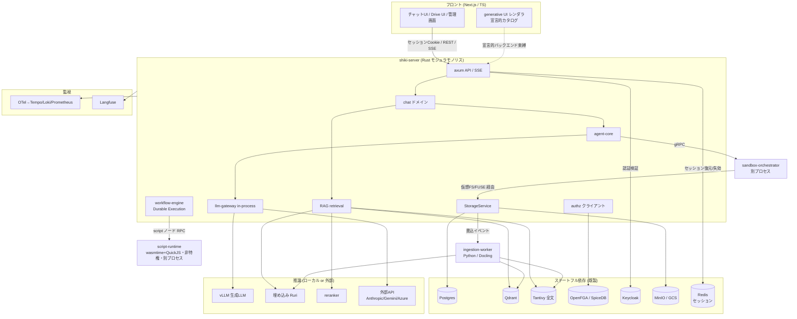
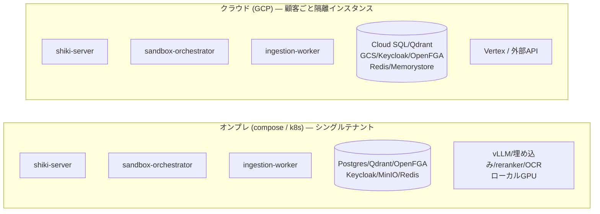
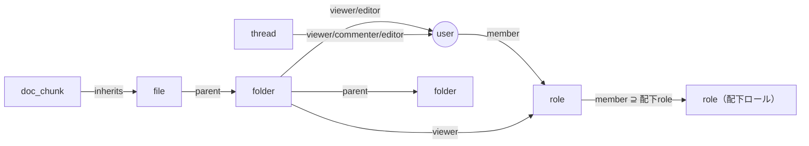
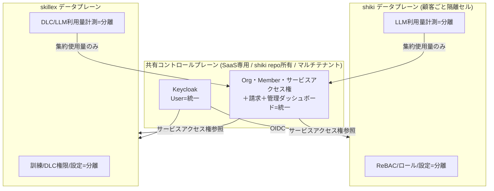
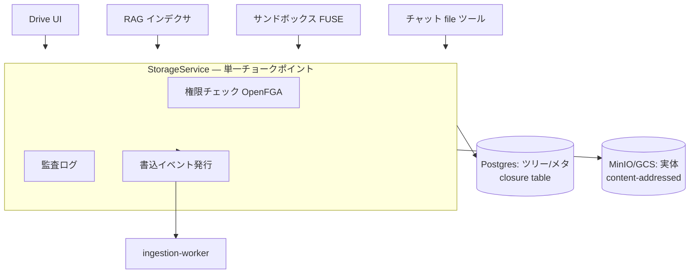
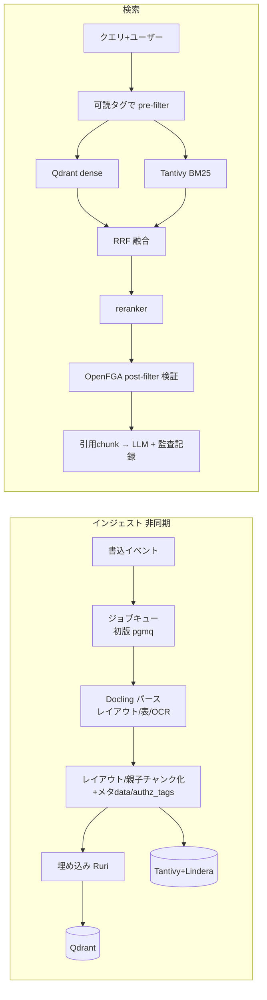
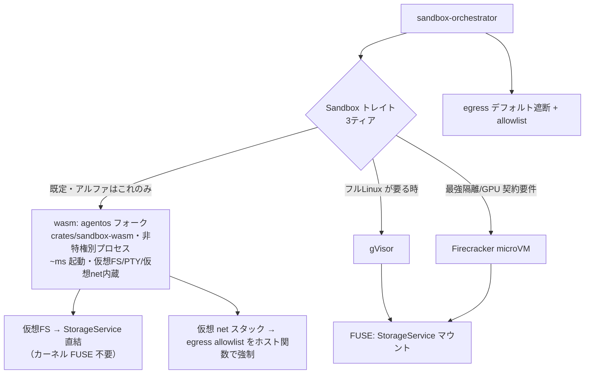
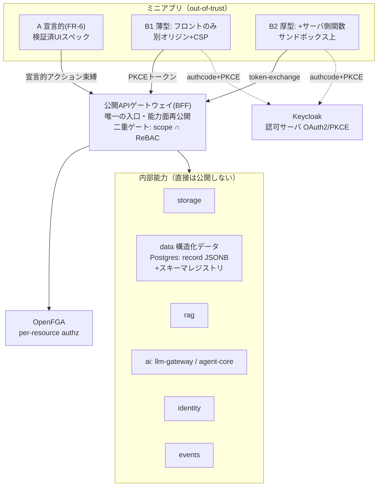

# shiki 設計書

> 本書は[要件定義書](./requirements.md)を満たすアーキテクチャを定義する。実装順は[ROADMAP](./roadmap.md)。
>
> ⚠️ **実装着手前に必ず読む**: 本設計が暗黙にしている前提のうち「このまま実装すると壊れる／詰まる／主張が嘘になる」箇所を
> [設計上の落とし穴・要注意点](./design-caveats.md) に固定した。とくに RAG/FUSE/認可（PIT-1〜5）は
> 当該 Phase の成立条件であり、未解決のまま着手しないこと。

## 1. 設計原則

1. **モジュラモノリス＋特権分離**: コアは単一バイナリ。特権が要るサンドボックスだけ別プロセス。
2. **差し替え点はトレイトに集約**: クラウド/オンプレ差は4〜5本のトレイト実装で吸収、アプリ本体は不変。
3. **単一チョークポイント**: ストレージ・認可・LLM呼出は各々1経路に集約し、権限/監査/イベントをそこで担保。
4. **枯れた基盤に乗る／コアを自作**: 隔離・認可・認証・パースは既製、サンドボックス制御/RAG/agent/gatewayは自作。

## 2. システム全体構成



## 3. デプロイ・トポロジ



- 同一バイナリ。差は下表のトレイト実装と推論バックエンドのみ。

### 3.1 差し替えトレイト

| トレイト | オンプレ実装 | クラウド実装 |
|----------|-------------|-------------|
| `ObjectStore` | MinIO (S3) | GCS |
| `VectorStore` | Qdrant（小規模は pgvector） | Qdrant / マネージド |
| `LlmProvider` | vLLM（ローカル） | Vertex / 外部API / LiteLLM アダプタ（§4.5） |
| `Sandbox` | wasm（agentos）/ Firecracker（KVM有）/ gVisor | wasm（agentos）/ gVisor / Firecracker（§4.6 3ティア） |
| `DocumentParser` | Docling（ローカル） | Docling / 商用OCR |
| `EmbeddingProvider` | Ruri / BGE-m3 | 同左 / 外部 |
| `KeyProvider` | ローカルキーファイル（将来HSM） | Cloud KMS |
| `SearchProvider` | SearXNG 自己ホスト（エアギャップは機能無効） | Brave Search API |
| `OfficeSuite` | Collabora Online（同梱） | Collabora Online（OnlyOffice へ差し替え可能な退路） |

## 4. サブシステム設計

### 4.1 認証・認可

- **AuthN = Keycloak**: 顧客IdP（AD/Entra/Okta）をOIDC/SAML/LDAPでフェデレート＋ローカルIdP。
  **認証は BFF 方式**: OIDC Authorization Code + PKCE の code 受け／token 交換は **shiki-server（`crates/api`）がサーバ側で実施**し、
  ブラウザには `httpOnly`+`Secure`+`SameSite=Lax` の**不透明セッション Cookie のみ**を渡す（トークンはブラウザに置かない）。
  セッションは **Redis（プール型・全テナント共用＋`tenant_id` キースコープ）** に保持し、リクエストごとに Cookie→セッション→`Principal` を復元。
  セッション削除は**セッション/プリンシパル単位の即時失効**（漏洩セッションの無効化・アカウント無効化・強制ログアウト）に効く。
  IdP 側でユーザーを無効化/削除した場合の即時反映は **OIDC Back-Channel Logout**（`POST /auth/backchannel-logout`）で受け、
  `logout_token` の `sid`/`sub` から該当セッションをサーバ側で失効させる（access token 寿命を待たない・#91）。
  セッションストアは `sub`/`sid` の逆引きインデックスを持ち、logout_token がテナントを含まなくてもテナント横断で失効できる。
  ⚠️ **個別リソースの共有解除（Task 1.6）はトークン/セッション形式に依らず OpenFGA のリクエスト毎チェック（＋PIT-11 の `HIGHER_CONSISTENCY`）で担保する**（セッション削除では代替できない・混同しないこと）。
  access token の期限切れに備え、**BFF（`crates/api`）が refresh token をサーバ側で保持・更新・ローテーション**し、downstream への token-exchange を継続させる（ブラウザ上はログイン済みなのに内部呼び出しだけ 401 になるのを防ぐ）。
  CSRF は SameSite ＋ double-submit トークンで防御。Cookie を first-party にするため **web/api は同一オリジン配信**（リバースプロキシ / Next rewrites）を前提とする。
  SSE は Cookie が自動添付されヘッダ注入が不要になる。ただし **POST で発話を送るチャットストリーム（Task 3.5）は `EventSource` が GET 専用・body 不可のため**、fetch-stream を維持するか「POST で stream を作成 → GET `EventSource` で購読」に分離する。downstream/サービス間（skillex 等）へは引き続き **JWT/token-exchange** で identity を運ぶ（内部はステートレス）。
  shiki-server の **AuthN 向き先は設定で差し替え**（SaaS=共有コントロールプレーンのissuer / オンプレ=ローカルKeycloak）。
  > 経緯と比較・影響範囲は [design-caveats PIT-30](./design-caveats.md) / [docs/auth/browser-token-strategy.md](./auth/browser-token-strategy.md) を参照。
- **AuthZ = ReBAC（OpenFGA/SpiceDB）**: タプル `object#relation@subject` で表現。



- フォルダは親→子へ、ロールは**配下ロール→親ロールへメンバーシップを継承**（上方向ロールアップ。
  親ロールは配下ロールのメンバーを含む。例: 営業部ロール ⊇ 営業1課ロール）。**可読性判定は単一の authz クエリ**に帰着し、
  ファイル共有も permission-aware RAG も同じ問いを使う。
- **認可コンテキスト**: 全データアクセスは `principal + org + tenant_id` を持つコンテキスト経由（SaaS マルチテナントを day-1 前提・後付けで隔離境界を壊さない）。
- **authz のテナント分離（SAAS.1 / #84）**: OpenFGA は **全テナント共有の単一ストア＋識別子名前空間化**（フルプール）で分離する。
  FGA 識別子を `<type>:<tenant_id>|<local_id>` へ名前空間化し（区切り `|` = `authz::TENANT_SEP`。AD group パスの `/` と衝突しない）、
  生の識別子構築を `AuthContext::ns()`（`authz::Namespace` チョークポイント）へ一本化して**越境タプルを型レベルで不能化**する。
  `tenant_id` は解決時に禁止文字（`| : # @`・空白）を fail-closed 検証。オンプレ/cell は `tenant_id="default"` 名前空間で一様に動く。
  → データプレーンの他層（DB 行分離・ストレージプレフィクス・セッションキー）も同じく tenant スコープ。**cell（顧客ごと専用ストア）は将来オプション**として残す（フルプール最適化は SAAS.5）。

##### authz 語彙の Single Source of Truth ＋ codegen
- **認可語彙（OpenFGA relation／能力スコープ `<能力>.<操作>`／agent-core 許可ツール名／宣言的アクションID）を
  単一定義から Rust enum ＋ TS 型へ生成**（手書き定数を持たない）。型契約の codegen 思想（utoipa→openapi-typescript・ts-rs）を認可語彙へ延長。
  → タイポ・存在しないスコープ/ツール/relation 参照を**コンパイル時／検証時に閉じた集合へ照合して弾く**。
- これは **集中PEP** と対になる: app-gateway / StorageService の単一チョークポイントが
  「エンドポイント→必要スコープ」の**宣言的マップ**を一律強制（個別ハンドラでチェックさせない＝抜け漏れを構造的に不可能化）。
- **AIハルシネーション境界**: LLM／エージェント／ミニアプリ（特に開発者・LLMが書くマニフェストやUIスペック）が
  **実在しない権限名・ツール名・スコープを参照しても、この閉じた語彙集合で拒否**される。
  Phase 6.3（UIスペック検証）・**Phase 9.1（ミニアプリ・マニフェスト検証）** はこの生成語彙に依存する。
- 注: ここで codegen するのは**粗い語彙（スコープ/relation名/ツール名）**であり、
  **インスタンス単位の実認可は依然 OpenFGA（ReBAC）＋行レベル ABAC 述語**で行う（語彙の型安全 ≠ 認可判定）。
  RBAC のロール×権限表をコアにはしない（ロール階層・個別共有で RBAC ロールが爆発するため／ReBAC維持）。

#### 4.1.1 マルチサービス境界（shiki × skillex）— SaaS版のみ

統一は **SaaS版限定**。オンプレは shiki・skillex とも認証基盤を切り離し単独運用（外部依存ゼロ）。

> ⚠️ 共有プレーンが全顧客・両サービスの blast radius になる点、aud/scope の厳密束縛と失効伝播、
> 利用量＝金額クリティカルの整合、「設定差し替えだけでオンプレ化」の過大主張は [PIT-26〜29](./design-caveats.md)。



- **3層境界**: ①User=統一 ②サービスへの入場券＋管理者バッジ=統一 ③館内ルール（細かい認可/設定）=分離。
- **サービスロール付与**は `利用可否＋サービス管理者か` の粗い粒度のみ。細かい権限は各サービス内。
- **請求=統一（Org単位1請求・サービス別内訳）／利用量=分離（集約値のみ請求へ・クォータ強制は各サービス）**。
- **オンプレ**: 共有プレーンを積まず、`shiki-server` の AuthN をローカルKeycloakへ向ける（設定差し替え）。
- **契約の正本 = shiki repo `contracts/`**: skillex（別リポ）が参照する OIDC設定・サービスアクセス権API・
  利用量集約イベント・トークンの aud/scope の正本を公開し、skillex が取り込む（バージョン管理＋後方互換ポリシ）。
- **管理画面はUIのみ統一・データ分離**: SaaSは統一シェル（共有ページ）＋各サービス設定ページをマイクロフロントエンドで合成。
  各ページは自サービスのAPI/ストアを叩き authz・設定データは分離。各ページは「シェル埋め込み／単独」両対応の自己完結モジュール
  （オンプレは単独管理画面として動作）。

### 4.2 ストレージ（3層分離 ＋ FUSE）



- 実体=オブジェクトストア（コンテンツアドレッシングで重複排除＋バージョニング）。
  論理ツリー/メタ=Postgres（closure table）。権限=OpenFGA。実体に直接権限を持たせない。
- **FUSE仮想FS**: サンドボックス内で `/workspace` としてマウント。read/write は裏で StorageService を叩き、
  権限/監査/再索引を必ず通る。**API は FUSE 前提で設計**（初版実装は sync 妥協可、後で FUSE 差し替え）。
  → ただし「必ず通る」を syscall 粒度でやると破綻する（capability 化が必要）／エージェントの read-after-write
  一貫性が無い点は [PIT-4・PIT-5](./design-caveats.md)。

### 4.3 RAG パイプライン



- **二段authz**: pre-filter（両系統に必須）＋ post-filter 検証。片方が壊れても権限を守る。
  ただし `authz_tags` の正体・post-filter の top-k 破壊・grant 方向の遅延は未設計。着手前に
  [PIT-1〜3](./design-caveats.md) を解決すること（この製品の心臓部）。
- `embedding_model_version` をベクタに刻み、モデル変更＝該当インデックス全再構築。
  → 全停止を避ける shadow 移行は [PIT-8](./design-caveats.md)。
- 親子チャンク（small-to-big）で日本語長文の文脈を保つ。

- **テナント分離（SAAS.1 の RAG 適用・#91 で明文化）**: Qdrant/Tantivy は DB/blob/FGA/session と同じく
  `tenant_id` 境界を持つ。これは `authz_tags`（テナント**内** ReBAC 可読性・PIT-1）とは**別レイヤ**の
  独立した防壁であり、以下を不変条件とする:
  - **Qdrant**: 既定は単一 collection ＋ payload に `tenant_id` を持たせ、**全 search に
    `tenant_id = ctx.tenant_id` フィルタを無条件 AND**（authz_tags フィルタが空/バグでも効く）。
    強隔離要件の顧客向けには collection-per-tenant を選べる二択を [SAAS.5](./roadmap/parallel-tracks.md) の
    cell/pool 方針と揃える。`embedding_model_version` × `tenant_id` は直交（version 単位の shadow index）。
  - **Tantivy**: index-per-tenant を既定とする（PIT-8 の shadow 切替と相性良）。単一 index にする場合は
    `tenant_id` を term filter で必須 AND。いずれでも「tenant フィルタは authz_tags と独立に必ず適用」。
  - **authz_tags は名前空間化形式のまま格納**する。`ListObjects` が返す `folder:<tenant>|<local>` を
    `strip_object_id` で local に**剥がして格納しない**（剥がすとタグから tenant 境界が消え、pre-filter
    バグ 1 個で越境する）。剥がす実装を採るなら「照合時に tenant フィルタが別途必ずかかる」ことをテストで担保。
  - **キャッシュキーの tenant/org prefix 規約**: 埋め込み・parse 結果・reranker 等のキャッシュキーは
    `{tenant_id}/{org}/...` prefix に閉じる。`sha256(text)` 単独キーは「他テナントが同一文書を持つか」の
    **キャッシュ存在オラクル**（blob dedup を tenant スコープ化した [PIT-14](./design-caveats.md) と同型）になる。
  - **chunk を OpenFGA オブジェクトにしない**（[PIT-7](./design-caveats.md)）。post-filter は
    `file:<tenant>|<local>` 粒度で行い、chunk→file 対応は RAG メタ側で持つ。
  - **公開トレイトは第一引数に `&AuthContext`**（`VectorStore` / `EmbeddingProvider` / `DocumentParser` /
    検索 API）。`tenant_id` を bare `String` で引き回さず、識別子は必ず `AuthContext::ns()`
    チョークポイント経由で構築する。
  - **インジェスト経路の tenant_id 必須化**: `storage_event_outbox` は `tenant_id` を第一級カラムで持つ。
    pgmq リレー・Python worker 入力の型にも `tenant_id` を**必須フィールド**として通す（worker が
    Qdrant/Tantivy のどの collection/index へ書くかの唯一の根拠になる）。

### 4.4 チャット & agent-core

- **Message content = 構造化ブロック配列（JSONB）**。添付はストレージ参照のみ。
- **agent-core（自作）**: LLM↔ツールのループ（計画→ツール→観測→継続）、ツールセット非依存、`Tool` トレイト。
  - チャット = 制約ツールセット（doc_search / code_interpreter / file_ops）＋短ホライズン。
  - 自律 = フルツール（shell/任意コマンド/CRUD）＋長ホライズン＋FUSEストレージ。
- 共通化: llm-gateway、Langfuseトレース、監査、トークン会計、権限境界。
- **ツール選択**: デフォルト全提示・モデル自動選択。権限/破壊/コスト系のみ明示許可。
- **web ツール**: 新トレイト `SearchProvider`（SaaS=Brave Search API / オンプレ=SearXNG / エアギャップ=機能無効）。
  **ページ取得は検索と別ポリシー**: allowlist に検索プロバイダだけ載せると検索結果 URL が開けないため、
  web ツール有効時は「検索結果由来のホストへの**時限的な動的 allowlist**（当該 run 限定・宛先を監査記録・
  シークレット添付は不可）」をサンドボックスの egress 制御に追加する。管理者ポリシーでドメイン拒否リストを重ねられる。
- **deepresearch = agent-core のプリセット**（専用エンジンを作らない）: 「長ホライズン＋web.search/rag.search/
  document.write＋サンドボックス」構成の first-party prompt template（FR-7 の枠）。成果物はストレージ保存→自動 RAG 対象化。
- **会話履歴は tenant スコープのスキーマで新設（SAAS.1 / #91）**: thread/message テーブルは既存規約を踏襲し
  全行 `tenant_id text not null`＋複合 PK/unique に `tenant_id` を含める（例: `node` の
  `(org, tenant_id, parent_id, name)`）。thread の OpenFGA オブジェクトも `thread:<tenant>|<id>` になるよう
  `authz::Namespace` に `thread()` ビルダを追加する（現状 organization/role/folder/file のみ）。

#### 4.4.1 非同期生成（バックグラウンド継続生成・run 抽象）

チャット送信後にページを離れても生成が続く。生成ジョブは単発 LLM 呼び出しではなく **agent-core の run**
（ツール呼び出しを含むループ）であり、**durability はステップ境界（ツール呼び出し完了点）にのみ存在する**
（workflow-engine と同じ原理。[miniapp-platform §2](./miniapp-platform.md) と claim/リース/チェックポイントの
実装パターン・テーブル規約を共有）。

- **投入**: `POST /threads/:id/messages` が単一 Tx で「ユーザーメッセージ保存＋run 行(status=queued)＋pgmq enqueue」
  （outbox と同型）→ 202 で `run_id` を即返す。
- **実行**: shiki-server 内 tokio ワーカープール（**チャット専用の高優先レーン**。ワークフロー/ingestion と同居させない）が
  `FOR UPDATE SKIP LOCKED` で claim＋リース（heartbeat）。イベントを `(run_id, seq)` で DB 追記＋Redis pub/sub 配信。
- **購読**: `GET /runs/:id/events`（SSE/EventSource）。順序は必ず **①Redis 購読を開始 → ②`Last-Event-ID`(=seq)
  以降を DB からリプレイ → ③ライブイベントと合流し seq で重複破棄**。リプレイ完了前に届いたライブイベントは
  バッファして seq 順に放出する（**先リプレイ→後購読はその隙間のイベントを取り逃がすため禁止**）。
  どのインスタンスでも Redis 経由で受信。
- **整合性の不変条件**: ①単一ライタ（リース保持ワーカーのみ）＋ `(run_id, seq)` unique で追記 exactly-once
  ②クラッシュ回復はステップ境界から（完了済みツール結果はチェックポイント復元、**生成途中の LLM ストリームは破棄して
  当該ステップのみ再生成**。「途中から続き生成」は採らない）③キャンセルは status=`cancelling`＋pub/sub 通知で
  ステップ境界・ストリーム読取ループが検知（サンドボックス実行中ツールへ kill 伝播）
  ④課金は attempt 単位で実消費を記録（表示は run 単位に集約）。

### 4.5 llm-gateway（自作・in-process）

- 内部正規形=OpenAI互換スキーマ（⚠️ 中立 content-block 案は [PIT-9](./design-caveats.md)。Task 3.2 着手時に確定）。
  薄いアダプタで vLLM / Anthropic / Gemini /（必要なら Azure）。
- **LiteLLM は `LlmProvider` 実装の一つ（オプションアダプタ）**（2026-07-05 確定・#32）:
  雑多な外部プロバイダを一括で足したい時だけ LiteLLM Proxy アダプタを有効化。
  **チョークポイント（会計・認可・監査・Langfuse）は Rust in-process から動かさない**。
  エアギャップ構成では LiteLLM を積まない（vLLM 直結のみ・NFR-2 無傷）。
- 機能は必要分のみ（フォールバック/リトライ/トークン会計/Langfuse計装/権限注入）。
  セマンティックキャッシュ・高度ルーティング・仮想キーは後追い。
- **モデルカタログ**: テナント管理者が「許可モデルリスト＋既定モデル＋モデル別単価（課金単価表と同居）＋
  国外処理バッジ（データレジデンシ明示）」を管理。ユーザーのモデル選択 UI はカタログの範囲内。
  prompt template のモデル既定（FR-7）もここに整合。
- **思考強度の正規化**: `effort: low/medium/high` を内部正規形に持ち、各アダプタが reasoning budget /
  thinking tokens に翻訳。UI は3段階セレクタのみ（プロバイダ固有ノブは晒さない）。
- `LlmProvider` トレイト実装そのもの。別プロセス化しない（ホップ0、部品削減）。
- **トークン会計は `tenant_id` + `org` スコープで day-1 から刻む（SAAS.3 課金の集計元・#91）**:
  計測レコード（prompt/completion tokens・model・cost・trace_id）に `tenant_id` + `org` を**必須カラム**とし、
  監査ハッシュチェーンが `tenant_id|org` で直列化・スコープする前例に倣う。金額クリティカル
  （[PIT-28](./design-caveats.md)）なので冪等キーを持たせ、テナント単位の集計をバイパス不能にする。

### 4.6 サンドボックス（3ティア・wasm 既定）

**2026-07 方針転換（#97）**: 既定バックエンドを **wasm（[agentos](https://github.com/rivet-dev/agentos) フォーク）** にする。
`Sandbox` トレイトは維持し、バックエンドを用途別3ティアに再定義する。
設計原則4「隔離プリミティブは自作しない」は本件で**一部撤回**（agentos フォーク＝Rust 製 in-process OS カーネルを自分たちが所有）。



| ティア | 用途 | 隔離保証（正直な主張） | アルファ |
|--------|------|----------------------|---------|
| **wasm（既定）** | エージェント実行・skill・code_interpreter（**Pyodide**: numpy/pandas/matplotlib） | プロセス分離＋wasm 二層（ブラウザ級・VM級ではない） | ✅ これのみ |
| gVisor | フル CPython（任意 pip）・ネイティブツールチェーン | ユーザー空間カーネル | ポストアルファ |
| Firecracker | 契約上 VM 級隔離が要件の顧客・GPU | VM 級（KVM 前提） | ポストアルファ |

- **wasm ティアの構造**: agentos は仮想FS・プロセステーブル・PTY・仮想ネットワークスタックを自前に持ち
  ホスト上で何も実行しない。コマンド群（coreutils/git/curl 等）は wasm パッケージ、Node.js スクリプト実行可、
  任意ネイティブバイナリ・フル Python は動かない（必要なら gVisor/FC へ自動昇格＋管理者ポリシー。ノード設定にティア選択は出さない）。
  **in-process カーネルは shiki-server に同居させず、専用の非特権プロセス（`crates/sandbox-wasm`）に隔離して RPC で使う**。
- **FUSE の位置づけ変更**: wasm ティアでは agentos の仮想FSを StorageService に直結するため
  **カーネル FUSE が不要**（PIT-4 の syscall 粒度問題・PIT-22 の温機プール時間衝突が構造ごと消える。
  capability モデルは仮想FSバックエンドにそのまま適用）。FUSE は gVisor/FC ティア用として残す。
- egress は wasm ティアでは仮想 net スタックのホスト関数分岐で allowlist を強制（PIT-25 の SNI プロキシは gVisor/FC 用）。
- code_interpreter は wasm ティアの制約インスタンス（Pyodide・ネット遮断・短命）。
- ⚠️ 落とし穴: gVisor/FC 制御層は [PIT-22〜25](./design-caveats.md)、wasm ティア固有は [PIT-32〜33](./design-caveats.md)
  （フォーク保守・wasm 脱出時の blast radius・wasm コマンドパッケージのサプライチェーン）。

### 4.7 generative UI / ミニアプリ / prompt template

- **生成UI**: LLM→検証済みJSONスペック→信頼コンポーネントカタログで描画（任意コード実行なし）。
- **ミニアプリ** = prompt template ＋ UIスペック ＋ 許可ツール、のバージョン付きアーティファクト。
  バックエンド束縛は宣言済み・認可済みアクション経由のみ（アンビエント権限なし）。ReBACで共有。
- **prompt template** = システムプロンプト＋知識スコープ（RAG範囲限定）＋許可ツール＋モデル既定＋few-shot。
  知識スコープで絞っても最終可読性は個人ReBACで再チェック。
- すべて「共有可能アーティファクト＋ReBAC＋監査」の共通枠に収まる。
- カタログにはチャート（vega-lite 的サブセットのチャートスペック）と地図（タイル表示＋ピン）を含む。
  地図タイルは外部依存（OSM タイルサーバ）＝「外部接続必須機能」区分（NFR-2 参照）。オンプレは自己ホストタイル or 無効。
- ワークフロー・ミニアプリの編集面（dnd / AI 編集 / shiki script）は [miniapp-platform.md](./miniapp-platform.md) が正本。

### 4.8 資料作成・Office 統合（Collabora）

- **生成（旧 v1）**: `DocumentGenerator` トレイト。xlsx=`rust_xlsxwriter`、docx/pptx=ingestion-worker(Python)。
  ひな型プレースホルダ穴埋め併設。サンドボックスのエージェントが「スペック→生成→ストレージ保存」。
- **ブラウザ内編集・共同編集（旧 v2 を前倒し・アルファスコープ）**: **Collabora Online** を採用し
  `OfficeSuite` トレイト（`crates/office`）でラップ（OnlyOffice への差し替え退路）。
  Office 系（docx/pptx/xlsx）の共同編集は Collabora 内蔵機能に完全委任（自作しない）。
  - **WOPI ホスト = StorageService の一クライアント**として `crates/office` に実装。
    CheckFileInfo/GetFile/PutFile は StorageService 経由（チョークポイント維持）。
    WOPI access_token は（実行主体×ファイル×短寿命）で発行し**毎呼び出しで ReBAC 再チェック**
    （共有解除後もトークンが生き残る事故を防ぐ。PIT-11 の HIGHER_CONSISTENCY と同じ扱い）。
    PutFile → 新バージョン → 既存の書込イベント → RAG 再索引が無改造で動く。
  - **デプロイ**: Collabora(CODE) はステートレスコンテナ。SaaS はテナント共有プール＋WOPI トークンに
    テナント境界を焼き込む。オンプレ/エアギャップは同一コンテナ同梱。
  - **AI の読み書き（ラップ SDK の実体・3段）**: ① read = Docling パース（構造保持）を正、convert-to は補助
    ② edit（非セッション時）= ファイルレベル編集 → 新バージョン保存（セッション有無は WOPI ロックで判定）
    ③ edit（セッション中）= **アルファではやらない**。「セッション中のため提案として保存」（別バージョン/コメント）に落とす。
    ライブ参加はポストアルファの研究課題（postMessage API 経由が候補）。
  - **スプレッドシート×GAS 相当**: シートのカスタム関数/マクロは shiki script（[miniapp-platform §3](./miniapp-platform.md)）。

### 4.8.1 マークダウン共同編集（Yjs）

- **CRDT は Yjs エコシステム（Rust 側 y-crdt/yrs）に乗る**（OT/CRDT 自作は論外＝「枯れた基盤に乗る」側）。
  WebSocket 同期サーバは axum 内（yrs）。update log＋snapshot は Postgres/StorageService へ（新規ステートフル依存ゼロ）。
- エディタは **TipTap(ProseMirror)＋y-prosemirror** の WYSIWYG（Obsidian/Notion/Loop 風）。
- **「内部は md」の正確な定義**: 真実は **Yjs ドキュメント（リッチ構造）**、Markdown は**正規化シリアライズ形式**。
  保存時に md へシリアライズして StorageService に書く（→書込イベント→RAG 再索引）。
  md ファイルを正にすると並行編集のマージ単位がテキスト行になり表・埋め込みで壊れるため採らない。
- **AI 編集は共同編集参加者**: エージェントの `document.edit` ツールは Yjs トランザクションを発行する専用クライアント
  として同一セッションに参加（awareness に「AI」表示・サジェスト/直接適用の2モード）。ファイル直接上書きで
  人間の編集と衝突する経路を作らない。権限は人間と同じ editor relation チェック。
- 共同編集は **md 系=Yjs / Office 系=Collabora 内蔵** の2系統（二重実装ではなく「Office の共同編集を自作しない」判断）。

### 4.9 監視

- OTel計装（axum/tonic/agent-core）→ Tempo/Loki/Prometheus（クラウドはエクスポータ差し替え）。
- Langfuse で LLM 可視化。**監査ログ（権限・引用chunk）と Langfuse を trace_id で突合**（早期に種を蒔く）。

### 4.10 ミニアプリ／業務アプリ基盤

FR-11。FR-6(A:宣言的) の上に B(コードベース) を足した二層。両者は同一の artifact＋ReBAC＋監査枠に乗り、
違いはランタイムと認可の入口だけ。汎用PaaS/DBaaSは作らず「管理データサービス＋サンドボックス再利用＋公開API」の3点で構成。



- **認可（FR-11最重要）**: ユーザー委譲OAuth2(PKCE)。実効権限 = アプリスコープ ∩ ユーザーReBAC。
  内部APIは晒さずゲートウェイが能力面を再公開。B2はtoken-exchangeでユーザー代理を維持、自動化のみ所有データ限定サービスidentity。
- **能力カタログ**: storage/data/rag/ai/identity/events。`能力.操作`＋リソース束縛、実認可OpenFGA、アプリ所有リソースあり。
- **構造化データ**（`crates/data`）: `record(table_id,id,data JSONB,rev)` ＋ `table_schema`、宣言フィールドに式インデックス（ランタイムDDLなし）。
  フィールド型に user/dept/file/record 参照。
  **行認可 = テーブルReBAC（OpenFGA・有界）＋クエリ時述語（ABAC・WHERE強制付与・集計にも適用・バイパス不可）＋フィールドマスク＋個別共有のみスパースtuple**。
  宣言的クエリ/保存ビュー（生SQL非公開）、リビジョン履歴、`rev`で楽観ロック。
- **ワークフロー（2026-07 全面改訂・#97）**: 旧「軽量FSMエンジン」は廃止し、
  **workflow-engine（自作 Durable Execution・n8n/Power Automate 相当）を唯一の実行エンジン**に格上げ。
  FSM は data サービスの宣言的ガード（status フィールド＋遷移認可=行述語の再利用・可視性駆動）に縮退し、
  遷移の副作用はすべて workflow-engine へ委譲（遷移コミット→outbox→トリガ）。
  IR（JSON DAG）・shiki script・skill・シークレット・実行主体/委譲モデルを含む設計正本は
  **[miniapp-platform.md](./miniapp-platform.md)**。
- **ランタイム**: B1=別オリジン+CSP（connect-srcゲートウェイ限定・ホスト無権限）／B2=既存サンドボックス（Firecracker/gVisor）+egress allowlist。
- **配布**: マニフェストartifact→内部レジストリへ不変publish→同意インストール（所有テーブル自動プロビジョン＋ReBAC付与）。
  信頼ティア（first-party署名/in-house同意/将来marketplace審査）、オンプレ署名バンドル（ネット不要）、SDK＋CLI（`shiki app init/dev/publish`）。

### 4.11 シークレット管理（`crates/secrets`）

外部コネクタ（http.request＋skill）の API キーを預かる。不変条件は
**write-only/use-only（平文読み返し API なし）・ReBAC オブジェクト（`secret:<tenant>|<id>`・owner/can_use）・
宛先束縛（登録時宣言ホスト以外への添付を fail-closed 拒否・egress allowlist と AND）・
envelope encryption（マスターキーは `KeyProvider` トレイト）・利用イベント毎回監査**。
詳細は [miniapp-platform §5](./miniapp-platform.md)。

### 4.12 SaaS 運用面（アルファ必須）

- **フィードバック（テナント境界を跨ぐ唯一のデータフロー）**: 二段構え。
  ①既定=メタデータのみ（評価＋カテゴリ＋run_id/trace_id・**会話本文なし**）を共有コントロールプレーンの
  feedback ストアへ。ベンダー側は Langfuse/監査と trace_id 突合（本文は見えない）。
  ②内容の共有（本文添付・**自由記述コメントも同格の「顧客コンテンツ」として扱う**。コメント欄に会話の抜粋を
  貼れば本文添付と同じため）=報告ダイアログでのユーザー明示同意時のみ。さらに**組織管理者ポリシーで禁止可能**
  （禁止時はカテゴリ選択のみ・自由記述欄自体を出さない）。添付の事実は監査記録。
  👎カテゴリ「やり方がわからなかった」をヘルプの穴検出器に使う。
- **ヘルプ**: `help/` ディレクトリ（Markdown・リリースと同バージョン・1ソース）を
  ①ヘルプセンター UI ②**RAG 組み込み知識スコープ「shiki-help」**（全テナント同梱・事前インデックス・テナントデータと別イン
  デックス）の両面に出す。チャットの doc_search が help コーパスに当たり「できること」の質問に答える。
- **管理ダッシュボードは2枚**:
  ①**顧客管理者**（統一シェル＋マイクロフロントエンドの既存設計）: メンバー/ロール・モデルカタログ/予算・
  使用量（org/ユーザー/アプリ/ワークフロー別）・監査ビューア＋エクスポート・**同意/委譲の一覧/棚卸し/失効**
  （ワークフロー委譲・skill インストール・secret 利用）・プラン/請求（Stripe ポータル）・組織ポリシー。
  ②**ベンダーコンソール**（共有コントロールプレーンの新モジュール・Imanect 専用）: テナントライフサイクル
  （cell プロビジョニング/停止/解約）・プラン/サブスク・テナント別機能フラグ・全テナント横断の**集約**使用量/SLO/ヘルス
  （顧客データ本文には構造的に到達不能）。
  サポートアクセスは **break-glass 方式のみ**: 顧客管理者の明示許可→時限→全操作監査→顧客画面にバナー。
  **サイレントアクセスの経路は作らない**。
- **テナント消去機構**: 解約・APPI/GDPR 削除要求に応える「cell 完全消去＋バックアップからの期限付き消滅証明」。
  blob・ベクタ・FGA タプル・監査・Langfuse・バックアップまでの消去経路を設計に含める（DPA の前提。
  `StorageService::purge_tenant` を全ストアへ拡張）。
- **バックアップ/DR**: テナント単位バックアップ・復元手順・RPO/RTO 宣言。Postgres・blob・Qdrant・FGA の
  **整合スナップショット**（バラバラ復元は FGA タプルとファイルがズレて権限事故 → PIT-38）。
- **データレジデンシ**: 東京リージョン固定を明示。外部 LLM 使用時の越境はモデルカタログの「国外処理」バッジで顧客に明示。
- **IaC**: `deploy/` に **OpenTofu** で GCP を記述。**cell=モジュールのインスタンス化**。
  「契約→ベンダーコンソールから cell プロビジョニング（CI 経由 tofu apply）→ Keycloak realm・DNS・初期管理者招待」
  まで自動化（リリースブロッカー扱い）。オンプレは compose/k8s のまま。
- **API レート制限**: テナント単位。workflow-engine のトークンバケット（Redis）を API 面にも適用。

## 5. リポジトリ構成（モノレポ・Rustワークスペース）

```
crates/
  api/             # axum, SSE, OpenAPI(utoipa)
  chat/            # スレッド/メッセージ/content blocks
  agent-core/      # エージェントループ・Tool トレイト
  llm-gateway/     # プロバイダアダプタ・LlmProvider
  storage/         # StorageService・ObjectStore
  rag/             # retrieval・VectorStore・二段authz
  authz/           # OpenFGA クライアント・relation 定義
  sandbox-client/  # orchestrator gRPC クライアント
  sandbox-orchestrator/ # サンドボックス制御（wasm ティアは非特権化可・gVisor/FC は特権）
  sandbox-wasm/    # agentos フォーク（wasm ティア・非特権別プロセス）
  fuse/            # StorageService の FUSE 表現（gVisor/FC ティア用）
  data/            # 構造化データサービス・record/schema・行authz述語・FSMガード
  app-gateway/     # 公開APIゲートウェイ(BFF)・OAuth2/スコープ・能力面
  app-platform/    # ミニアプリ artifact・マニフェスト・レジストリ・skill
  workflow-engine/ # ワークフロー IR・Durable Execution・スケジューラ・トリガ
  script-runtime/  # shiki script 実行（swc＋wasmtime/QuickJS・非特権別プロセス）
  secrets/         # シークレット管理・KeyProvider
  office/          # OfficeSuite トレイト・WOPI ホスト（Collabora）
  collab/          # Yjs(yrs) 共同編集同期サーバ・md シリアライズ
ingestion-worker/  # Python: Docling パース・docx/pptx 生成/編集
web/               # Next.js / TypeScript（generative UIレンダラ・ミニアプリB1配信・dnd/TipTap エディタ）
help/              # ヘルプコーパス（1ソース→ヘルプUI/RAG shiki-help スコープ）
sdk/               # ミニアプリ SDK ＋ CLI（shiki app init/dev/publish・公開API型配布）
deploy/            # docker compose / k8s manifests
docs/
```

- 型契約: Rust→OpenAPI(utoipa)→openapi-typescript、SSEイベント型は ts-rs/typeshare（手書き型なし）。
  公開APIゲートウェイの能力面も同じ生成物を SDK としてミニアプリへ配布（手書き型なし）。
