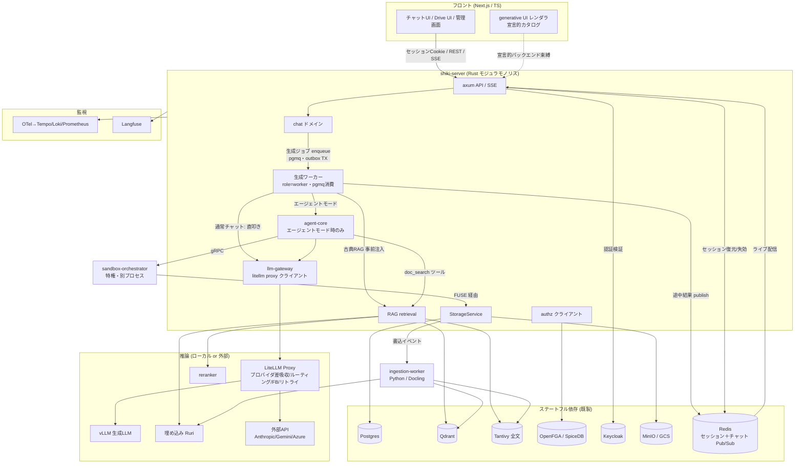
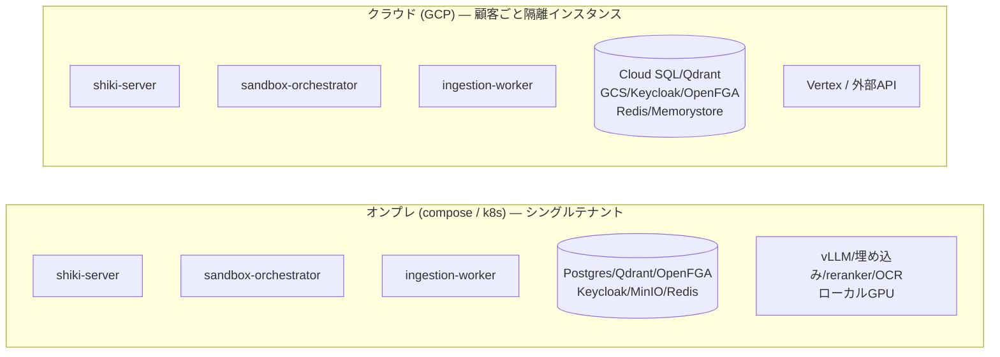
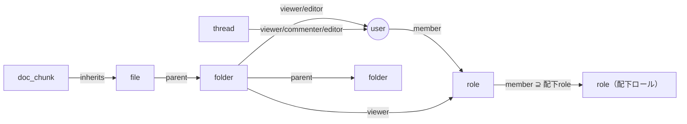
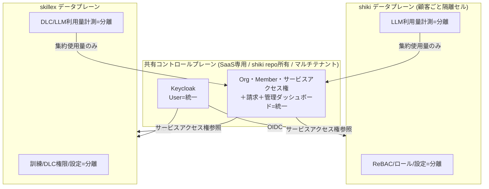
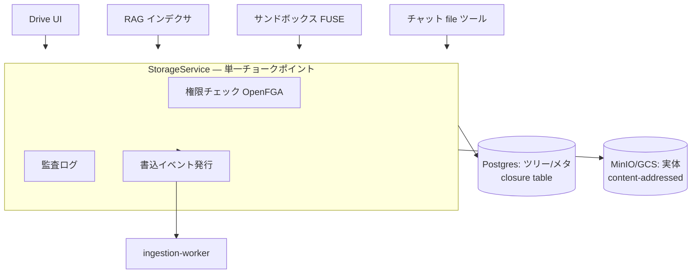
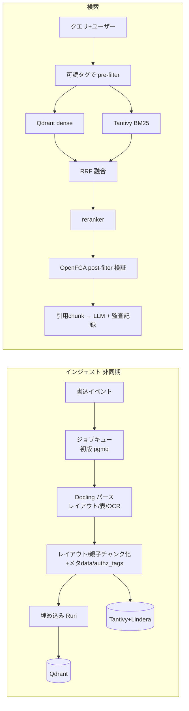
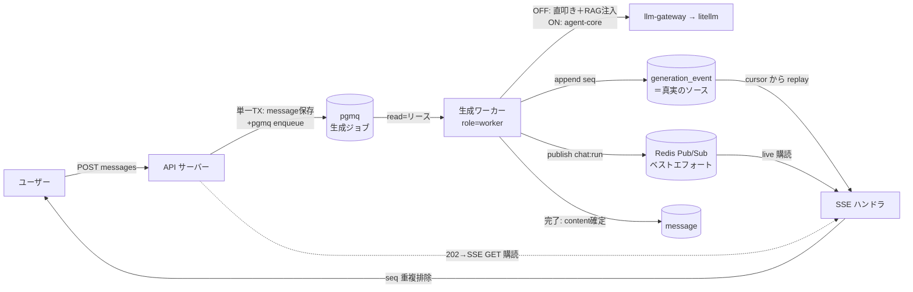
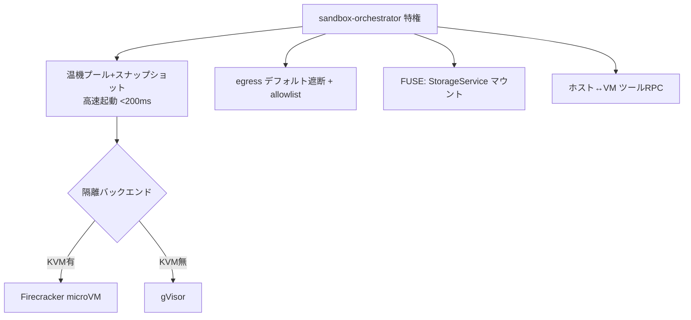
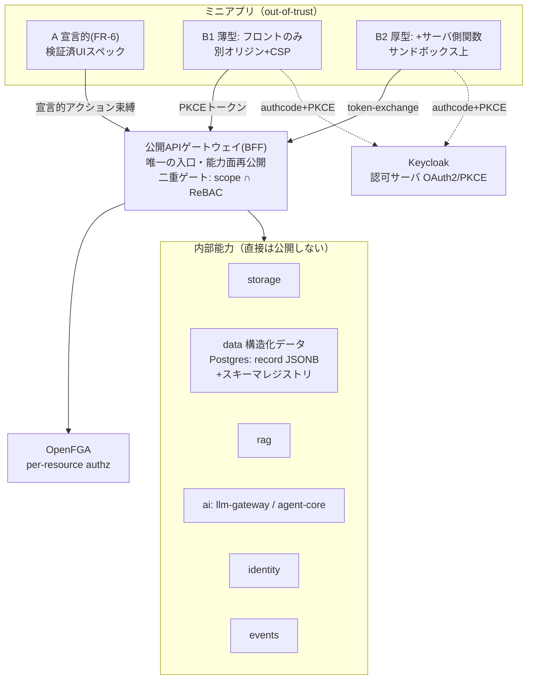

# shiki 設計書

> 本書は[要件定義書](./requirements.md)を満たすアーキテクチャを定義する。実装順は[ROADMAP](./roadmap.md)。
>
> ⚠️ **実装着手前に必ず読む**: 本設計が暗黙にしている前提のうち「このまま実装すると壊れる／詰まる／主張が嘘になる」箇所を
> [設計上の落とし穴・要注意点](./design-caveats.md) に固定した。とくに RAG/FUSE/認可（PIT-1〜5）は
> 当該 Phase の成立条件であり、未解決のまま着手しないこと。

## 1. 設計原則

1. **モジュラモノリス＋特権分離**: コアは単一バイナリ。特権が要るサンドボックスだけ別プロセス。
2. **差し替え点はトレイトに集約**: クラウド/オンプレ差は4〜5本のトレイト実装で吸収、アプリ本体は不変。
3. **単一チョークポイント**: ストレージ・認可・LLM呼出は各々1経路に集約し、権限/監査/イベントをそこで担保。
4. **枯れた基盤に乗る／コアを自作**: 隔離・認可・認証・パース・**LLMルーティング（LiteLLM Proxy）**は既製、サンドボックス制御/RAG/agent は自作。
   llm-gateway は LiteLLM Proxy 上の**薄い層**（権限注入・トークン会計・コスト計上・Langfuse 相関・監査を自作）に留める。

## 2. システム全体構成



## 3. デプロイ・トポロジ



- 同一バイナリ。差は下表のトレイト実装と推論バックエンドのみ。

### 3.1 差し替えトレイト

| トレイト | オンプレ実装 | クラウド実装 |
|----------|-------------|-------------|
| `ObjectStore` | MinIO (S3) | GCS |
| `VectorStore` | Qdrant（小規模は pgvector） | Qdrant / マネージド |
| `LlmProvider` | vLLM（ローカル） | Vertex / 外部API |
| `Sandbox` | Firecracker（KVM有）/ gVisor | gVisor / Firecracker |
| `DocumentParser` | Docling（ローカル） | Docling / 商用OCR |
| `EmbeddingProvider` | Ruri / BGE-m3 | 同左 / 外部 |

## 4. サブシステム設計

### 4.1 認証・認可

- **AuthN = Keycloak**: 顧客IdP（AD/Entra/Okta）をOIDC/SAML/LDAPでフェデレート＋ローカルIdP。
  **認証は BFF 方式**: OIDC Authorization Code + PKCE の code 受け／token 交換は **shiki-server（`crates/api`）がサーバ側で実施**し、
  ブラウザには `httpOnly`+`Secure`+`SameSite=Lax` の**不透明セッション Cookie のみ**を渡す（トークンはブラウザに置かない）。
  セッションは **Redis（プール型・全テナント共用＋`tenant_id` キースコープ）** に保持し、リクエストごとに Cookie→セッション→`Principal` を復元。
  セッション削除は**セッション/プリンシパル単位の即時失効**（漏洩セッションの無効化・アカウント無効化・強制ログアウト）に効く。
  ⚠️ **個別リソースの共有解除（Task 1.6）はトークン/セッション形式に依らず OpenFGA のリクエスト毎チェック（＋PIT-11 の `HIGHER_CONSISTENCY`）で担保する**（セッション削除では代替できない・混同しないこと）。
  access token の期限切れに備え、**BFF（`crates/api`）が refresh token をサーバ側で保持・更新・ローテーション**し、downstream への token-exchange を継続させる（ブラウザ上はログイン済みなのに内部呼び出しだけ 401 になるのを防ぐ）。
  CSRF は SameSite ＋ double-submit トークンで防御。Cookie を first-party にするため **web/api は同一オリジン配信**（リバースプロキシ / Next rewrites）を前提とする。
  SSE は Cookie が自動添付されヘッダ注入が不要になる。ただし **POST で発話を送るチャットストリーム（Task 3.5）は `EventSource` が GET 専用・body 不可のため**、fetch-stream を維持するか「POST で stream を作成 → GET `EventSource` で購読」に分離する。downstream/サービス間（skillex 等）へは引き続き **JWT/token-exchange** で identity を運ぶ（内部はステートレス）。
  shiki-server の **AuthN 向き先は設定で差し替え**（SaaS=共有コントロールプレーンのissuer / オンプレ=ローカルKeycloak）。
  > 経緯と比較・影響範囲は [design-caveats PIT-30](./design-caveats.md) / [docs/auth/browser-token-strategy.md](./auth/browser-token-strategy.md) を参照。
- **AuthZ = ReBAC（OpenFGA/SpiceDB）**: タプル `object#relation@subject` で表現。



- フォルダは親→子へ、ロールは**配下ロール→親ロールへメンバーシップを継承**（上方向ロールアップ。
  親ロールは配下ロールのメンバーを含む。例: 営業部ロール ⊇ 営業1課ロール）。**可読性判定は単一の authz クエリ**に帰着し、
  ファイル共有も permission-aware RAG も同じ問いを使う。
- **認可コンテキスト**: 全データアクセスは `principal + org + tenant_id` を持つコンテキスト経由（SaaS マルチテナントを day-1 前提・後付けで隔離境界を壊さない）。

##### authz 語彙の Single Source of Truth ＋ codegen
- **認可語彙（OpenFGA relation／能力スコープ `<能力>.<操作>`／agent-core 許可ツール名／宣言的アクションID）を
  単一定義から Rust enum ＋ TS 型へ生成**（手書き定数を持たない）。型契約の codegen 思想（utoipa→openapi-typescript・ts-rs）を認可語彙へ延長。
  → タイポ・存在しないスコープ/ツール/relation 参照を**コンパイル時／検証時に閉じた集合へ照合して弾く**。
- これは **集中PEP** と対になる: app-gateway / StorageService の単一チョークポイントが
  「エンドポイント→必要スコープ」の**宣言的マップ**を一律強制（個別ハンドラでチェックさせない＝抜け漏れを構造的に不可能化）。
- **AIハルシネーション境界**: LLM／エージェント／ミニアプリ（特に開発者・LLMが書くマニフェストやUIスペック）が
  **実在しない権限名・ツール名・スコープを参照しても、この閉じた語彙集合で拒否**される。
  Phase 6.3（UIスペック検証）・**Phase 9.1（ミニアプリ・マニフェスト検証）** はこの生成語彙に依存する。
- 注: ここで codegen するのは**粗い語彙（スコープ/relation名/ツール名）**であり、
  **インスタンス単位の実認可は依然 OpenFGA（ReBAC）＋行レベル ABAC 述語**で行う（語彙の型安全 ≠ 認可判定）。
  RBAC のロール×権限表をコアにはしない（ロール階層・個別共有で RBAC ロールが爆発するため／ReBAC維持）。

#### 4.1.1 マルチサービス境界（shiki × skillex）— SaaS版のみ

統一は **SaaS版限定**。オンプレは shiki・skillex とも認証基盤を切り離し単独運用（外部依存ゼロ）。

> ⚠️ 共有プレーンが全顧客・両サービスの blast radius になる点、aud/scope の厳密束縛と失効伝播、
> 利用量＝金額クリティカルの整合、「設定差し替えだけでオンプレ化」の過大主張は [PIT-26〜29](./design-caveats.md)。



- **3層境界**: ①User=統一 ②サービスへの入場券＋管理者バッジ=統一 ③館内ルール（細かい認可/設定）=分離。
- **サービスロール付与**は `利用可否＋サービス管理者か` の粗い粒度のみ。細かい権限は各サービス内。
- **請求=統一（Org単位1請求・サービス別内訳）／利用量=分離（集約値のみ請求へ・クォータ強制は各サービス）**。
- **オンプレ**: 共有プレーンを積まず、`shiki-server` の AuthN をローカルKeycloakへ向ける（設定差し替え）。
- **契約の正本 = shiki repo `contracts/`**: skillex（別リポ）が参照する OIDC設定・サービスアクセス権API・
  利用量集約イベント・トークンの aud/scope の正本を公開し、skillex が取り込む（バージョン管理＋後方互換ポリシ）。
- **管理画面はUIのみ統一・データ分離**: SaaSは統一シェル（共有ページ）＋各サービス設定ページをマイクロフロントエンドで合成。
  各ページは自サービスのAPI/ストアを叩き authz・設定データは分離。各ページは「シェル埋め込み／単独」両対応の自己完結モジュール
  （オンプレは単独管理画面として動作）。

### 4.2 ストレージ（3層分離 ＋ FUSE）



- 実体=オブジェクトストア（コンテンツアドレッシングで重複排除＋バージョニング）。
  論理ツリー/メタ=Postgres（closure table）。権限=OpenFGA。実体に直接権限を持たせない。
- **FUSE仮想FS**: サンドボックス内で `/workspace` としてマウント。read/write は裏で StorageService を叩き、
  権限/監査/再索引を必ず通る。**API は FUSE 前提で設計**（初版実装は sync 妥協可、後で FUSE 差し替え）。
  → ただし「必ず通る」を syscall 粒度でやると破綻する（capability 化が必要）／エージェントの read-after-write
  一貫性が無い点は [PIT-4・PIT-5](./design-caveats.md)。

### 4.3 RAG パイプライン



- **二段authz**: pre-filter（両系統に必須）＋ post-filter 検証。片方が壊れても権限を守る。
  ただし `authz_tags` の正体・post-filter の top-k 破壊・grant 方向の遅延は未設計。着手前に
  [PIT-1〜3](./design-caveats.md) を解決すること（この製品の心臓部）。
- `embedding_model_version` をベクタに刻み、モデル変更＝該当インデックス全再構築。
  → 全停止を避ける shadow 移行は [PIT-8](./design-caveats.md)。
- 親子チャンク（small-to-big）で日本語長文の文脈を保つ。

### 4.4 チャット & agent-core

- **Message content = 構造化ブロック配列（JSONB）**。添付はストレージ参照のみ。
- **2つの動作モード（`agent_mode` フラグ・既定 OFF）**。両モードとも AuthContext と二段 authz（pre/post-filter）は不変。
  - **通常チャット（OFF）**: chat ドメインが **llm-gateway を直叩き**＋**古典 RAG**（事前検索→文脈注入、post-filter を必ず適用）。ツールループ無し。引用は古典 RAG の検索結果から付与。
  - **エージェントモード（ON）**: **agent-core** ループ（計画→ツール→観測→継続）が doc_search 等のツールを自律呼出。下記「ツール選択」「全提示・自動選択・破壊系明示許可」はこのモード内の挙動。
- **agent-core（自作）**: LLM↔ツールのループ、ツールセット非依存、`Tool` トレイト。**エージェントモード時のみ作動**。
  - エージェントチャット = 制約ツールセット（doc_search / code_interpreter / file_ops）＋短ホライズン。
  - 自律 = フルツール（shell/任意コマンド/CRUD）＋長ホライズン＋FUSEストレージ。
- 共通化: llm-gateway、Langfuseトレース、監査、トークン会計、権限境界。
- **ツール選択（エージェントモード）**: デフォルト全提示・モデル自動選択。権限/破壊/コスト系のみ明示許可。

#### 4.4.1 生成ジョブ・サブシステム（接続非依存の継続生成）

チャット送信後にユーザーがページを離れても生成が続くよう、**生成をクライアント接続（SSE）から分離**し、ジョブ駆動で実行する。



整合性デザインパターン（**at-least-once ＋ 冪等**前提。exactly-once は狙わない）:

1. **Transactional Outbox**: user message 保存・assistant message(status=pending) 作成・生成ジョブ enqueue を**単一 Postgres TX**で実行（pgmq は Postgres 内）。「保存したがジョブ消失／ジョブはあるがメッセージ無し」を排除（既存 outbox 方針＝Phase 1 Task 1.8）。
2. **Idempotent Consumer ＋ Lease/Fencing**: 冪等キー＝`run_id`（1ターン1 run）。ワーカーは `generation_run` を claim（status＋`lease_until`＋`worker_id`＋単調増加 `fencing_token`）。再配信時は done→スキップ、running×リース有効→他ワーカー保持、running×リース失効→`fencing_token` を進めて takeover。書込は fencing token でガードし**ゾンビワーカーの古い書込を拒否**。
3. **Append-only Event Log（部分状態の Event Sourcing）**: `generation_event(run_id, seq, type, payload)` を**run 毎単調 seq**で追記。これが部分出力の**単一の真実のソース**。`message.content` は done 時に確定する materialized projection。
4. **Replay-then-Subscribe（無重複の再接続）**: SSE は `Last-Event-ID`/cursor を受け、まず DB の `generation_event(seq > cursor)` をリプレイ→Redis を購読し**seq で重複排除**。Redis 取りこぼしは DB 権威により次回リプレイで埋まる。
5. **Cooperative Cancellation**: ユーザー明示停止のみキャンセル（**ページ離脱≠キャンセル**）。`cancel_requested` フラグ＋Redis 制御 publish、ワーカーはループ/ストリーム境界で協調チェック→status=cancelled で部分確定。
6. **Retry / Dead-Letter**: pgmq visibility-timeout で再試行、N 回超で DLQ＋status=failed を UI 可視化。冪等性で再試行時の二重書込を防止。
7. **Orphan reaping / Liveness**: sweeper が `lease_until` 失効の running を再 enqueue（or failed 化）。Phase 5 予算ガード（最大ステップ/タイムアウト/トークン上限）と連携し detached 生成の暴走を防ぐ。
8. **AuthContext 伝播（confused-deputy 防御）**: ワーカーは**発話ユーザーの AuthContext（principal/org/tenant_id）下**で生成し**昇格しない**。ジョブ payload に AuthContext 再構築情報を安全に載せ、RAG post-filter は当該ユーザーの ReBAC でライブ再評価。セッション失効しても既認可ターンの生成は継続しうるが、新規ツール authz は都度ライブ評価。

→ 整合性の要注意点は [PIT-31](./design-caveats.md)。

### 4.5 llm-gateway（litellm proxy クライアント）

- **LiteLLM Proxy をサイドカー**として配置し、`crates/llm-gateway` は **OpenAI 互換 HTTP の薄いクライアント**。別プロセスのホップは許容（自作部品を最小化）。
- **プロバイダ差吸収・フォールバック・リトライ・タイムアウト・ルーティング**は LiteLLM Proxy 設定に委譲（vLLM / Anthropic / Gemini /（必要なら Azure））。
- **内部正規形＝OpenAI 互換に確定**（旧 PIT-9 の中立 content-block 案は取り下げ。判断は [PIT-9](./design-caveats.md) 参照）。
- **shiki 固有責務は gateway 層で担保**: AuthContext 権限注入・トークン会計・コスト計上・Langfuse 相関・監査。これらは litellm に委ねない。
- セマンティックキャッシュ・高度ルーティング・仮想キーは後追い（litellm 機能を順次活用）。
- `LlmProvider` トレイトはゲートウェイ抽象として残すが、プロバイダ差し替え自体は litellm 設定へ移譲する。

### 4.6 サンドボックス



- 隔離プリミティブは既製（Firecracker主/gVisor副、`Sandbox` トレイトで差し替え）。
- 自作=制御層（プール/高速起動/FUSE/egress/RPC/リソース制限）。参考実装 E2B（OSS）。
- code_interpreter は同基盤の制約インスタンス（Python限定・ネット遮断・短命）。
- ⚠️ 落とし穴は制御層に集中: 高速起動とユーザー束縛の時間衝突・ゲスト→特権RPCの脱出・gVisorの隔離低下・
  egress allowlistの機構は [PIT-22〜25](./design-caveats.md)。

### 4.7 generative UI / ミニアプリ / prompt template

- **生成UI**: LLM→検証済みJSONスペック→信頼コンポーネントカタログで描画（任意コード実行なし）。
- **ミニアプリ** = prompt template ＋ UIスペック ＋ 許可ツール、のバージョン付きアーティファクト。
  バックエンド束縛は宣言済み・認可済みアクション経由のみ（アンビエント権限なし）。ReBACで共有。
- **prompt template** = システムプロンプト＋知識スコープ（RAG範囲限定）＋許可ツール＋モデル既定＋few-shot。
  知識スコープで絞っても最終可読性は個人ReBACで再チェック。
- すべて「共有可能アーティファクト＋ReBAC＋監査」の共通枠に収まる。

### 4.8 資料作成

- v1: `DocumentGenerator` トレイト。xlsx=`rust_xlsxwriter`、docx/pptx=ingestion-worker(Python)。
  ひな型プレースホルダ穴埋め併設。サンドボックスのエージェントが「スペック→生成→ストレージ保存」。
- v2: OnlyOffice Docs / Collabora をiframe＋保存コールバックで組込（StorageService保存→RAG再索引）。

### 4.9 監視

- OTel計装（axum/tonic/agent-core）→ Tempo/Loki/Prometheus（クラウドはエクスポータ差し替え）。
- Langfuse で LLM 可視化。**監査ログ（権限・引用chunk）と Langfuse を trace_id で突合**（早期に種を蒔く）。

### 4.10 ミニアプリ／業務アプリ基盤

FR-11。FR-6(A:宣言的) の上に B(コードベース) を足した二層。両者は同一の artifact＋ReBAC＋監査枠に乗り、
違いはランタイムと認可の入口だけ。汎用PaaS/DBaaSは作らず「管理データサービス＋サンドボックス再利用＋公開API」の3点で構成。



- **認可（FR-11最重要）**: ユーザー委譲OAuth2(PKCE)。実効権限 = アプリスコープ ∩ ユーザーReBAC。
  内部APIは晒さずゲートウェイが能力面を再公開。B2はtoken-exchangeでユーザー代理を維持、自動化のみ所有データ限定サービスidentity。
- **能力カタログ**: storage/data/rag/ai/identity/events。`能力.操作`＋リソース束縛、実認可OpenFGA、アプリ所有リソースあり。
- **構造化データ**（`crates/data`）: `record(table_id,id,data JSONB,rev)` ＋ `table_schema`、宣言フィールドに式インデックス（ランタイムDDLなし）。
  フィールド型に user/dept/file/record 参照。
  **行認可 = テーブルReBAC（OpenFGA・有界）＋クエリ時述語（ABAC・WHERE強制付与・集計にも適用・バイパス不可）＋フィールドマスク＋個別共有のみスパースtuple**。
  宣言的クエリ/保存ビュー（生SQL非公開）、リビジョン履歴、`rev`で楽観ロック。
- **ワークフロー**: 軽量FSM（自作・artifact）。status=フィールド、遷移認可=行述語の再利用、statusが可視性駆動、
  副作用=宣言的アクション(AI含む)、サーバ強制＋監査、条件分岐/並列承認まで（重いBPMNエンジンは入れない）。
- **ランタイム**: B1=別オリジン+CSP（connect-srcゲートウェイ限定・ホスト無権限）／B2=既存サンドボックス（Firecracker/gVisor）+egress allowlist。
- **配布**: マニフェストartifact→内部レジストリへ不変publish→同意インストール（所有テーブル自動プロビジョン＋ReBAC付与）。
  信頼ティア（first-party署名/in-house同意/将来marketplace審査）、オンプレ署名バンドル（ネット不要）、SDK＋CLI（`shiki app init/dev/publish`）。

## 5. リポジトリ構成（モノレポ・Rustワークスペース）

```
crates/
  api/             # axum, SSE, OpenAPI(utoipa)
  chat/            # スレッド/メッセージ/content blocks
  agent-core/      # エージェントループ・Tool トレイト
  llm-gateway/     # LiteLLM Proxy クライアント・権限/会計/コスト/Langfuse相関/監査
  storage/         # StorageService・ObjectStore
  rag/             # retrieval・VectorStore・二段authz
  authz/           # OpenFGA クライアント・relation 定義
  sandbox-client/  # orchestrator gRPC クライアント
  sandbox-orchestrator/ # 特権プロセス・Firecracker/gVisor
  fuse/            # StorageService の FUSE 表現
  data/            # 構造化データサービス・record/schema・行authz述語
  app-gateway/     # 公開APIゲートウェイ(BFF)・OAuth2/スコープ・能力面
  app-platform/    # ミニアプリ artifact・マニフェスト・レジストリ・FSM
ingestion-worker/  # Python: Docling パース・docx/pptx 生成
web/               # Next.js / TypeScript（generative UIレンダラ・ミニアプリB1配信）
sdk/               # ミニアプリ SDK ＋ CLI（shiki app init/dev/publish・公開API型配布）
deploy/            # docker compose / k8s manifests（LiteLLM Proxy サイドカー・shiki-server role=worker を含む）
docs/
```

- **shiki-server は単一バイナリ**だが、`role=api`（HTTP/SSE）と `role=worker`（生成ジョブ消費・pgmq）の2ロールで起動可能（モジュラモノリス維持・ロール別にスケール）。
- **LiteLLM Proxy** はサイドカーサービスとして deploy に含める（llm-gateway はこの Proxy への薄いクライアント）。

- 型契約: Rust→OpenAPI(utoipa)→openapi-typescript、SSEイベント型は ts-rs/typeshare（手書き型なし）。
  公開APIゲートウェイの能力面も同じ生成物を SDK としてミニアプリへ配布（手書き型なし）。
