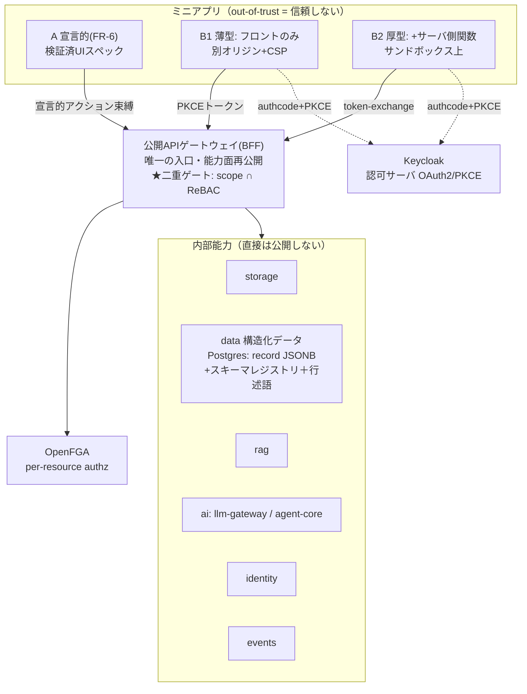

# ミニアプリ基盤 解説（新規メンバー向けオンボーディング）

> 対象: 新しくアサインされたエンジニア。ミニアプリ／業務アプリ基盤の全体像と、その前提になる
> 認証・認可まわりの周辺知識を、前提知識ゼロから理解するための入門資料。
>
> 正本（このドキュメントの元ネタ。迷ったらこちらが正）:
> - 要件: [`docs/requirements.md`](../requirements.md) FR-6 / **FR-11**
> - 設計: [`docs/design.md`](../design.md) §4.1（認証・認可）／**§4.10（ミニアプリ基盤）**
> - 実装計画: [`docs/roadmap/phase-9.md`](../roadmap/phase-9.md)
>
> ⚠️ この資料は「理解のための地図」です。仕様の最終判断は必ず上の正本を見てください。

---

## 0. 30秒サマリ

- **ミニアプリ = 社内の業務アプリ**（申請、台帳、案件管理…）。狙いは **現場が自分たちで業務アプリを増やせる基盤**。
- 2種類ある:
  - **A: 宣言的ミニアプリ** … AIや利用者が「UIの設計図（スペック）」を書くだけ。**任意コードは動かない**＝安全。
  - **B: コードベース・ミニアプリ** … 我々や上級ユーザーが**普通のコード**で実装。自由だが**信頼しない（out-of-trust）**ので隔離して動かす。
- B が shiki の機能（ファイル・データ・RAG・AI…）を使うときは、**内部APIを直接叩かせない**。
  代わりに **公開APIゲートウェイ**という1つの窓口だけを通す。
- 一番大事なルール: **「アプリに許した権限」と「使っている本人の権限」の両方を満たしたものだけ通す**（＝**二重ゲート**）。
- 業務アプリに必須の「**表形式データ**」と「**承認フロー**」を、専用の **構造化データサービス** と **軽量ワークフロー（FSM）** で提供する。

これだけ覚えて、あとは下で肉付けします。

---

## 1. なぜミニアプリ基盤を作るのか（背景）

shiki はエンタープライズ向けAIプラットフォーム（チャット・ストレージ・権限を守るRAG・サンドボックスで動く自律エージェント…）です。
その上で「**現場が自分たちの業務アプリを増やしていける**」状態を作ると、価値が一気に伸びます。これはいわゆる業務アプリ基盤（ローコード/ノーコード基盤）が提供する価値そのものです。

shiki ならではの差別化は、**ミニアプリの中から AI を呼べる**こと。
ただの台帳アプリではなく「申請を出したら AI が内容を要約・分類して、関連資料を RAG で引いてくる業務アプリ」が作れます。

そこで Phase 9 で「ミニアプリ／業務アプリ基盤」を作ります。
**ゴール**: 構造化データ＋承認フロー＋AI を持つ業務アプリを、**内部APIをセキュアに叩く形で**実装・簡単にデプロイできること。

---

## 2. 先に周辺知識（ここが土台。飛ばさないで）

ミニアプリの設計は、ほぼ全部「**誰が・何に・どこまでアクセスしてよいか**」の話です。
だから認証・認可の基本語彙を先に押さえます。社内でずっと使う言葉なので、ここで覚えるとあとが楽です。

### 2.1 認証（AuthN）と認可（AuthZ）— 全然別物

- **認証 (Authentication / AuthN)** = 「**あなたは誰?**」を確かめること。ログイン。
- **認可 (Authorization / AuthZ)** = 「**あなたはこれをしてよい?**」を判定すること。アクセス制御。

この2つは必ず分けて考えます。「ログインできた」＝「何でもできる」では**ない**。

### 2.2 Keycloak / OIDC — 認証はこれに任せる（自作しない）

- **Keycloak** = オープンソースの認証基盤（IdP = Identity Provider）。shiki は**認証を自作せず Keycloak に乗ります**。
  顧客の既存ID基盤（Active Directory / Entra ID / Okta）とも連携できます。
- **OIDC (OpenID Connect)** = Keycloak がログイン結果を伝えるための標準プロトコル。
  ログインに成功すると **JWT** という署名付きトークンが発行されます。
- **JWT (JSON Web Token)** = 「この人は誰で、いつまで有効か」が書かれた、改ざんできない（署名付き）文字列。
  フロントは API を呼ぶとき `Authorization: Bearer <JWT>` ヘッダで毎回これを送り、サーバは署名を検証して「確かに本人」と判断します。

> 覚え方: **Keycloak が「本人確認」をやってくれて、その証明書が JWT**。shiki 本体は「JWTが正しいか」を確かめるだけ。

### 2.3 OAuth2 / 認可コード / PKCE — 「本人の代わりに」アクセスする仕組み

ミニアプリの肝はここ。**ミニアプリ（＝別アプリ）が、ユーザー本人の代わりに shiki を叩く**状況を安全に作りたい。

- **OAuth2** = 「あるアプリに、ユーザーの権限の**一部だけ**を委譲する」標準プロトコル。
  「Google でログイン」「このアプリにカレンダーへのアクセスを許可しますか?」のアレ。
- **認可コードフロー (Authorization Code Flow)** = OAuth2 の標準的な流れ:
  1. ミニアプリがユーザーを Keycloak のログイン画面に送る
  2. ユーザーがログイン＆「このアプリに○○を許可」に同意
  3. Keycloak が短命の「**認可コード**」をミニアプリに返す
  4. ミニアプリがそのコードを**アクセストークン**（≒スコープ付きJWT）に交換する
- **PKCE（ピクシー / Proof Key for Code Exchange）** = 上記3→4の途中でコードが盗まれても悪用されないようにする追加の鍵。
  ミニアプリが毎回ランダムな秘密（code_verifier）を作り、そのハッシュを先に渡しておき、交換時に元の秘密を見せる。
  **ブラウザだけで動くアプリ（B1）には秘密を安全に保管できない**ので、PKCE が事実上必須です。

> 覚え方: **OAuth2 = 権限の一部だけ貸す仕組み。PKCE = ブラウザアプリ向けの盗難防止錠**。

### 2.4 スコープ (scope) — 「貸す権限の範囲」

OAuth2 でアプリに渡す権限の単位が **scope**。shiki では `<能力>.<操作>` の形にします。例: `data.read`, `storage.write`, `ai.invoke`。
「このミニアプリには `data.read` と `ai.invoke` だけ許可」のように、**アプリ単位で渡せる権限の上限**を決めます。

### 2.5 認可 = ReBAC（OpenFGA）— shiki の権限判定の中核

scope は「アプリに貸した権限の**上限**」にすぎません。**実際に「この人がこのファイルを見てよいか」を判定するのは別の仕組み**です。

- **ReBAC (Relationship-Based Access Control)** = 「**関係**でアクセスを決める」方式。
  例: 「user は dept の member」「folder は user に viewer 権限」…という**関係（タプル）**を積み上げ、
  「この folder を user は見れる?」を**関係をたどって**判定します。
- **OpenFGA** = ReBAC を実現するエンジン（Google Zanzibar 由来）。shiki は**認可も自作せず OpenFGA に乗ります**。
  タプルの形: `object#relation@subject`（例: `folder:123#viewer@user:alice`）。
- なぜ ReBAC か:「部署の階層」「フォルダの継承」「個別共有」を自然に表現でき、**ロールの組合せ爆発**を避けられるから。
  （対比: **RBAC** = ロールに権限を割り当てる方式。部署階層＋個別共有があるとロールが爆発するのでコアには採用しない。）

> 覚え方: **scope = アプリに貸せる権限の天井。ReBAC/OpenFGA = 本人が実際に何を触れるかの真実**。両方そろって初めて通す（→ 二重ゲート）。

### 2.6 ABAC（属性ベース）— 「行」を絞るのに使う

- **ABAC (Attribute-Based Access Control)** = データの**属性（値）**で判定する方式。
  例:「`owner` フィールドが自分の行だけ見える」「`status` が `公開` の行だけ見える」。
- ReBAC が苦手な「**何万行もあるテーブルの、行単位の絞り込み**」はこちらでやります（理由は §6 で詳述）。

### 2.7 BFF / ゲートウェイ — 「窓口を1つにする」

- **BFF (Backend For Frontend) / API ゲートウェイ** = フロント（やミニアプリ）専用の**入口を1つに集約**するサーバ。
  内部のいろんなサービスを直接見せず、**整理された窓口だけ**を公開する。
- shiki ではこれを **公開APIゲートウェイ** と呼び、**ミニアプリから shiki を叩く唯一の入口**にします。

### 2.8 confused deputy（混乱した代理人）問題 — 一番の敵

セキュリティで最重要の落とし穴。**「強い権限を持つ代理人が、弱い権限の人にだまされて代わりに悪さをしてしまう」**問題です。

例: ミニアプリ（代理人）が `data.read` の広いスコープを持っているとする。
権限の低いユーザー B が「人事部の給与テーブルを読んで」と頼む。
**もしアプリの権限だけで判定すると、B は本来見られない給与データを、アプリ経由で読めてしまう**。これが confused deputy。

→ 対策が **二重ゲート**（§4）。「アプリのスコープ」だけでなく「**頼んだ本人 B の権限**」も必ず確認する。

### 2.9 CSP / オリジン / サンドボックス — 「隔離」の道具

- **オリジン (Origin)** = `https://example.com` のような「スキーム＋ホスト＋ポート」の組。ブラウザのセキュリティ境界の単位。
- **CSP (Content Security Policy)** = ブラウザに「このページは**どこへ通信してよいか**」等を強制するルール。
  ミニアプリ（B1）には「通信先は shiki の**ゲートウェイだけ**」と CSP で縛り、勝手な外部送信を防ぐ。
- **サンドボックス (Firecracker / gVisor)** = コードを**隔離された箱**の中で動かす技術。shiki は Phase 4 で既にこれを持っている。
  信頼しないサーバコード（B2）はこの箱の中で動かし、外部通信もデフォルト遮断する。

> ここまでが土台。以降は「これらをどう組み合わせてミニアプリを安全にするか」の話です。

---

## 3. ミニアプリの2層モデル（A と B）

ミニアプリには2種類あります。**両方とも「アーティファクト＋バージョン＋ReBAC共有＋監査」という同じ共通枠**に乗ります。
違うのは **①どう動くか（ランタイム）** と **②どこから shiki を叩くか（認可の入口）** だけ。

| | **A: 宣言的ミニアプリ** | **B: コードベース・ミニアプリ** |
|---|---|---|
| 誰が作る | AI / 一般利用者 | shikiチーム / パワーユーザー |
| 中身 | UIの**設計図（検証済みスペック）** | **任意のコード**（フロント＋必要ならサーバ） |
| 信頼 | **in-trust（信頼できる）** ← 任意コードが動かないから | **out-of-trust（信頼しない）** ← 何が書かれているか分からない |
| shikiの叩き方 | 宣言済み・認可済みアクションだけ（アンビエント権限なし） | **公開APIゲートウェイ＋スコープ付きトークン経由のみ** |
| 位置づけ | FR-6（既存・Phase 6） | FR-11（新規・Phase 9） |

- **A は安全が構造的に保証される**: 「設計図」しか受け取らず、その設計図を shiki が検証してから描画するので、悪意あるコードが紛れ込む余地がない。
- **B はさらに2段階**:
  - **B1 = フロントのみ（本命）**: ブラウザで動く普通のWebアプリ。多くの業務アプリはこれで足りる。
  - **B2 = サーバ側ロジックあり（昇格オプション）**: サーバで動く処理が要るときだけ。既存サンドボックスの中で動かす。

> 設計判断:「**B はまず B1（フロントだけ）。サーバが本当に要るときだけ B2 に昇格**」。隔離が重い B2 を安易に使わない。

### 「汎用PaaS/DBaaS は作らない」という重要方針

「アプリを作れる基盤」と聞くと、Heroku/Firebase のような**汎用の実行環境＋DB**を作りたくなります。**作りません**（巨大で、運用負荷も攻撃面も増えるため）。
代わりに、業務アプリが実際に必要とする3点だけを**管理された形**で提供します:

1. **データ置き場** → 構造化データサービス（§6）
2. **実行場所** → 既存サンドボックスの再利用（B2のとき）
3. **shikiへの口** → 公開APIゲートウェイ（§4）

---

## 4. 一番の核心：内部APIを「セキュアに」叩く仕組み

ここが FR-11 の最重要ポイントです。**信頼しないミニアプリ（B）に、社内の機能をどう安全に使わせるか。**

### 4.1 原則：内部APIは直接見せない。窓口は1つ。

- shiki 内部のサービス（ストレージ、データ、RAG、AI…）の API を、**ミニアプリに直接は公開しない**。
- 代わりに **公開APIゲートウェイ（BFF）が唯一の入口**。
  ここで「**キュレーション済み・バージョン付き・スコープ付き**」の**能力面（capability surface）だけ**を再公開する。
- 利点: 内部実装が変わっても外向きの口は安定。攻撃面が1か所に集約され、そこだけ固く守ればよい。

### 4.2 認可の流れ（OAuth2 + PKCE）

1. ミニアプリ B はユーザーを **Keycloak**（認可サーバとして再利用）に送り、**認可コード＋PKCE**でログイン＆同意してもらう。
2. ミニアプリは**スコープ付きアクセストークン**を受け取る（例: `data.read`, `ai.invoke` だけ入ったトークン）。
3. ミニアプリはそのトークンを付けて**ゲートウェイだけ**を叩く。
4. ゲートウェイがトークンを検証し、**二重ゲート**で判定してから内部能力へ取り次ぐ。

→ **新しい認証基盤は作らない**。既存の Keycloak をそのまま認可サーバとして使い回す。

### 4.3 ★二重ゲート（Double Gate）— このプロジェクトで一番大事な式

```
実効権限 = アプリに付与されたスコープ  ∩  呼び出しユーザー本人のReBAC権限
```

- **左（スコープ）**: 「このアプリには `data.read` まで許可」というアプリ単位の**上限**。
- **右（ReBAC）**: 「**いま操作している本人**が OpenFGA 上で実際に何を触れるか」という**真実**。
- **両方の AND（∩）を満たしたものだけ通す。**

これが §2.8 の **confused deputy 対策**そのもの。
アプリが広いスコープを持っていても、**本人が見られないデータには絶対に到達できない**。
shiki 全体の「アンビエント権限なし＝常に呼び出している本人として認可される」という原則の延長です。

### 4.4 ユーザーがいない自動化（バッチ等）はどうする?

夜間バッチのように「操作する本人」がいないケースもある。
その場合だけ、**そのアプリが所有するデータに限定した、狭いスコープのサービスidentity**を許可する。
（＝他人のデータには触れない。広い権限は絶対に渡さない。）**全呼び出しを監査ログに残す。**

### 4.5 B2（サーバ側）のときのトークンの扱い

B2 はサーバ側コードが shiki を叩くが、それでも「**ユーザーの代理**」であり続けたい（＝二重ゲートを効かせ続けたい）。
そこで **token-exchange（トークン交換）** を使い、ユーザー文脈を保ったままサーバ側トークンに変換する。
B2 のコードはサンドボックス内で動かし、クライアント秘密もその中に閉じ込める。

---

## 5. 能力カタログ（Capability Catalog）

ミニアプリが使える shiki の機能を、**6つの能力**に整理して公開します。これが「ミニアプリから見た shiki の API メニュー」です。

| 能力 | 何ができる | スコープ例 |
|------|-----------|-----------|
| `storage` | ファイル・フォルダの読み書き | `storage.read` / `storage.write` |
| `data` | 構造化データ（テーブル/レコード）のCRUD（§6） | `data.read` / `data.write` |
| `rag` | 権限を守った文書検索（引用付き） | `rag.search` |
| `ai` | LLM呼び出し・エージェント実行（§7） | `ai.invoke` |
| `identity` | ユーザー/部署情報の参照 | `identity.read` |
| `events` | イベントの購読・発行 | `events.subscribe` |

- スコープは `<能力>.<操作>` ＋ **リソース束縛**の2軸（例:「このテーブルだけ」）。
- **スコープはあくまで上限**。実際の認可判定は**常に OpenFGA（＋行述語）**。
- アプリは**自分が所有するリソース**（後述の所有テーブル等）を持てる。

---

## 6. 構造化データサービス（業務アプリの中核）

業務アプリ＝**表形式のデータ**を扱えること。これを提供するのが `crates/data`。**ここの行レベル認可が設計の山場**です。

### 6.1 データの持ち方

- 既存 Postgres 上の**管理されたサービス**。テーブルごとに物理テーブルを作る（ランタイムDDL）ことは**しない**。
- レコードは1つのテーブルに集約: `record(table_id, id, data JSONB, rev, ...)`。
  実際のフィールドは `data`（JSONB）に入る。
- 各テーブルの構造は **`table_schema`（スキーマレジストリ）**で宣言。宣言したフィールドにだけ**式インデックス**を張って検索を速くする。
- フィールド型に **user / dept / file / record 参照**を持てる（業務アプリのユーザー選択・関連レコード参照に相当）。
- `rev` で**楽観ロック**（同時編集の衝突検知）、レコードの**リビジョン履歴**も保持。
- 生SQLは公開しない。**宣言的クエリ／保存ビュー**だけを公開する。

> なぜ「テーブルごとに物理テーブルを作らない」のか: 顧客がアプリを作るたびに `CREATE TABLE` が走ると、
> スキーマ管理・マイグレーション・権限管理が破綻する。1つの `record` テーブル＋スキーマレジストリに集約して**管理可能に保つ**。

### 6.2 ★行レベル認可（ここが難所）

「**何万行もあるテーブルで、行ごとに見える・見えないを制御する**」をどう実現するか。素朴にやると破綻します。

**やってはいけないこと**: 全レコードを OpenFGA のタプルにする。
→ レコードが100万行あればタプルも100万件。**タプル爆発**で「この人が見られる行一覧」を出す処理が**性能的に死ぬ**。

**正しい3層（＋例外）**:

1. **テーブル単位は ReBAC（OpenFGA）**: 「この**テーブル**を user/dept が触れるか」だけを OpenFGA で持つ。
   テーブルの数は限られるので**タプルは有界**。
2. **行単位はクエリ時述語（ABAC）**: テーブルに宣言された `row_policy`（例:「`owner == 自分` または `status == 公開`」）を、
   **クエリ実行時に強制的な WHERE 句にコンパイル**して必ず付ける。
   - **バイパス不可**: アプリ側がどんなクエリを投げても、この WHERE が必ず注入される。
   - **集計にも適用**: `COUNT` / `SUM` などにも同じ絞り込みが効く。
     → 「件数や合計値から、見えないはずの行の存在が漏れる」を防ぐ。
3. **フィールド単位のマスク（任意）**: ロールに応じて特定フィールド（例: 給与額）を隠す。
4. **例外＝個別共有だけスパースタプル**: 「この1行だけ特定の人に共有」のような**任意の個別共有**のときだけ、
   **共有された行にだけ** OpenFGA タプルを作る。全行ではなく**共有された行だけ**なのでタプルは少なく済む（sparse = 疎）。

> 覚え方: **テーブル＝ReBAC（数が少ない）／行＝WHERE述語（数が多い）／個別共有だけ例外的にタプル**。
> 「全行をタプルにしない」が鉄則。これを破ると性能が死ぬ。

この WHERE 強制注入・クエリコンパイラは**正しさがクリティカル**（authzバイパス・集計リークが起きたら事故）なので、特に慎重に設計・レビューする領域です。

---

## 7. ミニアプリの中から AI を使う

shiki ならではの差別化。ミニアプリは2種類の AI 呼び出しを使えます。

- **`llm.invoke`（raw）**: 単発の LLM 呼び出し。要約・分類・整形など。
- **`agent.invoke`（エージェント）**: ツールを使って自律的に動く。

**ここでも権限は二重・三重に絞る**:

- エージェントが使えるツール ＝ **アプリが宣言したツール ∩ template が許すツール ∩ ユーザーの ReBAC**。
- コンテキストにアプリのデータや RAG 結果を渡せるが、**RAG は個人の ReBAC で必ず再チェック**（見えない文書は引用に混ぜない）。
- コストは **(ユーザー × アプリ)** 単位で計上。**モデル/予算のガードレール**あり。呼び出しは**既存の監査**に統合。

---

## 8. ワークフロー（承認フロー）

業務アプリ＝**申請→承認**のような状態遷移。これを**軽量な FSM（有限状態機械）を自作**して提供します。

- 状態 = レコードの **`status` フィールド**（別システムではなくデータの一部）。
- 遷移の認可 = **§6の行述語エンジンを再利用**（「この人はこの遷移をしてよいか」）。
- `status` が**可視性を駆動**（例: `下書き` は本人だけ、`申請済` は承認者にも見える）。
- 遷移の副作用 = **宣言的アクション**（AI呼び出しを含む。例:「承認されたら要約を生成して通知」）。
- **サーバ側で強制＋監査**。条件分岐・並列承認まで対応。
- **重い BPMN エンジン（Camunda/Temporal 等）は入れない**。業務アプリに必要十分な軽量FSMに絞る。

---

## 9. 配布・デプロイ（「簡単にデプロイ」の中身）

ミニアプリは **マニフェスト付きアーティファクト**として配布します。

- **マニフェスト** = アプリの宣言書。要求スコープ・所有テーブル・ワークフロー・許可モデル・バンドル・エントリ等を書く。
- 流れ: **内部レジストリに不変（immutable）publish** → **管理者が同意してインストール**
  （このとき**所有テーブルが自動プロビジョン＋ReBAC が付与**される）。
- **信頼ティア**:
  - first-party 署名 = 既定で信頼（我々が作ったもの）
  - in-house = 管理者の同意が要る
  - 将来 marketplace = 審査付き（第三者公開。Phase 9 安定後の将来トラック）
- **オンプレ/エアギャップ**対応: 署名済みバンドルで**ネット接続なしにインポート**できる。
- 開発体験: **SDK ＋ CLI**（`shiki app init` / `dev` / `publish`）。これが「簡単にデプロイ」の実体。
- SDK には、公開APIゲートウェイの能力面の**型が自動生成で同梱**される（手書きの型を持たない＝タイポやAPIずれを防ぐ）。

---

## 10. 全体像（1枚絵）



**読み方**: 信頼しないミニアプリ（上）は、Keycloak で本人の代理トークンを得て、**ゲートウェイ1か所だけ**を叩く。
ゲートウェイが **scope ∩ ReBAC（二重ゲート）** で絞り、内部能力（下）へ取り次ぐ。内部能力は外に直接は見えない。

---

## 11. 関連コード（リポジトリのどこを見るか）

Phase 9 で実装する主なクレート（`docs/design.md` §5）:

| 場所 | 役割 | 備考 |
|------|------|------|
| `crates/app-gateway/` | 公開APIゲートウェイ・OAuth2/スコープ・能力面 | 二重ゲート・token-exchange |
| `crates/app-platform/` | ミニアプリ artifact・マニフェスト・レジストリ・FSM | |
| `crates/data/` | 構造化データ・record/schema・**行authz述語エンジン** | クエリコンパイラ |
| `crates/authz/` | OpenFGA クライアント・relation 定義 | 既存 |
| `crates/sandbox-orchestrator/` | Firecracker/gVisor 制御層 | 既存・B2実行で再利用 |
| `web/` | Next.js（generative UIレンダラ・**ミニアプリB1配信**） | |
| `sdk/` | ミニアプリ SDK ＋ CLI（`shiki app init/dev/publish`） | 公開API型を配布 |

> ミニアプリ基盤では **app-gateway の認可** と **data の行述語エンジン** が特に正しさクリティカル（どちらも事故ると重大なため）。慎重に設計・レビューする。

---

## 12. よくある誤解（アンチパターン集）

- ❌「ログインできたんだから、このユーザーのデータは全部読める」
  → **認証 ≠ 認可**。読めるかは必ず OpenFGA（＋行述語）で判定する。
- ❌「アプリに `data.read` を許可したから、アプリは全テーブル読める」
  → **二重ゲート**。本人が見られないデータには届かない。
- ❌「行ごとの権限だから、全レコードを OpenFGA タプルにすればいい」
  → **タプル爆発で死ぬ**。テーブル＝ReBAC、行＝WHERE述語、個別共有だけ例外的にスパースタプル。
- ❌「件数（COUNT）くらいなら権限チェックしなくていい」
  → **集計にも WHERE 述語を効かせる**。件数や合計から見えない行の存在が漏れる。
- ❌「ミニアプリの便利のために内部APIを直接公開しよう」
  → **唯一の入口はゲートウェイ**。内部APIは直接公開しない。
- ❌「業務フローだから本格的な BPMN エンジンを入れよう」
  → **軽量FSMで足りる**。重いエンジンは入れない。
- ❌「アプリを作れるように汎用の実行環境とDBを用意しよう」
  → **汎用PaaS/DBaaSは作らない**。構造化データ＋サンドボックス再利用＋公開APIの3点で満たす。

---

## 13. 用語ミニ辞典（索引）

| 用語 | 一言で |
|------|--------|
| AuthN / 認証 | あなたは誰?（ログイン） |
| AuthZ / 認可 | あなたはこれをしてよい?（アクセス制御） |
| Keycloak | 認証基盤（自作しない）。本人確認をやってくれる |
| OIDC / JWT | ログイン結果を伝える標準 / 改ざんできない本人証明トークン |
| OAuth2 | アプリに権限の一部だけを委譲する標準 |
| 認可コードフロー | OAuth2 の標準的な手順（コード→トークン交換） |
| PKCE | ブラウザアプリ向けのコード盗難防止錠 |
| scope | アプリに貸す権限の範囲・上限（`<能力>.<操作>`） |
| ReBAC / OpenFGA | 関係でアクセスを決める方式 / そのエンジン（認可の真実） |
| RBAC | ロールで権限を決める方式（コアには採用しない） |
| ABAC | 属性（値）でアクセスを決める方式（行の絞り込みに使う） |
| BFF / ゲートウェイ | 入口を1つに集約するサーバ |
| 二重ゲート | 実効権限 = アプリのスコープ ∩ 本人のReBAC |
| confused deputy | 強権限の代理人が弱権限の人にだまされる問題（二重ゲートで防ぐ） |
| token-exchange | ユーザー文脈を保ったままトークンを変換（B2用） |
| CSP / オリジン | ブラウザに通信先などを強制するルール / セキュリティ境界の単位 |
| サンドボックス | 信頼しないコードを隔離して動かす箱（Firecracker/gVisor） |
| FSM | 有限状態機械（軽量ワークフローの実体） |
| アーティファクト | バージョン付き・ReBAC共有・監査される成果物の共通枠 |

---

**次に読むと良いもの**: [`docs/design.md`](../design.md) §4.1（認証・認可の正確な定義）→ §4.10（ミニアプリ基盤）→
[`docs/roadmap/phase-9.md`](../roadmap/phase-9.md)（実際のタスク 9.1〜9.15）。
