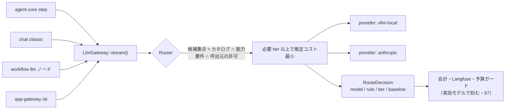
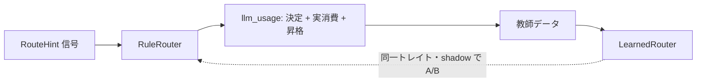

# ルールベース・モデルルータ（コストルータ）

> 本書は [design.md](../design.md) §4.5（llm-gateway）の詳細設計。llm-gateway 全体の位置づけ・
> トークン会計・思考強度正規化の正本は [design.md](../design.md) §4.5 であり、本書はその内側に
> 「**どのモデルで実行するかを決める層**」を足す。
> 実装は [roadmap 並行トラック LR](../roadmap/parallel-tracks.md)（LR.1〜LR.8）。
> 着手前に [design-caveats](../design-caveats.md) の **PIT-28**（利用量＝金額クリティカル）・
> **PIT-45**（ルータの差し替えが会計から見えない）・**PIT-46**（自動降格の3方向の黙った破壊）を確認すること。
> 認可・レジデンシ・カタログの境界は [design.md](../design.md) §4.1/§4.12 と
> [requirements.md](../requirements.md) NFR-2/NFR-10 が正本であり、本書はそれを**広げない**。
> 本書の数値（閾値・上限・既定 tier）はすべて**初期値**であり、shadow 計測（§8）で調整する設定値である。

---

## 1. 目的と非目的

**目的はコストカットのみ**。同じ仕事をより安いモデルで通し、通らなかったときだけ高いモデルに払う。

学習型ルータ（選好データから難易度を予測してモデルを振り分ける方式）は、**選好データが無い段階では作れない**。
本書はその手前に置く現実解として、**決定的なルールだけで振り分ける**ルータを定義する。同時に、
ルータの決定と実消費を構造化して記録し、**将来の学習型ルータの教師データを今から貯める**（§10）。

| 目的 | 非目的（別の層の仕事） |
|---|---|
| 十分な能力を満たす候補のうち最安を選ぶ | 応答品質の最大化（既定モデル選定とプロンプトの仕事） |
| 安価で通らなかったときの安全な昇格（§6） | 難易度の LLM 判定（**ルータは推論を呼ばない**・§9） |
| 削減額を実データで測ること（§7・§8） | ユーザー/skill/アプリの明示モデル指定の上書き（§5-1） |
| 将来の学習型ルータへの移行路（§10） | セマンティックキャッシュ・プロンプト圧縮（§9） |

> ⚠️ **ルータが LLM を呼んだ時点で削減の一部が消える。** ルータの判断は必ず「呼出側が既に持っている情報」と
> 「文字列の走査」だけで完結させる。この制約は性能要件ではなく**目的そのもの**である。

## 2. 位置づけ — どこに置き、何を広げないか

配置は `LlmGateway::stream()` の内側。LLM 呼出点は 4 箇所（agent-core のステップ・chat の classic 経路・
workflow-engine の llm ノード・app-gateway の `/ai`）で、**すべて gateway を通る**。ここに置く限り
単一チョークポイント不変条件（[design.md](../design.md) §1）を壊さない。個別ハンドラにモデル選択を散らさない。



**ルータは候補集合の中から選ぶだけで、候補集合はテナントのモデルカタログ**（＝管理者が許可したモデル・
[phase-12](../roadmap/phase-12.md) Task 12.1）である。したがってルータは認可境界もレジデンシ境界も
**広げられない**。降格が起こるのは常に許可集合の内側である。この性質が §4-7 の語彙ヒューリスティクスを
安全にしている（誤爆しても「カタログ内の別モデルが選ばれる」以上のことは起きない）。

> `Router` はトレイトにするが、[design.md](../design.md) §3.1 の差し替えトレイト（cloud/onprem 差を吸収する
> `ObjectStore` / `VectorStore` / `LlmProvider` / …）には**加えない**。あれは配置差を吸収する軸であり、
> ルータは llm-gateway 内部の実装戦略（ルール → 学習型）の差し替え軸で、層が異なる。

## 3. 前提工事 — カタログのメタデータ化と複数プロバイダ

現行の `ModelEntry` は `id / real_id / 単価` しか持たない。**「安いが十分か」を判定する材料が存在しない**ため、
ルータ本体より先にここを直す。

### 3.1 `ModelEntry` の拡張

| フィールド | 型 | 用途 |
|---|---|---|
| `tier` | `small` \| `standard` \| `large` | **能力クラス（順序付き）**。ルールが返す「必要 tier」と突き合わせる |
| `context_window` | `u32` | 入力上限。超える候補は機械的に落ちる |
| `max_output_tokens` | `u32` | 要求 `max_tokens` を満たせない候補は落ちる |
| `capabilities` | `{ tools, vision, thinking, json_schema }` | ツール提示ありの要求に tools 非対応モデルを当てない |
| `residency` | `domestic` \| `overseas` | 国外処理バッジ（[design.md](../design.md) §4.12 / NFR-10）と**同一語彙**。ルーティング制約にも使う |
| `provider` | `Option<String>` | §3.2 の providers[] 参照。省略時は既定 provider |
| `routable` | `bool` | `false` なら**明示選択でのみ使える**（自動では選ばれない） |

**`tier` は価格ではなく能力の順序**である。同一 tier 内の優先順位は単価から自動的に決まる（単価は既に持っている）
ので、管理者が決めるのは「どの能力クラスか」だけでよい。

> **`tier` を単価順から自動導出しない。** 単価順＝能力順は成り立たない（長コンテキスト特化の安価モデル、
> 旧世代の高価モデル）。導出は静かに間違え、しかも間違いが「モデルが馬鹿」に見えて原因究明を阻む。
> **`tier` 未設定のモデルはルータの候補から外す（fail-closed）**。明示選択では従来どおり使える。
> カタログはもともとテナント管理者が編む前提（Task 12.1）なので、tier 付与は運用の一部として自然に載る。

### 3.2 複数プロバイダ

現行 `ProviderConfig` は**単数**で、gateway は `LlmProvider` 実装を 1 つしか持てない。この制約のままだと
**最大の削減手段**——「ローカル vLLM（GPU 償却済み＝限界費用ほぼゼロ）を軽いタスク、外部 API を難しいタスク」——が
そもそも表現できない。ティア差は同一 provider 内（例: 小型モデル ↔ 大型モデル）でも取れるが、
桁が変わるのは provider を跨いだときである。

```
providers = [
  { name = "vllm-local", kind = "openai",    base_url = "http://vllm:8000/v1" },
  { name = "anthropic",  kind = "anthropic", api_key  = "..." },
]
models = [
  { id = "local-small", provider = "vllm-local", tier = "small",    residency = "domestic", ... },
  { id = "flagship",    provider = "anthropic",  tier = "large",    residency = "overseas", ... },
]
```

- gateway は `HashMap<String, Arc<dyn LlmProvider>>` を持ち、モデル解決時に provider を引く。
- **後方互換**: 単数 `provider` 設定は `name = "default"` の 1 要素として読み、`ModelEntry.provider` 省略時は
  既定 provider を指す。既存の設定ファイル・compose・テストは無改修で動く。
- **エアギャップ（NFR-2）不変**: 外部 provider を構成しなければ、その provider に属するモデルは
  カタログ検証で弾かれ候補集合から消える。ルータが外部接続を勝手に発生させることはない。
- provider 障害時のフォールバックはルーティングとは別軸（既存のリトライ責務）だが、同じ候補集合の上に載せられる。

## 4. ルータの入力 — `RouteHint`

**呼出側が「何の仕事か」を宣言する**。これが本設計の肝である。プロンプト本文から難易度を推測するより、
呼出点が知っている事実（これはタイトル生成である／これはツールループの 3 手目である）の方が桁違いに正確で、
かつタダである。

```rust
struct RouteHint {
    task: TaskKind,                  // 呼出点が宣言する仕事の種別
    step: Option<u32>,               // agent ループのステップ番号（0 = 初手）
    tools_offered: usize,            // 提示ツール数
    requires_vision: bool,
    effort: Option<Effort>,          // ユーザーの明示（low/medium/high）
    input_tokens_est: u64,           // 既存 agent-core `estimate_tokens` 相当
    expected_output_tokens: u32,     // max_tokens or TaskKind 既定（コスト推定用）
    escalation: u32,                 // 昇格段数（§6・0 = 未昇格）
    text_signals: TextSignals,       // §4 の走査結果（コードフェンス等）
}
```

### TaskKind（初期集合）

呼出点から素直に出るものだけを置く。「推測しないと決まらない種別」は作らない。

| TaskKind | 呼出点 | 既定の必要 tier |
|---|---|---|
| `Conversation` | chat classic / agent の最終応答 | standard |
| `AgentStep` | agent-core のステップ | 初手 standard・以降 §5 のルール |
| `TitleOrSummary` | スレッドタイトル・要約・見出し | small |
| `StructuredExtract` | JSON 抽出・分類・タグ付け | small |
| `Rewrite` | 整形・翻訳・敬体変換 | small |
| `WorkflowNode` | workflow-engine の llm ノード | standard（ノード側で上書き可） |
| `AppAi` | app-gateway `/ai`（ミニアプリ） | standard（`budget_models` の範囲内） |

### 信号と、それを使う根拠

1. **TaskKind** — 最強の信号。呼出点が宣言するので誤りようがない。
2. **`input_tokens_est`** — `context_window` で候補を絞る。加えて閾値超（初期値 32k）で tier を 1 段上げる。
   長い入力は小型モデルが崩れやすく、崩れた分の再生成が削減を食う。
3. **`tools_offered > 0`** — `capabilities.tools` を必須要件にする。ここを外すとエージェントが静かに機能停止する。
4. **`requires_vision`** — `capabilities.vision` を必須要件にする。
5. **`effort`** — ユーザーが `high` を選んだなら最上位 tier に固定する。**明示された意図は推測に勝つ。**
6. **`step`** — 初手は計画・以降はツール結果の畳み込みが主。ただし「以降＝簡単」は乱暴なので、
   降格は §6 の昇格とセットでのみ許す。
7. **`text_signals`（補助・最後の材料）** — コードフェンス／数式／URL 数、および語彙
   （昇格側: 設計・なぜ・デバッグ・検証・比較・証明・リファクタ ／ 降格側: 要約・翻訳・整形・抽出・分類・箇条書き）。
   日本語・英語の両方を持つ。
   > ⚠️ この信号は**攻撃者が動かせる**（プロンプト内に「設計」と書けば昇格する）。しかし候補集合は
   > カタログ内に閉じており、上限は予算ガードが押さえる。したがって被害は「高いモデルを使わされる」に留まり、
   > 認可・レジデンシは破れない（§2）。逆向き（降格を誘発）は品質劣化のみ。**fail-safe になっていることを
   > 確認した上で採用している**信号であり、これが成立しない場面（レジデンシ制約）では語彙を使わない。

## 5. 決定手続き（順序が正本）

```
1. 明示選択か？
     req.model が「ユーザー選択 / skill のモデル既定 / ワークフローノード指定 / アプリ指定」由来なら
     → そのまま使う。ルータは動かない。明示の上書きは決してしない。
2. 候補集合を作る
     カタログ ∩ routable ∩ tier 設定済み
       ∩ capabilities（tools / vision / json_schema）
       ∩ context_window >= input_tokens_est
       ∩ max_output_tokens >= expected_output_tokens
       ∩ 呼出元の許可（app_installation.budget_models 等）
       ∩ レジデンシ制約（テナントポリシーが domestic 限定なら overseas を除く）
3. ルール表を宣言順に評価し、最初に一致したルールの「必要 tier」と rule_id を採る（未一致は TaskKind 既定）
4. 必要 tier = max(ルール結果, effort 由来の下限, 昇格段数 §6, 同一 run の粘着下限 §5.1)
5. 必要 tier 以上の候補のうち、推定コスト最小を選ぶ
     推定コスト = prompt単価 × input_tokens_est + completion単価 × expected_output_tokens
6. 候補が空 → 既定モデルへフォールバックし、理由を warn ＋ 決定ログに残す
     （黙って弱くしない。候補が空になる設定ミスを運用が気づける形にする）
```

ルール表は**設定で編集できる**（コード変更なしに運用が回る）。1 ルール ＝ 条件 → 必要 tier ＋ rule_id。
宣言順・最初の一致が勝つ。この単純さは意図的で、**「なぜこのモデルが選ばれたか」を人間が説明できること**を
機械的最適性より優先している（説明できないコスト最適化は運用で信用されない）。

### 5.1 粘着（sticky）— 同一 run 内でモデルを行き来させない

**per-step で最安を選び直すのは誤りである。** 理由は 2 つ:

1. **プレフィックスキャッシュが壊れる**。vLLM の automatic prefix caching も外部 API の prompt caching も
   「同一モデルに同一プレフィックスを送る」ことが前提で、モデルを替えた瞬間に長い会話履歴の再計算が発生する。
   ステップごとに履歴全体を再送する agent ループでは、**キャッシュ喪失が降格の削減額を上回りうる**。
2. 応答の一貫性（口調・書式・方針）がステップ間で揺れ、ユーザーには「急に馬鹿になった」と見える。

したがって:
- 同一 run 内の tier は**単調非減少**（昇格はするが下げ戻さない）。
- 降格を判断するタイミングは run 開始時と、履歴が剪定された直後（[agent-core](../design.md) §4.4 の
  `prune_history` 発火時＝どのみちキャッシュが切れる点）に限る。
- 会話（thread）を跨いだ選択は独立でよい（プレフィックスが元々別）。

> プロンプトキャッシュは現時点で未実装だが、**vLLM / 外部 API の自動プレフィックスキャッシュは
> 明示指定なしに効いている**。粘着は「将来のための予防」ではなく今そこにある効果である。

## 6. 昇格（escalation）— 安価優先を安全にする弁

安価モデルで開始し、**失敗の兆候を観測したら 1 段上げて同じステップをやり直す**。
「9 割は安価で通り、通らなかった 1 割だけ高価に払う」という期待値がコスト削減の本体である。

| 兆候 | 検出点 | 根拠 |
|---|---|---|
| ツール引数 JSON がパース不能 | agent-core（`ToolUseStop` の入力検証） | 小型モデルの典型的な壊れ方 |
| 空応答（テキストもツール呼び出しも無い） | agent-core | 同上 |
| `stop_reason = MaxTokens` で未完 | agent-core | 出力が収まらない＝タスクが重い |
| 同一ツール呼び出しのループ検出 | 既存 `loop_detect` | モデルが抜け出せていない |
| ツールエラー N 回連続（初期値 2） | agent-core | 引数の作り方を理解できていない |

制約:
- 昇格は **1 run あたり K 回まで**（初期値 2）。同一ステップの再試行は 1 回まで。
- 昇格は**単調**（§5.1）。上げたら下げない。
- **やり直し分も実消費として課金される**（実際に払っているのだから当然）。したがって
  「**昇格率 × 再生成コスト < 降格による削減**」が成り立つ範囲でしか安価優先にしてはならない。
  この不等式は §8 の shadow 計測で確認してから `on` にする。
- **判断は agent-core（ステップ境界を持つ層）が行い、ルータは `escalation` 段数を受け取って
  tier 下限を上げる純関数**として振る舞う。リトライ制御をルータに持たせない（ルータを状態機械にしない）。

## 7. 会計・監査の不変条件（外すと金額が嘘になる）

現行、呼出側は自分が指定した `opts.model` を `GenerationRecord` に詰めている。**gateway が黙ってモデルを
差し替えると、記録上のモデルと実際に払った先が乖離する。** SAAS.3 課金の集計元（[PIT-28](../design-caveats.md)）が
壊れ、agent-core の予算ガードも誤った単価で積む。加えて「削減できた」ことを証明する手段も無くなる。

決定:

1. **`stream()` は実効モデルを戻り値で返す。**
   `RoutedStream { stream, decision: RouteDecision { model, tier, rule_id, escalation, baseline_model } }` とし、
   4 箇所の呼出点はすべて `decision.model` を会計に使う。呼出側が「意図したモデル」を記録に使う経路を残さない。
2. **`llm_usage` に列を足す**:
   | 列 | 意味 |
   |---|---|
   | `routed` | ルータが選んだか（明示選択なら false） |
   | `route_rule` | 一致したルール ID（未一致は既定） |
   | `route_mode` | `shadow` \| `on`（shadow 行は実行に反映されていない） |
   | `requested_model` | 呼出側が意図したモデル＝**ベースライン** |
   | `baseline_cost_usd_micros` | 同一トークンを `requested_model` で払った場合の推定額 |
   | `escalation` | 昇格段数（0 = 未昇格） |

   → **削減額 = `baseline_cost_usd_micros` − `cost_usd_micros`** を SQL で直接集計できる。
   これが KPI であり、shadow → on の判断材料であり、§10 の教師データでもある。
3. **予算ガードは実効モデルの単価で積む**（`estimate_cost_usd_micros` に実効モデルを渡す）。
4. **Langfuse の metadata に `route_rule` / `tier` / `escalation` / `baseline_model` を載せる**
   （trace_id で監査・OTel と突合できる状態を維持）。
5. 冪等キーの意味は変えない。昇格による再生成は**別の呼び出し**であり、別の冪等キー（`:e{n}` サフィックス）で
   刻む。二重計上でも計上漏れでもない。

## 8. 段階導入 — `router.mode`

`off` \| `shadow` \| `on`。**既定は `shadow`**。テナント単位で上書き可（Task 12.1 の管理画面に同居）。

| mode | 実行 | 記録 | 用途 |
|---|---|---|---|
| `off` | 従来どおり | ルータ列なし | 完全無効化（キルスイッチ） |
| `shadow` | **従来どおり**（既定/明示モデル） | 「もし適用していたら」を `llm_usage` に記録 | **品質退行リスクゼロで削減率を実測** |
| `on` | 決定を反映 | 実績を記録 | 本番適用 |

`shadow` で見るもの:
1. 推定削減率（`baseline − actual` の総和 / `baseline` の総和）
2. 降格されるリクエストの分布（どの TaskKind がどれだけ来ているか）
3. `context_window` 不足・`capabilities` 不足で候補から落ちた率（＝カタログ設定の穴）
4. 語彙ルールの発火率（誤爆していないか）
5. 昇格見込み（shadow では実際の昇格は起きないため、§6 の兆候の**発生率**を代理指標として見る）

> `shadow` は将来そのまま **A/B の器**になる（新しいルータを shadow で回して現行と比較する・§10）。

## 9. 意図的に作らないもの

| 作らない | 理由 |
|---|---|
| LLM による難易度分類 | ルータが推論を呼んだ時点で削減が食われる（§1） |
| セマンティックキャッシュ | 別軸の削減策。[design.md](../design.md) §4.5 の「後追い」のまま |
| 応答品質の自動評価（LLM-as-judge）による自動フィードバック | 評価コストが削減を食う。データが貯まってから（§10） |
| プロンプト圧縮 | agent-core の `context.rs`（剪定）が別機構として既にある |
| ルータによる provider 障害フォールバック | 既存のリトライ責務。混ぜると「安いから選んだ」と「落ちたから逃げた」が区別できなくなる |

## 10. 将来の学習型ルータへの移行

`Router` をトレイトとし、`RuleRouter` を最初の実装にする。`llm_usage` に貯まる
**（RouteHint の信号 → 選択 → 実消費 → 昇格有無 → ユーザーの再生成/編集シグナル）** がそのまま教師データになる。



- 昇格が起きた ＝「安価では足りなかった」の**負例**、昇格なしで完走 ＝「安価で足りた」の**正例**。
  ラベルを人手で付けなくても、運用そのものがラベルを生む構造にしておく。これが「最初からデータを集めるのは困難」への回答である。
- 差し替えは同一トレイト裏で行い、`shadow` モードで現行ルータと比較してから切り替える。
- 学習型を入れても **§7 の会計不変条件と §2 の候補集合の制約は変わらない**。壊れやすい部分（金額・認可・
  レジデンシ）はルータの実装戦略から独立させてある。
