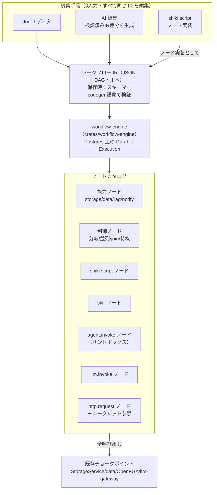

# ミニアプリ／ワークフロー基盤 統合設計

> 本書は [要件定義書](./requirements.md) FR-11〜FR-15 の設計正本。
> [設計書](./design.md) §4.10 の旧「軽量FSMエンジン」記述と roadmap Phase 9 Task 9.10 を**置き換える**
> （2026-07 の設計インタビューで確定。経緯は issue #97）。
> 認可・ストレージ・LLM の不変条件（単一チョークポイント・AuthContext・二重ゲート）は design.md §1/§4 が正本であり、
> 本書はその上に載る。着手前に [design-caveats PIT-31〜38](./design-caveats.md) を必ず確認すること。

## 1. 概念スタック

ワークフロー・shiki script・skill・ミニアプリ・FSM の関係を一本に統一する。
**実行エンジンは workflow-engine ただ一つ**であり、認可・監査・リトライ・Observability を二重実装しない。

| 概念 | 正体 | エンジンか？ |
|------|------|-------------|
| **workflow-engine** | 自作の Durable Execution エンジン（n8n/Power Automate 相当）。唯一の長時間実行ランタイム | ✅ 唯一のエンジン |
| **ワークフロー** | IR（JSON DAG）で定義されるバージョン付きアーティファクト。トリガ＋ノード＋接続 | ─（エンジンが実行する定義） |
| **shiki script** | TS 風言語（GAS に API を寄せる）。ノード実装・スプレッドシート関数・skill 実装を書く手段 | ❌ 言語。durable にならない |
| **skill** | 指示文＋（任意）script＋宣言ツール/スコープのバージョン付きアーティファクト。「呼び出し可能な業務知識」 | ❌ artifact |
| **FSM** | data サービスの**宣言的ガード**（record の status フィールド＋遷移認可）。独立エンジンとしては**廃止** | ❌ データの不変条件 |
| **ミニアプリ** | UIスペック＋テーブル＋ワークフロー＋skill を束ねた配布単位（kintone モデル） | ❌ パッケージ形式 |



### FSM とワークフローの違い（再定義）

- **FSM = データの不変条件**。record の属性（status）・遷移は record 書込と同一トランザクション・
  失敗は「遷移しない」（原子的・途中状態なし）・遷移認可は行述語の再利用（Phase 9 Task 9.3）。真実（source of truth）。
- **ワークフロー = 時間を持つプロセス**。分〜日単位の run・at-least-once・リトライ・補償。副作用の実行者。
- 遷移の副作用は FSM から**すべて workflow-engine に委譲**する: 遷移コミット → outbox イベント → ワークフロートリガ。
- **ワークフローが status を進めたいときも必ず通常の遷移 API を叩く**（ガード・認可を再評価）。
  エンジンに status を直接書かせて FSM の不変条件を破ってはならない。

## 2. workflow-engine

### 2.1 定義の正本 = IR（JSON DAG）

- ノード種・接続・パラメータ・トリガ・リトライポリシを持つ検証済みスキーマの JSON。
  バージョン付きアーティファクト（Phase 6 の artifact 共通枠・ReBAC 共有・監査）。
- dnd は IR の直接編集。**AI 編集は「IR を生成・変更するツール」**であり、generative UI と同じ
  「検証済みスペック」パターンの再利用。AI が作ったワークフローを人間がそのまま dnd で直せる。
- ノードが参照するツール名・スコープ・skill 名・secret 名は**保存時に codegen 認可語彙＋レジストリの
  閉じた集合へ照合して拒否**（design §4.1 のハルシネーション境界の再利用）。
- **Durability はノード境界にのみ存在する**。ノード間でだけ「3日待つ」「リトライ」ができる。
  決定論的リプレイ（Temporal 型 code-first workflow）は**採らない**。script で長時間 await は書けない。
  code view（IR→script の双方向同期）は最初からやらない。

### 2.2 Durable Execution（自作・Postgres・新規ステートフル依存ゼロ）

Temporal 等の外部エンジンは入れない（部品点数最小化・エアギャップ・認可/監査/テナント分離を心臓部に編み込むため）。
2.1 で durability をノード境界に限定した結果、必要なのは「Postgres 上のチェックポイント付きステップキュー」であり、
pgmq の延長＋状態機械として `crates/workflow-engine` に自作する。

| 要求 | 実装 |
|------|------|
| Durable Execution | `workflow_run` / `step_execution` テーブル（全行 `tenant_id` 必須）。ノード完了ごとにチェックポイント。ワーカーは `FOR UPDATE SKIP LOCKED` で claim＋リース（heartbeat） |
| イベント駆動 | 既存 outbox パターンの再利用（storage 書込・status 遷移・record 変更 → トリガテーブルとマッチング） |
| スケジューリング | cron 式を Postgres に保持、リーダーリース付き単一スケジューラループが due な run を enqueue |
| ステップリトライ | step ごとの retry policy（max/backoff）。at-least-once 前提・ノード実装は冪等推奨（冪等キーをコンテキストで供給） |
| Fan-out / 並列 | IR の分岐ノード＋ step 単位並列 claim。join ノードで待ち合わせ |
| Concurrency 制御 | 同時実行上限をテナント・ワークフロー・ノード種の3階層で（Postgres カウンタ） |
| Rate Limit | テナント×能力単位のトークンバケット（既存 Redis 再利用） |
| Observability | run/step テーブル＝実行履歴 UI の正。OTel span を run→step に張り、AI ノードは Langfuse trace_id と突合（既存の監査×Langfuse 突合の再利用） |

- スループットが Postgres で限界になったら、キュー部分のみトレイト裏で差し替え（既存原則どおり）。
- **チャット継続生成も同じ run 抽象に乗る**（design §4.4「非同期生成」）。claim/リース/チェックポイント/seq イベントの
  実装パターンとテーブル規約は共有モジュール化する。ただしチャット run は専用高優先キュー＋専用ワーカープール
  （レイテンシ敏感レーンを ingestion・ワークフローと同居させない）。

### 2.3 実行主体と委譲（最重要・confused-deputy 防御）

「作成者として実行」（GAS 方式）は採らない。トリガ種別で実行主体を分ける:

1. **対話トリガ（UI ボタン・チャット起動）**: 実効権限 = **トリガした本人の ReBAC ∩ ワークフローの宣言スコープ ∩ ノード設定**。
   本人が読めないデータはワークフロー越しでも読めない。
2. **スケジュール／イベントトリガ**: ワークフローごとに**専用サービスプリンシパル**
   （OpenFGA サブジェクト `workflow:<tenant>|<id>`、`AuthContext::ns()` 経由で構築）。
   必要な ReBAC タプルは**有効化時に、有効化する人が自分の権限の範囲内から明示委譲**
   （マニフェスト要求スコープ→同意インストール、Phase 9 の既存パターンの再利用）。作成者権限の暗黙引き継ぎはしない。
3. **委譲者の失権・退職**: 委譲タプルは委譲者にリンクして記録し、委譲者が該当権限を失ったら
   ワークフローを **fail-closed で停止 → 再同意要求**。無効な権限のまま黙って動き続ける経路を構造的に塞ぐ。
4. **監査**: 全 run に `run_id・トリガ種別・実行プリンシパル・委譲者` を記録。

### 2.4 ノードカタログ

| ノード種 | 中身 | 認可 |
|---------|------|------|
| 能力ノード | storage / data / rag / notify 等の組込操作 | 実行主体の AuthContext で既存チョークポイント経由 |
| 制御ノード | 分岐・並列・join・待機（時間/イベント） | ─ |
| shiki script ノード | script-runtime で有界実行（§3） | ホスト関数経由＝能力ゲートウェイで通常認可 |
| skill ノード | `skill:<name>@<version>` 参照（保存時に存在検証） | skill 宣言スコープ ∩ 実行主体 ReBAC |
| `agent.invoke` ノード | サンドボックス（wasm ティア既定）で agent-core 起動 | ノード設定 ∩ 実行主体 ReBAC（下記） |
| `llm.invoke` ノード | llm-gateway 直行（サンドボックスなし） | モデルカタログ・予算ガードレール |
| `http.request` ノード | 外部 HTTP（egress allowlist 適用） | シークレット宛先束縛（§5）＋allowlist の AND |

**外部 SaaS コネクタは n8n 式のネイティブ実装をしない**。`http.request`＋シークレット参照を土台に、
「Slack 通知」等は**それをラップした skill** として実装しスキルストアで配布する（first-party skill を少数公式提供）。
コネクタ開発をプラットフォーム開発から切り離す。

### 2.5 AI ノードの設定パネル（縮小のみ）

ノードをクリックすると右パネルでサンドボックス設定（インターネットアクセス可否・egress allowlist・
ストレージのマウントスコープ・許可ツール・モデル・時間/リソース上限）をきめ細かく設定できる。ただし:

- **ノード設定は capability の縮小のみ**。実効権限 = ノード設定 ∩ 実行主体の ReBAC であり、
  ノード設定で ReBAC 以上の権限は絶対に生えない（付与は有効化時の同意フローのみ。二重ゲート原則そのまま）。

## 3. shiki script

### 3.1 言語

- TS 風の構文。**swc（Rust）でパース・TS→JS 変換**。
- API は GAS に「それなり」に寄せる（命名・同期スタイル）。SpreadsheetApp 完全互換は謳わない。
- **npm import は v1 不可**。標準ライブラリ＋ `Shiki.*` API のみ。
  任意パッケージ・任意プロセスが要る処理は script の守備範囲外で、`agent.invoke` ノード（サンドボックス）へ昇格させる。
  すみ分け: **script = ms 級起動のグルーコード / サンドボックス = 何でもできる重量級**。

### 3.2 ランタイム（QuickJS-in-wasmtime・javy 方式）

- **wasmtime 上の QuickJS** で実行する二層隔離。QuickJS 自体を wasm に閉じ込めることで、
  QuickJS 脱出バグが出ても wasm のメモリ空間の中。wasmtime の fuel（CPU）・メモリ上限・
  epoch interruption（wall-clock 強制中断）がそのままリソース制限になる。
- 専用の**非特権プロセス `script-runtime`** としてプールし、shiki-server から RPC で呼ぶ
  （in-process 実行は脱出＝全テナント侵害になるため不可）。インスタンスは実行ごとに使い捨て・テナント間で共有しない。
- **ホスト関数ブリッジが唯一の外界**: `Shiki.storage.read(...)` 等はホスト関数経由で shiki-server の
  能力ゲートウェイに戻り、実行主体の AuthContext で通常の認可・監査を通る。
  wasm 内にネットワークもファイルシステムも存在しない（`http.request` もホスト関数で、宛先束縛が効く）。
- **同期スタイル**: ホスト関数は wasm 側で同期ブロック、ホスト側で async Rust に橋渡し。
  GAS 互換の書き味（`const rows = Shiki.data.query(...)`）。
- 1 回の実行は有界（タイムアウト・GAS の 6 分制限と同型）。ステートレス・at-least-once 前提で冪等推奨。
- script からのワークフロー起動は**名前指定の起動 API**（fire-and-forget または run_id を受けて別ノードで待つ）。
  script 自体は durable にならない。

### 3.3 3つの顔

同一言語・同一ランタイムで: ①ワークフローの script ノード ②スプレッドシートのカスタム関数/マクロ（GAS 相当）
③skill の実装。スプレッドシート用途がミリ秒級起動要件の根拠（セル再計算のたびに VM を起こさない）。

## 4. skill とスキルストア

- **skill** = 指示文＋（任意）shiki script 関数＋宣言ツール・スコープ＋（任意）参照資料、のバージョン付きアーティファクト。
- 呼び出し面は 2 つで中身は同一:
  1. **エージェントから**: agent.invoke 時にツールとしてマウント（実効 = skill 宣言スコープ ∩ 実行主体 ReBAC）
  2. **ワークフローから**: skill ノード（IR 上は `skill:<name>@<version>`。保存時に存在検証）
- **スキルストア = Phase 9 レジストリ設計（不変 publish・信頼ティア・同意インストール・署名バンドル）を
  skill という artifact 種に適用するだけ**。新しい配布機構は作らない。
- script 付き skill の実行は script-runtime（§3.2）。サンドボックスが要る skill は agent.invoke 経由。

## 5. シークレット管理（`crates/secrets`）

外部コネクタ（http.request＋skill）が要求する API キー等を預かる。不変条件:

1. **write-only / use-only**: 登録・ローテーション・削除・参照名一覧は可、**平文を読み返す API は存在しない**。
   利用は実行時注入のみ（エンジンが実行直前に解決し、ログ・run 履歴・エラーから自動レダクト）。UI の「表示」機能は作らない。
2. **ReBAC オブジェクト**: `secret:<tenant>|<id>`、関係は `owner` / `can_use`。実行主体が `can_use` を持つ場合のみ解決。
   付与は同意フロー（「このワークフローは secret: slack-bot-token を使用します」）。
3. **宛先束縛**: 登録時に送信可能ホストを宣言（例 `api.slack.com`）。`http.request` 実行時に
   「このシークレットはこの宛先にしか添付できない」をエンジンが強制（egress allowlist と AND・fail-closed）。
   盗んだトークンを攻撃者サーバへ POST する経路を構造的に塞ぐ。リダイレクト追従時も再検証する（PIT-36）。
4. **暗号化**: envelope encryption。マスターキーは新トレイト **`KeyProvider`**
   （クラウド=Cloud KMS / オンプレ=ローカルキーファイル・将来 HSM）。
5. **監査**: 解決（=利用）イベントを毎回記録（run_id・ノード・宛先ホスト）。

## 6. ミニアプリ（パッケージ形式）

- **ミニアプリ = UIスペック＋テーブル（構造化データ）＋ワークフロー＋skill＋（任意）script を束ねた
  バージョン付きアーティファクト**。「ワークフローに UI を載せる」の正確な形。
- FR-11 の二層モデル（A=宣言的 / B=コードベース）・公開APIゲートウェイ・二重ゲート・B1/B2 ランタイム・
  マニフェスト/レジストリ/同意インストールは**そのまま維持**。本書が変えるのは
  「ワークフロー＝軽量FSM」だった部分（→ workflow-engine）と、束ねる部品の一覧のみ。
- 作成インターフェースは 3 系統: コードエディタ（script/SDK）・dnd（ワークフロー/UI）・チャット（AI が IR/UIスペック/スキーマを生成）。
  三者とも正本（IR・UIスペック・table_schema）は同一で、AI 生成物は常に検証済みスペックとして保存される。
- スプレッドシート（Collabora）×GAS 相当（shiki script）×テーブル×ワークフローで kintone 的業務アプリを構成する。

## 7. 認可・監査の総括

| 面 | 権限の式 | 付与の入口 |
|----|---------|-----------|
| 対話トリガ run | 本人 ReBAC ∩ 宣言スコープ ∩ ノード設定 | ─（本人の権限のみ） |
| スケジュール/イベント run | 委譲済みタプル ∩ 宣言スコープ ∩ ノード設定 | 有効化時の明示委譲（同意フロー） |
| skill 実行 | 上記 ∩ skill 宣言スコープ | skill インストール同意 |
| secret 解決 | `can_use` ∩ 宛先束縛 ∩ egress allowlist | secret 利用同意 |
| ミニアプリ経由 | アプリスコープ ∩ ユーザー ReBAC（FR-11 二重ゲートのまま） | アプリインストール同意 |

すべての同意・委譲は管理ダッシュボードで一覧・棚卸し・失効できる（requirements FR-9 / roadmap Task 12.3）。

## 8. 実装配置

```
crates/
  workflow-engine/   # IR スキーマ・run/step 永続化・スケジューラ・トリガ・ワーカー
  script-runtime/    # wasmtime+QuickJS ホスト・swc 変換・Shiki.* ブリッジ（非特権プロセス）
  secrets/           # シークレット・KeyProvider トレイト
  skills/            # skill artifact 種・レジストリ拡張（app-platform と共有可）
```

依存: workflow-engine → data（9.2/9.3）・authz・storage・llm-gateway・sandbox-client・secrets。
実装順は [roadmap Phase 10](./roadmap/phase-10.md)。

## 9. アルファスコープ

- ✅ IR＋dnd＋AI 編集・script ノード・skill・スケジュール/イベント/対話トリガ・委譲モデル・
  リトライ/fan-out/concurrency/rate limit・実行履歴 UI・シークレット（宛先束縛込み）
- 後送り: code view（IR→script）・外部 webhook 受信の公開エンドポイント硬化・skill marketplace（第三者公開）・
  ワークフローの cell 間移行ツール
