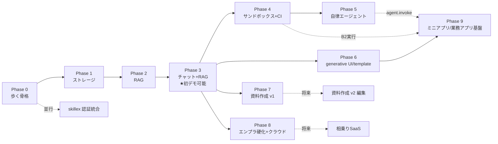

# shiki ROADMAP

> [要件定義書](./requirements.md) / [設計書](./design.md) に基づく実装順。
> 依存関係（認証→ストレージ→RAG→チャット→サンドボックス→…）に沿って縦スライスで進める。
> 期間見積は付さない。
>
> **フェーズ別の超細粒度タスク（イシュー粒度）は `docs/roadmap/` 配下:**
> [Phase 0](./roadmap/phase-0.md) ・ [Phase 1](./roadmap/phase-1.md) ・ [Phase 2](./roadmap/phase-2.md) ・
> [Phase 3](./roadmap/phase-3.md) ・ [Phase 4](./roadmap/phase-4.md) ・ [Phase 5](./roadmap/phase-5.md) ・
> [Phase 6](./roadmap/phase-6.md) ・ [Phase 7](./roadmap/phase-7.md) ・ [Phase 8](./roadmap/phase-8.md) ・
> [Phase 9](./roadmap/phase-9.md) ・ [並行/将来トラック](./roadmap/parallel-tracks.md)
>
> 各タスクは1つのGitHub Issueに対応（area:* ラベル）。

## フェーズ依存関係

---

## Phase 0 — 歩く骨格（Walking Skeleton）
**目的**: トレイト境界と配布形態を最初に通す。
- モノレポ／Rustワークスペース、axum、Postgres、Next.js。
- Keycloak（OIDCログイン）、OpenFGA（authz）配線、認証付きエンドポイント1本をE2E。
- OTel計装の土台、`docker compose` 一発起動。
- 認可コンテキスト（principal+org）の継ぎ目を最初から導入。
- **成果物**: ログインして認可された空のアプリが compose で起動する。

## Phase 1 — ストレージ
**依存**: Phase 0。
- StorageService（MinIO＋メタPostgres＋OpenFGA権限、単一チョークポイント）。
- Drive風UI（アップロード/閲覧/フォルダ・ファイル共有）、バージョニング、コンテンツアドレッシング。
- 書込イベント発行（後段RAGのトリガ）。
- **成果物**: 権限付きでファイル/フォルダを操作・共有できる。

## Phase 2 — RAG（インジェスト＋検索）
**依存**: Phase 1。
- `ingestion-worker`（Docling／日本語OCR）、ジョブキュー（初版 pgmq）。
- Qdrant＋Tantivy/Lindera、Ruri埋め込み、reranker。
- permission-aware 二段フィルタ（pre+post）、引用チャンクの監査記録。
- **成果物**: API で「権限を守った引用付き検索」が返る。
- **前倒しオプション**: 高品質パース（Docling）を後回しにして簡易パース＋権限フィルタ先行→ Phase 3 を前倒し。

## Phase 3 — チャット＋RAG ★最初のデモ可能な製品
**依存**: Phase 2。
- チャットドメイン（thread / content blocks / JSONB）。
- llm-gateway（vLLM＋外部API）、agent-core 制約版（doc_search ツール）。
- SSEストリーミング、引用表示、Langfuse、スレッド共有（ReBAC）。
- **成果物**: 権限を守ったRAGチャットが動く（第一の縦スライス完成）。

## Phase 4 — サンドボックス＋コードインタプリタ
**依存**: Phase 3。
- sandbox-orchestrator（Firecracker/gVisor、温機プール、egress遮断+allowlist、ツールRPC）。
- FUSEでStorageServiceをマウント。
- チャットの code_interpreter ツール（制約インスタンス）。
- **成果物**: チャットでコード実行できる／サンドボックス基盤が稼働。

## Phase 5 — 自律エージェント
**依存**: Phase 4。
- フルツールの agent-core をサンドボックス内でFUSEストレージ上に展開、長ホライズン。
- ①コード実行 ②ファイルCRUD ③任意コマンド。書込はイベント経由で自動再索引。
- **成果物**: Claude Code 級エージェントがストレージ上で自律動作。

## Phase 6 — generative UI ＋ prompt template ＋ ミニアプリ
**依存**: Phase 3。
- 宣言的コンポーネント・カタログ＋レンダラ。
- prompt template（知識スコープ／許可ツール／モデル既定）。
- ミニアプリ（template＋UIスペック＋許可ツール）をアーティファクト化、ReBAC共有。宣言的バックエンド束縛。
- **成果物**: 部署共有可能な社内ミニアプリが増殖し始める。

## Phase 7 — 資料作成 v1
**依存**: Phase 3（生成）／Phase 5（エージェント連携でより強力）。
- ライブラリ生成（xlsx=Rust、docx/pptx=Python worker）、ひな型穴埋め。
- **成果物**: パワポ/ワード/エクセルを生成しストレージ保存。

## Phase 8 — エンプラ硬化 ＆ クラウド対応
**依存**: Phase 3 以降随時。
- 監査ダッシュボード、アカウント/管理画面、監視整備。
- クラウド版トレイト差し替え（GCS/Cloud SQL/Vertex）、k8s化、受注用HWサイジング表。
- **成果物**: クラウド版（顧客ごと隔離）と本番運用可能なオンプレ。

## Phase 9 — ミニアプリ／業務アプリ基盤
**依存**: Phase 6（A=宣言的）。
- 二層モデル B（コードベース・ミニアプリ）＝out-of-trust 隔離実行（B1別オリジン+CSP／B2サンドボックス）。
- **公開APIゲートウェイ(BFF)** が唯一の入口・能力面再公開、ユーザー委譲OAuth2(PKCE)＋Keycloak再利用、**二重ゲート（スコープ ∩ ユーザーReBAC）**。
- **構造化データサービス**（record JSONB＋スキーマレジストリ＋行authz述語）＋**ワークフロー軽量FSM**。
- ミニアプリ内AI（llm.invoke／agent.invoke）、マニフェスト/レジストリ/同意インストール、SDK＋CLI。
- **成果物**: 構造化データ＋承認フロー＋AIを持つ業務アプリを、内部APIをセキュアに叩く形で実装・簡単デプロイできる。

---

## 並行 / 将来トラック

| トラック | タイミング | 備考 |
|----------|-----------|------|
| **skillex 認証統合** | Phase 0 の認証が安定したら**並行**（skillexは並行進行中） | 共有プール、DLC/LLM利用トークン発行を Phase 0 設計に織り込む |
| 資料作成 v2（ブラウザ内編集） | Phase 7 後 | OnlyOffice/Collabora 組込、自作は最終手段 |
| データプレーン完全相乗り（フルプール） | 需要が出たら | **SaaS（共有コントロールプレーン＋cell隔離データプレーン）は優先ターゲット**（design §4.1.1）。本項は cell 隔離をやめ全テナント共有プールへ寄せる更なる最適化＝tenant_id 行分離の全面適用 |
| ミニアプリ marketplace（第三者公開） | Phase 9 安定後 | 信頼ティアに審査付き第三者枠を追加 |
| 会話ブランチUI | 任意 | データ構造は Phase 3 で用意済み |

## マイルストーン要約

- **M1（Phase 0–1）**: 認証・権限・ストレージの土台。
- **M2（Phase 2–3）**: ★permission-aware RAG チャット = 最初の顧客価値・デモ可能。
- **M3（Phase 4–5）**: サンドボックス＆自律エージェント = 差別化の核。
- **M4（Phase 6–8）**: ミニアプリ増殖・資料作成・エンプラ硬化・クラウド対応 = 製品化。
- **M5（Phase 9）**: ★コードベース業務アプリ基盤（構造化データ＋ワークフロー＋セキュア内部API＋AI）。
