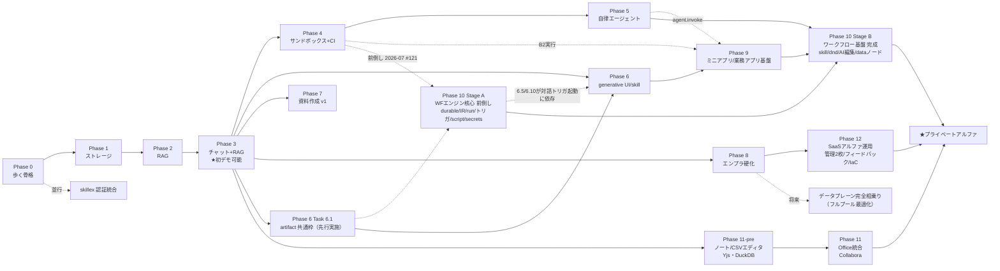

# shiki ROADMAP

> [要件定義書](./requirements.md) / [設計書](./design.md) に基づく実装順。
> 依存関係（認証→ストレージ→RAG→チャット→サンドボックス→…）に沿って縦スライスで進める。
> 期間見積は付さない。
>
> **フェーズ別の超細粒度タスク（イシュー粒度）は `docs/roadmap/` 配下:**
> [Phase 0](./roadmap/phase-0.md) ・ [Phase 1](./roadmap/phase-1.md) ・ [Phase 2](./roadmap/phase-2.md) ・
> [Phase 3](./roadmap/phase-3.md) ・ [Phase 4](./roadmap/phase-4.md) ・ [Phase 5](./roadmap/phase-5.md) ・
> [Phase 6](./roadmap/phase-6.md) ・ [Phase 7](./roadmap/phase-7.md) ・ [Phase 8](./roadmap/phase-8.md) ・
> [Phase 9](./roadmap/phase-9.md) ・ [Phase 10](./roadmap/phase-10.md) ・ [Phase 11-pre](./roadmap/phase-11-pre.md) ・
> [Phase 11](./roadmap/phase-11.md) ・ [Phase 12](./roadmap/phase-12.md) ・ [並行/将来トラック](./roadmap/parallel-tracks.md)
>
> 各タスクは1つのGitHub Issueに対応（area:* ラベル）。

## フェーズ依存関係

> **SaaS を優先ターゲットとする**（requirements §1.1）。**SaaS トポロジ（共有コントロールプレーン＋顧客ごと隔離 cell データプレーン・design §4.1.1）と `tenant_id` を Phase 0 の歩く骨格から前提**にし、クラウド向けトレイト実装（GCS/Cloud SQL/Vertex 等）は各フェーズで該当機能を作る都度に実装する（旧 Phase 8「クラウド対応」を解体し各フェーズへ溶かした）。オンプレ版は同一コードベースをトレイト差し替え＋デプロイ構成で吸収する従ターゲット。「データプレーン完全相乗り（フルプール）」だけが将来最適化として残る。

---

## Phase 0 — 歩く骨格（Walking Skeleton）
**目的**: トレイト境界・**SaaS トポロジ**・配布形態を最初に通す。
- モノレポ／Rustワークスペース、axum、Postgres、Next.js。
- Keycloak（OIDCログイン）、OpenFGA（authz）配線、認証付きエンドポイント1本をE2E。
- **認証は BFF + オパークセッション Cookie**（Redis セッションストア。Task 0.11/#55）。ブラウザにトークンを置かない。
- **SaaS トポロジを前提**: 共有コントロールプレーン（Keycloak/Org）＋顧客ごと隔離 cell データプレーン（design §4.1.1）。ローカル開発は compose、優先デプロイ先はクラウド（GCP）。
- OTel計装の土台、`docker compose` 一発起動。
- 認可コンテキスト（**principal + org + `tenant_id`**）を最初から導入（SaaS マルチテナントを day-1 前提・後付けで隔離境界を壊さない）。
- **成果物**: ログインして認可された空のアプリが起動する（SaaS トポロジで `tenant_id` スコープが通っている）。

## Phase 1 — ストレージ
**依存**: Phase 0。
- StorageService（MinIO＋メタPostgres＋OpenFGA権限、単一チョークポイント）。
- Drive風UI（アップロード/閲覧/フォルダ・ファイル共有）、バージョニング、コンテンツアドレッシング。
- 書込イベント発行（後段RAGのトリガ）。
- **成果物**: 権限付きでファイル/フォルダを操作・共有できる。

## Phase 2 — RAG（インジェスト＋検索）
**依存**: Phase 1。
- `ingestion-worker`（Docling／日本語OCR）、ジョブキュー（自作 `crates/jobq`・vanilla Postgres）。
- Qdrant＋Tantivy/Lindera、Ruri埋め込み、reranker。
- permission-aware 二段フィルタ（pre+post）、引用チャンクの監査記録。
- **成果物**: API で「権限を守った引用付き検索」が返る。
- **前倒しオプション**: 高品質パース（Docling）を後回しにして簡易パース＋権限フィルタ先行→ Phase 3 を前倒し。

## Phase 3 — チャット＋RAG ★最初のデモ可能な製品
**依存**: Phase 2。
- チャットドメイン（thread / content blocks / JSONB）。
- llm-gateway（vLLM＋外部API）、agent-core 制約版（doc_search ツール）。
- SSEストリーミング、引用表示、Langfuse、スレッド共有（ReBAC）。
- **成果物**: 権限を守ったRAGチャットが動く（第一の縦スライス完成）。

## Phase 4 — サンドボックス＋コードインタプリタ
**依存**: Phase 3。
- sandbox-orchestrator（Firecracker/gVisor、温機プール、egress遮断+allowlist、ツールRPC）。
- FUSEでStorageServiceをマウント。
- チャットの code_interpreter ツール（制約インスタンス）。
- **成果物**: チャットでコード実行できる／サンドボックス基盤が稼働。

## Phase 5 — 自律エージェント
**依存**: Phase 4。
- フルツールの agent-core をサンドボックス内でFUSEストレージ上に展開、長ホライズン。
- ①コード実行 ②ファイルCRUD ③任意コマンド。書込はイベント経由で自動再索引。
- **成果物**: Claude Code 級エージェントがストレージ上で自律動作。

## Phase 6 — generative UI ＋ skill ＋ ミニアプリ
**依存**: Phase 3 ＋ **Phase 10 Stage A（前倒し・#121。workflow-engine・script-runtime・secrets・artifact共通基盤）**。
6.5（宣言的バックエンド束縛）・6.10（ミニアプリ実行）が workflow-engine の対話トリガ起動へ直接依存するため、
Stage A 完了前に本フェーズへ着手する場合はこの2タスクを後回しにする。
- 宣言的コンポーネント・カタログ＋レンダラ。
- skill（旧 prompt template を統合: SKILL.md相当の指示文＋知識スコープ／許可ツール／モデル既定／few-shot＋
  任意script。shiki script(`.shiki`)/shell script(`.sh`)のどちらも可）。
- ミニアプリ（skill＋UIスペック＋ワークフロー）をアーティファクト化、ReBAC共有。宣言的バックエンド束縛は
  workflow-engine 対話トリガ起動も含む。**テーブル（構造化データ）を含む完全な定義は Phase 9 合流後、
  [miniapp-platform.md §6](./miniapp-platform.md) が正本**。
- **成果物**: ロール共有可能な社内ミニアプリが増殖し始める。

## Phase 7 — 資料作成 v1
**依存**: Phase 3（生成）／Phase 5（エージェント連携でより強力）。
- ライブラリ生成（xlsx=Rust、docx/pptx=Python worker）、ひな型穴埋め。
- **成果物**: パワポ/ワード/エクセルを生成しストレージ保存。

## Phase 8 — エンプラ硬化
**依存**: Phase 3 以降随時。
- 監査ダッシュボード、アカウント/管理画面、監視整備。
- **オンプレ版の硬化**: 同一コードベースのトレイト差し替え（MinIO/vLLM 等）＋ k8s 化、受注用 HW サイジング表、エアギャップ縮退（PIT-29）の検証。
  ※ **クラウド向けトレイト実装（GCS/Cloud SQL/Vertex）は本フェーズに集約せず、各フェーズで該当機能を作る都度に実装する**（SaaS が優先ターゲットのため）。
- **成果物**: SaaS（顧客ごと隔離 cell）が本番運用可能で、オンプレ版も同一成果物として運用可能。

## Phase 9 — ミニアプリ／業務アプリ基盤
**依存**: Phase 6（A=宣言的）。
- 二層モデル B（コードベース・ミニアプリ）＝out-of-trust 隔離実行（B1別オリジン+CSP／B2サンドボックス）。
- **公開APIゲートウェイ(BFF)** が唯一の入口・能力面再公開、ユーザー委譲OAuth2(PKCE)＋Keycloak再利用、**二重ゲート（スコープ ∩ ユーザーReBAC）**。
- **構造化データサービス**（record JSONB＋スキーマレジストリ＋行authz述語）＋**FSMガード**（Task 9.10 改訂:
  旧「軽量FSMエンジン」→ data の宣言的ガードに縮退。副作用は Phase 10 の workflow-engine へ委譲）。
- ミニアプリ内AI（llm.invoke／agent.invoke）、マニフェスト/レジストリ/同意インストール、SDK＋CLI。
- **成果物**: 構造化データ＋承認フロー＋AIを持つ業務アプリを、内部APIをセキュアに叩く形で実装・簡単デプロイできる。

## Phase 10 — ワークフロー基盤（engine・shiki script・skill・secrets）
**依存**: Stage B は Phase 9（data/ゲートウェイ/レジストリ）・Phase 5（agent.invoke フルツール）。詳細: [phase-10.md](./roadmap/phase-10.md)

> 📌 **部分前倒し（2026-07-07 決定・#121）**: 詳細設計（[docs/workflow/](./workflow/README.md)・#119）完了を受け、
> **Stage A（エンジン核心: 10.0 durable 切り出し・IR/検証・run/step・トリガ・委譲コア・制御/能力ノード・
> script-runtime・script→workflow.start・secrets・http.request）を Phase 5〜9 と並走で前倒し着手**する。
> 前提は **6.1（artifact 共通枠）の先行実施＋outbox の per-consumer fan-out 化（P10-A0）**。
> skill・dnd/AI 編集・実行履歴 UI・data 系ノードは Stage B（Phase 6/9 合流後）。
> Stage 分割・実行順・DoD は [phase-10.md](./roadmap/phase-10.md) 冒頭の節が正。
- **workflow-engine**（自作 Durable Execution・IR=JSON DAG・トリガ/リトライ/fan-out/concurrency/rate limit/実行履歴）。
- 実行主体モデル（対話=本人∩スコープ／スケジュール・イベント=専用プリンシパル＋明示委譲・fail-closed 停止）。
- **script-runtime**（swc＋wasmtime/QuickJS）・**skill＆スキルストア**・**シークレット管理**（宛先束縛・KeyProvider）。
- dnd エディタ＋AI 編集（IR 生成）＋実行履歴 UI。
- **成果物**: スケジュール/イベント/対話トリガの業務自動化が、権限委譲・監査・リトライ付きで動く（正本: [miniapp-platform.md](./miniapp-platform.md)）。

## Phase 11-pre — ノート（md）／CSV エディタ
**依存**: Phase 3（チャット・AI 編集ツール）・Phase 1（ストレージ）。埋め込み/ツール公開は Phase 6/9/10 の成果を再利用。詳細: [phase-11-pre.md](./roadmap/phase-11-pre.md)
- **ノート**: Yjs/yrs 共同編集基盤＋ TipTap WYSIWYG（真実=Yjs・md=シリアライズ・スラッシュコマンド・
  frontmatter メタデータ・AI は共同編集参加者=直接適用既定）。ノートページ×チャット分割ビュー（note_ref カード）。
  埋め込みは検証済みシキコンポーネント／別オリジン iframe／ドライブ参照のみ（生 HTML/JSX は実行しない）。
- **CSV**: ファイルが真実（ファイル単位 ReBAC）。`crates/tabular` クエリサービス（隔離 DuckDB・RO SQL・
  ページング=無限スクロール）＋グリッドエディタ（パッチ編集・楽観ロック）。csv.query/patch/write を
  エージェントとワークフローに公開。BI・JSX サンドボックス実行・Notion 型プロパティ DB は将来イシュー。
- **成果物**: ノートの共同編集＋AI 編集、CSV のグリッド編集＋SQL 分析が動き、チャット/ワークフローから同じ能力を使える。

## Phase 11 — Office 統合（Collabora）
**依存**: Phase 11-pre（時系列）・Phase 1（ストレージ）・Phase 2（RAG 還流）。詳細: [phase-11.md](./roadmap/phase-11.md)
- **Collabora Online 統合**（OfficeSuite トレイト・WOPI ホスト=StorageService クライアント・共同編集は内蔵委任・
  AI は非セッション時ファイルレベル編集）。
- スプレッドシート×shiki script（カスタム関数/マクロ・Phase 10 の script-runtime 再利用）。
- **成果物**: Office 文書の共同編集＋AI 編集が動き、保存が StorageService→RAG に還流する。

## Phase 12 — SaaS アルファ運用（管理・フィードバック・IaC・消去/DR）
**依存**: Phase 8（エンプラ硬化）・SAAS.3/4（課金・クォータ）。詳細: [phase-12.md](./roadmap/phase-12.md)
- 顧客管理者ダッシュボード完成（モデルカタログ/予算・同意/委譲棚卸し・監査エクスポート・Stripe ポータル）。
- **ベンダーコンソール**（テナントライフサイクル・機能フラグ・集約使用量/SLO・break-glass）。
- フィードバック（二段同意）・ヘルプ（`help/`→UI＋shiki-help RAG スコープ）。
- IaC（OpenTofu・cell プロビジョニング自動化）・テナント消去機構・バックアップ/DR（整合スナップショット）・API レート制限。
- **成果物**: プライベートアルファを顧客に配れる運用体制（契約→プロビジョニング→サポート→解約消去が回る）。

---

> **プライベートアルファ = Phase 0〜12 ＋ SAAS.1〜4 の完成形**（requirements §1.1 のリリース定義）。

---

## 並行 / 将来トラック

| トラック | タイミング | 備考 |
|----------|-----------|------|
| **Phase 10 Stage A（WF エンジン核心 前倒し）** | **完了（2026-07-10・#203〜）**。dnd/AI 編集/実行履歴 UI も完了し、残りは Phase 9 依存分（skill/data 系）のみ | 6.1 先行＋既存基盤のみで Phase 5〜9 と並走。Stage 分割は [phase-10.md](./roadmap/phase-10.md) |
| **skillex 認証統合** | Phase 0 の認証が安定したら**並行**（skillexは並行進行中） | 共有プール、DLC/LLM利用トークン発行を Phase 0 設計に織り込む |
| ~~資料作成 v2（ブラウザ内編集）~~ | **Phase 11 に昇格**（2026-07） | V2 トラックは Phase 11（Collabora）へ統合 |
| データプレーン完全相乗り（フルプール） | 需要が出たら | **SaaS（共有コントロールプレーン＋cell隔離データプレーン）は優先ターゲット**（design §4.1.1）。本項は cell 隔離をやめ全テナント共有プールへ寄せる更なる最適化＝tenant_id 行分離の全面適用 |
| ミニアプリ marketplace（第三者公開） | Phase 9 安定後 | 信頼ティアに審査付き第三者枠を追加 |
| 会話ブランチUI | 任意 | データ構造は Phase 3 で用意済み |

## マイルストーン要約

- **M1（Phase 0–1）**: 認証・権限・ストレージの土台。
- **M2（Phase 2–3）**: ★permission-aware RAG チャット = 最初の顧客価値・デモ可能。
- **M3（Phase 4–5）**: サンドボックス＆自律エージェント = 差別化の核。
- **M4（Phase 6–8）**: ミニアプリ増殖・資料作成・エンプラ硬化 = 製品化（クラウド/SaaS は Phase 0 から前提・各フェーズで実装）。
- **M5（Phase 9）**: ★コードベース業務アプリ基盤（構造化データ＋ワークフロー＋セキュア内部API＋AI）。
- **M6（Phase 10–11）**: ★ワークフロー基盤（n8n 相当）＋エディタ（ノート/CSV=11-pre）＋Office 統合 = 業務自動化と文書作成の完成形
  （エンジン核心 Stage A は 2026-07 前倒しで M3 以降と並走・#121）。
- **M7（Phase 12）**: ★★プライベートアルファ・リリース（運用体制込み）。
