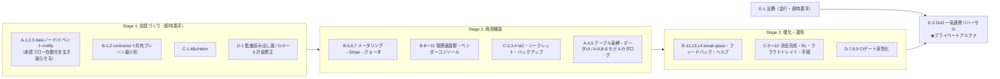

# SaaS プライベートアルファ・リリース計画（実装突合版）

> 作成: 2026-08-10。**ドキュメントのチェックボックスではなくコードの実在**（ファイル・配線・テスト・CI）で
> 全フェーズを突合した結果に基づく残タスク一覧と実行計画。
> リリース定義: **プライベートアルファ = Phase 0〜12 ＋ SAAS.1〜4 の完成形**（requirements §1.1・roadmap.md）。
>
> 突合で判明した最重要事実:
> 1. **機能面（Phase 0〜6, 9〜11）はほぼ完成**している。フェーズ文書の未チェックは大半が「実装済みなのに未更新」。
> 2. **商用・運用面（Phase 8/12・SAAS.3/4・SK.1〜7）がほぼ丸ごと未着手**で、しかも **GitHub Issue が 1 件も
>    起票されていない**（open 54 件は Phase 13・エージェント改善・バグのみ）。リリースまでの残作業は
>    実質ここに集中している。
> 3. **Phase 7（資料作成 v1）は実装ゼロ**。Collabora 一本化（#381）で新規作成・編集は代替されたが、
>    FR-8 の「ライブラリ直接生成・ひな型穴埋め」の要件は生きたまま宙に浮いており、スコープ判断が必要。

---

## 1. 現在地（フェーズ別実装状況）

| フェーズ | 実態 | 残り（要点） |
|---------|------|-------------|
| Phase 0 歩く骨格 | ✅ 完了 | なし（文書のチェック未更新のみ） |
| Phase 1 ストレージ | ✅ ほぼ完了 | 監査ログの**読み出し経路ゼロ**（1.9→実質 8.1/8.2 送り）・共有の個別例外 but-not（defer 済み） |
| Phase 2 RAG | ✅ 完了 | なし（唯一文書と実態が一致） |
| Phase 3 チャット | ✅ ほぼ完了 | **モデル選択・思考強度のユーザー露出が無い**（API/UI とも。12.1 と同根） |
| Phase 4 サンドボックス | ✅ ほぼ完了 | orchestrator の **OTel 計装ゼロ**・**egress 監査が audit_log に載らない**・テナント別上限/認証なし・FC 未検証（ポストアルファ扱い可） |
| Phase 5 自律エージェント | ✅ ほぼ完了 | **Langfuse が run 内全 LLM 呼び出しを 1 generation に潰すバグ**（generation id 固定）・shell のパイプ非対応 |
| Phase 6 genUI/skill | ✅ ほぼ完了 | 宣言的ミニアプリの**テーブル束縛が無い**（6.10 の Phase 9 合流分が未消化）・6.9 は #344 で仕様変更済みだが文書未更新 |
| Phase 7 資料作成 v1 | ❌ **実装ゼロ** | rust_xlsxwriter/pptx 生成/ひな型穴埋め/テンプレ管理/サーバ PDF 変換すべて無し。**スコープ判断が必要**（§4） |
| Phase 8 エンプラ硬化 | ❌ ほぼ未着手 | 8.1 部分・8.5 部分・8.9 アプリ層のみ。**8.2〜8.4, 8.6〜8.8, 8.10〜8.13 未実装** |
| Phase 9 ミニアプリ基盤 | ✅ ほぼ完了 | notify.send の**配信面（通知 UI）無し**・ゲートウェイの (ユーザー×アプリ) レート制限無し・SDK が手書き型（codegen 未接続） |
| Phase 10 ワークフロー | ✅ Stage A＋UI 完了 | **Stage B 残: data 系ノード（10.6b）・data イベント source（10.3）・Shiki.data.\*（10.7）**・skill 宣言スコープ・.sh 実行・委譲棚卸しジョブ未配線 |
| Phase 11-pre ノート/CSV | ✅ 完了 | なし |
| Phase 11 スライド/Office | ✅ ほぼ完了 | **Collabora ビルド manifest が .gitignore に食われ未コミット**（自前ビルド再現不能）・スライド/Office e2e が CI 常時 skip・変換可能性 lint 警告 |
| Phase 12 SaaS アルファ運用 | ❌ ほぼ未着手 | 12.1/12.3/12.9/12.12 部分。**12.2, 12.4〜12.8, 12.10, 12.11 未実装** |
| SAAS.1/2/5 | ✅ 完了（#84/#87/#89） | SAAS.5 は実データ保有テナントの cell→pool 移行が fail-closed 拒否（運用ギャップ・アルファ許容） |
| SAAS.3 課金メータリング | ❌ 部分 | LLM 会計は正確に蓄積済み。**テナント集計 API・期間明細・Stripe 連携がゼロ**（Stripe はリポジトリに 1 行も無い） |
| SAAS.4 プラン/クォータ | ❌ 未実装 | tenant テーブルに plan 列すら無い |
| SK.1〜7 共有プレーン | ❌ ほぼ未着手 | SK.1/2 は dev fixture のみ。**`contracts/` ディレクトリ自体が不在**。Org/Membership モデル無し。`aud=shiki-llm` を検証する受け口も無し |

---

## 2. 残タスク一覧（ワークストリーム別）

依存関係上の 2 大ボトルネックは **WS-B の共有コントロールプレーン最小形（SK.3/SK.6）** と
**WS-C の k8s/Helm（8.8）** 。この 2 つが Phase 12 の大半をブロックするため最優先で着手する。

### WS-A: 機能の輪を閉じる（Phase 6/9/10 残件）— 承認フロー自動化が現状「死んでいる」

| # | タスク | 対応 ID | 依存 | 備考 |
|---|-------|--------|------|------|
| A-1 | data 系ノード実装（data.query / record.create / record.update / transition。scope 昇格・params 型・実行・config-panel） | 10.6b | – | vocab は予約済み。`nodes/exec.rs` が `unsupported_stage_a` |
| A-2 | data イベント source（relay が data 由来イベントを**配送済みにして捨てている**分岐の解消） | 10.3 Stage B | A-1 | **9.10 FSM 遷移 outbox の消費者が現状ゼロ**＝承認フローの副作用が発火しない |
| A-3 | notify.send の完成: WF ノード＋web 通知一覧/既読 UI＋「マイタスク」導線 | 10.6b / 9.8 / 9.10 | A-2 | 現状は台帳記録のみで出口が無い |
| A-4 | 宣言的ミニアプリ（A 層）へのテーブル束縛（`MiniAppBody` にテーブル・data 用アクション束縛） | 6.10 | A-1 | miniapp-platform.md §6 の kintone モデルが B 層でしか成立していない |
| A-5 | 構造化データの第一級 UI（テーブル定義・レコード一覧・保存ビュー・FSM 定義） | 9.4/9.10 派生 | – | 現状 API のみ・ナビに存在しない |
| A-6 | workflow script ノードの `Shiki.data.*` / `Shiki.notify.send` arms 追加 | 10.7 Stage B | A-1 | `ALLOWED_APIS` 側は開いている |
| A-7 | 委譲棚卸しジョブをリーダー tick へ配線（`DelegationStore::inventory()` 呼び出し元がテストのみ） | 10.4a | – | PIT-34 二段目が本番で走っていない |
| A-8 | skill 宣言スコープ（`SkillBody.allowed_scopes`）＋ `.sh` 実行経路（または UI/スキーマから一時撤去） | 10.11 | – | 保存できて実行できない状態の解消 |
| A-9 | モデル選択・思考強度の露出（`GET /models`・`PostMessageRequest` に model/effort・composer セレクタ・許可外 fail-closed） | 12.1 前半 | – | `ModelCatalog`/`Effort` 型は実装済み。配線のみ |

### WS-B: SaaS 商用基盤（課金・管理・共有コントロールプレーン）— 最大の未着手領域

| # | タスク | 対応 ID | 依存 | 備考 |
|---|-------|--------|------|------|
| B-1 | `contracts/` 新設＋共有 realm 契約の正本化（realm export からの切り出し・図入り design 反映） | SK.1 | – | skillex をブロックしない事が最優先 |
| B-2 | 共有コントロールプレーン最小形: Org/Membership/サービスアクセス権モデル＋API＋招待フロー | SK.3, SK.6 | B-1 | **12.4/12.6 の依存元**。データモデルがどこにも無い |
| B-3 | 統一アカウント管理画面（統一シェル＋設定ページ合成。#69 が足がかり） | SK.6 | B-2 | オンプレは単独動作 |
| B-4 | skillex トークン受け口（`aud=shiki-llm` 検証エンドポイント）＋token exchange＋監査/失効 | SK.2, SK.5 | B-1 | 現状 audience は `shiki-api` 1 つのみ許可で構造的に未達 |
| B-5 | 課金・使用量メータリング完成: テナント単位集計 API・期間明細・ストレージ/ユーザー数/実行時間の計測追加 | SAAS.3 | – | llm_usage は蓄積済み・集計面がゼロ |
| B-6 | Stripe 連携（プラン/サブスク・カスタマーポータル・請求書。Org 単位 1 請求・サービス別内訳） | SAAS.3, SK.7 | B-2, B-5 | リポジトリに Stripe コード皆無＝ゼロから |
| B-7 | プラン制限・クォータ enforcement（plan 定義・ユーザー数/ストレージ/レート上限・機能フラグ・到達通知） | SAAS.4 | B-5 | tenant テーブル拡張から |
| B-8 | モデルカタログのテナント化（静的 TOML→DB＋管理 API/UI・国外処理バッジ・org/ユーザー別予算） | 12.1 | A-9, B-7 | |
| B-9 | 顧客管理者ダッシュボード（使用量・監査エクスポート・組織ポリシー・Stripe ポータル） | 12.2 | B-5, D-1 | |
| B-10 | 同意・委譲の管理者棚卸し UI（組織横断一覧・失効・再同意導線） | 12.3 | A-7 | 現状オーナー自身の 1 WF 単位のみ |
| B-11 | ベンダーコンソール（テナントライフサイクル・プラン・機能フラグ・集約使用量/SLO。顧客本文到達不能をテスト担保） | 12.4 | B-2 | `/admin/tenants` API の種はあり |
| B-12 | break-glass サポートアクセス（顧客許可・時限・バナー・全操作監査。サイレント経路なしをテスト担保） | 12.5 | B-11 | コードに一切無し |
| B-13 | フィードバック機構（二段同意・組織ポリシーゲート・trace_id 突合・feedback ストア） | 12.6 | B-2 | |
| B-14 | ヘルプ基盤（`help/` 新設→ヘルプ UI＋shiki-help RAG 公開コーパス。テナントデータと別インデックス） | 12.7 | – | `help/` ディレクトリ自体が無い |
| B-15 | アカウント/ロール管理 UI＋管理 API（Keycloak↔OpenFGA 整合の単一経路・委任管理。IdP diff 同期との共存設計込み） | 8.3, 8.4 | – | 現状 role はログイン時 diff 同期のみで管理画面から書けない |

### WS-C: インフラ・デプロイ・データ保護 — deploy/ が compose のみ

| # | タスク | 対応 ID | 依存 | 備考 |
|---|-------|--------|------|------|
| C-1 | k8s マニフェスト/Helm チャート（特権 orchestrator のノード隔離・GPU 配置・PodSecurity 設計込み） | 8.8 | – | **C 系のボトルネック**。orchestrator は seccomp=unconfined 要求 |
| C-2 | IaC: OpenTofu 化＋cell プロビジョニング自動化（コンソール→CI→apply→realm/DNS/初期管理者。冪等・dry-run） | 12.8, 8.9 | C-1, B-11 | design.md 自身が「リリースブロッカー扱い」と明記 |
| C-3 | 本番シークレット管理（External Secrets / Secret Manager 注入・本番 Keycloak realm の IaC 構築・ローテーション手順） | 8.10 | C-1 | dev fixture は README が本番使用を禁止 |
| C-4 | バックアップ/DR: Postgres/blob/Qdrant/FGA の**整合スナップショット**（PIT-38）・テナント単位復元・RPO/RTO 宣言・復元リハーサル | 8.11, 12.10 | C-1 | スクリプトが 1 本も無い。**顧客データを預かる前提条件** |
| C-5 | テナント消去の完成（Langfuse 消去経路・消滅証明の出力・痕跡ゼロ検証ジョブ・バックアップ期限消滅） | 12.9 | C-4 | purge_tenant 本体は #420 で全テーブル対応済み |
| C-6 | API レート制限（workflow-engine のトークンバケットを API 面へ。**429＋Retry-After**。`crates/api/src/error.rs` の RateLimited→503 を 429 へ修正）＋ゲートウェイ (ユーザー×アプリ) クォータ | 12.11, 9.6 | – | app-gateway と HTTP ステータス不整合あり |
| C-7 | クラウドトレイト実装（GCS ObjectStore は現状 `bail!`。Cloud SQL 接続・必要なら Vertex）＋アプリ本体不変 CI ゲート | 8.6, 8.7 | 要決断 D3 | GCP デプロイの前提 |
| C-8 | アップグレード手順（expand/contract マイグレーション方針・ローリング更新・ロールバック・互換マトリクス） | 8.12 | C-1 | migration 既に 61 本・方針明文化が急務 |
| C-9 | Collabora ビルド manifest のコミット（`.gitignore` に `!deploy/docker/collabora/office-manifest.env` 追加）＋本番 Office トポロジ | 11.5 | C-1 | **office-image.yml が現状必ず失敗**＝MPLv2 自前ビルド再現不能 |
| C-10 | sandbox のマルチテナント防御（テナント別同時起動上限・orchestrator gRPC 認証/mTLS） | 4.2 派生 | C-1 | compose は 127.0.0.1 バインドで隠れているだけ |
| C-11 | HW サイジング表（受注用。小/中/大リファレンス構成） | 8.13 | – | オンプレ営業資料。アルファ後でも可（要判断） |

### WS-D: 可観測性・監査・品質ゲート — 「権限を守った」ことを証明できる状態にする

| # | タスク | 対応 ID | 依存 | 備考 |
|---|-------|--------|------|------|
| D-1 | 監査ログの読み出し面: 検索 API＋インデックス（tenant_id 先頭の複合・引用 chunk 逆引き）＋ダッシュボード＋CSV/JSONL エクスポート＋監査閲覧ロール | 8.1, 8.2 | – | 記録・ハッシュチェーンは有るが**読む手段が皆無**。DPA/APPI の裏付けに必須 |
| D-2 | ハッシュチェーンの範囲決定と検証 CLI/ジョブ（現状「改竄耐性は主張しない」＋読取/deny 未連結。要件側を直すか設計を変えるか） | 8.1 | 要決断 D4 | |
| D-3 | Langfuse の run 単位トレース修正（generation id `{trace_id}-gen` 固定→ステップ毎ユニーク化・ツール span 化） | 5.9 | – | 多段 run が 1 generation に潰れている |
| D-4 | sandbox-orchestrator の OTel 計装＋trace context 伝播（gRPC metadata） | 4.2 | – | 現状 tracing fmt のみ |
| D-5 | egress 許可/遮断イベントの audit_log 記録 | 4.6 | – | 現状 debug ログのみ。「持ち出し防止」を証跡で示せない |
| D-6 | 監視の実質化: Grafana ダッシュボード＋アラートを deploy/ にコード化。メトリクス拡張（LLM トークン/コスト・sandbox 使用率・インジェスト遅延・authz QPS・jobq 滞留） | 8.5 | – | 現状メトリクスは HTTP 2 本のみ・アラートゼロ |
| D-7 | CI の実質化: editor-sandbox バンドルを CI イメージへ同梱（スライド e2e が常時 skip）・Collabora nightly（OFFICE_E2E）・agent-tools e2e（sandbox 起動）・gVisor IT の required 化・ts-rs ドリフト検査（#422） | 11.x/4.x | – | リリース判定の裏取りが現状取れていない |
| D-8 | validate.rs の proptest/fuzz（PIT-23 の CI 化。宣言のみで未使用） | 4.7 | – | |
| D-9 | ゲートウェイ API を utoipa ApiDoc へ載せ SDK を codegen 化（9.14「手書き型なし」受け入れ条件） | 9.14 | – | 手書きミラーのドリフトリスク |

### WS-E: 法務・リリース準備

| # | タスク | 対応 ID | 依存 | 備考 |
|---|-------|--------|------|------|
| E-1 | 法務ブロッカー 6 項目の推進（電気通信事業法届出要否・利用規約・プラポリ・AI 免責・LLM プロバイダ DPA・特商法表記。docs/legal/launch-compliance.md §6） | 12.12 | 弁護士 | エンジニアリングと並行可・リードタイム長 |
| E-2 | 法令チェックリストの担当/状態列追加＋エンジニアリング対応突合表（消去 SLA・レジデンシ・監査エクスポート⇔実装の証拠） | 12.12 | C-5, D-1 | 突合先の実装が先 |
| E-3 | アルファ DoD の一気通貫リハーサル: 「契約→cell プロビジョニング→管理者設定→利用→フィードバック→解約消去証明」（Phase 12 DoD） | 12 全体 | 全 WS | 最終ゲート |

---

## 3. 実行計画

フェーズ依存ではなく**並行 4 トラック**で進める（人が分かれる前提。1 人なら Stage 順に直列）。

- **Stage 1（直ちに）**: ボトルネック解消と「死んでいる輪」の復旧。A-1〜3（FSM outbox の消費者ゼロ問題）、
  B-1/B-2（12.4/12.6 の依存元）、C-1（C 系全部の依存元）、D-1（監査の読み出し面）＋計装バグ修正（D-3〜5）。
  E-1（法務）はリードタイムが長いため**今日から**並行着手。
- **Stage 2**: 商用機能の本体。課金は B-5（集計）→B-6（Stripe）→B-7（クォータ）の直列。管理画面群（B-9〜11）は
  B-2 の上に載せる。インフラは C-2（IaC）→C-3/C-4。
- **Stage 3**: 硬化。break-glass・フィードバック・ヘルプ、テナント消去完成、レート制限、CI 実質化。
- **最終ゲート**: E-3 の一気通貫リハーサル（Phase 12 DoD）＋E-2 の突合表完成。

### 起票について

Phase 8/12・SAAS.3/4・SK は **Issue が 1 件も存在しない**。dev-workflow の「1 タスク = 1 Issue」に載せるため、
本計画の WS 表（A-1〜E-3）を単位に起票し、`area:*` ラベル＋依存を Issue 本文へ写す。既存 open issue との
重複は #69（B-3 の足がかり）・#360（A-8 そのもの）・#361（C-6 の一部）・#186（B-14 関連）・#422（D-7 の一部）。
**既存 open issue のうちリリースゲートに含めるべきものは §7 を正とする**。

---

## 4. 要決断事項（human 判断待ち）

実装前に決めないと手戻りになるもの。**いずれも本計画では未決として扱い、担当 Issue の先頭で決める**。

| # | 論点 | 選択肢と含意 |
|---|------|-------------|
| D1 | **Phase 7（資料作成 v1）の扱い**。リリース定義は「FR-1〜17 全実装」だが FR-8 のライブラリ生成（xlsx/pptx プログラム生成・ひな型穴埋め・テンプレ管理・サーバ PDF 変換）は実装ゼロ。Collabora＋スライド砂箱エクスポート＋save_* ツールで代替済みの部分も多い | (a) 要件から正式に落とし FR-8/design §4.8/roadmap を改訂（推奨: 現行の代替経路で顧客価値は概ね出る）／(b) ひな型穴埋め＋サーバ PDF 変換だけ最小実装／(c) フル実装。**(a) でも「リリース定義=FR 全実装」の文言修正が必要** |
| D2 | **アルファのデプロイ形態**。cell=GKE(k8s) 前提で C-1→C-2 を組むか、初期数テナントは compose+VM で凌ぎ k8s を後追いにするか | 後者なら C-1 の優先度が下がり C-2 は VM ベース IaC になる。ただし 8.8 を DoD から外す判断の明文化が要る |
| D3 | **オブジェクトストレージ**: GCS 実装（8.6）か、GCP 上で MinIO 自前運用継続か。同様に **Vertex AI の要否**（現状 OpenAI 互換＋Anthropic で運用可能） | GCS 実装が正道だが、MinIO 継続ならば C-7 の大半を後送りできる |
| D4 | **監査ハッシュチェーンの主張範囲**。実装は「改竄耐性は主張しない」＋読取/deny/引用は未連結。8.1 受け入れ条件（append-only 改竄検知）と衝突 | (a) 要件を実態に合わせて下げ、DPA 表現も合わせる／(b) チェーン対象を拡大し検証ジョブ実装。顧客向け表明に直結するため法務（E-1）と同時に決める |
| D5 | **モデルカタログの管理主体**（12.1）。静的 TOML のままアルファに出すか、テナント DB 化まで踏むか | B-8 の規模が変わる。少数テナントのアルファなら TOML＋ベンダー運用で開始し、DB 化を追う手もある |
| D6 | **skillex 統合のアルファ必須範囲**。SK.4〜7 をアルファゲートに含めるか（shiki 単体アルファなら SK.1〜3＋B-4 の受け口までで足りる） | 含めない場合、リリース定義の注記が必要 |

---

## 5. ドキュメント陳腐化の修正（実装より先に直すと判断ミスを防げる）

- `CLAUDE.md`: 「gVisor 既定の反転は rootfs 前提工事待ち」→ **反転済み（#346）**。
- `docs/roadmap/phase-4.md` の同趣旨注記、`phase-5.md` の「既知の未実装」①③（#351・deep-research e2e で解消済み）。
- `docs/design.md`: `sandbox-wasm/` クレートは存在しない（実体は orchestrator 内 backend＋vendor/secure-exec）。
  §4.8「生成（旧 v1）」は D1 の決定に合わせ改訂。
- `docs/roadmap.md` Phase 4/5 概要の「FUSE でマウント」→ Durable Workspace（seed→exec→sync-back）へ読み替え。
- `docs/roadmap/phase-0.md`〜`phase-11.md` のチェックボックスを実態へ更新（Phase 2 以外ほぼ全滅）。
  `phase-0.md` に Task 0.11 の節欠落、`phase-3.md` に Task 3.11 の定義欠落。
- `docs/roadmap/phase-6.md` Task 6.9: #344 の仕様変更（allowed_tools=誘導テキスト化）を反映。
- `docs/roadmap/phase-10.md` 冒頭の未了注記: 真の未了は 10.6b・10.3 data source・10.7 Stage B・10.4b 棚卸し画面のみ。
- `docs/sandbox/bench.md` の web_fetch/Pyodide 記述（#348 で無効）。

---

## 6. スコープ外の再確認（アルファに含めない・既定通り）

Firecracker 実 boot／gVisor・FC ティアの温機プール／FUSE 本実装／marketplace 信頼ティア／
ワークフロー code view／会話ブランチ UI（BR.x）／Phase 13（HTML ページ/サイト公開）／
スプレッドシート×script（11.9）／ISMS・SOC2 取得／データプレーン完全相乗りの移行実装拡充（SAAS.5 残ギャップ）。

---

## 7. 既存 Open Issue（54 件）のトリアージ — リリースゲートに含めるもの

未起票の残作業（§2）とは別に、**既に起票済みの issue のうちアルファ前に潰すべきもの**を確定する。
2026-08-10 時点の open 54 件を全件精査した結果。

### 7.1 リリース必須 — セキュリティ・権限境界（WS-D 相当に編入）

| Issue | 内容 | 理由 |
|-------|------|------|
| **#78** | Next.js を CVE-2025-66478 修正版へ | **現在も `15.1.3` のまま**（web/package.json で確認）。フロント全面の既知 CVE を抱えたまま顧客に配れない。あわせて Dependabot 指摘（default ブランチに critical 4 件を含む 91 件）の棚卸しを 1 タスク化する |
| **#95** | deny.toml の RUSTSEC ignore 解消 | 上記棚卸しと同一タスクで扱う（aws-sdk-s3 上流待ちの経過確認込み） |
| **#395** | org 離脱後も `viewer_via_link` タプルが残る（PIT-53） | 権限境界の残留穴。permission-aware を看板にする以上、失権時回収はアルファ前に必要 |
| **#340** | 共有リンク一般アクセスのハードニング（並行更新直列化・フォルダ解錠・読取ゲート全面失効） | #338/#342 で入れた一般アクセス面の既知の穴。共有リンクはアルファで顧客が最初に踏む面 |
| **#327** | 下書き localStorage のユーザー/テナント名前空間化＋ログアウト時破棄 | 共用 PC で他ユーザー/他テナントの下書きが見える=SaaS ではデータ漏えい扱い |
| **#326** | 編集系ツールの Forbidden/NotFound 統一（存在秘匿） | 存在オラクル。二段 authz の原則（スコープ外リソースの存在を漏らさない）の徹底 |
| **#168** | submit_approval の tool_name をサーバ由来へ | 承認監査の完全性。クライアント供給値が監査に載る状態は D-1（監査面）と矛盾 |

### 7.2 リリース必須 — コア機能の信頼性バグ（WS-A 相当に編入）

| Issue | 内容 | 理由 |
|-------|------|------|
| **#364** | 承認待ちが jobq 可視性タイムアウト(3分)超→クラッシュで run 再開されない | 承認ゲートは既定モード。放置すると「止まったまま戻らない run」を顧客が踏む |
| **#404** | サブエージェントが毎回トークン予算で止まる（per-step 累積バグ） | deep research（差別化機能）が実質使えない |
| **#417** | outbox 消費経路の一本化（rag.enabled=false でも GC が進む・ADR F2） | #413 の残件。構成次第で outbox が無限成長する運用地雷 |
| **#383** | 作成系ツールへ安定した冪等キー（resume 時の成果物重複） | #351 の resume 配線で顕在化する重複。データを汚す種類のバグ |
| **#359** | 委譲ワークフロー run へ skill artifact の読取権限を委譲 | スケジュール/イベント実行 × skill ノードの組が壊れる。A-2（トリガ復旧）とセットで |
| **#360** | skill-script のスコープ宣言（SkillBody 拡張）＋ ceiling 交差 | **= 本計画 A-8**（既起票だった。A-8 はこの issue を正とする） |
| **#361** | Shiki.* script 経路（HostBridge）へのレート制限配線 | = C-6 の一部（既記載） |
| **#181** | gVisor rootfs に numpy/pandas 同梱 | 既定ティアの code_interpreter がデータ分析できない。FR-5 の体験の要 |
| **#403** | emit_ui スペック生成をモデルが毎回 2〜3 回間違える | genUI の一発成功率＝体感品質。プロンプト/エラー返却の改修で完結する |

### 7.3 アルファ品質として推奨（ゲートには含めない・順次）

#102（ツール発火制御）・#100（reranker 足切り）・#423〜#426（doc_search/doc_read/予算の改善群）・
#390（スキル一覧のスケール）・#300（下書き生成の見せ方）・#81（Drive UI 洗練）・#399（索引残骸掃除 admin）・
#409（引用実在の機械検証）・#402（計画の形式保証）・#365/#321（テスト flake）・
#62（TS の unit/coverage — lint/build/e2e は CI 済みのため残スコープを縮めて更新）・#69（= B-3）・#186（= B-14 と統合）。

### 7.4 リリース対象外（既定通り・ラベルで明示する）

#434〜#437（Phase 13）・#317/#318（ポストアルファ明記済み）・#246〜#248（[future]）・#345（PDF エディタ）・
#341（匿名・テナント跨ぎ公開リンク）・#154（wasm 速度）・#183（ブログ）・#60（開発用ダッシュボード）・
#432（skill リネーム）・#206（Cloud Run sandbox のメモ — §4 D2 のデプロイ判断の入力として扱う）。

### 7.5 陳腐化・クローズ候補

| Issue | 状態 |
|-------|------|
| **#204**（質問フォーム プラン） | 質問カード genui として実装済み（`crates/gui/src/question.rs`・#410 で不具合修正まで済み）。クローズ可 |
| **#58**（md ネイティブ層の設計提案） | Phase 11-pre（Yjs＋TipTap ノート）として実現済み。要設計判断も確定済みのため、docs 反映を確認してクローズ可 |
| **#62** | 部分完了（上記 7.3 参照）。スコープを「unit test＋coverage」へ縮めて更新 |
