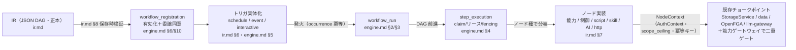

# ワークフロー基盤ドキュメント

> 本書は [miniapp-platform.md](../miniapp-platform.md) §1〜§3 の詳細設計群（`docs/workflow/`）の入口。
> 概念・スコープの正本は miniapp-platform.md であり、本書とその配下 3 ドキュメントはその上に載る詳細設計である。
> 実装は [roadmap Phase 10](../roadmap/phase-10.md)。着手前に
> [design-caveats](../design-caveats.md) の PIT-31 / PIT-34 / PIT-35 / PIT-36 を必ず確認すること。
> 認可・ストレージ・LLM の不変条件（単一チョークポイント・AuthContext・二重ゲート）は
> [design.md](../design.md) §1 / §4 が正本である。

## 1. 正本宣言と読み順

ワークフロー基盤に初めて触れる場合、以下の順で読む。上に行くほど概念、下に行くほど実装詳細である。

1. [miniapp-platform.md](../miniapp-platform.md) — 概念スタック・確定方針（**最上位正本**）。ここが本基盤の「なぜ」。
2. **本 README** — 実装者視点の全体像・用語・ドキュメントマップ・Task 対応・FAQ。
3. 詳細 3 ドキュメント（どれから読んでもよいが、下記マップで守備範囲を把握してから）:
   - [ir.md](./ir.md) — ワークフロー IR 仕様（定義と静的制約）
   - [engine.md](./engine.md) — 実行エンジン（実行時セマンティクス）
   - [script.md](./script.md) — shiki script 処理系（言語・ランタイム・ブリッジ）
4. [implementation.md](./implementation.md) — **Stage A 実装（PR #126〜#153）とのコード対応**。
   アーキテクチャ図・Postgres の役割・用語ごとのファイル/行番号対応・主要フローのトレース。
   上記 3 ドキュメントは実装着手前（PR #120）の設計であり実装ファイルパスを含まないため、
   「今のコードのどこにあるか」を知りたい場合はここを見る。

各詳細ドキュメントは章番号（`ir.md §N` 形式）で相互参照する。本 README も同じ番号で参照する。

## 2. 概念フロー（実装者視点）

[miniapp-platform.md](../miniapp-platform.md) §1 の概念図が「どの部品が何か」を示すのに対し、
本図は「1 本のワークフローが定義から副作用に至るまでの実装フロー」を示す。

要点: ノード実装は認可・監査を自前で持たない。すべて NodeContext を通じて既存チョークポイントに合流し、
そこで二重ゲート（`scope_ceiling ∩ 実行主体 ReBAC`）が効く。個別ノードに認可を散らさない。

## 3. ドキュメントマップ

| ドキュメント | 守備範囲 | 主な章 |
|---|---|---|
| [ir.md](./ir.md) | **定義と静的制約**。IR エンベロープ・データフロー模型（式言語なし）・ノード/エッジ/グラフ制約・map 領域・トリガ・ノードカタログ・保存時検証パイプライン・バージョニング。 | §1〜§9（＋§10 通し実例） |
| [engine.md](./engine.md) | **実行時セマンティクス**。テーブル・run/step 状態機械・DAG 前進・スケジューラ/トリガ・実行主体と委譲の強制・リトライ/冪等/at-least-once・concurrency/rate limit・wait/キャンセル・有効化同意・Observability。 | §1〜§12 |
| [script.md](./script.md) | **言語・ランタイム・ブリッジ**。shiki script サブセット・コンパイルパイプライン・script-runtime プロセス・ホスト関数ブリッジ・`Shiki.*` API と能力プロファイル・実行契約・セキュリティ。 | §1〜§8 |
| [implementation.md](./implementation.md) | **実装マップ**。アーキテクチャ図・Postgres の役割・用語↔コード対応・クレート構成・主要フローのトレース・e2e テストの読み方・Stage A 既知の未実装・設計ドキュメントとの既知の差分。 | §1〜§8 |

相互リンク: ir.md ⇄ engine.md（実行セマンティクス）・ir.md ⇄ script.md（script ノード）・全 → 本 README。

## 4. 用語集

他 3 ドキュメントはこの語彙に一元化する。同じ語を同じ意味で使う。

| 用語 | 意味 |
|---|---|
| IR | ワークフロー定義の唯一の正本（JSON DAG）。バージョン付き artifact。編集手段は dnd と AI 編集のみ（ir.md §1）。 |
| run | IR の 1 回の実行インスタンス。トリガ発火ごとに 1 つ生成される（engine.md §2/§3）。 |
| step | run 内の 1 ノードの 1 実行単位。チェックポイントの粒度（engine.md §2/§4）。 |
| step_path | step の識別子。静的ノードは `node_id`、map 要素内は `<map_id>[<index>].<node_id>`（engine.md §2）。 |
| occurrence | スケジュールトリガの 1 発火。`(workflow_id, scheduled_at)` で冪等記録し二重投入を防ぐ（engine.md §5）。 |
| region（map 領域） | `control.map` が要素ごとに並列実行するノード集合。`parent` で親 map に束ねる（ir.md §5）。 |
| 委譲（delegation） | schedule/event run の workflow プリンシパルへ、有効化者が自分の権限範囲から付与する ReBAC タプル（engine.md §6）。 |
| 実行主体（principal） | run が能力を呼ぶ際の認可主体。interactive=本人、schedule/event=workflow プリンシパル（engine.md §6）。 |
| 宣言スコープ（declared_scopes） | IR が宣言する権限の天井。codegen 認可語彙の閉じた集合に照合される（ir.md §2）。 |
| scope_ceiling | ノード単位の実効上限 `declared_scopes ∩ ノード設定`。能力ゲートウェイで検証（engine.md §6）。 |
| 冪等キー | `wf:{tenant_id}:{run_id}:{step_path}`。attempt を含めず、リトライ・再 claim を跨いで不変（engine.md §7）。 |
| effect_journal | チョークポイント側の冪等記録テーブル。内部能力の副作用を高々 1 回にする（engine.md §7）。 |
| fencing token | claim ごとに +1 する単調増加値。ゾンビワーカーの書込を拒否する（engine.md §1）。 |
| 能力ゲートウェイ | 全ノード・script の能力呼び出しが合流する既存チョークポイント。認可・監査・レダクト・rate limit が効く。 |
| script-runtime | wasmtime 上の QuickJS で shiki script を有界実行する非特権プロセス（script.md §4）。 |

## 5. roadmap Task ↔ ドキュメント章 対応表

| Task | タイトル（要約） | 主な章 |
|---|---|---|
| 10.1 | IR スキーマ＋artifact 化＋語彙照合検証 | ir.md §1, §2, §7, §8, §9 |
| 10.2 | run/step 永続化＋ワーカー（claim/リース/チェックポイント） | engine.md §1, §2, §3, §4 |
| 10.3 | トリガ（スケジューラ＋イベントマッチング） | engine.md §5 ／ ir.md §6 |
| 10.4 | 実行主体・委譲モデル（fail-closed 停止） | engine.md §6, §10 |
| 10.5 | 制御ノード＋リトライ＋concurrency/rate limit | ir.md §5 ／ engine.md §7, §8, §9 |
| 10.6 | 能力ノード＋AI ノード 2 種＋設定パネル契約 | ir.md §4, §7 ／ engine.md §6 |
| 10.7 | script-runtime（swc＋wasmtime/QuickJS・ブリッジ） | script.md §4, §5, §6, §8 |
| 10.8 | script ノード＋script→ワークフロー起動 API | script.md §1, §2, §3, §7 ／ ir.md §7 |
| 10.9 | シークレット管理（`crates/secrets`・宛先束縛） | ir.md §7（http.request）／ script.md §6 ／ [miniapp-platform.md](../miniapp-platform.md) §5 |
| 10.10 | http.request ノード（allowlist × 宛先束縛） | ir.md §7 ／ engine.md §7 |
| 10.11 | skill artifact＋スキルストア＋skill ノード | ir.md §7（skill.invoke）／ script.md §6 |
| 10.12 | dnd ワークフローエディタ | ir.md §1, §8 |
| 10.13 | AI 編集（チャット→IR 生成/変更） | ir.md §1, §8 |
| 10.14 | 実行履歴 UI＋Observability | engine.md §3, §11 |
| 10.15 | first-party skill 初期セット | ir.md §7 ／ script.md §6 ／ [miniapp-platform.md](../miniapp-platform.md) §5 |

> 📌 **部分前倒し（2026-07-07・#121）**: P10-A0（outbox fan-out）＋10.0（durable 切り出し）＋10.1a〜10.10 のエンジン核心は
> **Stage A として前倒し着手**（前提は 6.1 の先行実施＋P10-A0＝outbox の per-consumer fan-out 化）。10.11〜10.15 と各タスクの b 側
> （skill 照合・同意 UI・data/notify ノード・UI 群）は Stage B。分割の正本は
> [roadmap phase-10.md](../roadmap/phase-10.md) 冒頭の「部分前倒し」節。

## 6. FAQ

**Q1. なぜ Temporal / n8n を使わないのか。**
durability をノード境界のみに限定した結果、必要なのは「Postgres 上のチェックポイント付きステップキュー」で足りるため。
外部エンジンを入れると部品点数が増え、エアギャップ配布が崩れ、認可・監査・テナント分離を心臓部に編み込めない。
自作の workflow-engine は既存 jobq・outbox・chat の `generation_run` 実装の延長であり、新規ステートフル依存はゼロ（engine.md §1）。

**Q2. なぜ IR に式言語（JS 式・CEL 等）がないのか。**
AI 編集と dnd の両方が「スキーマ検証可能な構造化データ」を生成する設計（検証済みスペック方式）だから。
文字列埋め込み式はパーサ・エスケープ・インジェクション面を生み、保存時検証の網羅性とハルシネーション境界を貫徹できない。
複雑な変換・計算は script ノードへ昇格させる（すみ分け: IR=配線、script=ロジック。ir.md §3）。

**Q3. なぜ code view（IR→script の双方向同期）がないのか。**
IR を編集する手段は dnd と AI 編集の 2 つだけであり、script はノードの実装言語であって IR の編集手段ではないため。
双方向同期を持つと「IR が正本」という単一の真実が崩れ、AI が作った IR を人間がそのまま dnd で直せる利点が失われる（ir.md §1・script.md §1）。

**Q4. なぜ exactly-once を約束しないのか。**
ステップ実行は at-least-once であり、「実行後・checkpoint 前」のクラッシュで再実行され得る唯一の重複窓が構造的に残るため。
内部能力ノード（storage/data/notify/transition/workflow.start）は `effect_journal` の冪等キー強制で **高々 1 回**（engine-dedup）に潰す。
外部 http.request は **best-effort** で、`Idempotency-Key` ヘッダ注入支援のみ。UI とドキュメントに区分を明示する（engine.md §7）。

**Q5. 決定論はなぜ不要なのか。**
Temporal 型の決定論リプレイ durability を採らなかったため。契約は at-least-once＋冪等キーであり、リプレイに依存しない。
よって script は `Date.now()` / `Math.random()` を使ってよい。「3 日待つ」「リトライ」はノード境界＝engine の仕事であり、
script 内に long await を書く構文は存在しない（script.md §2）。

**Q6. script ノードと agent.invoke ノードの使い分けは。**
script = ms 級起動のグルーコード（同期 API・npm import 不可・有界 ≤6 分）。条件計算・整形・軽い外部呼び出し向き。
agent.invoke = サンドボックスで動く重量級（任意パッケージ・自律ツール実行）。フル環境が要る処理をここへ昇格させる。
「何でもできる代わりに重い」ものは agent、「軽い代わりに制限が多い」ものは script（miniapp-platform §3.1・ir.md §7）。

**Q7. FSM とワークフローの境界は。**
FSM は data サービスの宣言的ガード（record の status＋遷移認可）であり、遷移は書込と同一トランザクションで原子的に起きる「データの不変条件」。
ワークフローは時間を持つプロセス（分〜日・at-least-once・リトライ）。両者の接点は **`data.transition` ノード経由のみ**であり、
エンジンが status を直接書いて FSM の不変条件を破ることは構造的に不可能（ir.md §7・miniapp-platform §1）。

## 7. PIT 対応表

| PIT | 論点 | 本設計での対応 |
|---|---|---|
| [PIT-31](../design-caveats.md#-pit-31-at-least-once-の副作用は二重に起きる前提で設計する) | at-least-once 副作用の二重実行 | engine.md §7（冪等キー＋effect_journal で内部能力を高々 1 回・外部は best-effort 明示） |
| [PIT-34](../design-caveats.md#-pit-34-委譲-fail-closed-は失権を検知できて初めて成立する) | 委譲失効の検知と fail-closed | engine.md §6（run 開始時の委譲再評価＋非同期棚卸しジョブの二段構え・SLA 宣言） |
| [PIT-35](../design-caveats.md#-pit-35-script-runtime-のホスト関数ブリッジは-pit-23-と同型の脱出面) | ホスト関数ブリッジの脱出面 | script.md §5（敵対的入力前提の全フレーム検証・catch_unwind・CI fuzzing・深さ 1 固定） |
| [PIT-36](../design-caveats.md#-pit-36-シークレット宛先束縛はリダイレクトdns動的-url-で迂回される) | シークレット宛先束縛の迂回 | ir.md §7（http.request のホスト部リテラル必須・リダイレクト既定 deny）＋ script.md §6（参照名のみ・エンジン側解決） |

## 8. human 承認待ちの提案（解決済み）

Stage A 実装（2026-07-07・PR #126〜#153）により、以下 3 点はすべて human 承認済み・実装済みである。
コード対応の詳細は [implementation.md](./implementation.md) §8 を参照。

- **OpenFGA relation スキーマの委譲モデリング**（engine.md §6）: 「委譲を対象オブジェクトへの通常
  relation タプル（subject=workflow プリンシパル）＋ `workflow_delegation` 行で管理する」案で確定。
  新しい relation は追加せず既存 relation（folder/file の editor/viewer・secret の can_use・
  artifact の viewer）に workflow subject 型を足す方式。`migrations/0017_workflow_registration.sql`
  で実装済み。
- **`crates/durable` の切り出しと名称**（engine.md §1）: 提案どおり切り出し、パッケージ名
  `shiki-durable`（`Cargo.toml` の `crates/durable`）で確定・実装済み。
- **各種数値初期値**: `WorkflowConfig`（`crates/api/src/workflow_runtime/mod.rs`）に
  `worker_concurrency`/`tick_secs`/`lease_secs`/`http_timeout_ms`/`rate_capacity`/
  `rate_refill_per_sec` の既定値を実装済み（`enabled: false` が既定で明示的な opt-in が必要）。
  ベンチ・運用での調整は今後も継続。
