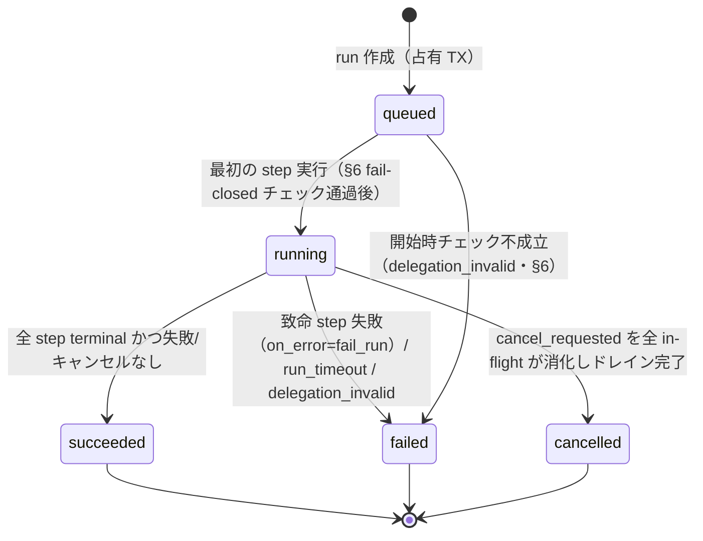
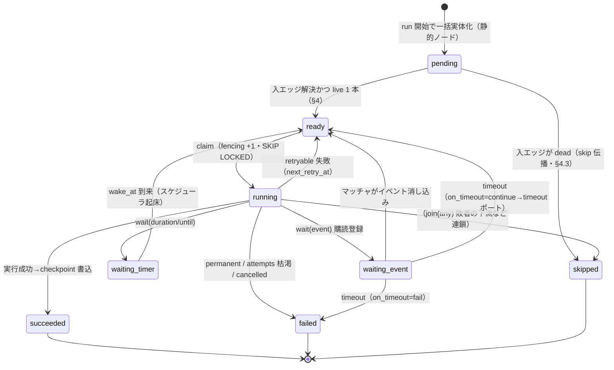
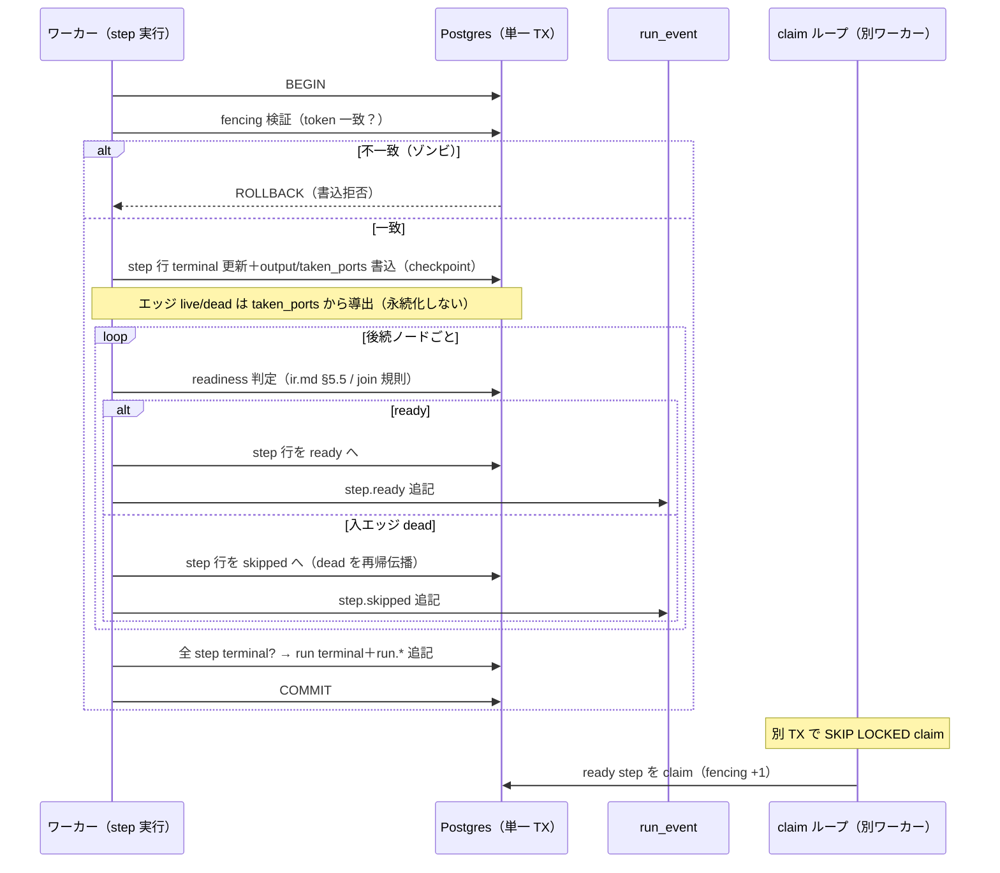
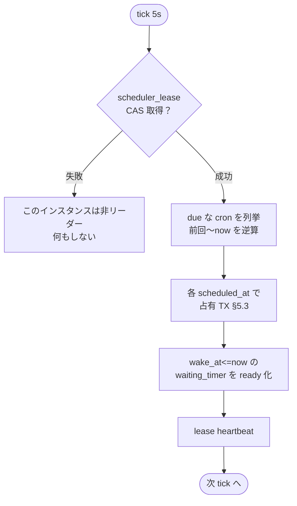

# workflow-engine 実行エンジン設計

> 本書は [miniapp-platform.md](../miniapp-platform.md) §2 の詳細設計。概念・スコープの正本は miniapp-platform.md。
> 認可・ストレージ・LLM の不変条件（単一チョークポイント・AuthContext・二重ゲート）は [design.md](../design.md) §1/§4 が正本であり、本書はその上に載る。
> 実装は roadmap [Phase 10](../roadmap/phase-10.md)（Task 10.2〜10.6・10.14）。着手前に [design-caveats](../design-caveats.md) PIT-31/34/35/36 を必ず確認すること。
>
> 本書が正を持つのは **実行時セマンティクス**（skip 伝播の実行・join 発火・リトライ・リース・スケジューラ・委譲強制）である。
> ワークフロー IR の定義・静的制約・保存時検証は [ir.md](./ir.md) が正、shiki script の実行系は [script.md](./script.md) が正であり、本書はそれらを参照して二重記述を避ける。用語は [README.md](./README.md) の用語集に一元化する。
> 本書の数値（上限・タイムアウト・プール数・周期）はすべて **初期値**であり、実装時にベンチ・運用で調整するコード上の設定値である。

---

## 1. 全体像

`crates/workflow-engine` は shiki-server の in-process サブシステムとして動く。外形は 3 つの協調する構成要素からなる。

- **ワーカープール**: ready な step を `FOR UPDATE SKIP LOCKED` で claim し、ノード実装を実行してチェックポイントを書き、DAG を前進させる（§4）。
- **リーダー選出スケジューラ**: 単一リースを CAS 取得したインスタンスだけが、cron 評価・タイマー起床・リース heartbeat を回す（§5）。
- **トリガマッチャ**: 既存 outbox イベントを購読し、イベントトリガと `wait(event)` 購読を照合して run を起こす／step を起こす（§5）。

設計の骨子は「新規ステートフル依存ゼロ」である。永続化は Postgres、配信は既存 Redis の pub/sub のみを使う。Temporal 等の外部 Durable Execution エンジンは持ち込まない（部品点数最小化・エアギャップ・認可/監査/テナント分離を心臓部に編み込むため。miniapp-platform §2.2）。durability は **ノード境界にのみ存在**し、決定論的リプレイは採らない（§7 でこの帰結を明示する）。

### 1.1 レーン分離

ワークフロー用の jobq キューとワーカープールは、chat 生成（レイテンシ敏感な高優先レーン・design §4.4.1）および ingestion（バッチレーン）と **プールを共有しない**。ワークフローは分〜日単位のスループット重視レーンであり、レイテンシ敏感なチャット生成を同居させて head-of-line blocking を起こさないためである。共有するのは「実装パターン」（claim/リース/fencing/seq 追記/Redis 配信）であって「実行資源」ではない。

### 1.2 共有モジュール `crates/durable`（提案・名称は実装時確定）

chat の `generation_run`/`generation_event`（`migrations/0012_chat.sql`・`crates/chat/src/store/runs.rs`）は、claim・リース・fencing・seq イベント追記の先行実装である。workflow-engine はこの実装パターンに乗り、共通部分を新クレート `crates/durable` へ切り出すことを **提案**する（human 承認待ち。切り出し名も提案）。何を共有し、何を共有しないかを次表に定める。

| 関心事 | `crates/durable` へ切り出す（共有） | workflow-engine 側に残す（分離） |
|---|---|---|
| claim | `FOR UPDATE SKIP LOCKED` の claim プリミティブ | claim 対象クエリ（ready step の抽出条件・§4） |
| リース | リース取得＋heartbeat＋失効判定 | リース TTL の値・sweeper 起動周期 |
| fencing | claim ごとに `fencing_token` +1・追記/確定は fencing 一致時のみ通す（ゾンビワーカー書込拒否） | fencing を検証する具体的な TX 境界（§4.1） |
| 追記ログ | `(id, seq)` 単調 seq の exactly-once 追記 | `run_event` の kind 語彙・payload スキーマ（§3.3） |
| 配信 | Redis pub/sub への best-effort publish | チャンネル命名・SSE 合流プロトコル（§11） |
| **キュー** | ─（共有しない） | **専用 jobq キュー・専用ワーカープール・レーン優先度**（§1.1） |
| **状態機械** | ─（共有しない） | run/step の状態遷移・DAG 前進（§3・§4） |

chat run と workflow run は「同じ run 抽象」（design §4.4.1・miniapp-platform §2.2）に乗るが、キュー・レーン・優先度・状態機械は各ドメインが所有する。`durable` は耐久実行の下部構造のみを提供する。

---

## 2. テーブル

全テーブルは全行 `tenant_id text not null` を持ち、複合キーで tenant をスコープする（#91 規約踏襲）。以下は **DDL 風スケッチ**であり、実 migration は実装時に確定する。不変条件は各表の直後に箇条書きで置く。

### 2.1 一覧

| テーブル | 役割 | キー・要点 |
|---|---|---|
| `workflow_registration` | 有効化状態の正 | PK(tenant_id, workflow_id) |
| `workflow_trigger` | IR から実体化したトリガ | PK(tenant_id, trigger_id) |
| `schedule_occurrence` | スケジュール発火の冪等記録 | UNIQUE(tenant_id, workflow_id, trigger_id, scheduled_at) |
| `trigger_firing` | イベント発火の冪等記録 | UNIQUE(tenant_id, trigger_id, event_id) |
| `workflow_run` | run の正 | PK(tenant_id, run_id) |
| `step_execution` | step の正＝チェックポイント | PK(tenant_id, run_id, step_path) |
| `run_event` | 追記ログ（UI/SSE/監査の材料） | PK(run_id, seq) |
| `wait_subscription` | wait(event) の購読登録 | PK(tenant_id, run_id, step_path) |
| `workflow_delegation` | 委譲の記録 | (tenant_id, workflow_id, delegator, scope, …) |
| `concurrency_counter` | 3 階層同時実行カウンタ | PK(tenant_id, scope_kind, scope_key) |
| `scheduler_lease` | リーダーリース | 単一行 CAS |
| `effect_journal` | チョークポイント側の冪等記録 | UNIQUE(tenant_id, idempotency_key) |

### 2.2 DDL 風スケッチ

```sql
-- 有効化状態の正。run 開始時の fail-closed チェック（§6）の起点。
create table workflow_registration (
    tenant_id        text        not null,
    workflow_id      uuid        not null,
    -- enabled=通常 / disabled=停止 / suspended_reconsent=委譲失効で要再同意（§6）。
    status           text        not null
                     check (status in ('enabled', 'disabled', 'suspended_reconsent')),
    -- 有効化中の version（run はこれをピンして開始する・§10）。
    enabled_version  int         not null,
    -- 有効化時に委譲者が同意したスコープ集合（declared_scopes ⊆ これ を実行時に検証）。
    consented_scopes text[]      not null default '{}',
    updated_at       timestamptz not null default now(),
    primary key (tenant_id, workflow_id)
);

-- IR の triggers を enable 時に実体化。disable で発火停止。
create table workflow_trigger (
    tenant_id    text        not null,
    trigger_id   uuid        not null,
    workflow_id  uuid        not null,
    version      int         not null,          -- 実体化元 IR version
    kind         text        not null,          -- schedule | event | interactive
    source       text,                          -- event の source（storage.write 等）
    spec         jsonb       not null,          -- cron/tz/filter/scope（IR 由来）
    enabled      boolean     not null default true,
    primary key (tenant_id, trigger_id)
);
-- マッチャの候補引き（イベント種→トリガ）。
create index workflow_trigger_match_idx on workflow_trigger (tenant_id, kind, source)
    where enabled;

-- スケジュール発火の冪等記録。占有（run 作成）と同一 TX で挿入する。
create table schedule_occurrence (
    tenant_id    text        not null,
    workflow_id  uuid        not null,
    trigger_id   uuid        not null,
    scheduled_at timestamptz not null,          -- cron が算出した論理発火時刻（tz 解決後の UTC）
    run_id       uuid,                          -- skip 溢れ時は null（記録のみ・再発火防止）
    created_at   timestamptz not null default now(),
    -- 同一発火の二重投入をキーで潰す（§5・PIT-31）。
    unique (tenant_id, workflow_id, trigger_id, scheduled_at)
);

-- イベント発火の冪等記録。outbox イベント 1 件につき最大 1 run。
create table trigger_firing (
    tenant_id  text        not null,
    trigger_id uuid        not null,
    event_id   uuid        not null,            -- outbox イベントの id
    run_id     uuid,
    created_at timestamptz not null default now(),
    unique (tenant_id, trigger_id, event_id)
);

-- run の正。
create table workflow_run (
    tenant_id        text        not null,
    run_id           uuid        not null,
    workflow_id      uuid        not null,
    version          int         not null,      -- 開始時ピン（§10）
    trigger_kind     text        not null,      -- schedule | event | interactive
    trigger_id       uuid,
    -- 実行主体（§6）。interactive=本人 subject / schedule・event=workflow プリンシパル。
    principal        text        not null,
    delegator        text,                       -- schedule/event 時の委譲者（監査・棚卸し）
    status           text        not null default 'queued'
                     check (status in ('queued', 'running', 'succeeded', 'failed', 'cancelled')),
    input            jsonb       not null default '{}',  -- ≤256KB・超過は blob 参照（§12）
    cancel_requested boolean     not null default false,
    trace_id         text,                       -- OTel（run 作成時採番・§11）
    started_at       timestamptz,
    finished_at      timestamptz,
    created_at       timestamptz not null default now(),
    primary key (tenant_id, run_id)
);

-- step の正＝チェックポイント。1 step 1 行（attempt 履歴は run_event へ）。
create table step_execution (
    tenant_id         text        not null,
    run_id            uuid        not null,
    -- 静的ノードは node_id。map 要素内は <map_id>[<index>].<node_id>（ネストは連結）。
    step_path         text        not null,
    node_id           text        not null,
    status            text        not null default 'pending'
                     check (status in ('pending', 'ready', 'running',
                                        'waiting_timer', 'waiting_event',
                                        'succeeded', 'failed', 'skipped')),
    attempt           int         not null default 0,
    next_retry_at     timestamptz,               -- backoff / concurrency 順番待ちの再スケジュール
    wake_at           timestamptz,               -- waiting_timer の起床時刻
    -- リース: 保持ワーカーのみ単一ライタ。失効で別ワーカーが takeover。
    lease_owner       text,
    lease_expires_at  timestamptz,
    -- claim ごとに +1。追記/確定は一致時のみ（ゾンビ書込拒否）。
    fencing_token     bigint      not null default 0,
    output            jsonb,                      -- ≤256KB・超過は blob spill（§12）
    -- terminal 遷移で確定した「取られたポート」。エッジ状態はここから導出する（§4.1）。
    -- 成功: {out}/{true} 等。失敗＋on_error=continue: {error}。skipped/未処理失敗: {}。
    taken_ports       text[]      not null default '{}',
    error             jsonb,                      -- { code, message, retryable, node_id, attempt }
    -- attempt を含まない不変キー（§7）。wf:{tenant_id}:{run_id}:{step_path}。
    idempotency_key   text        not null,
    langfuse_trace_id text,                       -- AI ノードの Langfuse 突合（§11）
    updated_at        timestamptz not null default now(),
    primary key (tenant_id, run_id, step_path)
);
-- ready/再試行の claim 対象抽出（claim はテナント横断・公平性は §8 の tenant 上限で担保）。
create index step_ready_idx on step_execution (next_retry_at)
    where status = 'ready';
-- 孤児回収 sweeper: リース失効の running を拾う。
create index step_lease_idx on step_execution (lease_expires_at)
    where status = 'running';

-- 追記ログ。chat generation_event と同型。単一ライタ（fencing）で exactly-once。
create table run_event (
    run_id     uuid        not null,
    seq        bigint      not null,             -- run ごと単調増加
    kind       text        not null,             -- run.started / step.ready / ...（§3.3）
    payload    jsonb       not null default '{}',
    created_at timestamptz not null default now(),
    primary key (run_id, seq)                    -- 重複 seq の二重書込を拒否
);

-- wait(event) の購読登録。マッチャが消し込む。
create table wait_subscription (
    tenant_id  text        not null,
    run_id     uuid        not null,
    step_path  text        not null,
    source     text        not null,             -- 購読イベント種
    filter     jsonb       not null,             -- 条件木（ir.md §3）
    scope      jsonb       not null,             -- テーブル/フォルダ束縛
    timeout_at timestamptz,                       -- on_timeout の期限（§9）
    primary key (tenant_id, run_id, step_path)
);
create index wait_subscription_match_idx on wait_subscription (tenant_id, source);

-- 委譲の記録。同意 UI・棚卸しの正（§6・§10）。
create table workflow_delegation (
    tenant_id     text        not null,
    workflow_id   uuid        not null,
    delegator     text        not null,          -- 委譲者 subject
    scope         text        not null,          -- 委譲した declared_scope の 1 要素
    fga_tuple_ref text        not null,          -- 書き込んだ FGA タプルの参照
    granted_at    timestamptz not null default now(),
    revoked_at    timestamptz,                    -- 棚卸しで失効検出時に打刻
    primary key (tenant_id, workflow_id, delegator, scope)
);

-- 3 階層同時実行カウンタ（§8）。
create table concurrency_counter (
    tenant_id  text   not null,
    scope_kind text   not null,                   -- tenant | workflow | node_kind
    scope_key  text   not null,                   -- 空 / workflow_id / node 種名
    current    int    not null default 0,
    limit_val  int    not null,
    primary key (tenant_id, scope_kind, scope_key)
);

-- リーダーリース（§5）。単一行 CAS。
create table scheduler_lease (
    id         int         primary key default 1 check (id = 1),
    owner      text,
    expires_at timestamptz
);

-- チョークポイント側の冪等記録（§7）。副作用と同一 TX で書く。
create table effect_journal (
    tenant_id       text        not null,
    idempotency_key text        not null,
    result_summary  jsonb       not null,          -- 再実行時に返す記録済み結果
    created_at      timestamptz not null default now(),
    unique (tenant_id, idempotency_key)
);
```

### 2.3 不変条件

- **全行 tenant_id・全クエリ tenant スコープ**: SaaS 共用プールで越境しない（Task 10.2 受け入れ条件）。
- **`run_event` は単一ライタ・exactly-once**: `(run_id, seq)` PK で重複 seq を潰し、fencing 一致ワーカーのみが追記する（chat と同型）。
- **`step_execution` は step ごと 1 行**: attempt は列であり行を増やさない。attempt 履歴・遷移の連続は `run_event` に追記する。
- **占有は冪等記録と同一 TX**: `schedule_occurrence`/`trigger_firing` の UNIQUE 挿入と `workflow_run` 作成・enqueue は単一 TX（§5・PIT-31）。
- **`effect_journal` は副作用と同一 TX**: チョークポイント側で「副作用の実行」と「journal 追記」を分離不能にする（§7）。
- **`step_path` 文法**: 静的ノードは `node_id`、map 要素内は `<map_id>[<index>].<node_id>`（ネストは連結。例 `map_files[3].parse`）。定義は ir.md §5.3 が正。
- **エッジ状態は永続化しない（導出値）**: エッジテーブルは持たない。「解決済み」= 源 step が terminal、
  `live` = `from_port ∈ 源 step の taken_ports`、`dead` = 解決済みかつ live でない。`taken_ports` は
  checkpoint と同一 TX で確定するため、クラッシュ後の再前進でも判定が揺れない（§4.1）。

---

## 3. run / step 状態機械

run と step の状態は `step_execution.status`・`workflow_run.status` に持ち、全遷移を `run_event` に追記する。UI・SSE はこの追記列をリプレイする（§11）。

### 3.1 run 状態機械



- 補助状態 `waiting`（in-flight step が全部 wait 中）は **表示用の導出値**であり、カラムに持たない（真実は step 側）。
- `cancelling` も同様に導出であり、`cancel_requested = true ∧ status = running` の表示ラベルである。

### 3.2 step 状態機械



- `running → ready` の再試行は同一 attempt 系列であり、`next_retry_at` にバックオフ後の時刻を書いて claim 対象に戻す（§7）。
- concurrency 上限に阻まれた場合も `ready` のまま `next_retry_at` に小 backoff を書く（拒否ではなく順番待ち・§8）。

### 3.3 run_event の kind とリプレイ

遷移はすべて `run_event` に追記する。kind の初期集合は次のとおり（codegen 語彙化する。ir.md の語彙とは別レイヤ）。

`run.started` / `step.ready` / `step.started` / `step.succeeded` / `step.failed` / `step.retrying` / `step.skipped` / `step.waiting` / `step.woken` / `run.succeeded` / `run.failed` / `run.cancelled`。

UI・SSE は chat と同一のプロトコルでリプレイする（design §4.4.1・§11）: **①Redis 購読を開始 → ②`Last-Event-ID`(=seq) 以降を DB からリプレイ → ③ライブイベントと合流し seq で重複破棄**。先リプレイ→後購読は隙間を取り逃がすため禁止。

---

## 4. DAG 前進アルゴリズム

step の終端遷移（succeeded/failed）を起点に、DAG を **単一 TX** で一段前進させる。ready 化と claim は分離し、claim は別 TX の `SKIP LOCKED` で行う。

### 4.1 前進手順（単一 TX）

step 終端遷移時、保持ワーカーは以下を 1 つの Postgres TX で実行する。

1. **fencing 検証 → チェックポイント**: 自ワーカーの `fencing_token` が step 行と一致することを確認し（不一致ならゾンビとして中止）、step 行を terminal（succeeded/failed）へ更新し `output`/`error`/**`taken_ports`** を書き込む。**この checkpoint 書込が「実行済み」の唯一の真実**であり、これより後のクラッシュは再実行を招かない（§7 の順序固定）。
2. **出エッジのポート解決**: ノード種に応じて `taken_ports` を決める（手順 1 の checkpoint に含めて書く）。
   - 通常ノード成功 → `{out}`。失敗かつ `on_error=continue` → `{error}`。失敗かつ `fail_run` → `{}`（run を failed へ・手順 4）。
   - `control.branch` → 条件評価結果で `{true}` か `{false}`。`control.switch` → 一致 case ポート or `{default}`。
   - **エッジ状態は導出値であり永続化しない**（§2.3）: 各出エッジは `live`（`from_port ∈ taken_ports`）/ `dead`（解決済みかつ live でない）と判定される（定義は ir.md §5.5）。
3. **後続 readiness 判定 ＋ skip 連鎖**: 各後続ノードについて ir.md §5.5 の readiness 規則を評価する。
   - join 以外は入エッジ ≤1 なので「入エッジが解決し live 1 本」で `ready`。入エッジが dead なら `skipped` にし、その全出力ポートのエッジを dead にして **再帰的に dead を伝播**する。
   - join は §4.4 の規則（`all` は全入エッジ解決、`any` は初回 live）で ready/skipped/failed を決める。
4. **run 終了判定**: 全 step が terminal（succeeded/failed/skipped）になったら run を terminal（§4.5）にし、`run.*` を追記する。

ready 化された step 行は `ready` になるだけで、この TX では実行しない。実行は別ワーカーが `SKIP LOCKED` の claim TX で拾う（レーンとバックプレッシャは §8）。

### 4.2 シーケンス図（step 完了 → エッジ解決 → ready 化）



### 4.3 skip 伝播の擬似コード

```text
fn advance(tx, run, completed_step):
    assert completed_step.fencing == db_row.fencing        # ゾンビ拒否
    completed_step.taken_ports = resolve_ports(completed_step)   # 手順 2（ポート解決）
    write_checkpoint(tx, completed_step)                   # 手順 1（status/output/taken_ports を単一 UPDATE）

    # エッジ状態は永続化しない。判定は常に源 step 行から導出する:
    #   resolved(e) = terminal(step(e.from))
    #   live(e)     = e.from_port ∈ step(e.from).taken_ports
    #   dead(e)     = resolved(e) ∧ ¬live(e)      （skipped は taken_ports={} なので全出エッジ dead）

    frontier = successors(completed_step.node)
    while frontier not empty:                              # 手順 3（連鎖）
        node = frontier.pop()
        step = step_row(tx, run, path_of(node))
        if step.status != PENDING: continue                # 既に確定済みは触らない
        r = readiness(node, in_edges(node))                # ir.md §5.5 / join 規則（導出エッジ状態で評価）
        match r:
            READY:
                step.status = READY; emit(tx, "step.ready", step)
            SKIP:
                step.status = SKIPPED; step.taken_ports = {}   # 全出エッジが dead に導出される
                emit(tx, "step.skipped", step)
                frontier.extend(successors(node))          # dead を再帰伝播
            WAIT_JOIN:
                pass                                        # 未解決の join は待つ

    if all_terminal(tx, run):                              # 手順 4
        finalize_run(tx, run)                              # §4.5
```

### 4.4 join の発火

`control.join` は入エッジ集合で待ち合わせる（ir.md §5.4 が定義の正・ここは実行時の発火）。

- **`mode: all`（既定）**: 全入エッジが「解決」（live=完了 or dead）するまで待つ。全解決時に発火し、出力は `{ "<from_node_id>": <output or null(dead)>, ... }`。全入エッジ dead なら join 自体 `skipped`。
- **`mode: any`**: 最初の live 解決で **1 回だけ**発火。出力は `{ "winner": "<node_id>", "output": ... }`。残る分岐は完走するが、その下流で当該 join(any) は再発火しない（発火済みフラグを step 行で持つ）。全入エッジ dead なら `skipped`、全 live 失敗（fail_run でない場合）なら `failed`。

join の再発火防止と「初回 live」の判定は §4.1 手順 3 の readiness 評価内で行い、`any` の発火済み状態は checkpoint（step 行）に含める（クラッシュ後も二重発火しない）。

### 4.5 run 開始時の一括実体化と終了判定

- **開始時**: 静的ノード全件を `pending` で一括実体化する（1 run 1 バルク INSERT）。UI が実行前に計画（全 step とその関係）を表示できる。エントリノード（入エッジ 0）は run 開始時に全件 `ready` になる（静的並列・ir.md §5.1）。
- **map 要素 step**: `control.map` 実行時に要素数ぶんの step 行を動的挿入する（`step_path` に `[index]` が入る）。動的挿入も §4.1 の TX 内で行う。
- **終了判定**: 全 step が terminal になった時点で run を terminal 化する（§3.1）。run の最終 status は次の規則で決める:
  - `cancelled`: `cancel_requested` によるドレイン完了。
  - `failed`: ①`on_error=fail_run` の step 失敗（即 run fail 経路）②`run_timeout_sec` 超過 ③`delegation_invalid`、のいずれか。
  - `succeeded`: 上記以外。**`on_error=continue` で `error` ポートが解決された failed step は「処理済み失敗」であり、run の成否判定に含めない**（失敗はデータフローに変換済みのため。map の `on_item_error: collect` も同様）。

---

## 5. スケジューラ・トリガ

### 5.1 リーダーリース付き単一ループ

`scheduler_lease` を CAS 取得したインスタンスだけがスケジューラループを回す（tick 5s・初期値）。1 tick で以下を行う。

1. **due な cron の評価**: enable 中の schedule トリガについて、前回発火〜現在の間に来た論理発火時刻を cron から算出し、各 `scheduled_at` について占有 TX（§5.3）を実行する。
2. **due な waiting_timer の起床**: `wake_at <= now()` の `waiting_timer` step を `ready` へ戻す（§9）。
3. **waiting_event の期限処理**: `timeout_at <= now()` の `wait_subscription` を消し込み、`on_timeout` に従い `timeout` ポート解決 or failed にする（§9.2）。
4. **リース heartbeat**: `scheduler_lease.expires_at` を延長。失効すれば別インスタンスが CAS で引き継ぐ。



### 5.2 misfire・catchup

スケジューラ停止中に生じた「穴」（misfire）は、cron 逆算で占有期間の `scheduled_at` 列を列挙して扱う。IR の `catchup` に従う（ir.md §6）。

- `skip`（既定）: 停止中の未発火のうち **直近 1 occurrence のみ**発火する（残りは記録せず捨てる）。
- `none`: 未発火はすべて捨てる。
- `all`（全部再生）は **v1 でやらない**（ir.md §6 で確定済み）。

### 5.3 占有 TX（冪等発火）

スケジュール発火の二重投入を構造的に防ぐため、以下を **単一 TX** で行う（Task 10.3・PIT-31）。

1. `schedule_occurrence` に UNIQUE(tenant_id, workflow_id, trigger_id, scheduled_at) で INSERT。**UNIQUE 衝突＝既発火**としてスキップ（何もせず COMMIT）。
2. `max_parallel_runs` 溢れ時は `on_trigger_overflow` に従い、`queue` なら run を `queued` のまま作成、`skip` なら run を作らず occurrence 記録のみ残す（再発火防止・§8）。
3. `workflow_run` を作成し、jobq へ enqueue。

クラッシュ再起動時、UNIQUE により同一 `scheduled_at` は二度と投入されない（enqueue 直後に死んでも再起動で occurrence 衝突＝スキップ。Task 10.3 受け入れ条件）。

### 5.4 イベントトリガとマッチャ

イベントトリガは既存の `storage_event_outbox` 系 relay（outbox は書込と同一 Tx の耐久イベントログ兼 fan-out 点・design §4.3）を **購読者として拡張**する。マッチャは次の手順で動く。

1. `(tenant_id, source)` index（`workflow_trigger_match_idx`）で候補トリガを引く。
2. トリガの `scope` 束縛（対象テーブル・フォルダ id）に合致するか判定する。
3. `filter` の条件木（ir.md §3）を **イベントペイロードに対して**評価する。
4. 合致したら `trigger_firing` に UNIQUE(tenant_id, trigger_id, event_id) で INSERT し、run 作成＋enqueue を **単一 TX**（outbox イベント 1 件につき最大 1 run）。

### 5.5 wait_subscription の消し込み（同一マッチャ）

`wait(event)` の購読解決も **同じマッチャ**が行う。イベント到来時、`(tenant_id, source)` で `wait_subscription` を引き、`scope`＋`filter` に合致する購読について当該 step を `ready` 化し、イベントペイロードを step 入力に格納する（購読行は消し込む）。これによりトリガ発火と wait 解決が同一のイベント消費経路を通り、実装が二重化しない。

### 5.6 filter 評価エラーは fail-closed

トリガ filter・wait filter の評価が `expr_type_error`（型不一致等・ir.md §3）になった場合は、**発火しない＋監査記録**とする（黙って発火するのは正しくないため fail-closed）。評価エラーは `run_event` ではなく監査ログ（該当トリガ id 付き）へ残す。

---

## 6. 実行主体・委譲の強制

本節は **PIT-34 の決定**（失権を検知できて初めて fail-closed が成立する）の実装であり、confused-deputy 防御の中核である。miniapp-platform §2.3 が上位方針の正。

### 6.1 principal の確定（run 作成時・決定）

run 作成時に principal を確定し `workflow_run` 行へ記録する。

- **interactive**: セッションの本人（subject）。以降の能力呼び出しは **毎回ライブの OpenFGA** に当たる。許可のキャッシュ・先読みをしないため、run 実行中に本人が権限を失えばその step から自然に落ちる。
- **schedule / event**: workflow プリンシパル `workflow:<tenant>|<id>`。`AuthContext::ns()` 経由で構築し、`authz::Namespace` に `workflow()` ビルダを追加する（Task 10.4）。

### 6.2 run 開始時チェック（必須・fail-closed・決定）

schedule/event run は **最初の step 実行前**に以下を検証する。1 つでも欠けたら run を `failed(reason=delegation_invalid)` にし、registration を `suspended_reconsent` へ遷移させる。

1. registration が `enabled`。
2. 委譲が有効: `workflow_delegation` の各 scope について、**委譲者が今も当該権限を持つか OpenFGA を check**（run 前の最低線・PIT-34）。
3. version の `declared_scopes ⊆ consented_scopes`。

interactive run はこのチェックを経ない（本人権限がライブに効くため）。

### 6.3 非同期棚卸しジョブ（二段目・決定）

run 前チェックだけでは「実行中 run の失権」を止められない。周期（初期値 5 分）＋ IdP 同期・退職イベント（SAAS.2 reconciliation）を契機に、全委譲を再評価する棚卸しジョブを回す。失効検出時:

1. workflow プリンシパルの FGA タプルを撤去する。
2. registration を `suspended_reconsent` へ。
3. **実行中 run はキャンセル**（`reason=delegation_revoked`・§9 のキャンセル経路）。

**SLA 宣言**:

- 失権 → 新規 run 停止: 次 run 開始時（即時・§6.2 のチェックで落ちる）。
- 失権 → 実行中 run 停止・タプル撤去: 最大「棚卸し周期＋実行中 step の残り時間」。

### 6.4 構造的 fail-closed の三段目

タプル撤去後は、in-flight の能力呼び出しも既存の能力ゲートウェイ（OpenFGA check）で自然に deny される。すなわち fail-closed は **①run 前チェック → ②棚卸しによる能動停止 → ③タプル撤去後の受動 deny** の三段構えで成立する。

### 6.5 スコープ交差の強制点（決定）

`NodeContext` に `scope_ceiling = declared_scopes ∩ ノード設定` を運ぶ。**能力ゲートウェイ（既存チョークポイント）側で「操作の要求スコープ ∈ scope_ceiling」を検証してから、通常の OpenFGA check** を行う（二重ゲート）。個別ノード実装に検査を書かせない。実効権限 = 実行主体 ReBAC ∩ declared_scopes ∩ ノード設定であり、ノード設定は縮小のみ（拡大不能・miniapp-platform §2.5）。

### 6.6 OpenFGA モデリング（提案・human 承認待ち）

> **提案（human 承認待ち）**: 委譲 = 対象オブジェクトへの **通常 relation タプル**（subject = workflow プリンシパル）＋ `workflow_delegation` 行でのリンク管理。条件付きタプル等の新機構は使わない。OpenFGA の relation schema 追加は human 決定領域のため、本モデリングは提案としてラベルする。承認後に authz の schema へ反映する。

<!-- TODO(design): 委譲タプルの relation 名・オブジェクト種の粒度（scope 1 対 1 か束か）は OpenFGA schema 決定時に確定する。 -->

### 6.7 監査

run 作成時に `run_id・trigger_kind・principal・delegator` を audit_log へ記録する（Task 10.4）。委譲の付与・失効も `workflow_delegation` の更新と同時に監査へ残す。

---

## 7. リトライ・冪等・at-least-once

本節は **PIT-31 の決定**であり、design-caveats PIT-31「実装前に決めること」①内部能力ノードの冪等キー強制 ②外部 http は exactly-once 非約束 ③completed 判定とチェックポイントの順序、への回答である。

### 7.1 順序固定（PIT-31 ③への回答）

step の処理順序を固定する: **ノード実行 → checkpoint 書込（output＋succeeded）→ 後続 ready 化**（§4.1 手順 1）。したがって重複が起きうる窓は「実行後・checkpoint 前」のクラッシュのみであり、これが at-least-once の唯一の重複窓である。checkpoint 後のクラッシュは、再 claim 時に step が既に terminal なので再実行されない。

### 7.2 冪等キー（PIT-31 ①への回答・基盤）

冪等キーは `wf:{tenant_id}:{run_id}:{step_path}` とし、**attempt を含めない**（リトライ・再 claim を跨いで不変）。`NodeContext` で全ノード実装に供給する。attempt を含めないことが「リトライしても副作用は 1 回」の前提である。

### 7.3 内部能力ノードのチョークポイント強制 dedupe（PIT-31 ①への回答・本体）

内部能力ノード（storage 書込・data 書込・data.transition・notify・workflow.start）は、**チョークポイント側で強制 dedupe** する。

- 副作用の実行と同一 TX で `effect_journal` に UNIQUE(tenant_id, idempotency_key) で「実行済み＋結果要約」を記録する。
- 再実行は journal ヒットで **記録済み結果を返す**（no-op）。副作用は再び起きない。
- journal は TTL（初期値 run 保持期間と同じ・§12）で GC する。

これにより「ワーカー kill を挟むリトライで内部能力ノードの副作用が高々 1 回」という受け入れ条件を **構造的に**満たす。個別ノード実装に dedupe を書かせない（能力ゲートウェイの一点で効く）。

### 7.4 外部 http.request（PIT-31 ②への回答）

外部 `http.request` は exactly-once を **約束しない**（ノード契約・UI・実行履歴ドキュメントに明示）。エンジンが提供するのはオプトインの `Idempotency-Key: <冪等キー>` ヘッダ注入支援のみである。外部サービスがこのヘッダを解釈するかは外部の責任であり、エンジンは冪等性を代替しない。

### 7.5 リトライ分類

ノード実装はエラーを 3 分類して返す。

- `retryable`: attempt を消費し、backoff 後に再スケジュール。
- `permanent`: attempts 残があっても **即 failed**。
- `rate_limited`: **attempt を消費せず**遅延再スケジュール（§8 の rate limit 枯渇と接続）。

backoff は exponential＋full jitter。`next_retry_at` に時刻を書き、ready 相当のスケジュールに乗せる（§3.2 の `running → ready`）。retry の既定は `max_attempts: 1`（リトライなし）であり、リトライは at-least-once を顕在化させる明示オプトインである（ir.md §4）。

### 7.6 受け入れ条件に使える不変条件

以下は Phase 10 の受け入れ条件へそのまま転記できる形の不変条件である。

- ワーカー kill を挟むリトライ試験で、内部能力ノード（storage/data/transition/notify/workflow.start）の外部から見える副作用が **高々 1 回**になる（`effect_journal` UNIQUE で担保）。
- 冪等キーは同一 `(run_id, step_path)` で全 attempt・全再 claim を通じて **不変**である（attempt を含まないことで担保）。
- checkpoint 済み（terminal）step は再 claim 時に **再実行されない**（§7.1 順序固定で担保）。
- `http.request` は exactly-once を約束せず、ノード契約・UI にその旨が明記される（構造ではなくドキュメントで担保）。
- `rate_limited` エラーは attempt を消費せず、step を失敗させず遅延させる（§8・Task 10.5 受け入れ条件）。

---

## 8. concurrency・rate limit・バックプレッシャ

### 8.1 3 階層 concurrency カウンタ

`concurrency_counter` を tenant / workflow / node_kind の 3 階層で持つ（上限は engine 設定＋IR の `policies`）。claim 直後に増分を試行する。

```text
UPDATE concurrency_counter SET current = current + 1
 WHERE tenant_id = $1 AND scope_kind = $2 AND scope_key = $3 AND current < limit_val
```

- 3 階層すべてで増分に成功したら step を実行する。
- いずれかで取れなければ step を **ready のまま**返し、`next_retry_at = now + backoff(小)` を書く（**拒否ではなく順番待ち**・Task 10.5 受け入れ条件）。
- terminal / wait 遷移で減分する。
- カウンタのリークは棚卸し（lease 失効 step の減分）で回収する（§9.5 の sweeper と同経路）。

### 8.2 rate limit

rate limit は既存の Redis トークンバケット（テナント × 能力）を再利用する。能力ゲートウェイの呼び出し口でトークンを消費し、枯渇時は `rate_limited` エラーを返す。これは §7.5 の分類に接続し、attempt 非消費の遅延再スケジュールになる（step を失敗させない・Task 10.5 受け入れ条件）。

### 8.3 run 多重度・トリガ溢れ

run の多重度は `policies.concurrency.max_parallel_runs`（ir.md §2）で制御する。超過したトリガ発火は `on_trigger_overflow` に従う。

- `queue`（既定・バックプレッシャ）: run を `queued` のまま滞留させる。
- `skip`: run を作成しない。ただし occurrence/firing には記録済みなので **再発火しない**（§5.3）。

---

## 9. wait・キャンセル・タイムアウト

### 9.1 wait(duration / until)

step を `waiting_timer` にし `wake_at` を書いてワーカーを解放する（リースも解放）。スケジューラが `wake_at <= now()` で `ready` へ戻す（§5.1 手順 2）。

### 9.2 wait(event)

`wait_subscription` を登録して step を `waiting_event` にする。`timeout_at` 超過は `on_timeout` に従う（ir.md §5.2 の `wait` ポート）。

- `fail`: step を failed。
- `continue`: `timeout` ポートを取って前進（§4 のポート解決）。

イベント到来による解決はマッチャが行う（§5.5）。

### 9.3 キャンセル

キャンセルは API（本人 or 管理者・ReBAC）→ `workflow_run.cancel_requested = true` ＋ Redis pub/sub 通知で伝播する。ワーカーは **step 境界**および **長時間オペ内部**（LLM ストリーム読取・sandbox 実行・http）で検知する。sandbox は sandbox-client 経由で kill する。

猶予（初期値 10s）後にリースを放棄し、当該 step を `failed(cancelled)`、未実行 step を `skipped`、run を `cancelled` にする。ドレイン完了で run terminal（§3.1）。

### 9.4 タイムアウト階層

step の `timeout_sec`（ノード種ごとに既定・上限あり・ir.md §7）は run の `run_timeout_sec`（既定 3 日・最大 30 日・ir.md §2）より内側にある。

- step timeout: retryable 扱い（policy 次第で再試行）。
- run timeout: run failed ＋ in-flight step をドレイン。

### 9.5 リース失効（ワーカー死）

リース失効した step は別ワーカーが claim する（`fencing_token` +1）。

- **完了済み（terminal）step は再実行しない**（checkpoint が正・§7.1）。
- running のまま死んだ step は attempt そのままで re-run する（at-least-once・冪等キー不変）。

sweeper（§5 のスケジューラ内 or 専用ループ）が `step_lease_idx` で失効 running を拾い、concurrency カウンタの減分リークも同時に回収する（§8.1）。

---

## 10. 有効化・同意フロー（UI 契約）

本節は §6 の委譲を UI 側から見た契約である。管理ダッシュボード（FR-9）はこのテーブル群（`workflow_registration`・`workflow_delegation`）を read する。

### 10.1 enable(version)

有効化時、以下を **単一論理操作**で行う。

1. IR の `declared_scopes` ＋ ノード由来の要求（skill 宣言スコープ・secret の `can_use`・イベント購読 scope）を **同意画面に列挙**する。
2. 有効化者が **自分の権限範囲内から**委譲する。範囲外のスコープが 1 つでも混じれば **全体を拒否**（fail-closed・部分委譲しない）。
3. FGA タプル書込 ＋ `workflow_delegation` 記録 ＋ `workflow_trigger` 実体化 ＋ `workflow_registration`（enabled_version・consented_scopes）更新。

### 10.2 disable

トリガを無効化する（`workflow_trigger.enabled = false`）。実行中 run は既定で完走させる（ポリシで即キャンセルも選べる・§9.3 経路）。

### 10.3 新 version の enable（再同意）

- scope 差分を表示する。
- **拡大がある場合のみ**再同意（新スコープの委譲）を要求する。
- **縮小のみ**なら差分同意なしで切替可能。
- declared_scopes が広がった新 version は、再同意が済むまで有効化済みワークフローを新版へ切替できない（fail-closed・ir.md §2 と対応）。

### 10.4 管理ダッシュボード

委譲一覧・棚卸し・失効操作（FR-9）はこのテーブル群を read/write する。失効操作は §6.3 の棚卸しジョブと同じ撤去経路（FGA タプル撤去 → suspended_reconsent → 実行中 run キャンセル）を手動発火する。

---

## 11. Observability・実行履歴

### 11.1 OTel

run 作成時に `trace_id` を採番し `workflow_run` 行へ記録する。span 階層は **run span → step span（attempt はイベント）→ 能力呼び出し span**（既存計装に接続）。監査 ↔ OTel ↔ Langfuse が `run_id`/`trace_id` で相関する（Task 10.14 受け入れ条件）。

### 11.2 AI ノードの Langfuse 突合

`llm.invoke`/`agent.invoke` は llm-gateway/agent-core の Langfuse `trace_id` を `step_execution.langfuse_trace_id` に保存し、UI で突合リンクを出す（既存の監査 × Langfuse 突合の再利用）。

### 11.3 実行履歴 UI の正

実行履歴 UI の正 = `workflow_run`/`step_execution` テーブル ＋ `run_event`。入出力プレビューは `output`（spill 時は blob 参照・§12）を **シークレットレダクト済み**で表示する。**レダクトは記録時（保存前）に実施**し、表示時レダクトに頼らない（secrets の write-only 原則・miniapp-platform §5）。

### 11.4 再実行操作（v1）

v1 は次の 2 つだけを提供する。step 単位の入力編集リプレイはやらない。

- **失敗 step からの再開**: 同一 run 内で failed step を `ready` に戻す。成功済み checkpoint は再利用する（再実行しない）。
- **run の再実行**: 新規 run（同一 input）を作成する。

### 11.5 メトリクス

queue 滞留・step 実行時間・リトライ率・リース失効率・スケジューラ遅延を Prometheus に出す。

---

## 12. サイズ・保持

### 12.1 step output の spill

- `≤256KB` は `step_execution.output` に JSONB インライン。
- 超過は ObjectStore（`workflow-io/{tenant}/{run_id}/{step_path}`）へ spill し、参照を保存する。
- 上限 `32MB`（超過は step 失敗）。
- run の `input` も同型（≤256KB インライン・超過 blob 参照・§2.2）。

### 12.2 run 履歴の保持

- 保持期間はテナント設定（初期値 90 日）。
- GC ジョブが `workflow_run`・`run_event`・`effect_journal`・spill blob を **同時に**消す（§7.3 の journal TTL は run 保持期間と同じ）。

- **GC の実行主体**: 専用の jobq ジョブとし、スケジューラリーダーが日次で enqueue する（tick ループに重い削除を同居させない）。
- **保持期間の起算は run の terminal 時刻**。terminal でない run は保持期間を跨いでも GC 対象外（`run_timeout_sec` 最大 30 日 < 保持初期値 90 日のため実質的に衝突しない）。
