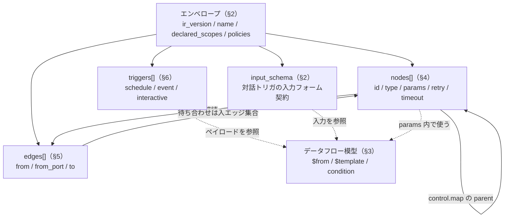
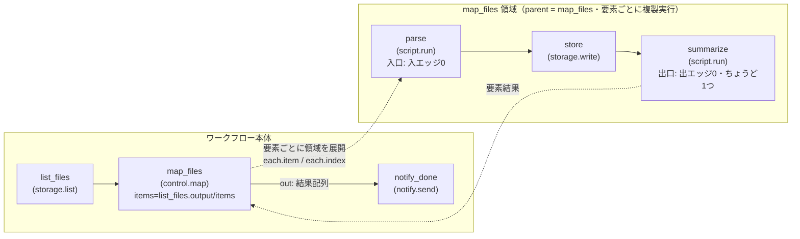

# ワークフロー IR 仕様

> 本書は [miniapp-platform.md](../miniapp-platform.md) §2.1 の詳細設計。概念・スコープの正本は [miniapp-platform.md](../miniapp-platform.md)。
> 認可・ストレージ・LLM の不変条件（単一チョークポイント・AuthContext・二重ゲート）は [design.md](../design.md) §1/§4 が正本であり、本書はその上に載る。
> 実装は [roadmap Phase 10](../roadmap/phase-10.md)（Task 10.1 が本書の主対象。10.5/10.6/10.10/10.12/10.13 が参照）。
> 着手前に [design-caveats](../design-caveats.md) の PIT-31（at-least-once 副作用）・PIT-34（委譲失効の検知）・PIT-35（script ホスト関数ブリッジ）・PIT-36（シークレット宛先束縛の迂回）を確認すること。
> 本書は IR の**定義と静的制約**の正本。実行時の振る舞い（skip 伝播の実行・join 発火・冪等・リトライ）は [engine.md](./engine.md)、script ノードのコンパイル・実行は [script.md](./script.md) が正本。用語は [README.md](./README.md) の用語集に一元化する。
> 本数値上限・タイムアウト・プール数はすべて**初期値**（実装時にベンチ・運用で調整。コード上は設定値）である。

---

## 1. 位置づけ

IR（Intermediate Representation）はワークフロー定義の**唯一の正本**であり、JSON で表現された有向非巡回グラフ（DAG）である。「トリガ＋ノード＋接続＋ポリシ」を宣言的に持つ。

- **IR を編集するのは dnd エディタと AI 編集の 2 つだけ**（[miniapp-platform.md](../miniapp-platform.md) §2.1）。shiki script は IR の編集手段では**ない**——ノードの中身を実装する言語であり、IR とは層が異なる（[script.md](./script.md) §1）。
- **code view（IR→script の双方向同期）はスコープ外**。IR とスクリプトを往復変換する経路は最初から作らない。IR は宣言的スペックのまま保つ。
- IR はバージョン付き artifact である（Phase 6 の artifact 共通枠を再利用: 不変 version・ReBAC 共有・監査）。artifact の `kind` は `workflow`。
- **保存時に検証パイプライン（§8）を通ったものだけが artifact version になる。検証を通らない IR は存在できない**。dnd 保存も AI 生成も同一の入口・同一のパイプラインを通る（generative UI の「検証済みスペック」パターンの再利用）。AI が生成した IR も人間が dnd でそのまま続きを編集できるのは、両者が同じ検証済みスペックを共有するからである。

IR が担う責務と、IR が担わない責務を明確に切り分ける。

| 担う（IR = 配線・定義） | 担わない（別の層） |
|---|---|
| ノードの配置・接続・パラメータの静的定義 | ノード内部のロジック（→ script ノード / [script.md](./script.md)） |
| トリガ・リトライ・タイムアウトの宣言 | 実行時の状態遷移・チェックポイント（→ [engine.md](./engine.md)） |
| 参照・条件・テンプレートの構造化記述 | 自由記述の式・計算（→ script ノードへ昇格・§3） |
| 保存時に静的検証可能な制約 | 実行時にしか分からない値の解決（→ [engine.md](./engine.md)） |

### 1.1 IR の構成要素関係図



---

## 2. エンベロープ

IR のトップレベルは以下の形を取る。

```jsonc
{
  "ir_version": 1,                  // IR スキーマ版（整数・単調増加）。未知の版は保存拒否（§9）
  "name": "expense-approval",       // ^[a-z][a-z0-9-]{0,63}$。tenant 内一意は artifact 層で担保
  "display_name": "経費承認フロー",  // 表示用
  "description": "経費申請の金額に応じて承認経路を分岐する",
  "declared_scopes": ["data.read", "data.write", "notify.send"],  // 宣言スコープ＝権限の天井。codegen 認可語彙
  "triggers": [ /* §6 */ ],
  "input_schema": { /* JSON Schema サブセット・省略可 */ },  // 対話トリガの入力フォーム契約
  "nodes": [ /* §4 */ ],
  "edges": [ /* §5 */ ],
  "policies": {                     // 省略時は全て既定値
    "run_timeout_sec": 259200,      // run 全体の上限（既定 3 日・最大 30 日）
    "concurrency": { "max_parallel_runs": 10 },  // このワークフローの run 同時実行（テナント/ノード種上限は engine 側設定）
    "on_trigger_overflow": "queue"  // 上限超過時: queue（既定・バックプレッシャ）| skip
  }
}
```

- **deny-unknown（全階層）**: 未知フィールドは全ての階層で保存拒否する。セキュリティ製品として未知の入力を黙殺しない（§8 V1）。この方針の帰結として、フィールド追加であっても `ir_version` を上げる（§9）。
- **`name`**: `^[a-z][a-z0-9-]{0,63}$`。tenant 内一意性の担保は artifact 層の責務であり、IR 検証はフォーマットのみを見る。
- **`declared_scopes`**: codegen 認可語彙の閉じた集合に照合する（§8 V3）。これは**権限の天井**であり、実効権限は次式で定まる（[miniapp-platform.md](../miniapp-platform.md) §7 の表そのまま）。

  ```
  実効権限 = トリガ由来の主体権限（実行主体の ReBAC） ∩ declared_scopes ∩ ノード設定
  ```

  **新バージョンで `declared_scopes` が広がった場合、有効化済みワークフローは再同意が済むまで新バージョンへ切替不可**（fail-closed。実行時の強制は [engine.md](./engine.md) §10 と対応）。縮小のみなら差分同意なしで切替可能。
- **`policies`**: 全て省略可。省略時は既定値。`run_timeout_sec` は run 全体の壁時計上限、`max_parallel_runs` はこのワークフロー単位の run 同時実行上限、`on_trigger_overflow` は上限超過時の挙動（`queue` はバックプレッシャで滞留、`skip` は run 作成を見送る。実行時の滞留・滞留解除の詳細は [engine.md](./engine.md) §8）。
- **`input_schema`**: 対話トリガ（§6 `interactive`）の入力フォーム契約。JSON Schema のサブセット（型・必須・enum・range 程度。式・`$ref` 外部参照は持たない）。`llm.invoke` の `output_schema` も同じサブセットを使う（§7）。

---

## 3. データフロー模型（式言語を持たない・重要決定）

**IR に自由記述の式言語（JS 式・CEL 等）を導入しない。** パラメータは「リテラル＋参照＋テンプレート＋構造化条件」のみで組み立てる。複雑な変換・計算はすべて script ノードへ昇格させる（すみ分け: **IR = 配線 / script = ロジック**）。

この決定の理由（[README.md](./README.md) の FAQ にも載せる）:

1. AI 編集・dnd の両方が「スキーマ検証可能な構造化データ」を生成する設計である（検証済みスペック方式）。文字列に埋め込んだ式は、パーサ・エスケープ・インジェクションの面が生え、保存時検証の網羅性が落ちる。
2. 認可語彙・参照の静的検証（ハルシネーション境界）を式の内部まで貫徹するコストが高い。
3. 逃げ道が既にある——script ノードは ms 級起動なので、条件計算に使ってもコストが軽い（[script.md](./script.md) §4）。

却下案: CEL（構文が TS 系と乖離・依存追加）/ JS ミニ式（結局 QuickJS が要る → script ノードと二重化）。

パラメータ値として使える構造は 3 種——参照（`$from`）・テンプレート（`$template`）・構造化条件（`condition`）——である。以下順に定義する。

### 3.1 参照（`$from`）

パラメータ値の任意の位置に、リテラル JSON の代わりに参照オブジェクトを置ける。

```jsonc
{ "$from": "nodes.fetch_report.output", "path": "/items/0/name", "default": "untitled" }
```

- **source（`$from` の元）**:
  - `input` — run 入力（対話トリガの `input_schema` に沿う値）
  - `trigger` — トリガイベントのペイロード
  - `nodes.<node_id>.output` — 他ノードの出力
  - `run` — run メタ（`run_id`・`workflow_id`・`attempt` 等の読み取り専用）
  - `each` — **map 領域内のみ**。現在要素（`each.item` と `each.index`。§5.3）
- **`path`**: RFC 6901 JSON Pointer。省略時は source 全体を指す。
- **`default`**: 解決失敗（skipped ノードの出力・パス不在・null）時のフォールバック。**`default` がなく解決に失敗した場合、step は `expr_resolve_error` で失敗する**（黙って null を流さない）。実行時の解決アルゴリズムは [engine.md](./engine.md) §4。
- **静的検証（§8 V5）**: `nodes.<id>` は**当該ノードの祖先**（DAG 上、いずれかのパスで先行するノード）でなければ保存拒否。**すべてのパスで先行するとは限らない**祖先（分岐の片側にしかいない等）を参照する場合は `default` 必須（そのパスが取られないと skipped になり解決失敗するため）。
- **`secrets.*` という source は存在しない**。シークレットは参照名でノード設定に書き、エンジンが実行直前に解決・注入する（§7 `http.request` / [script.md](./script.md) §6）。値がデータフローに乗る経路を構造的に作らない。

### 3.2 テンプレート（`$template`）

```jsonc
{ "$template": "{user} さんの経費申請（{amount} 円）が承認待ちです",
  "vars": {
    "user":   { "$from": "trigger", "path": "/record/applicant_name" },
    "amount": { "$from": "trigger", "path": "/record/amount" }
  } }
```

- **文字列組み立て専用**。`{name}` は `vars` のキーのみを参照できる（位置指定・ネスト・式は不可）。リテラルの `{` / `}` は `{{` / `}}` でエスケープする。
- `vars` の値は参照（`$from`）またはリテラル。非文字列値は JSON 表現へ文字列化する（数値・bool はそのまま、object/array はコンパクト JSON）。
- 上限: `vars` の数 ≤ 50（§8 V7）。

### 3.3 構造化条件（`condition`）

`control.branch` ノード・イベントトリガの `filter`・`control.wait`（event）の `filter` で共通に使う条件木である。

```jsonc
{ "all": [
    { "op": "eq", "left": { "$from": "trigger", "path": "/record/status" }, "right": "submitted" },
    { "any": [
      { "op": "gte", "left": { "$from": "trigger", "path": "/record/amount" }, "right": 100000 },
      { "op": "eq",  "left": { "$from": "trigger", "path": "/record/category" }, "right": "travel" }
    ] }
] }
```

- **合成**: `all` / `any` / `not`（ネスト深さ最大 5・§8 V7）。ルートは合成（`all`/`any`/`not`）でも単一の op リーフでもよい。
- **op（閉じた集合）**: `eq` `neq` `lt` `lte` `gt` `gte` `in`（`right` = 配列リテラル）`contains`（string/array）`starts_with` `ends_with` `exists` `is_null` `matches`。
  - `matches`: 正規表現。**保存時にコンパイル検証する**（§8 V5）。Rust `regex` クレート（バックトラックなし）を用い、パターン長 ≤ 256。
- **型厳密**: 左右の型が不一致（数値と文字列等）の比較を false へ黙って落とさず、`expr_type_error` として step / トリガ評価を失敗させる（監査に残る）。数値は serde_json の数値（i64/u64/f64）間でのみ数値比較する。
- **暗黙変換なし**。truthy / falsy の概念を持たない（bool 以外を条件位置に置けない）。
- トリガ filter の評価エラーの実行時の扱い（発火しない＋監査）は [engine.md](./engine.md) §5。

---

## 4. ノード

ノードは処理単位である。1 ノードが 1 step の実行に対応する（map 領域では要素数分の step に展開・§5.3）。

```jsonc
{
  "id": "notify_manager",           // ^[a-z][a-z0-9_]{0,63}$・ワークフロー内一意
  "type": "notify.send",            // 閉じたノードカタログ（codegen 語彙・§7）
  "label": "上長へ通知",             // 表示用・任意
  "parent": null,                    // map 領域内なら親 map ノード id（§5.3）。領域外は null
  "params": { /* ノード種ごとのスキーマ。codegen が正・§7 */ },
  "retry": {
    "max_attempts": 3,
    "backoff": { "kind": "exponential", "base_sec": 5, "max_sec": 300, "jitter": true }
  },
  "timeout_sec": 30,                 // ノード種ごとに既定・上限あり（§7 の表）
  "on_error": "fail_run"             // fail_run（既定）| continue（error ポートへ）
}
```

- **`id`**: `^[a-z][a-z0-9_]{0,63}$`。ワークフロー内一意（§8 V2）。参照（`nodes.<id>`）・エッジ・`step_path`（[engine.md](./engine.md) §2）の識別子になる。
- **`retry`** の既定は `max_attempts: 1`（リトライなし）。**リトライは at-least-once を顕在化させる行為**なので、明示オプトインとする（PIT-31 の思想）。attempt を跨いで冪等キーは不変であり、その供給と dedupe の詳細は [engine.md](./engine.md) §7。
  - `backoff.kind`: `exponential`（`base_sec`・`max_sec`・`jitter`）。full jitter の実行は [engine.md](./engine.md) §7。
- **`timeout_sec`**: ノード種ごとに既定値と上限がある（§7 の表）。上限超過値は保存拒否（§8 V7 の趣旨）。step timeout の実行時の扱い（retryable か等）は [engine.md](./engine.md) §9。
- **`on_error`**:
  - `fail_run`（既定）: エラーで run 全体を failed にする。
  - `continue`: ノードは出力ポート `error` を持ち、エラーオブジェクトが `error` ポートの下流へ流れる。

  `continue` 時に error ポートへ流れる形:

  ```jsonc
  { "error": { "code": "...", "message": "...", "retryable": true, "node_id": "...", "attempt": 2 } }
  ```

---

## 5. エッジ・ポート・グラフ制約

### 5.1 エッジ

```jsonc
{ "from": "check_amount", "from_port": "true", "to": "notify_manager" }
```

- `from_port` 省略時は `"out"`。
- **to 側にはポートがない**。合流・待ち合わせは `control.join` の**入エッジ集合**で定義する（下記 §5.4）。
- **グラフ制約（保存時検証・§8 V2）**:
  - **DAG**（閉路拒否）。自己ループ拒否。多重エッジ（同一の from / from_port / to）拒否。
  - **join 以外のノードの入エッジは最大 1 本**。合流したければ必ず `control.join` を置く。ダイヤモンド合流の実行セマンティクスが曖昧化するのを型で排除する（重要決定）。
  - すべてのノードは、いずれかのエントリノード（入エッジ 0 本のノード）から到達可能でなければならない。孤立ノード拒否。
  - **エントリノード（入エッジ 0）は複数可**。run 開始時に全エントリノードが ready になる（静的並列。[engine.md](./engine.md) §4）。

### 5.2 ポートカタログ

| ノード種 | 出力ポート |
|---|---|
| 通常ノード | `out`（＋ `on_error: continue` 時 `error`） |
| `control.branch` | `true` / `false` |
| `control.switch` | 各 case 値ポート ＋ `default` |
| `control.join` | `out` |
| `control.map` | `out`（領域完了後・結果配列） |
| `control.wait`（event, `on_timeout: continue`） | `out` / `timeout` |

- `control.switch` の case ポート名は params の `cases` で宣言する値と一致させる（保存時にポート存在検証・§8 V2）。

### 5.3 map 領域（動的 fan-out）

`control.map` は `items`（配列への参照）を受け、**領域（region）**を要素ごとに並列実行する。

- **領域** = `parent: "<map_id>"` を持つノード集合。制約（§8 V2）:
  - 領域内ノードのエッジは**同一領域内で閉じる**（領域跨ぎのエッジは保存拒否）。
  - 領域の**入口** = 領域内で入エッジ 0 本のノード（複数可）。
  - 領域の**出口** = 領域内で出エッジ 0 本のノード**ちょうど 1 つ**（出口の出力が要素結果になる）。
  - map の**ネスト可・最大深さ 2**。
- **`params`**:

  ```jsonc
  { "items": { "$from": "nodes.list_files.output", "path": "/items" },
    "max_concurrency": 10,           // 領域の要素並列度（初期値 10）
    "on_item_error": "fail_map" }    // fail_map（既定）| collect
  ```

  - `fail_map`（既定）: 1 要素の失敗（リトライ枯渇後）で map ノード自体が失敗する（`on_error` に準拠）。実行中の他要素は完走させる。
  - `collect`: 失敗要素は `{ "error": ... }` として結果配列に混ぜ、map は成功扱いにする。
- **map 出力**:

  ```jsonc
  { "items": [ /* 要素結果…（入力順） */ ], "errors": [ { "index": 3, "error": { /* … */ } } ] }
  ```

- **fan-out 上限**: 要素数 ≤ 1000（初期値）。超過は step 失敗・`fanout_limit_exceeded`。
- 領域内ノードから現在要素を参照するには `each`（`each.item` / `each.index`・§3.1）を使う。`step_path` 上の map 要素表現は [engine.md](./engine.md) §2。

#### map 領域の構造例



### 5.4 join

`control.join` は複数入エッジの待ち合わせ点である。

- **`params`**: `{ "mode": "all" | "any" }`（既定 `all`）。
- **`all`**: 全入エッジが「解決」するまで待つ。解決 = 生きて完了（live）または死んだ（dead・§5.5）。
  - 出力: `{ "<from_node_id>": <output or null(dead)>, ... }`
  - 全入エッジが dead なら join 自体が skipped。
- **`any`**: 最初の live 解決で発火（1 回だけ）。
  - 出力: `{ "winner": "<node_id>", "output": ... }`
  - 残る分岐は完走するが、その下流で join(any) は再発火しない。全 dead なら skipped。全 live が失敗（`fail_run` でない場合）なら failed。
- join の**発火判定の実行時セマンティクス**（どの遷移でどう ready 化するか）は [engine.md](./engine.md) §4 が正本。本節は静的定義（出力形・mode の意味）を規定する。

### 5.5 skip 伝播（静的定義）

skip 伝播の**実行アルゴリズム**（どの TX でどう dead を伝播させるか）は [engine.md](./engine.md) §4 が正本。本節はエッジ状態と skipped の**定義**のみ規定する。

- **エッジ状態**: `pending` → `live`（源が成功しポートが取られた）/ `dead`（源が skipped、または源は完了したが当該ポートが取られなかった、または源が失敗して `error` 以外のポート）。
- ノードは「入エッジがすべて解決し、かつ live が 1 本以上」で ready になる（join 以外は入エッジ ≤ 1 なのでこの規則は自明）。入エッジが（唯一の 1 本が、または join なら全てが）dead ならノードは `skipped` になり、その全出力ポートのエッジが dead になる（連鎖）。
- run の終了判定: 全ノードが terminal（succeeded / failed / skipped）になったら run terminal（実行時判定は [engine.md](./engine.md) §4）。

---

## 6. トリガ

```jsonc
[
  { "id": "t_sched", "type": "schedule", "cron": "0 9 * * MON", "tz": "Asia/Tokyo", "catchup": "skip" },
  { "id": "t_event", "type": "event", "source": "data.transition",
    "filter": { /* 条件木（対象: イベントペイロード）・§3.3 */ },
    "scope": { "table": "expense" } },
  { "id": "t_manual", "type": "interactive" }
]
```

- トリガは `nodes` とは別セクションに置く（dnd 上は擬似ノードとして描画する）。ペイロードは `{ "$from": "trigger" }` で参照する。
- 複数トリガ間でペイロード形が異なる場合は、`default` または `control.branch` で吸収する（保存時に警告・§8）。

### 6.1 `schedule`

- cron 5 フィールド ＋ `tz` 必須（IANA タイムゾーン名）。
- **DST**: 「存在しない時刻はスキップ・二重時刻は先勝ち」。
- **`catchup`**:
  - `skip`（既定）: 停止中の未発火は直近 1 回だけ発火する。
  - `none`: 未発火は捨てる。
  - **`all`（全部再生）は v1 でやらない**。
- misfire（停止中の穴）の埋め方の実行時挙動は [engine.md](./engine.md) §5。

### 6.2 `event`

- **`source`** は閉じた集合 `storage.write` / `data.record.created` / `data.record.updated` / `data.transition`（既存 outbox イベント種に対応）。将来追加は codegen 語彙で行う。加えて `event.custom`（`event.publish` ノードが発行するカスタムイベント）と `webhook.received`（外部システムからの webhook 受信・署名検証とレート制限は受信エンドポイント側で設計）を**予約済み**（§7.8・Stage A では保存不可）。
- **`scope`** で対象（テーブル・フォルダ）を**必須束縛**する。全イベント購読を許さない。フォルダ / テーブル id は保存時に存在検証する（§8 V4）。
- `filter`（条件木・§3.3）でペイロードを絞る。filter 評価エラーの実行時扱い（発火しない＋監査）は [engine.md](./engine.md) §5。

### 6.3 `interactive`

- UI ボタン・チャットからの起動。エンベロープ直下の `input_schema`（§2）が入力フォーム契約になる。

### 6.4 実行主体

実行主体はトリガ種別で決まる（[miniapp-platform.md](../miniapp-platform.md) §2.3 のまま。強制は [engine.md](./engine.md) §6）:

| トリガ種 | 実行主体 |
|---|---|
| `interactive` | トリガした本人 |
| `schedule` / `event` | workflow プリンシパル（`workflow:<tenant>|<id>`）＋有効化時の明示委譲 |

---

## 7. ノードカタログ v1（params の正は codegen）

**ノード params のスキーマは Rust 型定義から codegen（JSON Schema ＋ TS 型）するのが正**であり、本表は**設計仕様**として用途・冪等性区分・スコープ・timeout を規定する（右パネル UI の契約は codegen 型が駆動する・Task 10.6/10.12）。

**冪等性区分**:
- `engine-dedup` — 内部チョークポイントが冪等キーで重複排除し、副作用が高々 1 回になる（実行の詳細は [engine.md](./engine.md) §7）。
- `best-effort` — 外部副作用。exactly-once を約束しない（UI とドキュメントに明示する）。
- `pure` — 副作用なし。

| type | 区分 | 概要 | 冪等性 | timeout 既定/最大 |
|---|---|---|---|---|
| `storage.read` | 能力 | ファイル読み（≤ 10MB） | pure | 30s / 120s |
| `storage.write` | 能力 | ファイル書き（新バージョン） | engine-dedup | 30s / 120s |
| `storage.list` | 能力 | フォルダ一覧 | pure | 30s / 120s |
| `data.query` | 能力 | 宣言的クエリ | pure | 30s / 120s |
| `data.record.create` / `data.record.update` | 能力 | レコード書込（rev 楽観ロック） | engine-dedup | 30s / 120s |
| `data.transition` | 能力 | **FSM 遷移 API を叩く**（直接 status 書込は構造的に不可能） | engine-dedup | 30s / 120s |
| `rag.search` | 能力 | permission-aware 検索（必要スコープは既存語彙 `rag.query`） | pure | 60s / 120s |
| `notify.send` | 能力 | アプリ内通知 | engine-dedup | 30s / 60s |
| `workflow.start` | 能力 | 別ワークフロー起動（fire-and-forget・run_id 返し） | engine-dedup（起動 1 回保証） | 10s / 30s |
| `control.branch` / `switch` / `join` / `map` / `wait` | 制御 | §5 | pure | ―（wait は別枠・§7.5） |
| `script.run` | script | shiki script 実行 | best-effort（script 次第・冪等キー供給） | 30s / 360s |
| `skill.invoke` | skill | `skill:<name>@<version>` | skill 宣言に従う | 60s / 360s |
| `llm.invoke` | AI | llm-gateway 直行 | pure（課金あり） | 120s / 600s |
| `agent.invoke` | AI | サンドボックスで agent-core | best-effort | 600s / 3600s |
| `http.request` | 外部 | 外部 HTTP | **best-effort**（Idempotency-Key 注入支援のみ） | 30s / 120s |

以下、設計上の要点を持つノード種を個別に規定する。params の網羅的スキーマは codegen 型が正であり、本節は制約と出力形を示す。

### 7.1 `data.transition`（FSM 遷移）

**status を進めたいときも必ず通常の遷移 API を叩く**（[miniapp-platform.md](../miniapp-platform.md) §1）。エンジンに status を直接書かせて FSM の不変条件を破ることは構造的に不可能——このノードは遷移 API を呼ぶだけであり、直接 status 書込のノードは存在しない。ガード・認可は遷移 API 側で再評価される。

```jsonc
{ "id": "approve", "type": "data.transition",
  "params": {
    "table": "expense",
    "record": { "$from": "trigger", "path": "/record/id" },
    "transition": "approve",       // FSM で宣言済みの遷移名（codegen/レジストリ照合）
    "input": { "$from": "input", "path": "/comment", "default": "" }
  } }
```

- 出力: 遷移後レコードの要約 `{ "record_id", "status", "rev" }`。

### 7.2 `http.request`（外部 HTTP・PIT-36 の型防御）

```jsonc
{ "id": "post_slack", "type": "http.request",
  "params": {
    "method": "POST",
    "url": "https://api.slack.com/api/chat.postMessage",  // ホスト部はリテラル必須
    "path_suffix": { "$from": "input", "path": "/channel_path", "default": "" },  // パスは可
    "query": { /* $from / $template 可 */ },
    "body": { "$template": "…", "vars": { /* … */ } },
    "secret": { "name": "slack-bot-token", "attach": { "kind": "bearer" } },
    "redirect": "deny"             // deny（既定）| follow_stripped
  } }
```

- **URL のホスト部は IR 上リテラル必須**（`$from` / `$template` 不可。パス・クエリ・ボディは可）。保存時に egress allowlist・シークレット宛先束縛と照合できるのはこの制約のおかげであり、PIT-36 の動的 URL 迂回を型で殺す（§8 V4）。
- **`secret`**: `{ "name": "<参照名>", "attach": { "kind": "bearer" | "header", "header"?: "X-Api-Key" } }`。参照名のみを書き、解決・宛先束縛検証・注入はエンジンが実行直前に行う（値がデータフローに乗らない・§3.1）。
- **`redirect`**: 既定 `deny`。`follow_stripped` は追従時にシークレットを剥がして再検証する（PIT-36）。
- **実行時の注入はコネクション検証後**: ホスト部リテラル制約は動的 URL 迂回を塞ぐが、DNS rebinding（検証後に解決先 IP が付け替わる）は塞げない。エンジンが名前解決・コネクション確立・検証を行い、**検証済みコネクションにのみ**シークレットを注入する（PIT-36 ③。実行時の正は [engine.md](./engine.md) §7・`Shiki.http.request` と同一実装）。
- 応答: `{ "status", "headers": { /* 許可リストのみ */ }, "body": /* JSON なら parse・そうでなければ text・≤ 1MB */ }`。
- 冪等性は best-effort。`Idempotency-Key: <冪等キー>` ヘッダの注入支援のみ提供する（[engine.md](./engine.md) §7）。

### 7.3 `llm.invoke`

```jsonc
{ "id": "classify", "type": "llm.invoke",
  "params": {
    "model": "…",                  // テナントのモデルカタログに保存時存在照合＋実行時再照合
    "effort": "low",               // low | medium | high
    "prompt": { "$template": "…", "vars": { /* … */ } },
    "output_schema": { /* JSON Schema サブセット（input_schema と同じ）→ structured output */ }
  } }
```

- `model` はテナントのモデルカタログに保存時存在照合し、実行時にも再照合する（§8 V3・[engine.md](./engine.md) §6 の fail-closed）。
- `output_schema` を指定すると structured output になる。スキーマは `input_schema` と同じ JSON Schema サブセット（§2）。

### 7.4 `agent.invoke`

```jsonc
{ "id": "research", "type": "agent.invoke",
  "params": {
    "instruction": { "$from": "input" },
    "egress_allowlist": ["api.example.com"],  // 縮小のみ
    "mount_scope": { "folder": "…" },          // 縮小のみ
    "allowed_tools": ["rag.search", "storage.read"],  // codegen ツール語彙・縮小のみ
    "model": "…",
    "max_duration_sec": 600,
    "max_tokens": 100000
  } }
```

- サンドボックス設定（`egress_allowlist`・`mount_scope`・`allowed_tools`・`model`・`max_duration_sec`・`max_tokens`）は**縮小のみ**。実効権限 = 実行主体 ReBAC ∩ `declared_scopes` ∩ 本設定であり、ノード設定で権限を拡大できない（[miniapp-platform.md](../miniapp-platform.md) §2.5・二重ゲート）。
- ツール名・スコープは codegen 語彙照合（§8 V3）。
- **アルファは wasm ティア固定**（ティア選択ノブは出さない・[design.md](../design.md) §4.6）。

### 7.5 `control.wait`

```jsonc
{ "id": "wait_manager", "type": "control.wait",
  "params": {
    "kind": "event",               // duration | until | event
    "source": "data.transition",   // kind=event 時
    "scope": { "table": "expense" },
    "filter": { /* 条件木・§3.3 */ },
    "timeout_sec": 259200,
    "on_timeout": "continue"       // fail | continue（timeout ポートへ）
  } }
```

- `kind`: `duration`（相対時間）/ `until`（絶対時刻）/ `event`（イベント待ち）。
- `on_timeout: continue` のとき出力ポート `timeout` を持つ（§5.2）。
- wait の実行時挙動（waiting_timer / waiting_event・購読登録・起こし方）は [engine.md](./engine.md) §9。

### 7.6 `script.run`

```jsonc
{ "id": "compute", "type": "script.run",
  "params": {
    "source": { "inline": "function main(input) { return { total: input.a + input.b }; }" },
    // または { "artifact": "script:<name>@<ver>" }
    "input": { "$from": "trigger" }
  } }
```

- `source`: `{ "inline": "…" }`（≤ 64KB・保存時にコンパイル検証・§8 V6 / [script.md](./script.md) §3）または `{ "artifact": "script:<name>@<ver>" }`（version 固定なので保存時は存在検証のみ）。
- 実行契約（入出力・at-least-once・冪等キー）は [script.md](./script.md) §7。

### 7.7 `skill.invoke`

- `skill:<name>@<version>` を参照する。保存時にレジストリ＋インストール済みを存在検証する（§8 V4）。実効 = skill 宣言スコープ ∩ 実行主体 ReBAC（[miniapp-platform.md](../miniapp-platform.md) §4）。

### 7.8 将来予約ノード（語彙予約・現ステージでは保存不可）

後方互換性を最初から固定するため、将来ノードの **type 名（＝IR の `"type"` 値・TS 型・UI カタログ）と要求スコープを閉集合に先行予約**する（human 確定・issue #180）。予約 variant は `NodeType::available_stage_a()` が false を返し、保存時検証 V3 が「Stage A では未対応」として拒否する。**実装時に variant 追加は発生しない**（available 集合への追加＋実装のみ＝後方互換）。params スキーマは実装フェーズで codegen 定義する（本表は用途と認可方針の予約）。

| type | 系 | 概要 | 要求スコープ（予約） |
|---|---|---|---|
| `control.loop` | 制御 | 条件ループ（DAG にサイクルを持ち込まずエンジン側で展開） | ─ |
| `control.assert` | 制御 | 条件不成立で run を失敗させるアサーション | ─ |
| `debug.log` | デバッグ | 実行履歴への構造化ログ出力（pure） | ─ |
| `transform.template` / `parse` / `serialize` / `regex` / `map` / `filter` / `reduce` | データ加工 | 宣言的加工群（テンプレート展開・CSV/XML/JSON パース/直列化・正規表現・コレクション操作）。script.run でも書けるがノーコード UX の一級ノード。全て pure | ─ |
| `sheet.read` / `sheet.write` / `sheet.append` | オフィス | スプレッドシート操作（セル・範囲・シート・数式は params で表現＝中粒度） | `sheet.read` / `sheet.write`（append は write） |
| `doc.read` / `doc.edit` / `doc.comment` | オフィス | 構造化ドキュメント操作（見出し・表・コメント） | `doc.read` / `doc.write`（edit/comment は write） |
| `memory.get` / `memory.set` | 状態 | 会話・履歴・ユーザー状態ストア（テナント/ユーザー/ワークフロースコープ） | `memory.read` / `memory.write` |
| `event.publish` | イベント | カスタムイベント発行（購読はトリガ `event.custom`＝§6.2。フロー途中の待ち合わせは `control.wait` の `kind=event` 拡張で対応し新ノードは作らない） | `event.publish` |
| `workflow.call` | サブフロー | **同期**サブフロー呼び出し（結果を待って受け取る）。fire-and-forget は既存 `workflow.start` | `workflow.start`（流用） |
| `llm.embed` | LLM | テキスト埋め込み（llm-gateway 経由） | ─（天井対象外） |
| `llm.extract` | LLM | スキーマ指定の構造化出力（出力スキーマ検証まで契約に含む） | ─（天井対象外） |
| `ai.review` / `ai.eval` | AI | コード/文章/表のレビュー・LLM 出力品質評価（LLM-as-judge）。構造化出力（指摘リスト・スコア）の契約を持つ | ─（天井対象外） |
| `ai.ocr` / `ai.image.analyze` / `ai.image.generate` / `ai.transcribe` / `ai.speech` | AI | モダリティ拡張（OCR・画像認識/生成・音声認識/合成）。文書処理基盤（Docling）との役割分担は実装時に設計 | ─（天井対象外） |
| `graphql.query` | 外部 | GraphQL 呼び出し（クエリ・変数の型付き UX）。gRPC はユースケースが薄く予約しない | `http.egress`（流用） |
| `sandbox.exec` | 実行 | サンドボックス内の単発コマンド/Python 実行（secure-exec 基盤を転用。サンドボックス由来出力は敵対的として扱う・PIT-23） | `sandbox.exec`（危険度が高く独立スコープ） |
| `human.approval` | 人間参加 | 人間の承認を待って分岐する human-in-the-loop（`control.wait` のイベント待ちより明示的な一級概念。承認 UI・タイムアウト・代理承認を契約に含む） | `notify.send`（承認依頼通知を伴う） |

**ノードにしない**と確定したもの（予約対象外・理由の明文化）:

- **Retry / Timeout / Try-Catch / Fallback** — ノード**属性**（`retry` / `timeout_sec` / `on_error`＋error ポート）として §4 に存在済み。
- **Cache / Rate Limit / Mutex（同時実行制御）** — 任意ノードに付く **step 属性**として予約（`cache`（LLM/API 結果のキャッシュ・キーと TTL）・`rate_limit`（API 呼び出し制限）・`mutex`（排他キー））。DAG を汚さず全ノードに合成可能で、追加は params/IR フィールド追加＝後方互換。
- **Transaction** — **補償（compensation）エッジ**として予約。失敗時に補償ノードへ逆順で流す saga 型（分散トランザクションは提供しない）。
- **Secrets（API キー管理）** — ノードではなく参照（`http.request` の secret 参照＋宛先束縛・§7.2）。OAuth/JWT/API Key 管理も同じ connection/secret 基盤で扱う。
- **SQL 直接実行** — **作らない**。生 SQL は二段 authz・FSM 不変条件をバイパスし得るため、構造化データは宣言的な `data.query` に限定する。
- **通知のサービス別ノード（Slack/Teams/メール等）** — 作らず `notify.send` の params（`channel`・connection 参照）に統合する。サービス追加が語彙追加にならない。
- **Parallel / Merge** — DAG のファンアウト＋ `control.join` で表現済み。**Break Point** はエディタ/実行 UI の機能であって IR 語彙ではない。

---

## 8. 保存時検証パイプライン（確定・順序固定）

AI 編集も dnd 保存も**同一エンドポイント・同一パイプライン**を通る。ステージは固定順で走る。

| # | ステージ | 内容 | エラーコード例 |
|---|---|---|---|
| V1 | スキーマ | JSON Schema（deny-unknown・型・必須） | `ir.schema_violation` |
| V2 | グラフ | id 一意・エッジ参照存在・ポート存在・DAG・入エッジ制約・領域閉包・出口一意・到達可能性 | `ir.graph_cycle` 等 |
| V3 | 語彙照合 | ノード type・declared_scopes・ツール名・モデル名を codegen 語彙と登録カタログの閉じた集合へ照合 | `ir.unknown_scope` |
| V4 | 参照存在 | skill（レジストリ＋インストール済み）・secret（存在＋宛先束縛がノード URL ホストを許容）・テーブル/フォルダ id | `ir.unknown_skill` |
| V5 | データフロー | `$from` の祖先性・default 要否・条件木の型整合（静的に分かる範囲）・regex コンパイル | `ir.bad_ref` |
| V6 | script コンパイル | inline script の swc パース・禁止構文（[script.md](./script.md) §3。artifact 参照は version 固定なので存在のみ） | `ir.script_syntax` |
| V7 | 上限 | ノード ≤ 200・エッジ ≤ 500・IR ≤ 1MB・条件木深さ ≤ 5・テンプレ var 数 ≤ 50 | `ir.limit_exceeded` |

各ステージの詳細:

- **V1 スキーマ**: トップレベルからノード params まで、JSON Schema で型・必須・deny-unknown を検証する。未知フィールドは全階層で拒否する（§2）。
- **V2 グラフ**: `id` 一意、エッジの `from` / `to` が実在ノード、`from_port` が §5.2 のポートカタログに存在、DAG（閉路なし）、join 以外の入エッジ ≤ 1、map 領域の閉包（領域跨ぎエッジなし）・出口ちょうど 1、全ノードのエントリからの到達可能性を検証する。
- **V3 語彙照合**: ノード `type`・`declared_scopes`・ツール名（`allowed_tools`）・モデル名を codegen が生成した閉じた語彙と、テナントの登録カタログ（モデルカタログ等）へ照合する。**ハルシネーション境界**であり、実在しない語彙を参照する IR（特に AI 生成）を保存前に拒否する。
- **V4 参照存在**: skill（レジストリ＋インストール済み）・secret（存在＋宛先束縛がノードの `http.request` URL ホストを許容する）・テーブル/フォルダ id の実在を検証する。
- **V5 データフロー**: `$from` の `nodes.<id>` が祖先か、全パスで先行しない場合に `default` があるか、条件木の左右の型が静的に整合するか、`matches` の regex がコンパイルできるかを検証する（§3）。
- **V6 script コンパイル**: inline script を swc でパースし、禁止構文を弾く（[script.md](./script.md) §3）。artifact 参照は version 固定なので存在確認のみ。
- **V7 上限**: サイズ・数量の上限を検証する（すべて初期値・設定で調整可）。

**エラー形式**: 最初の 1 件で止めず、全件を配列で返す（dnd がノード上に表示するため）。

```jsonc
{ "errors": [
    { "code": "ir.bad_ref", "node_id": "notify_manager", "path": "/params/message/vars/amount",
      "message": "$from nodes.compute は notify_manager の祖先ではなく default もない" },
    { "code": "ir.unknown_scope", "node_id": "post_slack", "path": "/declared_scopes/2",
      "message": "http.egres は未知のスコープ（http.egress の誤り？）" }
] }
```

- `edge` に紐づくエラーは `node_id` の代わりに `edge`（`{ "from", "from_port", "to" }`）を持つ。

**保存時検証と実行時検証の関係**: V3 / V4 は「保存時 OK でも実行時に消えている」ことがある（skill アンインストール・モデルカタログ変更等）。したがって**実行時にも再検証し fail-closed する**（[engine.md](./engine.md) §6）。保存時検証は UX とハルシネーション境界を担い、実行時検証が最終防衛線である。

---

## 9. バージョニング・ライフサイクル

- **artifact version は不変**。run は開始時に `(workflow_id, version)` を**ピン**し、実行途中で新版に乗り換えない。
- **有効化（enable）は version 単位**: `workflow_registration` が `enabled_version` を指す（[engine.md](./engine.md) §2/§10）。新版を公開しても、enable を切り替えるまで旧版が動き続ける。
- **`ir_version`（スキーマ版）は整数単調増加**。エンジンは N と N-1 を読める（それ以前は保存時マイグレーション必須）。フィールド追加であっても deny-unknown のため `ir_version` を上げる（安全側に倒す・頻度は低い想定）。
- **削除は論理削除のみ**（実行履歴の run が version を参照し続けるため）。
- **scope 拡大時の再同意**: 新 version の `declared_scopes` が旧版より広がった場合、有効化済みワークフローは再同意が済むまで新版へ切替不可（§2・fail-closed）。縮小のみなら差分同意なしで切替可能（同意フローの UI 契約は [engine.md](./engine.md) §10）。

---

## 10. 通し実例

「経費申請の `data.transition` イベント → 金額分岐 → 上長通知 or 自動承認 → map で添付ファイル処理 → join → 完了通知」の完全な IR。triggers / nodes / edges / policies を全て含み、§8 の検証を通る形で示す。

```jsonc
{
  "ir_version": 1,
  "name": "expense-approval",
  "display_name": "経費承認フロー",
  "description": "経費申請の提出イベントを起点に、金額で承認経路を分岐し添付を処理する",
  "declared_scopes": ["data.read", "data.write", "storage.read", "storage.write", "notify.send"],

  "triggers": [
    { "id": "t_submitted", "type": "event", "source": "data.transition",
      "scope": { "table": "expense" },
      "filter": {
        "op": "eq", "left": { "$from": "trigger", "path": "/transition" }, "right": "submit"
      } }
  ],

  "nodes": [
    // 1) 金額で分岐（10 万円以上は上長承認、未満は自動承認）
    { "id": "check_amount", "type": "control.branch",
      "params": { "condition": {
        "op": "gte", "left": { "$from": "trigger", "path": "/record/amount" }, "right": 100000
      } } },

    // 2a) 高額: 上長へ通知（承認待ち）
    { "id": "notify_manager", "type": "notify.send",
      "params": {
        "to": { "$from": "trigger", "path": "/record/manager_id" },
        "message": { "$template": "{user} さんの経費申請（{amount} 円）が承認待ちです",
          "vars": {
            "user":   { "$from": "trigger", "path": "/record/applicant_name" },
            "amount": { "$from": "trigger", "path": "/record/amount" } } }
      },
      "retry": { "max_attempts": 3, "backoff": { "kind": "exponential", "base_sec": 5, "max_sec": 300, "jitter": true } } },

    // 2b) 低額: FSM 遷移 API で自動承認
    { "id": "auto_approve", "type": "data.transition",
      "params": {
        "table": "expense",
        "record": { "$from": "trigger", "path": "/record/id" },
        "transition": "approve",
        "input": { "$from": "run", "path": "/run_id" }
      } },

    // 3) 両分岐の合流（どちらか一方だけ live・all で待って dead を吸収）
    { "id": "join_paths", "type": "control.join",
      "params": { "mode": "all" } },

    // 4) 添付ファイル一覧
    { "id": "list_attachments", "type": "storage.list",
      "params": { "folder": { "$from": "trigger", "path": "/record/attachment_folder" } } },

    // 5) map: 添付を要素ごとに並列処理（領域 = parent: map_attachments）
    { "id": "map_attachments", "type": "control.map",
      "params": {
        "items": { "$from": "nodes.list_attachments.output", "path": "/items" },
        "max_concurrency": 5,
        "on_item_error": "collect"
      } },

    //   領域入口: 添付を読む
    { "id": "read_file", "type": "storage.read", "parent": "map_attachments",
      "params": { "file": { "$from": "each", "path": "/item/file_id" } } },

    //   領域出口（出エッジ0・ちょうど1つ）: 監査用アーカイブフォルダへ複製を書き出す
    { "id": "archive_file", "type": "storage.write", "parent": "map_attachments",
      "params": {
        "folder": { "$from": "trigger", "path": "/record/archive_folder" },
        "name": { "$template": "archive-{i}", "vars": { "i": { "$from": "each", "path": "/index" } } },
        "content": { "$from": "nodes.read_file.output", "path": "/bytes" }
      } },

    // 6) 完了通知（申請者へ）
    { "id": "notify_done", "type": "notify.send",
      "params": {
        "to": { "$from": "trigger", "path": "/record/applicant_id" },
        "message": { "$template": "{user} さんの経費申請の処理が完了しました",
          "vars": { "user": { "$from": "trigger", "path": "/record/applicant_name" } } }
      },
      "retry": { "max_attempts": 3, "backoff": { "kind": "exponential", "base_sec": 5, "max_sec": 300, "jitter": true } } }
  ],

  "edges": [
    { "from": "check_amount", "from_port": "true",  "to": "notify_manager" },
    { "from": "check_amount", "from_port": "false", "to": "auto_approve" },
    { "from": "notify_manager", "to": "join_paths" },
    { "from": "auto_approve",   "to": "join_paths" },
    { "from": "join_paths",       "to": "list_attachments" },
    { "from": "list_attachments", "to": "map_attachments" },
    // 領域内エッジ（同一領域で閉じる）
    { "from": "read_file", "to": "archive_file" },
    // map の out（領域完了後）を完了通知へ
    { "from": "map_attachments", "to": "notify_done" }
  ],

  "policies": {
    "run_timeout_sec": 259200,
    "concurrency": { "max_parallel_runs": 10 },
    "on_trigger_overflow": "queue"
  }
}
```

この IR の検証上の要点（なぜ通るか）:

- **入エッジ制約（V2）**: `join_paths` のみ入エッジ 2 本（join なので許容）。他ノードは全て入エッジ ≤ 1。
- **map 領域閉包（V2）**: `read_file` と `archive_file` が `parent: map_attachments`。領域内エッジ `read_file → archive_file` は領域内で閉じる。入口 = `read_file`（入エッジ 0）、出口 = `archive_file`（出エッジ 0・ちょうど 1 つ）。
- **祖先性と default（V5）**: 各ノードのデータ参照は `trigger`（常に解決可能）・`each`（領域内のみ）・領域内祖先 `read_file` のみで、分岐の片側にしか存在しない祖先への参照がないため `default` は不要。`join_paths` の出力（dead 側が null）は誰も参照しない。
- **式言語を持たない帰結**: 「添付 N 件」のような**件数の算出は IR だけでは書けない**（`$from` は配列長を取れない）。件数が要るなら `map_attachments` の後に script ノードを 1 つ置き `input.items.length` を返す——これが「複雑な計算は script へ昇格」（§3）の実例である。
- **語彙・スコープ（V3）**: 使用ノードの要求スコープ（`notify.send`・`data.write`・`storage.read`・`storage.write`）は全て `declared_scopes` に含まれる。
- **skip 伝播**: `check_amount` の一方の分岐が dead になり、その下流（`notify_manager` か `auto_approve` のいずれか）が skipped になるが、`join_paths` が `all` で dead を吸収して `list_attachments` 以降へ前進する（実行時挙動は [engine.md](./engine.md) §4）。
