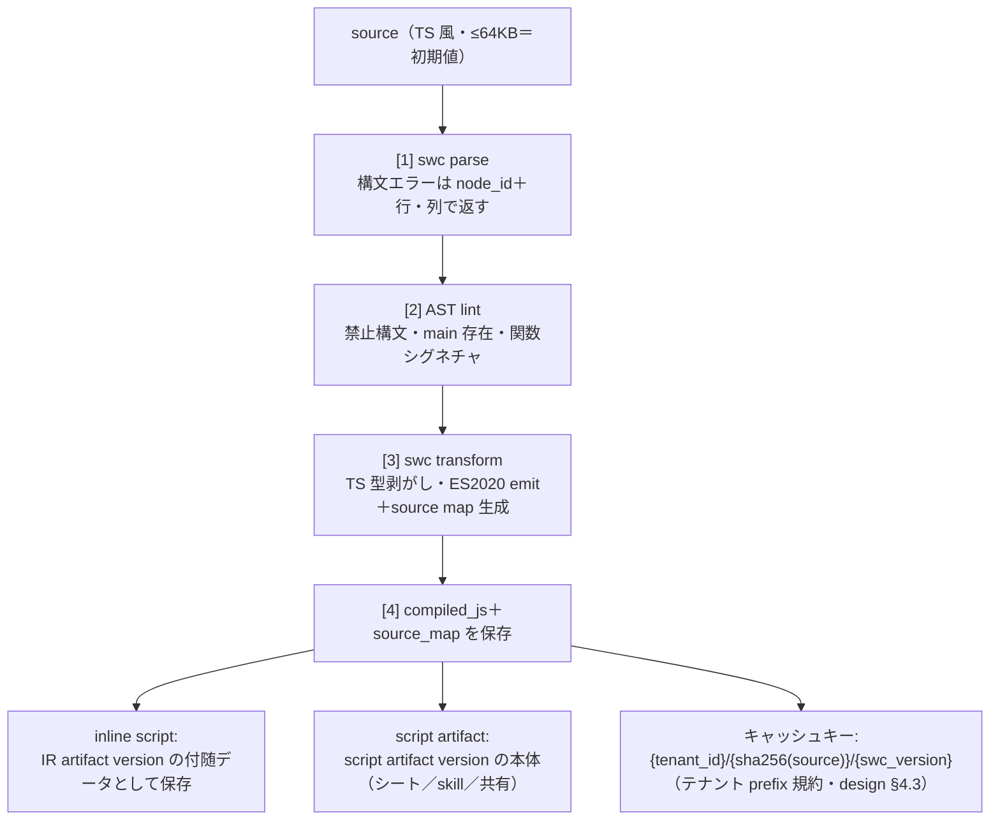
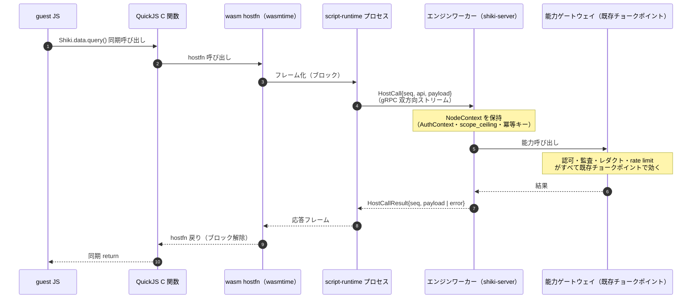

# shiki script 処理系設計

> 本書は [miniapp-platform.md](../miniapp-platform.md) §3（shiki script）の詳細設計。
> 概念・スコープの正本は [miniapp-platform.md](../miniapp-platform.md)。実装は [roadmap Phase 10](../roadmap/phase-10.md)（主に Task 10.7 / 10.8）。
> 着手前に [design-caveats](../design-caveats.md) の **PIT-23（ゲスト→特権 RPC 脱出面）・PIT-35（ホスト関数ブリッジ）・PIT-36（シークレット宛先束縛の迂回）** を必ず確認すること。
> 本書が正を持つ範囲は **言語サブセット・コンパイル・ランタイム・ホスト関数ブリッジ・`Shiki.*` API** に限る。
> IR 上の `script.run` ノード定義・保存時 V6 検証は [ir.md](./ir.md)、リトライ・冪等キー・step 契約の実行セマンティクスは [engine.md](./engine.md) が正本であり、本書はそこへ委譲して二重記述しない。
> 数値はすべて **初期値（実運用・ベンチで調整。コード上は設定値）** として読むこと。

---

## 1. 位置づけ

### 1.1 「shiki script → IR」は code view ではない（誤解を先回りして潰す）

**shiki script は IR を生成・編集する言語ではない。** ワークフロー定義（IR＝JSON DAG）を編集する手段は dnd エディタと AI 編集の 2 つだけであり（[ir.md](./ir.md) §1）、code view（IR→script の双方向同期）は**スコープ外**（[miniapp-platform.md](../miniapp-platform.md) §2.1）。この点を最初に固定する。

本書やロードマップに現れる「shiki script → IR」という言い回しは、**言語で IR を書く**という意味では断じてなく、次のパイプラインを指す:

```
IR の script.run ノード（source を参照）
  → 保存時にコンパイル検証（本書 §3・ir.md V6）
  → 実行時に script-runtime プロセスで実行（本書 §4・§5）
```

すなわち script は **IR の中に格納される 1 ノードの実装言語**であって、IR そのものの記述言語でも編集面でもない。IR＝配線（データフロー模型・[ir.md](./ir.md) §3）、script＝ロジック、というすみ分けが全体の前提である。複雑な変換・計算は IR の式言語ではなく script ノードへ昇格させる（IR は自由記述の式言語を持たない・[ir.md](./ir.md) §3）。

### 1.2 3 つの顔・同一言語同一ランタイム

shiki script は次の 3 つの用途（顔）を持つが、**同一言語・同一ランタイム・同一 `Shiki.*` API** で実装される。顔ごとに異なるのは**能力プロファイル**だけである（§6）。

| 顔 | 実行契機 | 実行主体 | 主な制約 |
|---|---|---|---|
| ワークフローの `script.run` ノード | run の step 実行 | run の実行主体（トリガ種別で決まる・[engine.md](./engine.md) §6） | ノード retry / timeout に従う |
| スプレッドシートのカスタム関数・マクロ（GAS 相当） | セル再計算（関数）／明示クリック（マクロ） | シート閲覧者本人 | 関数は read-only を構造で保証（§6・§7） |
| skill の実装 | agent マウント／skill ノード | 実行主体 ∩ skill 宣言スコープ | skill 宣言に従う |

スプレッドシート用途（セル再計算のたびに VM を起こす）が **ms 級起動要件**の根拠であり、ランタイム設計（§4）を規定する。

### 1.3 script は durable にならない

1 実行は**有界**（wall-clock 上限 360s＝初期値・設定可・§4）。「3 日待つ」「リトライ」「補償」はすべて**ノード境界＝engine の仕事**であり（[miniapp-platform.md](../miniapp-platform.md) §2.1・durability はノード境界にのみ存在する）、script 内に long await を書く構文は**存在しない**。そもそも非同期 API 自体がない（§2・§5 の同期橋渡し）。長時間・多パッケージ・任意プロセスが要る処理は script の守備範囲外であり、`agent.invoke` ノード（サンドボックス）へ昇格させる（すみ分け: script＝ms 級起動のグルーコード／サンドボックス＝何でもできる重量級・[miniapp-platform.md](../miniapp-platform.md) §2.4）。

---

## 2. 言語サブセット

- **構文**: TypeScript 構文を **swc（Rust）でパース**する。型注釈は**チェックせず剥がすだけ**（型検査は v1 でやらない。エディタ側の TS language service 支援は将来課題）。emit ターゲットは **ES2020**。
- **エントリ**: トップレベルに `function main(input) { ... return <JSON 値>; }` を必須とする。ヘルパー関数・トップレベル `const` は可。
- **禁止構文（保存時に [ir.md](./ir.md) §8 V6 で拒否）**: `import` / `export` / `async` / `await` / トップレベル `return` / `with`。`eval` / `new Function` は**ランタイムで無効化**する（QuickJS 設定）。
- **決定論は要求しない**: `Date.now()` / `Math.random()` は使用可。決定論リプレイ型 durability（Temporal 型）を採らなかったためであり、契約は **at-least-once ＋冪等キー**（[engine.md](./engine.md) §7）。この判断の背景は [README.md](./README.md) の FAQ に往復リンクする。
- **標準ライブラリ**: QuickJS 組込（`JSON` / `Math` / `Date` / `String` / `RegExp` / `Array` 等）。`fetch` / `XMLHttpRequest` / タイマー（`setTimeout` 等）/ `console` は**存在しない**。`console` の代替は `Shiki.log`（§6）。**npm import は v1 不可**（標準ライブラリ＋ `Shiki.*` のみ）。

### 2.1 正しい `main` の例

```typescript
// 経費申請レコードを引き、金額でしきい値を付けて返す（配線は IR 側が担う）
function classify(amount: number): "high" | "normal" {
  return amount >= 100000 ? "high" : "normal";
}

function main(input: { recordId: string }) {
  const record = Shiki.data.get("expense", input.recordId); // 同期・ホスト関数
  const tier = classify(record.fields.amount);
  Shiki.log.info(`expense ${input.recordId} classified as ${tier}`);
  return { tier, applicant: record.fields.applicant_name };
}
```

### 2.2 禁止構文の NG 例（保存時 V6 で拒否される）

```typescript
// ✗ import は禁止（npm import 不可・V6 で ir.script_syntax）
import { z } from "zod";

// ✗ async / await は禁止（非同期 API は存在しない・long await はエンジンの仕事）
async function main(input) {
  const data = await fetch("https://example.com"); // fetch も存在しない
  return data;
}
```

保存時にこの source を含む IR は `ir.script_syntax` エラーで拒否され、該当行・列とノード id が返る（[ir.md](./ir.md) §8）。

---

## 3. コンパイルパイプライン（保存時・「script→IR」の実体）

script の source（TS 風・≤64KB＝初期値）は、保存時に次の固定パイプラインを通る。これが §1.1 で述べた「script→IR」の実体である。



- IR 保存（[ir.md](./ir.md) §8 の V6）は**必ず [1][2] を通す**。[3][4] は保存時に前倒し実行してよい（実装最適化であって必須ではない）。artifact 参照（`script:<name>@<ver>`）は version 固定なので、保存時は**存在検証のみ**で足り再コンパイルしない。
- **ソースが正・compiled は導出物**: `compiled_js` には `swc_version` を記録する。swc 更新時は**次回保存で再コンパイル**する。既存 artifact はソースが正なのでいつでも再生成でき、compiled を永続的な真実として扱わない。
- **実行時のバイトコード**: script-runtime は `compiled_js` を受け取る。QuickJS バイトコードへの事前コンパイルは**ランタイムプロセス内 LRU キャッシュ**（key: `tenant_id`＋`sha256(js)`＋`qjs_version`）に留め、**バイトコードを永続化しない**（qjs 版更新時の無効化が複雑になるのを避ける。キャッシュミスのコストは ms 級で許容）。
- **エラー表示**: 実行時例外は source map で元ソース行へマップし、`run_event`・実行履歴 UI に出す（[engine.md](./engine.md) §11）。

---

## 4. ランタイム（script-runtime プロセス）

### 4.1 構成（wasmtime 上の QuickJS・javy 方式）

script-runtime は **wasmtime 上の QuickJS**（javy 方式・二層隔離）である。QuickJS 本体を wasm モジュール（`wasm32-wasip1`）としてビルドし、wasmtime で実行する。ゲスト JS は**データとして**渡す（コードとしてロードしない）。QuickJS 脱出バグが出ても wasm のメモリ空間内に閉じ、wasmtime の fuel（CPU）・メモリ上限・epoch interruption（wall-clock 強制中断）がそのままリソース制限になる。

**sandbox（agent 実行）とは別系統である点を明記する。** サンドボックスの wasm ティア（[design.md](../design.md) §4.6）は **secure-exec フォーク（V8 ベース・`vendor/secure-exec/`）**であり、script-runtime の **wasmtime＋QuickJS** とは**エンジンが異なる**。

| 観点 | script-runtime（本書） | sandbox wasm ティア（design §4.6） |
|---|---|---|
| 隔離エンジン | wasmtime＋QuickJS（javy 方式） | secure-exec フォーク（V8＋WASI polyfill） |
| 想定ワークロード | ms 級起動・同期ホスト関数・最小フットプリントのグルーコード | フル環境（プロセステーブル・PTY・仮想 net）・任意ツール |
| 起動要件 | セル再計算に耐える ms 級（§4.3） | エージェント実行（重量級・秒〜分） |

エンジン系を 2 つ持つ判断ではなく、**隔離ランタイム 2 種（重量級 secure-exec ／ 軽量級 QuickJS）の用途別使い分け**である。script は「フル環境が不要な軽量グルーコード実行」が要件なので、wasmtime＋QuickJS が適合する。

### 4.2 プロセスモデル

- **専用の非特権プロセス**として `crates/script-runtime` を立てる（seccomp・no network・no fs・最小権限）。shiki-server から **gRPC over UDS** で呼ぶ。in-process 実行は脱出＝全テナント侵害になるため採らない。
- **プロセスプール**: 初期値 **CPU コア数 / 2**（設定可）。プロセスは複数実行を**直列**に処理してよいが、分離はインスタンス境界で担保する（下記）。
- **インスタンス使い捨て**: 1 実行 = 1 wasmtime Store / Instance。実行後に破棄し、**テナント間で共有しない**。
- **異常時の回復**: panic / 異常終了で**即プロセス再起動**。加えて **N 実行（初期値 256・設定可）ごとに予防的リサイクル**する。
- **プリウォーム**: QuickJS wasm モジュールのコンパイル済み Module 生成は**プロセス起動時に 1 回**だけ行う。実行ごとに走るのは Instance 生成＋JS 読込のみ。

### 4.3 リソース制限（すべて wasmtime 側で強制・すべて初期値／設定可）

| 制限 | 初期値 | 最大 | 備考 |
|---|---|---|---|
| fuel（CPU 予算） | 「単純ループ 1 秒相当」を実測較正して設定 | ― | 枯渇で強制中断 |
| メモリ | 128MB | 512MB | ノード設定で**縮小のみ**可 |
| wall-clock（epoch interruption） | 30s | 360s | GAS 6 分と同型。ノード timeout と接続（§7） |
| ホスト呼び出し回数 | ≤1000 回/実行 | ― | §5 のフレーム往復回数 |
| ホスト呼び出しリクエスト | ≤1MB | ― | runtime→server フレーム |
| ホスト呼び出し応答 | ≤4MB | ― | server→runtime フレーム |
| `Shiki.log` | ≤100 行・合計 ≤16KB | ― | 超過は打ち切りマーカー |
| 戻り値 | ≤256KB | ― | step output 上限と一致（[engine.md](./engine.md) §12） |

- **コールドスタート目標**: p50 < 5ms・コールド < 50ms（初期値・スプレッドシート関数要件）。この目標がプリウォーム設計（§4.2）とインスタンス使い捨ての両立を要求する。
- ノード設定でのリソース**縮小のみ**を許し、**拡大は不可**（実効権限・実効リソースはどこでも縮小方向のみ・二重ゲート原則）。

---

## 5. ホスト関数ブリッジ（PIT-35 の決定・最重要節）

本節は **[design-caveats PIT-35](../design-caveats.md) の「実装前に決めること」への回答**である。PIT-35 は「`Shiki.*` ホスト関数はゲスト（テナントのコード）からの入力を Rust 側で解釈する。wasmtime の隔離が完璧でも、ブリッジ実装の入力検証が甘ければそこが脱出経路」と指摘する（PIT-23＝ゲスト→特権 RPC と同型の脅威モデル）。以下の設計決定と不変条件でこれを閉じる。

> **設計決定: 能力実行は shiki-server 側で行う。script-runtime プロセスは資格情報・シークレット・AuthContext を一切持たない。**

### 5.1 呼び出し経路



要点は、能力の**認可・監査・レダクト・rate limit がすべてエンジンワーカー側の能力ゲートウェイ（既存チョークポイント）で効く**ことである。script-runtime は「どの api をどのペイロードで呼びたいか」をフレームで伝えるだけで、その要求が許されるかを一切判断しない。scope_ceiling（`declared_scopes ∩ ノード設定`）の交差検証も能力ゲートウェイ側で行われる（[engine.md](./engine.md) §6）。個別の script 実装・個別ノードに認可を書かせない。

### 5.2 gRPC メッセージ型（proto 風スケッチ）

`Execute` は**双方向ストリーム**である。実装時の proto は別途確定するが、メッセージ型のスケッチは次のとおり。

```proto
service ScriptRuntime {
  // 1 実行 = 1 双方向ストリーム
  rpc Execute(stream RuntimeToServer) returns (stream ServerToRuntime);
}

// server → runtime
message ServerToRuntime {
  oneof msg {
    ExecStart      exec_start        = 1; // { compiled_js, input, limits, exec_id }
    HostCallResult host_call_result  = 2; // { seq, payload | error }
    Cancel         cancel            = 3; // 実行の強制中断
  }
}

// runtime → server
message RuntimeToServer {
  oneof msg {
    HostCall   host_call   = 1; // { seq, api, payload }  ← 能力要求
    Log        log         = 2; // { level, message }     ← Shiki.log
    ExecResult exec_result = 3; // { return | error }      ← main の終了
  }
}
```

- `ExecStart` は `compiled_js`（§3 の導出物）・`input`（`main(input)` へ渡る JSON）・`limits`（§4.3）・`exec_id`（実行識別子）を運ぶ。**資格情報・シークレット・AuthContext は含まない**（それらは server 側 NodeContext にのみ存在する）。
- `HostCall.api` は閉じた集合（§6 の `Shiki.*` に 1:1 対応）。`seq` は単調増加。
- **同期橋渡し・深さ 1 固定**: guest は hostfn でブロックし、runtime プロセスはフレーム往復を待つ（ホスト側は async Rust）。**HostCall 処理中にゲストへ再入しない**（コールバック API を作らない）。これにより再入起因の状態破壊・スタック無限成長を型で排除する。

### 5.3 敵対的入力前提の防御（PIT-23 と同型・双方向不信）

runtime→server の**全フレーム**に対し、server 側は次を検証する。違反は**即実行破棄＋監査**とする。

1. **サイズ上限**（§4.3 のリクエスト/応答上限）。
2. **UTF-8 / JSON 妥当性**の検証。
3. **api 名の閉じた集合照合**（未知 api は拒否）。
4. **seq の単調性**検証。
5. **exec_id 一致**検証（別実行のフレーム混線を排除）。

加えて:

- server 側の hostfn ハンドラは **`catch_unwind` 境界**を張り、panic は**そのゲスト実行のみを失敗**させる（プロセスを巻き添えにしない・ホスト側 panic 起因 DoS を封じる）。
- runtime プロセス側も**同様に server 応答（`ServerToRuntime`）を検証する**（双方向不信）。
- **CI に fuzzing を必須で載せる**: フレームデコーダと hostfn 引数を `cargo-fuzz` で継続 fuzzing する（受け入れ条件に含める）。
- **キャンセル**: エンジンからの `Cancel` → epoch interruption で wasm を強制中断 → インスタンス破棄（§4.2）。

### 5.4 受け入れ条件に使える不変条件（PIT-35 への回答の核）

以下は実装の受け入れ条件としてそのまま使える不変条件文である。

- **[INV-1]** script-runtime プロセスは資格情報・シークレット・AuthContext を**一切保持しない**（`ExecStart` にも含まれない）。
- **[INV-2]** 能力の認可・監査・レダクト・rate limit・scope_ceiling 交差検証は**例外なくエンジンワーカー側の能力ゲートウェイで**行われ、script-runtime も個別ノード実装もこれを判断しない。
- **[INV-3]** HostCall 処理はゲストへ**再入しない**（深さ 1 固定・コールバック API 不在）。
- **[INV-4]** runtime→server の全フレームはサイズ・UTF-8/JSON・api 名閉集合・seq 単調性・exec_id 一致で検証され、違反は即実行破棄＋監査に残る。
- **[INV-5]** server 側 hostfn ハンドラは `catch_unwind` 境界を持ち、panic は当該ゲスト実行のみを失敗させプロセスを再起動しても他実行の正当性を壊さない。
- **[INV-6]** runtime プロセスも server 応答を検証する（双方向不信）。
- **[INV-7]** フレームデコーダ・hostfn 引数の fuzzing（cargo-fuzz）が CI に存在する。

---

## 6. `Shiki.*` API v1 と能力プロファイル

すべての `Shiki.*` API は**同期**であり、**能力ゲートウェイの操作（codegen スコープ語彙）に 1:1 対応**する。以下の表は顔ごとの能力プロファイルである（[miniapp-platform.md](../miniapp-platform.md) §3 由来）。

| API | 対応スコープ | workflow ノード | skill | シート関数 | シートマクロ |
|---|---|---|---|---|---|
| `Shiki.data.query` / `get` | `data.read` | ✅ | 宣言次第 | ✅（read-only） | ✅ |
| `Shiki.data.create` / `update` | `data.write` | ✅ | 宣言次第 | ❌ | ✅ |
| `Shiki.data.transition` | `data.write` | ✅ | 宣言次第 | ❌ | ✅ |
| `Shiki.storage.read` / `list` | `storage.read` | ✅ | 宣言次第 | ✅ | ✅ |
| `Shiki.storage.write` | `storage.write` | ✅ | 宣言次第 | ❌ | ✅ |
| `Shiki.rag.search` | `rag.query` | ✅ | 宣言次第 | ❌（コスト） | ✅ |
| `Shiki.notify.send` | `notify.send` | ✅ | 宣言次第 | ❌ | ✅ |
| `Shiki.http.request` | `http.egress` | ✅ | 宣言次第 | ❌ | ✅ |
| `Shiki.workflow.start` | `workflow.start` | ✅ | 宣言次第 | ❌ | ✅ |
| `Shiki.log.*` / `Shiki.context` | ― | ✅ | ✅ | ✅ | ✅ |

- **顔ごとのプロファイルはホスト側で強制する**（guest からは呼べない API が例外になるだけ）。シート関数（セル再計算で暗黙実行される）は**副作用ゼロ＝read-only を構造で保証**する。マクロ（明示クリック）は interactive トリガ相当＝本人権限。
- **`Shiki.secrets` は存在しない**（明記）。シークレットは参照名のみを渡し（§6.7）、解決・宛先束縛検証・注入はエンジン側で行う。平文がゲストメモリに乗る経路は**レスポンス経由を含め存在しない**。

以下、各 API の小節でシグネチャ・引数/戻り値（TS 風型）・エラーを示す。型は概形であり、正は codegen 語彙（Rust 型→TS）が持つ。

### 6.1 `Shiki.data.query` / `Shiki.data.get`（`data.read`）

```typescript
// data の宣言的クエリ（roadmap Task 9.4 の filter/sort/page 模型に対応）。ページングはホスト側で解決。
Shiki.data.query(table: string, q: {
  where?: Condition;          // 構造化条件（自由 SQL は渡せない）
  order?: { field: string; dir: "asc" | "desc" }[];
  limit?: number;             // 上限あり（初期値・設定可）
}): { rows: Record<string, unknown>[]; total: number };

// 単一レコード取得
Shiki.data.get(table: string, id: string): {
  id: string; rev: number; fields: Record<string, unknown>;
};
```

- 認可: 行レベル述語・フィールドマスクは能力ゲートウェイ側で適用（ゲストは post-mask 済みの行しか受け取らない）。
- エラー: 未存在は `ShikiError { code: "not_found" }`、権限不足は `permission_denied`。

### 6.2 `Shiki.data.create` / `Shiki.data.update`（`data.write`）

```typescript
Shiki.data.create(table: string, fields: Record<string, unknown>): { id: string; rev: number };
Shiki.data.update(table: string, id: string, patch: Record<string, unknown>, opts?: { rev?: number }): { rev: number };
```

- **rev 楽観ロック**。`rev` 不一致は `ShikiError { code: "conflict", retryable: true }`。
- 冪等性: 内部能力ノードは host 側 dedupe（effect_journal・[engine.md](./engine.md) §7）が既定で効くため、同一 step attempt 系列の再実行で書込は高々 1 回。

### 6.3 `Shiki.data.transition`（`data.write`）

```typescript
// FSM 遷移 API を叩く。status への直接書込は構造的に不可能（miniapp-platform §1）。
Shiki.data.transition(table: string, id: string, action: string, args?: Record<string, unknown>): { rev: number; status: string };
```

- ガード・遷移認可は FSM 側で再評価される。ガード不成立は `ShikiError { code: "transition_denied" }`。**status を直接書く API は提供しない**（FSM の不変条件を破らせない）。

### 6.4 `Shiki.storage.read` / `list` / `write`（`storage.read` / `storage.write`）

```typescript
Shiki.storage.read(fileRef: string): { bytes: Uint8Array; contentType: string }; // ≤10MB（初期値）
Shiki.storage.list(folderRef: string): { entries: { id: string; name: string; kind: "file" | "folder" }[] };
Shiki.storage.write(folderRef: string, name: string, bytes: Uint8Array, contentType?: string): { fileRef: string; version: number };
```

- `write` は新バージョンを作る（engine-dedup）。読み書きとも StorageService（既存チョークポイント）を経由し、権限・監査・再索引が無改造で効く。
- エラー: サイズ超過は `payload_too_large`、権限不足は `permission_denied`。

### 6.5 `Shiki.rag.search`（`rag.query`）

```typescript
Shiki.rag.search(q: { query: string; topK?: number; scope?: { folder?: string } }): {
  hits: { fileRef: string; snippet: string; score: number }[];
};
```

- permission-aware 検索（二段 authz は RAG 側で適用）。実行主体が読めない chunk は結果に現れない。

### 6.6 `Shiki.notify.send`（`notify.send`）

```typescript
Shiki.notify.send(to: { user?: string; role?: string }, msg: { title: string; body: string; link?: string }): { notificationId: string };
```

- アプリ内通知（engine-dedup）。宛先の到達可否は能力ゲートウェイで検証。

### 6.7 `Shiki.http.request`（`http.egress`）— シークレットは参照名のみ

```typescript
Shiki.http.request(req: {
  method: "GET" | "POST" | "PUT" | "PATCH" | "DELETE";
  url: string;                                 // ホスト部の allowlist・宛先束縛はエンジン側で強制
  headers?: Record<string, string>;
  body?: string | Record<string, unknown>;     // object は JSON 化
  secret?: {                                    // ← 参照名のみ。平文はゲストに存在しない
    name: string;                               // 例: "slack-bot-token"
    attach: { kind: "bearer" } | { kind: "header"; header: string };
  };
  redirect?: "deny" | "follow_stripped";        // 既定 deny
}): {
  status: number;
  headers: Record<string, string>;              // 許可リストのみ
  body: unknown;                                // JSON なら parse・そうでなければ text・≤1MB（初期値）
};
```

- **`Shiki.http.request({ secret: { name } })` は参照名のみを渡す。** シークレットの解決・宛先束縛検証（PIT-36）・注入は**エンジン側で行い、http.request ノードと同一実装を通る**（二重実装しない）。平文がゲストメモリに乗る経路はレスポンス経由を含め存在しない（レスポンスに反射するのは外部サービスの責任範囲外であり、レダクトは run 履歴側で実施する）。
- リダイレクトは既定 deny。`follow_stripped` 時はシークレットを剥がし再検証する（PIT-36）。
- exactly-once は**約束しない**（外部副作用・best-effort）。冪等性は `Idempotency-Key` ヘッダ注入支援のみ（[engine.md](./engine.md) §7）。

### 6.8 `Shiki.workflow.start`（`workflow.start`）

```typescript
Shiki.workflow.start(name: string, input: unknown): { runId: string }; // fire-and-forget
```

- 起動されるワークフローの権限は**起動側 run の実行主体で interactive トリガとして評価**される（権限昇格経路にならない）。冪等キーで二重起動を防止（engine-dedup・起動 1 回保証）。

### 6.9 `Shiki.log.*` / `Shiki.context` / `Shiki.fail`

```typescript
Shiki.log.info(msg: string): void;     // console 代替。≤100 行・合計 ≤16KB（初期値）で打ち切り
Shiki.log.warn(msg: string): void;
Shiki.log.error(msg: string): void;

// 読み取り専用・PII なし
Shiki.context: { runId: string; workflowId: string; nodeId: string; attempt: number; idempotencyKey: string };

// 明示的 permanent 失敗（engine のリトライ分類に接続・engine.md §7）
Shiki.fail(message: string, opts?: { permanent?: boolean }): never;
```

- **エラー表現**: 能力エラーは JS 例外 `ShikiError { code, retryable }` として throw される。`retryable` は engine のリトライ分類（`retryable` / `permanent` / `rate_limited`）に接続する。`Shiki.fail(msg, { permanent: true })` は残 attempt があっても即 failed にする。
- `Shiki.context.idempotencyKey` は冪等にしたい副作用の相関に使う（内部能力は host 側 dedupe が既定で効く・http は明示ヘッダ）。

---

## 7. script ノード実行契約（engine との接続）

本節は script の**入出力とライフサイクル契約**を示す。step の状態機械・リトライスケジュール・冪等キー生成規則そのものは [engine.md](./engine.md)（B3・B7）が正であり、ここでは接続点のみを述べる。

- **入力**: `params.input` を解決した JSON（`$from` 解決済み・[ir.md](./ir.md) §3）が `main(input)` に渡る。
- **出力**: `main` の戻り値（JSON 化可能・≤256KB＝初期値）が step output になる。JSON 化不能・上限超過は step 失敗。
- **タイムアウト・リトライ**: ノードの `retry` / `timeout_sec` 設定に従う（[ir.md](./ir.md) §4・A7 で `script.run` は timeout 既定 30s／最大 360s＝初期値）。
- **at-least-once**: script は**再実行され得る**（リース失効・クラッシュ再実行）。冪等にしたい副作用は次の 2 系統で守る:
  - 内部能力（data / storage / notify / workflow.start）は **host 側 dedupe が既定で効く**（effect_journal・[engine.md](./engine.md) §7）。
  - 外部 http は **exactly-once を約束しない**。`Shiki.context.idempotencyKey` を `Idempotency-Key` ヘッダに注入して外部側の冪等性に委ねる。
- **冪等性区分**: `script.run` ノードは best-effort（script 次第・engine が冪等キーを供給・[ir.md](./ir.md) §7）。

### 7.1 スプレッドシート関数の実行契約（差分）

シート関数はワークフロー script ノードと同一言語・同一ランタイムだが、実行契約が異なる。

| 観点 | workflow `script.run` | スプレッドシート関数 |
|---|---|---|
| トリガ | run の step 実行 | セル再計算 |
| 実行主体 | run の実行主体（トリガ種別で決まる） | シート閲覧者本人 |
| 出力 | step output（≤256KB＝初期値） | セル値（≤32KB＝初期値） |
| タイムアウト | 30s（初期値・最大 360s） | 10s（初期値） |
| リトライ | ノード設定に従う | **なし** |
| 能力 | ノードプロファイル（§6） | read-only（副作用ゼロを構造で保証） |

マクロ（明示クリック）は interactive トリガ相当＝本人権限で、関数より広い能力プロファイル（§6 の「シートマクロ」列）を持つ。

<!-- TODO(design): シート関数のセル依存グラフ再計算バッチ（1 再計算で多数の関数が並列起動する場合のプロセスプール占有・レート制御）は未設計。Phase 11（スプレッドシート）着手時に engine 側の concurrency 模型と併せて確定する。 -->

---

## 8. セキュリティまとめ

脅威 → 防御の対応表で締める。各防御は前節までの設計に対応する。

| 脅威 | 防御 | 根拠節 |
|---|---|---|
| QuickJS 脱出（JS エンジンのバグ） | wasm 境界（wasmtime のメモリ空間に閉じる二層隔離） | §4.1 |
| wasm 脱出 | 非特権プロセス＋seccomp（no network / no fs / 最小権限）。blast radius＝プロセス内の**他実行なし**（インスタンス使い捨て） | §4.1・§4.2 |
| ブリッジ入力の悪用（巨大ペイロード・不正 UTF-8・再入・ホスト側 panic → DoS） | フレーム検証（サイズ・UTF-8/JSON・api 名閉集合・seq 単調性・exec_id 一致）＋深さ 1 固定＋`catch_unwind`＋fuzzing（PIT-23/35 と同型） | §5.3・§5.4 |
| リソース枯渇（無限ループ・メモリ爆発） | fuel（CPU）・epoch interruption（wall-clock）・メモリ上限＋プロセスリサイクル | §4.3 |
| 資格情報窃取 | **プロセスに資格情報が構造的に存在しない**（AuthContext は server 側 NodeContext のみ・INV-1） | §5・§5.4 |
| シークレット窃取 | 参照名のみ渡し・エンジン側解決＋宛先束縛（PIT-36）。平文がゲストに乗る経路なし | §6.7 |
| テナント混線 | インスタンス使い捨て＋exec_id 検証＋キャッシュキーの tenant prefix | §4.2・§5.3・§3 |
| 権限昇格（script→ワークフロー起動経由） | 起動先は起動側実行主体で interactive 評価（昇格経路にならない） | §6.8 |
| FSM の不変条件破壊（status 直書き） | `data.transition` のみ提供・直接 status 書込 API を作らない | §6.3 |

これらは互いに独立の層をなし、単一層の破れが即座に全体侵害へ至らない多層防御（defense-in-depth）を構成する。最上位の不変条件は **§5.4 の [INV-1]〜[INV-7]** であり、Phase 10 Task 10.7 の受け入れ条件に直接転写できる。
